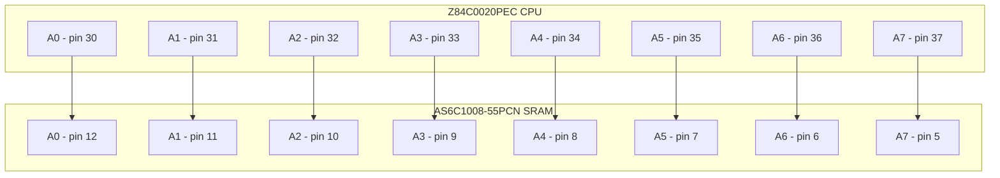
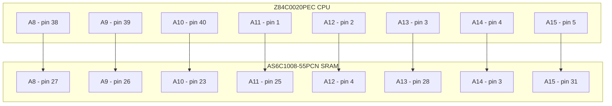
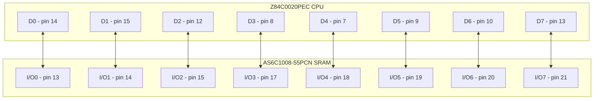
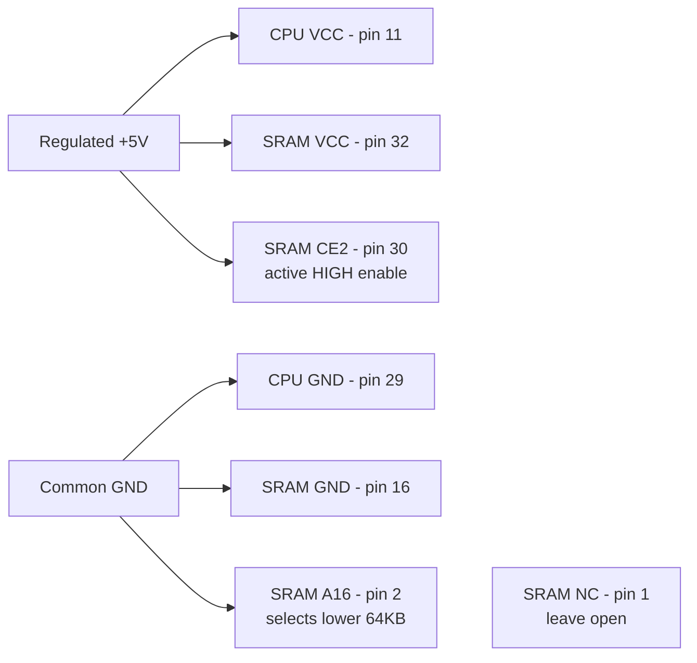
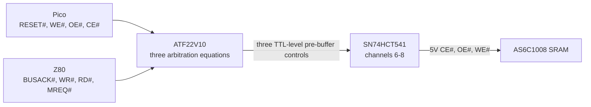
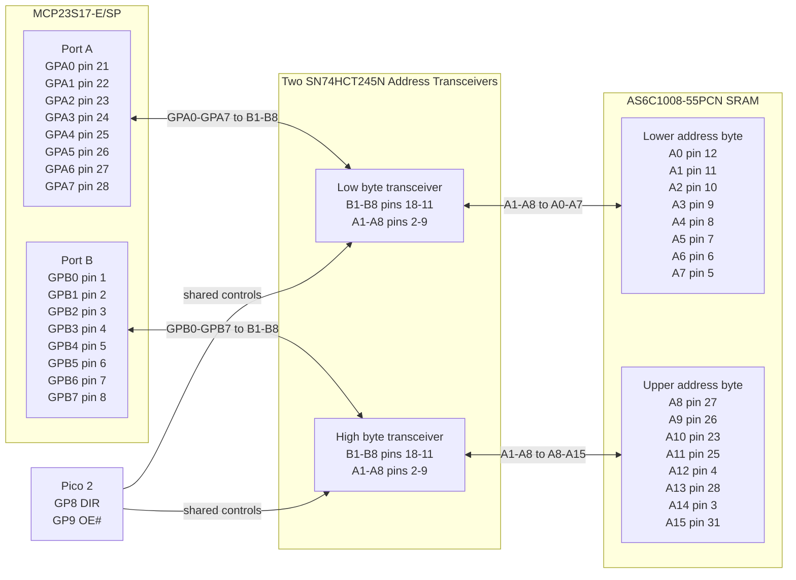
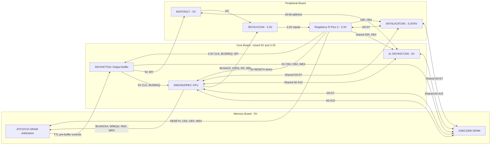
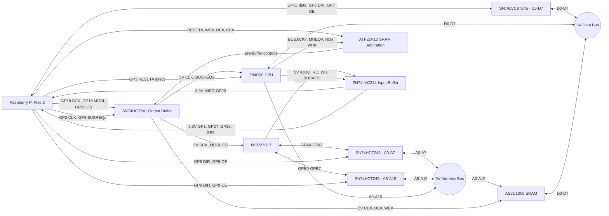

# Z80 ROMless SBC - WIP Engineering & Build Specification

**Repository:** [github.com/gloveboxes/Z80ROMlessSBC](https://github.com/gloveboxes/Z80ROMlessSBC)
**PDF edition:** [README.pdf](README.pdf)

## Overview

This document describes a theoretical Z80 single-board computer design
that has not yet been built, wired, or validated in hardware. Treat it
as an engineering proposal and bring-up plan, not as a proven reference
design. Every electrical assumption, timing margin, and firmware
interaction still needs bench validation with the staged tests in
Section 8 before the design should be considered reliable.

The proposed system is a ROMless Z80 computer supervised by a Raspberry
Pi Pico 2 W. The Pico supplies the Z80 clock, holds and releases reset,
loads a boot image directly into SRAM by taking the Z80 bus, and then
lets the Z80 execute from RAM. A 64 KB SRAM provides the Z80 memory
space; level shifters and bus transceivers isolate the Pico's 3.3 V GPIO
from the 5 V Z80/SRAM bus; an MCP23S17 expands the Pico's address-drive
capability during DMA and trapped I/O cycles.

The key design idea is that the Pico acts as both supervisor and virtual
peripheral controller. It can stop the fully static Z80 clock on an I/O
cycle, inspect the requested port, exchange one data byte, and then
resume execution. Terminal I/O is intended to be one of those virtual
peripherals: Z80 `IN` and `OUT` instructions feed nonblocking queues on
the Pico, while a WebSocket terminal server runs on the Pico's other
core so Wi-Fi and browser traffic do not disturb Z80 timing.

Z80 software lives in a reserved region of the Pico's own onboard
flash rather than on removable media or compiled into the running
firmware image. The Pico reads boot binaries, monitor images, and CP/M
disk images directly from that memory-mapped flash region, then uses
the already-validated DMA path to populate SRAM before the Z80 is
released. Once the Z80 is running, the same I/O trap mechanism can
expose sector-oriented virtual disk ports backed by that same flash
partition (Section 6.3).

The build plan is deliberately phased. Early phases prove power,
translation, SPI expansion, bus isolation, SRAM DMA, and clock control
before the Z80 is installed. Later phases prove virtual-ROM boot,
synchronous I/O trapping, WebSocket terminal service, and finally the
maximum qualified clock rate. Passing an earlier phase is a prerequisite
for trusting the assumptions used by the next one.

### Firmware and CP/M build

The repository implements the ten cumulative firmware stages under `src/`.
Stage 10 includes the journaled flash disks, CP/M boot loader, and WebSocket
terminal. Its host build also assembles the board-native CP/M 2.2 BIOS,
reconstructs pristine CCP/BDOS bytes from the preserved Altair source image,
and emits all provisionable images.

Install CMake, Ninja, Python 3, `picotool`, and `z80asm`. The firmware needs a
complete Arm GNU bare-metal toolchain with Newlib; the Homebrew compiler alone
does not provide the required runtime. A known working setup is:

```sh
brew install cmake ninja picotool z80asm
export PATH="$HOME/.local/share/arm-gnu-toolchain-15.3.rel1/bin:$PATH"
cmake -S . -B build -G Ninja \
  -DPICO_BOARD=pico2_w \
  -DZ80_WIFI_SSID='your-network' \
  -DZ80_WIFI_PASSWORD='your-password'
cmake --build build --target z80_cpm_images -j
```

Wi-Fi credentials are written only to the generated build tree. An empty SSID
leaves networking disabled while flash-disk service continues to operate. The
`z80_cpm_images` target builds Stage 10 and writes these files to `build/cpm/`:

| Artifact | Purpose |
| --- | --- |
| `z80boot.pkg` | Manifest, CRCs, and the reset-ready 64 KiB Z80 image |
| `drive_a_cpm63k.img` | Native CP/M system disk with the SBC BIOS |
| `drive_b_bdsc.img` through `drive_d_blank.img` | Converted 320 KiB disks |
| `z80romless-flash.bin` | Complete 4 MiB initial-provisioning image |
| `manifest.json` | Geometry, addresses, sizes, and SHA-256 values |

Run the host regression checks with:

```sh
python3 -m unittest discover -s src/cpm -p 'test_*.py' -v
```

### PDF edition

The checked-in `README.pdf` is generated from this file. The renderer preserves
tables, highlighted code, local images, links, and MathML. Each Mermaid diagram
gets a dedicated page; wide diagrams use A4 landscape pages and are rendered as
vector graphics without the interactive preview controls.

Install Node.js, Pandoc, and a Chromium-family browser, then run:

```sh
brew install node pandoc
npm ci
npm run pdf
```

The script searches for Microsoft Edge, Google Chrome, or Chromium. Set
`BROWSER_EXECUTABLE` to use another installation. Optional input and output
paths may be passed after `--`, for example:

```sh
npm run pdf -- README.md README.pdf
```

### Flash provisioning

For a new or disposable flash, put the Pico in BOOTSEL mode and write the
complete image. This erases existing CP/M disk contents and the journal:

```sh
picotool load -v build/cpm/z80romless-flash.bin -t bin -o 0x10000000
picotool reboot
```

For normal updates, load only the firmware and selected storage regions. These
commands preserve regions not named by the input file:

```sh
picotool load -v build/src/stage10_websocket_terminal/z80_stage10_websocket_terminal.uf2
picotool load -v build/cpm/z80boot.pkg -t bin -o 0x102A0000
picotool load -v build/cpm/drive_a_cpm63k.img -t bin -o 0x102C0000
picotool load -v build/cpm/drive_b_bdsc.img -t bin -o 0x10310000
picotool load -v build/cpm/drive_c_escape.img -t bin -o 0x10360000
picotool load -v build/cpm/drive_d_blank.img -t bin -o 0x103B0000
picotool reboot
```

After association, browse to `http://<pico-dhcp-address>:8088/`. The USB serial
console reports Stage 10 startup and accepts `s` to print terminal queue/drop
counts and disk/fatal status. CP/M disk writes are persistent, so retain host
backups before full reprovisioning.

## 0. Project Inventory

The quantities below build one complete three-breadboard prototype.
Purchase quantities include a small allowance for breadboard spares.

### 0.1 Semiconductors

| Required | Component | Package | Function |
|----:|----|----|----|
| 1 | Raspberry Pi Pico 2 W | Module with two 20-pin headers | Supervisor, clock, DMA, virtual I/O, and Wi-Fi terminal |
| 1 | Z84C0020PEC | 40-pin PDIP | CMOS Z80 CPU |
| 1 | AS6C1008-55PCN | 32-pin PDIP | SRAM; lower 64 KB used |
| 1 | MCP23S17-E/SP | 28-pin SPDIP | SPI-to-16-bit address interface |
| 1 | ATF22V10B-15PC or ATF22V10C-15PU | 24-pin PDIP | Programmable SRAM control-source arbitration |
| 1 | SN74HCT541N | 20-pin PDIP | Eight-channel 5 V output buffer for clock, BUSREQ#, SPI, and SRAM controls |
| 2 | SN74HCT245N | 20-pin PDIP | Bidirectional address-bus isolation |
| 1 | SN74LVC8T245PW | 24-pin TSSOP on 0.6-inch DIP-24 carrier | Dual-supply 3.3 V/5 V Pico data-bus interface |
| 1 | SN74LVC244AN | 20-pin PDIP | 5 V-to-3.3 V buffering for Z80 status/control and MCP SO |
| 1 | 1N5819 | Axial diode | Schottky power OR from external +5 V to Pico VSYS |

> **Ten-package logic design:** The ATF22V10 replaces the former
> 74HCT157, 74HCT08, and their discrete source-selection wiring. It
> computes all three SRAM controls from RESET#, BUSACK#, the Pico DMA
> controls, and the Z80 MREQ#/RD#/WR# outputs (Section 1.2). The
> ATF22V10 guarantees only a TTL-level 2.4 V HIGH, so its SRAM outputs
> pass through the SN74HCT541N rather than driving the 5 V SRAM
> directly. The same HCT541 translates Pico CLK, BUSREQ#, and the three
> MCP23S17 SPI inputs to guaranteed 5 V levels. Pico GP3 drives the
> Z80 RESET# input directly because the Z84C00 specifies a 2.2 V HIGH
> threshold for non-clock inputs; the Z80 clock retains its stricter
> translated path. This reduces the complete system from 13 active
> packages to 10 while retaining the MCP23S17 and all three bus
> transceivers. The
> SN74LVC244AN buffers RD#/WR# because Pico 2 GP27 and GP28 are
> standard ADC-capable pads, not 5 V-tolerant FT pads. It also buffers
> BUSACK#, IORQ#, and MCP SO: although GP0, GP1, and GP20 are FT pads,
> their 5.5 V tolerance requires RP2350 IOVDD to be present at 3.3 V.
> Using the spare LVC244 channels preserves safe power sequencing and
> powered-off isolation (Section 5.3).

### 0.2 Sockets and Headers

| Quantity | Item |
|----:|----|
| 1 | 40-pin DIP socket |
| 1 | 32-pin DIP socket |
| 1 | 28-pin DIP socket |
| 1 | 24-pin, 0.3-inch-wide DIP socket for the ATF22V10 |
| 1 | 24-pin, 0.6-inch-wide DIP socket, or two 12-position socket strips, for the data-transceiver carrier |
| 4 | 20-pin DIP sockets |
| 2 | 20-pin 0.1-inch male headers for the Pico 2, if not fitted |
| 2 | 20-position 0.1-inch socket strips for removable Pico mounting; do not substitute DIP IC sockets |

### 0.3 Capacitors and Resistors

| Fitted | Purchase | Item | Purpose |
|----:|----:|----|----|
| 10 | 13 | 100 nF X7R ceramic capacitors, at least 10 V | One at every IC supply pair; the dual-supply data carrier needs two |
| 3 | 5 | 10 uF capacitors, at least 10 V | One per breadboard |
| 1 | 2 | 47 uF electrolytic capacitor, at least 10 V | 5 V supply-entry bulk capacitance |
| 29 | 35 | 10 kOhm, 1/4 W resistors | Defined startup levels and temporary test pulls |
| Reused for tests | 10 | 1 kOhm, 1/4 W resistors | First-drive current limiting and manual input tests |

Place each 100 nF capacitor directly across its IC supply pins with the
shortest practical leads. On the 5 V side, fit 10 kOhm pull-ups to
BUSREQ#, BUSACK#, MREQ#, IORQ#, RD#, WR#, MCP SO, SRAM CE#, SRAM OE#,
SRAM WE#, WAIT#, INT#, and NMI#. RESET# is the direct GP3 node and must
not have a 5 V pull-up. Also pull SN74HCT541 A6, A7, and A8 up to 5 V
so its SRAM-control outputs remain inactive if the GAL is absent or
unpowered. On the Pico side, use 10 kOhm pull-ups to 3.3 V on GP4
(BUSREQ#), GP5 (SRAM CE#), GP7/GP9 (transceiver OE#), GP21 (SPI CS#),
GP22 (SRAM WE#), and GP26 (SRAM OE#). Use 10 kOhm pull-downs to GND on
GP2 (CLK), GP3 (RESET#), GP6/GP8 (transceiver DIR), and GP18/GP19 (SPI
SCK/SI). Once the Pico 3.3 V rail is valid, these external resistors
establish safe levels before the firmware configures SIO. During a cold
power ramp the Pico-side pull-ups cannot hold active-low controls HIGH
while their 3.3 V rail is still at 0 V; RESET# remains asserted and SRAM
contents are therefore treated as indeterminate until the boot image is
loaded and verified. The HCT541-input pull-ups cover an absent GAL, and
the final SRAM-node pull-ups cover an absent or unpowered HCT541. Tie
every unused CMOS input to a defined level.

### 0.4 Construction and Power

| Quantity | Item | Requirement |
|----:|----|----|
| 3 | 830-tie-point solderless breadboards (BusBoard/X-ON BB830, ABS body; 63 terminal rows plus two 100-point power-distribution strips per board) | Memory, CPU core, and peripheral zones |
| 1 | Regulated 5 V supply | At least 1 A; adjustable current limiting preferred |
| 1 | USB data cable | Pico programming and serial diagnostics |
| 1 set | 22 AWG solid-core hookup wire | Multiple colors for signal groups |
| 1 set | Short male-to-male jumpers | Inter-board and temporary connections |
| 1 set | Short ground and power-distribution links | Connects all three boards; includes +5 V, 3.3 V, and multiple GND links |
| 1 | In-line power switch or removable supply jumper | Emergency power removal; rated at least 1.5 A continuous |
| As required | Labels or wire markers | Bus bits, controls, and socket pin 1 |

Feed the breadboard's +5 V logic rail directly from the regulated
supply. Feed Pico VSYS from that rail only through the 1N5819: anode to
external +5 V, banded cathode to VSYS. Pico 2 already has a Schottky
diode from USB VBUS to VSYS, so this second diode safely ORs USB and
external power without back-powering either source. Never link the
external +5 V rail directly to Pico VBUS or VSYS. Feed the
SN74LVC8T245 VCCA and SN74LVC244AN from the Pico 3.3 V rail. Connect
SN74LVC8T245 VCCB and all other logic to the regulated 5 V rail. No
5 V output connects directly to a Pico GPIO; both LVC devices provide
power-off isolation, and the SN74LVC244AN's `Ioff` protection keeps the five
monitored inputs isolated while its 3.3 V supply is absent or ramping.
Tie the Pico's AGND pin (pin 33) to the common digital ground: this
design does not use the ADC function on GP26-GP29, so no separate
analogue ground plane is needed.

The plug-in supply shown on the middle breadboard may provide the 5 V
entry point only after a load test proves 4.75 V to 5.25 V at the board
under at least 500 mA load without regulator overheating. Do not connect
that module's 3.3 V output to the Pico 3V3 pin or the system 3.3 V rail;
the Pico must remain the only 3.3 V source. Reserve terminal rows 1-3
under the module body even if its pins enter only the distribution
strip. If the actual module obscures more than three terminal rows,
move it off-board or to the Memory Board rather than compressing the
Core Board placement.

### 0.5 Bring-Up Equipment

- Digital multimeter with resistance, continuity, and DC voltage modes.
- Two-channel oscilloscope rated for at least 100 MHz for edge-integrity
  checks; a 20 MHz instrument is adequate only for low-speed functional
  bring-up.
- Logic analyzer with at least 16 channels; 24 or more is preferred.
- Current-limited bench supply or an in-line 5 V current meter.
- Fine probe hooks or test clips suitable for DIP pins.
- A programmer explicitly supporting the selected ATF22V10B or
  ATF22V10C device and generic 22V10 JEDEC files.

### 0.6 Optional Items

- LEDs with 1 kOhm series resistors for low-speed diagnostics only; do
  not permanently load high-speed buses with LEDs.
- No card socket or extra storage hardware is needed for boot images or
  CP/M disks: they live in a reserved region of the Pico's own onboard
  flash (Section 6.3), provisioned once with `picotool` and read back
  over the existing memory-mapped XIP bus. Reflash that region with
  `picotool` to change a disk image; no wiring changes.
- Spare 100 nF capacitors, resistors, jumper wire, and an IC extractor.

## 1. Reference Pin Mapping & Logic Domain Verification

This architecture leverages the fully static nature of the Z84C0020PEC
CMOS CPU. The Pico controls the clock and uses the Z80 BUSREQ#/
BUSACK# handshake for DMA ownership. During RESET, the address and data
buses float and control outputs are inactive. During BUSACK#, A0-A15,
D0-D7, MREQ#, IORQ#, RD#, and WR# float while BUSACK# remains actively
driven LOW; M1#, RFSH#, and HALT# are not part of the floated bus set.

### 1.0 Raspberry Pi Pico 2 Header Pin Map

GPIO numbers in the firmware are not physical header numbers. Use this
table for construction; the ranges preserve ascending bit order.

| Pico function | GPIO | Physical header pin | Connection |
|----|----:|----:|----|
| BUSACK# monitor | GP0 | 1 | SN74LVC244AN 1Y1 |
| IORQ# trap input | GP1 | 2 | SN74LVC244AN 1Y2 |
| Z80 CLK | GP2 | 4 | SN74HCT541 A1 pin 2 |
| Z80 RESET# | GP3 | 5 | Z80 pin 26 and ATF22V10 pin 1, direct 3.3 V logic |
| Z80 BUSREQ# | GP4 | 6 | SN74HCT541 A2 pin 3 |
| SRAM CE# | GP5 | 7 | ATF22V10 pin 7 |
| Data DIR / OE# | GP6 / GP7 | 9 / 10 | SN74LVC8T245 pins 2 / 22 |
| Address DIR / OE# | GP8 / GP9 | 11 / 12 | Both SN74HCT245 pins 1 / 19 |
| D0-D3 | GP10-GP13 | 14-17 | SN74LVC8T245 A1-A4 pins 3-6 |
| D4-D7 | GP14-GP17 | 19-22 | SN74LVC8T245 A5-A8 pins 7-10 |
| SPI SCK / MOSI / MISO / CS# | GP18-GP21 | 24-27 | HCT541 A4/A5, LVC244 2Y1, HCT541 A3 |
| SRAM WE# | GP22 | 29 | ATF22V10 pin 3 |
| SRAM OE# | GP26 | 31 | ATF22V10 pin 5 |
| Z80 RD# monitor | GP27 | 32 | SN74LVC244AN 1Y3 |
| Z80 WR# monitor | GP28 | 34 | SN74LVC244AN 1Y4 |
| 3.3 V output | - | 36 | SN74LVC8T245 VCCA, LVC244 VCC, and 3.3 V pull-ups |
| VSYS | - | 39 | 1N5819 banded cathode; anode to external +5 V |

Connect Pico GND pins 3, 8, 13, 18, 23, 28, and 38, plus AGND pin
33, to common ground with multiple short links. Leave RUN pin 30,
ADC_VREF pin 35, and 3V3_EN pin 37 open. Do not connect the external
5 V rail to VBUS pin 40; USB supplies that node internally.

<table>
<colgroup>
<col style="width: 25%" />
<col style="width: 25%" />
<col style="width: 25%" />
<col style="width: 25%" />
</colgroup>
<thead>
<tr>
<th>Component</th>
<th>Signal Name / Group</th>
<th>Hardware Pin Numbers</th>
<th>Electrical Constraint / Logic Domain</th>
</tr>
</thead>
<tbody>
<tr>
<td rowspan="14"><strong>Z84C0020PEC (CPU)</strong></td>
<td>CLK</td>
<td>Pin 6</td>
<td>Input. Driven by level-shifted 5V CMOS square wave. Clock can be
safely frozen indefinitely in either a HIGH or LOW state.</td>
</tr>
<tr>
<td>IORQ#</td>
<td>Pin 20</td>
<td>Output. Active Low. Buffered to 3.3 V through SN74LVC244AN channel
1A2/1Y2 and monitored by Pico 2 GP1 to trigger clock-stop trapping.</td>
</tr>
<tr>
<td>MREQ#</td>
<td>Pin 19</td>
<td>Output. Active Low, three-state. Connects to ATF22V10 pin 8 for
CPU-owned SRAM cycles; pulled HIGH when the CPU is absent.</td>
</tr>
<tr>
<td>RD#</td>
<td>Pin 21</td>
<td>Output. Active Low. Buffered to 3.3 V through SN74LVC244AN channel
1A3/1Y3 and sampled by Pico 2 GP27 to resolve cycle intent.</td>
</tr>
<tr>
<td>WR#</td>
<td>Pin 22</td>
<td>Output. Active Low. Buffered to 3.3 V through SN74LVC244AN channel
1A4/1Y4 and sampled by Pico 2 GP28 to resolve cycle intent alongside
RD#.</td>
</tr>
<tr>
<td>BUSACK#</td>
<td>Pin 23</td>
<td>Output. Active Low. Feeds ATF22V10 pin 2 for SRAM-source arbitration
(Section 1.2) and is buffered to 3.3 V through SN74LVC244AN
channel 1A1/1Y1 for monitoring at Pico 2 GP0.</td>
</tr>
<tr>
<td>BUSREQ#</td>
<td>Pin 25</td>
<td>Input. Active Low. Level-shifted up to 5V to request DMA
ownership.</td>
</tr>
<tr>
<td>RESET#</td>
<td>Pin 26</td>
<td>Input. Active Low. Driven directly by Pico GP3 at TTL-compatible
3.3 V and also connected to ATF22V10 pin 1 for SRAM-source arbitration.
Hold LOW for at least three full clock cycles.</td>
</tr>
<tr>
<td>M1#</td>
<td>Pin 27</td>
<td>Output. Active Low. Probe point for the Phase 7 opcode-fetch test;
not connected to Pico logic.</td>
</tr>
<tr>
<td>A0 – A15 (Address Bus)</td>
<td>Pins 30 – 40, 1 – 5</td>
<td>5V Tri-state Bus. Driven by CPU during active run, floats during
DMA/RESET.</td>
</tr>
<tr>
<td>D0 – D7 (Data Bus)</td>
<td>Pins 7 – 10, 12 – 15</td>
<td>5V Bi-directional Tri-state Bus. Connected directly to SRAM data bus
pins.</td>
</tr>
<tr>
<td>WAIT#</td>
<td>Pin 24</td>
<td>Input. Active Low. Unused; pull to +5V through 10 kOhm so it never
floats LOW and stalls the CPU in a permanent wait state.</td>
</tr>
<tr>
<td>INT#</td>
<td>Pin 16</td>
<td>Input. Active Low. Unused; pull to +5V through 10 kOhm to prevent a
spurious interrupt from a floating input.</td>
</tr>
<tr>
<td>NMI#</td>
<td>Pin 17</td>
<td>Input. Active Low, edge-sensed. Unused; pull to +5V through 10 kOhm
to prevent a spurious non-maskable interrupt from a floating input.</td>
</tr>
<tr>
<td rowspan="7"><strong>AS6C1008-55PCN (SRAM)</strong></td>
<td>A0 – A15 (Address lines)</td>
<td>Pins 12-10, 9-7, 6-5, 27-26, 23, 25, 4, 28, 3, 31</td>
<td>5V Input. Connected directly to the 5V Z80 address bus. Driven by
MCP23S17 during DMA.</td>
</tr>
<tr>
<td>A16</td>
<td>Pin 2</td>
<td>5V Input. Tie to GND to select the lower 64KB bank; do not leave
floating.</td>
</tr>
<tr>
<td>D0 – D7 (Data lines)</td>
<td>Pins 13 – 15, 17 – 21</td>
<td>5V Bi-directional Bus. Connected directly to the Z80 data bus.</td>
</tr>
<tr>
<td>WE#</td>
<td>Pin 29</td>
<td>Input. Active Low. Driven by SN74HCT541 Y6 from the ATF22V10
arbitration output (Section 1.2): Z80 WR# during CPU ownership, Pico
DMA write signal during DMA ownership.</td>
</tr>
<tr>
<td>OE#</td>
<td>Pin 24</td>
<td>Input. Active Low. Driven by SN74HCT541 Y7 from the ATF22V10
arbitration output (Section 1.2): Z80 RD# during CPU ownership, Pico
DMA read signal during DMA ownership.</td>
</tr>
<tr>
<td>CE#</td>
<td>Pin 22</td>
<td>Input. Active Low. Driven by SN74HCT541 Y8 from the ATF22V10
arbitration output (Section 1.2): Z80 MREQ# during CPU ownership so
I/O cycles cannot access SRAM, Pico DMA chip-enable signal during DMA
ownership.</td>
</tr>
<tr>
<td>CE2</td>
<td>Pin 30</td>
<td>Input. Active High. Tie permanently to VCC (+5V) to enable the
device through the active-low CE# input.</td>
</tr>
</tbody>
</table>

### 1.1 Z84C0020PEC-to-AS6C1008-55PCN Wiring

The following is the direct run-mode connection verified against the
manufacturers' 40-pin PDIP and 32-pin PDIP pin assignments. The
AS6C1008 is a 128K x 8 device, so A16 must be tied LOW to expose its
lower 64KB as the Z80's address space. CE2 must be tied HIGH, and pin 1
is not connected.

Manufacturer datasheets:

- [Zilog Z84C00 CMOS Z80 CPU Product Specification](https://www.zilog.com/docs/z80/ps0178.pdf)
- [Alliance Memory AS6C1008 128K x 8 Low Power CMOS SRAM Datasheet](https://www.alliancememory.com/wp-content/uploads/AS6C1008_Mar_2023V1.2.pdf)

#### Package Pinouts

[](https://www.zilog.com/docs/z80/ps0178.pdf)

[](https://www.alliancememory.com/wp-content/uploads/AS6C1008_Mar_2023V1.2.pdf)

#### Address Bus A0-A7



#### Address Bus A8-A15



#### Data Bus D0-D7



#### Memory Control


#### Power and Fixed Pins



> **SRAM control-source arbitration:** MREQ#/RD#/WR# above are the
> CPU-owned run-mode inputs of the ATF22V10 described in Section 1.2,
> never directly to the SRAM. The programmed equations select either
> these inputs or the Pico DMA controls; the three results then pass
> through dedicated SN74HCT541 channels to the SRAM.

### 1.2 SRAM Control-Source Arbitration: ATF22V10B/C

The Z80 and Pico must never drive SRAM CE#, OE#, or WE# simultaneously.
The ATF22V10 implements three combinational 2:1 selectors with a shared
ownership condition:

```text
CPU_OWNS_SRAM = RESET# AND BUSACK#

SRAM_WE_PRE# = CPU_OWNS_SRAM ? Z80_WR#   : PICO_WE#
SRAM_OE_PRE# = CPU_OWNS_SRAM ? Z80_RD#   : PICO_OE#
SRAM_CE_PRE# = CPU_OWNS_SRAM ? Z80_MREQ# : PICO_CE#
```

| RESET# | BUSACK# | Selected source | Required state |
|----:|----:|----|----|
| 0 | X | Pico | Held-reset DMA or Z80 absent |
| 1 | 0 | Pico | BUSREQ#/BUSACK# DMA ownership |
| 1 | 1 | Z80 | Normal CPU execution |

This covers the two cases that BUSACK# alone cannot distinguish. During
RESET the Z80 drives BUSACK# inactive HIGH, and with the Z80 physically
absent its pull-up also reads HIGH. RESET# LOW therefore selects the Pico
in both cases. Only an out-of-reset CPU that has not granted the bus can
select MREQ#/RD#/WR#.

The PLD source adds the logically redundant consensus term
`Z80_CONTROL# & PICO_CONTROL#` to each output. It does not change this
truth table, but it holds an inactive HIGH continuously while RESET# or
BUSACK# transfers ownership with both candidate controls HIGH. Without
that term, unequal GAL product-term delays can create a static-1 hazard,
seen externally as a short active-low SRAM control pulse. Each hardened
equation uses four product terms, within every ATF22V10 macrocell's
capacity.

Program the selected ATF22V10B or ATF22V10C with
[src/pld/sram_control.pld](src/pld/sram_control.pld). Use the exact
device algorithm listed by the programmer, write the generated JEDEC
file, read it back, and require a verify pass before installation. Do
not enable the optional power-down mode or security fuse.

| ATF22V10 pin | Signal | Connection |
|----:|----|----|
| 1 | RESET# | Pico GP3 and Z80 pin 26 direct node |
| 2 | BUSACK# | Z80 pin 23 |
| 3 | PICO_WE# | Pico GP22 |
| 4 | Z80_WR# | Z80 pin 22 |
| 5 | PICO_OE# | Pico GP26 |
| 6 | Z80_RD# | Z80 pin 21 |
| 7 | PICO_CE# | Pico GP5 |
| 8 | Z80_MREQ# | Z80 pin 19 |
| 9-11, 13 | Unused inputs | Tie to GND |
| 12 | GND | Common ground |
| 14 | SRAM_WE_PRE# | SN74HCT541 A6 pin 7 |
| 15 | SRAM_OE_PRE# | SN74HCT541 A7 pin 8 |
| 16 | SRAM_CE_PRE# | SN74HCT541 A8 pin 9 |
| 17-23 | Unused outputs | Program constant LOW; leave open |
| 24 | VCC | Regulated +5 V |

The ATF22V10's guaranteed HIGH output is 2.4 V, which satisfies the
HCT541's 2.0 V input threshold but not the AS6C1008's 5 V CMOS input
threshold. Never bypass the HCT541 on these three paths. Fit 10 kOhm
pull-ups at HCT541 A6-A8 and at the final SRAM CE#/OE#/WE# nodes. The
input pull-ups keep the permanently enabled HCT541 deterministic if the
GAL is missing; the output pull-ups keep the SRAM inactive if the
HCT541 is missing or unpowered.

During Phase 6 with the Z80 absent, hold GP3 RESET# LOW. The programmed
logic then selects the Pico controls regardless of the pulled-up,
undriven BUSACK# input.



## 2. 16-Bit Address Expansion Interface: MCP23S17-E/SP

The MCP23S17 acts as the dedicated 16-bit register shifter interfacing
the Pico 2's SPI bus with the shared 5V address bus. During DMA block
injection, it drives the target SRAM locations. During an active I/O
trap, the transceiver directions are reversed, allowing the MCP23S17 to
monitor the address bus states driven by the frozen Z80 CPU.

| MCP23S17 Pin Designation | Target Connection | System Logic Role |
|----|----|----|
| GPA0 – GPA7 (Port A) | SN74HCT245N Transceiver \#1 (B1 – B8) | Lower Address Byte Control (\$A_0 – A_7\$) |
| GPB0 – GPB7 (Port B) | SN74HCT245N Transceiver \#2 (B1 – B8) | Upper Address Byte Control (\$A_8 – A\_{15}\$) |
| CS# (Pin 11) | SN74HCT541 Y3 pin 16, from Pico GP21 via A3 | SPI Hardware Chip Select (Active Low), 5 V translated |
| CLK / SCK (Pin 12) | SN74HCT541 Y4 pin 15, from Pico GP18 via A4 | SPI Master Clock Train Input, 5 V translated |
| SI (Pin 13) | SN74HCT541 Y5 pin 14, from Pico GP19 via A5 | SPI Master-Out-Slave-In (MOSI Path), 5 V translated |
| SO (Pin 14) | SN74LVC244AN channel 2A1/2Y1 to Pico 2 GP20 | SPI Master-In-Slave-Out (MISO Path), buffered from 5 V to 3.3 V; fit the Section 0.3 pull-up because SO is high-impedance while CS# is HIGH |
| A0, A1, A2 (Pins 15-17) | Tied to GND | Hardware address = 000; matches the fixed 0x40/0x41 opcode used in firmware regardless of the IOCON.HAEN state, and prevents floating address-select inputs |
| RESET# (Pin 18) | Tied to VCC (5V) | Hardware reset overridden for continuous software operation |

[Microchip MCP23017/MCP23S17 16-Bit I/O Expander with Serial Interface Datasheet](https://ww1.microchip.com/downloads/aemDocuments/documents/OTH/ProductDocuments/DataSheets/20001952C.pdf)

### 2.1 MCP23S17-to-SRAM Address Wiring

The MCP23S17 connects to the SRAM address inputs through two
SN74HCT245N transceivers; it must not be connected directly to the
shared address bus. Both transceivers share the Pico's GP8 direction
control and GP9 active-low output-enable control described in Section
5.2. Side B faces the MCP23S17 and side A faces the SRAM and shared Z80
address bus.



## 3. Physical Partitioning & Breadboard Topology

The layout enforces a strict three-zone model across three 830-point
breadboards to minimize cross-talk and propagation delay across the
distinct 3.3V and 5V power domains. Each zone below lists the specific
chips to place on that board and where to seat them.

Place the three BB830s side by side with their long edges parallel:
Memory on the left, Core in the center, and Peripheral on the right.
Rows 1-63 run in the same direction on all three boards, so equal row
numbers align across both board boundaries. The Core Board's central
position is deliberate: the dominant Memory/Core paths are the shared
16-bit address and 8-bit data buses, while the dominant Core/Peripheral
paths are the MCP23S17's 16-bit address interface and the Pico's 8-bit
data interface. Four Pico-to-GAL signals span both board boundaries
without a buffer: PICO_CE#, PICO_OE#, PICO_WE#, and RESET#. RESET# is a
three-way node also tapped by the Z80 on the Core Board; the other three
simply cross the Core Board without connecting to a Core component.
Keep this low-activity group away from CLK. Putting either outer cluster
in the center would shorten these four wires only by forcing one of the
much wider address/data interfaces to span two board widths.

- **Memory Board (Left Zone):** AS6C1008-55PCN SRAM and the programmed
  ATF22V10. The GAL's four CPU-side inputs (BUSACK#, MREQ#, RD#, WR#)
  cross from the Core Board, and its three pre-buffer outputs cross
  back to the Core Board's SN74HCT541 before the buffered result
  returns here as SRAM CE#/OE#/WE#. This deliberate round trip keeps
  the HCT541's clock channel local to the Z80 instead (see below), which
  matters far more than SRAM control length since SRAM CE#/OE#/WE# only
  toggle at the Z80 bus-cycle rate, the same class as MREQ#/RD#/WR#,
  which already crossed this same boundary in the original design. Row
  budget: 16 (SRAM) + 12 (ATF22V10) = 28 of 63 terminal rows.

- **Core Board (Center Zone):** Z84C0020PEC CPU, both SN74HCT245N
  address transceivers, and the SN74HCT541N output buffer. Keep the
  HCT541 beside the Z80 so its
  Y1 clock output never crosses a board boundary, the same placement
  rule the discrete design used for its dedicated clock buffer. Orient
  both address transceivers with their A-side pin rows toward the Memory
  Board and their B-side pin rows toward the Peripheral Board. Side A
  joins the Z80/SRAM address bus and side B reaches the MCP23S17. The
  photographed plug-in supply reserves rows 1-3, leaving 60 usable
  terminal rows.
  The chip budget is 20 (Z80) + 20 (2x SN74HCT245N) + 10
  (SN74HCT541N) = 50 of those 60 rows, leaving 10 rows for socket-body
  clearance, decoupling, and wiring. *No hardware wait-state latches
  or flip-flops are used.*

- **Peripheral Board (Right Zone):** Raspberry Pi Pico 2, MCP23S17,
  the SN74LVC244AN input buffer, and the SN74LVC8T245 data-transceiver
  carrier. Orient the carrier with its B-port pin row toward the Core
  Board and its A-port pin row toward the outer edge; connect the A port
  locally to the Pico below it. Orient the LVC244 so its 1A input pin
  row faces the Core Board and its 1Y output pin row faces inward toward
  the Pico; its fifth input, MCP SO, remains local. The HCT541's three
  SPI outputs cross from the Core Board to reach the MCP23S17 here, a
  second new crossing from
  consolidating three buffer packages into one; SPI only toggles during
  DMA/trap windows when the Z80 clock is stopped, so it never runs
  concurrently with the timing-critical CLK path. Row budget: 20
  (Pico 2) + 14 (MCP23S17) + 10 (SN74LVC244AN) + 12 (SN74LVC8T245
  carrier) = 56 of 63 terminal rows, leaving seven rows for spacing,
  decoupling, and wiring.

The following row-aligned schedule was selected by evaluating every
valid per-board package ordering and gap distribution against grouped
signal-count weights, iterating the comparison across all three boards.
This is a routing aid, not an instruction to equalize individual wire
lengths:

| Board | Terminal-row schedule | Unallocated rows |
|----|----|----:|
| Memory | Unallocated 1-8; GAL 9-20; gap 21; SRAM 22-37 | 1-8 and 38-63 (34) |
| Core / middle | Supply clearance 1-3; unallocated 4-7; HCT541 8-17; gap 18; Z80 19-38; gap 39; HCT245 low byte 40-49; gap 50; HCT245 high byte 51-60 | 4-7 and 61-63 (7) |
| Peripheral | LVC8T245 carrier 1-12; gap 13; Pico 14-33; gap 34; LVC244 35-44; gap 45; MCP23S17 46-59 | 60-63 (4) |

This placement uses row alignment to reduce diagonal jumper length:

- **Memory/Core:** SRAM rows 22-37 overlap the Z80's rows 19-38 for the
  full A0-A15/D0-D7 trunk. GAL rows 9-20 overlap the HCT541 and the top
  of the Z80 for its seven Core-side control signals.
- **Core/Peripheral:** MCP23S17 rows 46-59 overlap both HCT245s for its
  16-bit address path. Pico rows 14-33 overlap the HCT541 and Z80 for
  CLK, BUSREQ#, RESET#, and SPI-source wiring. The LVC244 and data
  carrier remain one local package away from the Pico while aligning
  reasonably with the Core chips they serve.
- **Peripheral/Memory:** Pico rows 14-33 overlap GAL rows 9-20, reducing
  the vertical component of the four direct Pico-to-GAL paths.

This schedule includes one empty row between every socket or module and
still fits all three boards. Mark the actual supply-module overhang and
socket outlines on the empty boards before wiring; the schedule is not
valid if the supply consumes more than the assumed three rows.


Use one supply-entry point and fan out +5 V and GND to each board; do
not daisy-chain the boards' power rails end-to-end. Run the Pico 3.3 V
rail separately to the two LVC devices. Bond adjacent boards with
multiple short ground jumpers, especially beside the address/data bus
crossings and CLK. Verify every BB830 distribution rail end-to-end with
a meter before fitting links; never assume visually aligned rail
segments are internally continuous.

### 3.1 KiCad Electrical Schematic

The native KiCad 10 schematic is the electrical source of truth for
pin numbers, named nets, explicit no-connect markers, and ERC. It uses
project-local symbols so the exact ATF22V10, Z80, SRAM, Pico, and
translator pin definitions travel with the repository. RESET# is drawn
as an explicit three-way Pico/Z80/GAL wire junction. Address, data,
SPI, monitor, and control paths are shown as unfolded KiCad vector or
group buses with every member named; matching labels on the chip-pin
stubs provide the exact electrical connections without implying that
signals pass through an intermediate chip as series logic.

| Artifact | Purpose |
| --- | --- |
| [KiCad project](hardware/kicad/z80_romless_sbc.kicad_pro) and [native schematic](hardware/kicad/z80_romless_sbc.kicad_sch) | Editable KiCad 10 source |
| [Project symbol library](hardware/kicad/z80sbc.kicad_sym) | Exact local pin names, numbers, and ERC electrical types |
| [SVG export](hardware/kicad/exports/z80_romless_sbc.svg) and [PDF export](hardware/kicad/exports/z80_romless_sbc.pdf) | Zoomable full schematic renderings |
| [KiCad netlist](hardware/kicad/reports/z80_romless_sbc.net) and [independent net manifest](hardware/kicad/reports/net_manifest.json) | Machine-readable connectivity |
| [ERC report](hardware/kicad/reports/z80_romless_sbc-erc.json) | KiCad 10.0.5 result: zero violations with errors, warnings, and exclusions included |

The schematic contains 56 physical components, including all 29
startup resistors and 14 fitted capacitors, plus one nonphysical
`#FLG01` power marker used only by ERC. KiCad's exported netlist
matches the independently generated manifest exactly: 91 real nets
and 340 component pin endpoints. The ERC-only power marker and KiCad's
synthetic no-connect nets are excluded from that comparison.

To regenerate and validate the native source, exports, strict ERC
report, and independent netlist comparison:

```sh
python3 -m venv .venv-kicad
.venv-kicad/bin/pip install -r scripts/requirements-kicad.txt
PYTHON=.venv-kicad/bin/python npm run kicad
```

The command runs [build-kicad-schematic.py](scripts/build-kicad-schematic.py),
KiCad CLI upgrade/export/ERC, and
[check-kicad-netlist.py](scripts/check-kicad-netlist.py). Any ERC
violation or net/endpoint mismatch fails the build.

### 3.2 High-Speed Interconnect Routing

At the qualified 1-4 MHz clock rates, propagation skew from a few
millimetres of wire-length difference is negligible compared with the
Z80 timing budget. Solderless-breadboard reliability is instead
dominated by total wire length, stubs, loop area, contact resistance,
and fast-edge ringing. Route each bus as a short grouped trunk with
roughly similar paths, but do not add serpentine wire merely to make
lengths equal:

- **A0-A15:** keep the Z80, SRAM, and SN74HCT245N taps on one short
  trunk; avoid star branches and long unterminated stubs.
- **D0-D7:** orient the Peripheral Board's SN74LVC8T245 B side toward
  the Core Board, cross its eight 5 V bus lines as one short group, and
  continue the shared trunk through the Z80 to the adjacent SRAM.
- **SN74HCT541 Y6-Y8 to SRAM CE#/OE#/WE#:** these cross from the Core
  Board's HCT541 to the Memory Board's SRAM; route them as one grouped
  trunk at the board boundary. Exact length matching is unnecessary.
- **CLK (SN74HCT541 Y1 pin 18 to Z80 pin 6):** route this as the
  single shortest, most direct jumper, kept away from the address bus.
  Do not lengthen it to match other nets; clock is the most
  edge-rate-sensitive signal in the design. This is why the HCT541 is
  seated on the Core Board rather than beside the GAL.

Route a ground jumper alongside every inter-board signal group and add
ground probe points near CLK, IORQ#, MREQ#, RD#, WR#, SRAM CE#/OE#/WE#,
and each bus transceiver. Keep all jumpers as short as the placement
allows.

### 3.3 Major Chip Interconnection Overview



## 4. Output Buffer Mapping: SN74HCT541N (DIP-20)

The 5 V-powered SN74HCT541 provides all eight required high-level
outputs. Its TTL-compatible inputs accept both Pico 3.3 V signals and
the ATF22V10's guaranteed 2.4 V HIGH. At the light CMOS loads used here,
its 5 V outputs satisfy the Z80 clock's strict $V_{IHC}$ threshold, the
MCP23S17's $0.8V_{DD}$ SPI threshold, and the SRAM's CMOS control-input
threshold. Its worst-case propagation delay is 29 ns at 4.5 V with a
50 pF load. Combined with the ATF22V10C-15's 15 ns combinational delay
and the SRAM's 55 ns chip-enable access, the control-to-data path can
approach 99 ns before breadboard interconnect allowance. This is why
1-4 MHz is measured rather than assumed, and why this design is not a
20 MHz system despite using a 20 MHz-rated CPU.

| Channel | HCT541 input | HCT541 output | Function |
|----:|----|----|----|
| 1 | A1 pin 2 from Pico GP2 | Y1 pin 18 to Z80 CLK pin 6 | Master clock |
| 2 | A2 pin 3 from Pico GP4 | Y2 pin 17 to Z80 BUSREQ# pin 25 | DMA request |
| 3 | A3 pin 4 from Pico GP21 | Y3 pin 16 to MCP23S17 CS# pin 11 | SPI chip select |
| 4 | A4 pin 5 from Pico GP18 | Y4 pin 15 to MCP23S17 SCK pin 12 | SPI clock |
| 5 | A5 pin 6 from Pico GP19 | Y5 pin 14 to MCP23S17 SI pin 13 | SPI MOSI |
| 6 | A6 pin 7 from ATF22V10 pin 14 | Y6 pin 13 to SRAM WE# pin 29 | Arbitrated write enable |
| 7 | A7 pin 8 from ATF22V10 pin 15 | Y7 pin 12 to SRAM OE# pin 24 | Arbitrated output enable |
| 8 | A8 pin 9 from ATF22V10 pin 16 | Y8 pin 11 to SRAM CE# pin 22 | Arbitrated chip enable |

Tie both active-low output enables, OE1# pin 1 and OE2# pin 19, to GND.
Connect VCC pin 20 to regulated +5 V and GND pin 10 to common ground.
The buffer is permanently enabled; the Pico-side defaults and GAL
equations therefore establish safe inactive outputs before firmware
enables its GPIO drivers.

Pico GP3 RESET# bypasses the HCT541 and connects directly to Z80 pin 26
and ATF22V10 pin 1. Its 3.3 V HIGH exceeds the Z84C00's 2.2 V and the
ATF22V10's 2.0 V input-HIGH minima. Keep its 10 kOhm pull-down to GND
and never fit a 5 V pull-up on this node.

## 5. Transceiver Operating Modes & Isolation Tables

The transceivers isolate the supervisor elements (Pico 2 and MCP23S17)
from the main bus during standard execution, preventing bus contention.

### 5.1 SN74LVC8T245 Dual-Supply Data Bus Transceiver

The former 3.3 V-powered SN74LVC245 could not guarantee the
AS6C1008's $0.7V_{CC}$ input-HIGH threshold. Use an SN74LVC8T245PW with
VCCA at 3.3 V and VCCB at 5 V instead. The A port faces the Pico and
the B port faces the shared Z80/SRAM data bus. This orientation also
keeps DIR and OE#, which are referenced to VCCA, compatible with Pico
GPIO levels. The device has no native DIP package; mount the 24-pin
TSSOP device on a straight-through, 0.6-inch DIP-24 carrier that
preserves pin numbers. The carrier must provide short power/ground
paths and two local 100 nF capacitors at the device pads, one for VCCA
and one for VCCB; breadboard capacitors eleven rows away are not a
substitute for on-carrier high-frequency decoupling.

| Bus bit | Pico GPIO / A port | 5 V bus / B port |
|----|----|----|
| D0 | GP10 / A1 pin 3 | B1 pin 21 |
| D1 | GP11 / A2 pin 4 | B2 pin 20 |
| D2 | GP12 / A3 pin 5 | B3 pin 19 |
| D3 | GP13 / A4 pin 6 | B4 pin 18 |
| D4 | GP14 / A5 pin 7 | B5 pin 17 |
| D5 | GP15 / A6 pin 8 | B6 pin 16 |
| D6 | GP16 / A7 pin 9 | B7 pin 15 |
| D7 | GP17 / A8 pin 10 | B8 pin 14 |

Connect VCCA pin 1 to Pico 3.3 V, DIR pin 2 to GP6, GND pins 11-13
to common ground, OE# pin 22 to GP7, and both VCCB pins 23-24 to the
regulated 5 V rail. Preserve this pin numbering on the carrier.

| System Operating State | OE# (GP7) | DIR (GP6) | Signal Direction | Functional Role |
|----|----|----|----|----|
| **Boot / Write Mode** | 0 (Low) | 1 (High) | Side A → Side B (Pico → Bus) | Pico streams virtual ROM blocks into the SRAM. |
| **Readback / Trap Mode** | 0 (Low) | 0 (Low) | Side B → Side A (Bus → Pico) | Pico reads data bus during verification or OUT traps. |
| **Active Execution (Run)** | 1 (High) | X (Don't Care) | High-Impedance (High-Z) | Z80 and SRAM handle data operations directly; Pico data bus isolated. |

### 5.2 SN74HCT245N Address Bus Transceivers (5V Powered)

| System Operating State | OE# (GP9) | DIR (GP8) | Signal Direction | Functional Role |
|----|----|----|----|----|
| **DMA Injection Mode** | 0 (Low) | 0 (Low) | Side B → Side A (Expander → Bus) | MCP23S17 dictates memory-injected target address variables. |
| **Trap Address Read Mode** | 0 (Low) | 1 (High) | Side A → Side B (Bus → Expander) | Reverses transceivers so MCP23S17 can read the active port. |
| **Active Execution (Run)** | 1 (High) | X (Don't Care) | High-Impedance (High-Z) | Z80 drives system address lines directly; expander isolated. |

### 5.3 SN74LVC244AN 5 V-to-3.3 V Input Buffer

The RP2350's GP0-GP25 are 5 V-tolerant FT pads, but the 5.5 V rating
applies only while IOVDD is powered at 3.3 V; with IOVDD at 0 V their
absolute maximum is 3.63 V. GP26-GP29 are the QFN-60 package's
ADC-capable pads and are not FT at all. Buffering all five incoming
5 V signals therefore avoids a power-sequencing constraint and keeps
every Pico GPIO within its normal 3.3 V domain. Power the SN74LVC244AN
from the Pico 3.3 V rail. Its inputs accept up to 5.5 V and its `Ioff`
specification protects both sides when VCC is 0 V. Tie both output
enables (pins 1 and 19) to GND: every buffered signal -- BUSACK#,
IORQ#, RD#, WR#, and MCP SO -- must always be readable, and none of
them share a Pico GPIO with any other driver, so neither output enable
needs gating. Wire the channels as follows; tie every unused input to
GND and leave unused outputs open.

| 5 V source | LVC244 input | 3.3 V output | Pico destination |
|----|----:|----:|----|
| Z80 BUSACK# pin 23 | 1A1 pin 2 | 1Y1 pin 18 | GP0 |
| Z80 IORQ# pin 20 | 1A2 pin 4 | 1Y2 pin 16 | GP1 |
| Z80 RD# pin 21 | 1A3 pin 6 | 1Y3 pin 14 | GP27 |
| Z80 WR# pin 22 | 1A4 pin 8 | 1Y4 pin 12 | GP28 |
| MCP23S17 SO pin 14 | 2A1 pin 11 | 2Y1 pin 9 | GP20 |
| GND | 2A2/2A3/2A4 pins 13/15/17 | 2Y2/2Y3/2Y4 pins 7/5/3 open | Unused |

VCC (pin 20) connects to 3.3 V and GND (pin 10) to common ground. The
5 V-side pull-ups in Section 0.3 keep every input defined when its
source is absent or high-impedance.

### 5.4 Bus and Supervisor Signal Interconnections



## 6. Architectural Operational Boundaries

### 6.1 Synchronous Clock-Stop Trap Protocol

When the Z80 executes an I/O instruction, the falling edge of IORQ#
trips a hardware edge interrupt on the Pico 2. The handler disables the
hardware PWM clock slice after GPIO synchronization and interrupt-entry
latency. Because the Z84C00 is fully static, the clock can then remain
stopped indefinitely in either a HIGH or LOW state. The design has no
hardware WAIT# or combinational clock gate, so safe trap frequency is a
measured property, not an assumption.

### 6.2 Terminal I/O over Pico WebSocket

The final terminal is a virtual I/O peripheral implemented by the Pico,
not a Z80-side UART. Z80 software performs ordinary `IN` and `OUT`
instructions against a small terminal port pair; the Pico intercepts
those cycles through the Section 6.1 clock-stop trap, then resumes the
CPU after sampling or supplying the data byte. A browser connects to the
Pico over Wi-Fi and receives the terminal stream through a WebSocket
server running on the Pico 2 W.

The WebSocket server must run on the Pico's other core so Wi-Fi, lwIP,
HTTP serving, and WebSocket polling cannot interfere with the timing of
the Z80-facing supervisor path. Core 0 owns GPIO, MCP23S17 SPI, clock
stop/resume, DMA, and the I/O trap. Core 1 owns Wi-Fi association, the
embedded terminal page, WebSocket accept/send/receive, and network
polling. The cores share terminal byte queues, one immutable disk-write
queue, a small request/result pair for Z80 bus ownership, and atomic
terminal/disk status words; they share no raw bus GPIO ownership.

Use the `pico-altair-8800` WebSocket console as the software pattern:
one embedded HTML terminal page, one WebSocket server, and byte queues
between the CPU-facing side and the network-facing side. The trap hook
must never call lwIP, print, sleep, wait for a browser, or block on a
queue. It may only enqueue Z80 output bytes, dequeue already-buffered
browser input bytes, and report terminal status. Core 1 may drop, drain,
or back-pressure network data; it must not take locks needed by the
trap or touch any Z80 bus GPIO.

The initial terminal decode is intentionally small:

| Port | Direction | Function |
|----:|----|----|
| `0x00` | Z80 `OUT` | Terminal transmit byte from Z80 to browser |
| `0x00` | Z80 `IN` | Terminal receive byte from browser to Z80; returns `0x00` if empty |
| `0x01` | Z80 `IN` | Terminal status: bit 0 = receive byte available, bit 1 = transmit queue has room, bit 7 = WebSocket client connected |

This is enough for ROM monitors, BASIC, CP/M console glue, and small
diagnostics. If later software needs modem-control style signals, add
more virtual status bits before adding hardware.

### 6.3 Onboard Flash CP/M Disk Storage

Boot images and CP/M disk images live in a reserved region of the
Pico's own onboard flash, not on any external card or bus. This needs
zero extra GPIO and zero extra parts: the same physical flash chip
that already holds the Pico's own firmware is memory-mapped and
directly readable by both cores at any time, so no SPI bus, socket, or
level-shifted chip-select is involved. GP27 and GP28 keep their
original job monitoring Z80 RD# and WR# (Section 5.3); nothing needs
reclaiming for storage.

**Capacity budget.** The Pico 2 W's onboard flash is 4 MiB. Reserve the
top 1.4375 MiB for a power-fail journal, a distinct Z80 boot package,
and four complete 320 KiB disks, leaving 2.5625 MiB for Pico firmware.
That still comfortably covers this project's code plus the Wi-Fi
firmware/CLM blob embedded by `pico_cyw43_arch`.

| Region | Flash offset (from flash base) | Size | Contents |
|----|----:|----:|----|
| Journal | `0x290000` | 64 KiB | Eight rotating metadata/data sector pairs |
| Boot | `0x2A0000` | 128 KiB | Manifest plus a maximum 64 KiB Z80 RAM image |
| Drive A | `0x2C0000` | 320 KiB | CP/M system disk |
| Drive B | `0x310000` | 320 KiB | CP/M data disk |
| Drive C | `0x360000` | 320 KiB | CP/M data disk |
| Drive D | `0x3B0000` | 320 KiB | CP/M data disk |

Each 320 KiB slot is exactly eighty 4 KiB flash erase sectors with no
partial sector left over, so every slot boundary is also a sector
boundary.

**Disk-image contract.** Here, "320 KiB" means exactly 327,680 bytes:
2,560 linear 128-byte CP/M records. The default BIOS presents those as
80 logical tracks of 32 records, numbered 1-32, with no skew. This is a
project-specific logical geometry, not the IBM 3740 8-inch SSSD format
(77 tracks x 26 records x 128 bytes = 256,256 bytes); existing images
in another 8-inch format must be converted rather than copied into a
slot unchanged. The matching CP/M 2.2 DPB is `SPT=32`, `BSH=4`,
`BLM=15`, `EXM=1`, `DSM=155`, `DRM=63`, `AL0=0x80`, `AL1=0x00`,
`CKS=0`, and `OFF=2`. Keep these values in the Z80 BIOS and host image
builder from one shared generated definition.

**Reservation mechanism.** Set the CMake variable
`PICO_FLASH_SIZE_BYTES` to `0x290000` before `pico_sdk_init()`. In Pico
SDK 2.2 this value sizes the generated linker's `FLASH` region, while
the `PICO_FLASH_SIZE_BYTES` C macro still comes from `pico2_w.h` and
must remain the physical 4 MiB. That deliberate same-name split lets
the linker reject code or `const` data that grows into storage while
`hardware_flash` still accepts physical offsets through `0x3FFFFF`.
Do not pass `-DPICO_FLASH_SIZE_BYTES=0x290000` to the compiler: its
flash erase/program bounds would then reject every storage write. Add
`static_assert(PICO_FLASH_SIZE_BYTES == 4u * 1024u * 1024u, "Pico 2 W flash size changed")`
to the storage module and inspect the link map in CI to require
`__flash_binary_end <= 0x10290000`.

The build must also link `pico_flash`, `hardware_flash`,
`hardware_watchdog`, `pico_multicore`, and `pico_util`. Define
`PICO_FLASH_ASSUME_CORE1_SAFE=1`: core 0 uses `flash_safe_execute()`
only for journal recovery before core 1 is launched, while later core-1
writes still lock out core 0 normally. Core 0 must never erase/program
flash after core 1 starts. The essential CMake ordering is:

```cmake
set(PICO_FLASH_SIZE_BYTES 0x290000)
pico_sdk_init()

target_compile_definitions(z80_supervisor PRIVATE
  PICO_FLASH_ASSUME_CORE1_SAFE=1)
target_link_libraries(z80_supervisor PRIVATE
  pico_flash hardware_flash hardware_watchdog pico_multicore pico_util)
```

**Provisioning.** Build each disk as a flat, exactly-320-KiB binary and
build the boot package described below, then write them outside the
running firmware. Use `-v` so `picotool` verifies every load:

```sh
picotool load -v -o 0x102A0000 -t bin z80boot.pkg
picotool load -v -o 0x102C0000 -t bin drive-a.img
picotool load -v -o 0x10310000 -t bin drive-b.img
picotool load -v -o 0x10360000 -t bin drive-c.img
picotool load -v -o 0x103B0000 -t bin drive-d.img
```

(`0x10000000` is the Pico's XIP flash base address, so these absolute
addresses are the flash-offset column above plus that base.) Reject any
disk file whose host-side size is not exactly 327,680 bytes. If an
RP2350 partition table is later embedded, declare these as data
partitions and load them by partition ID; do not casually add
`--ignore-partitions`. Firmware-only UF2 updates normally leave these
addresses untouched, but `flash_nuke.uf2`, mass erase, or a replacement
partition table destroys them, so keep host backups. There is no
runtime bulk-image upload path in this design.

`z80boot.pkg` is little-endian. Its first 20 bytes are, in order,
32-bit magic `0x5442385A` ("Z8BT"), 16-bit version 1, 16-bit header
length 20, 32-bit image length, 32-bit IEEE CRC32 of the image, and
32-bit IEEE CRC32 of the preceding 16 header bytes. Pad the remainder
of the first 4 KiB with `0xFF`; the image begins at package offset
`0x1000` and must be 1-65,536 bytes. The Z80 reset vector is at image
offset zero. Generate this package and the BIOS DPB constants from one
host tool so geometry and integrity metadata cannot drift.

**Read path.** A disk read is a plain pointer dereference into the
memory-mapped flash region -- `XIP_BASE + drive_offset + sector_offset`
-- with no SPI transaction, no DMA request, and no cross-core
handshake. This is fast and safe to call directly from
`io_trap_handler()` itself, unlike the deferred-queue pattern SD-based
storage would have needed, provided no flash write (below) is
concurrently in progress; the write path guarantees that by freezing
the Z80 for its own duration, so a read trap can never race a write.

**Write and recovery path.** Updating one 128-byte CP/M record requires
read-modify-erasing and reprogramming its enclosing 4 KiB flash block.
The trap copies the complete 128-byte request into `disk_write_queue`
and reports BUSY; it never erases flash itself. Core 1 constructs the
new 4 KiB block in SRAM, asks core 0 to acquire BUSACK# while trapping
remains enabled, and core 0 disables the trap only after BUSACK# is
LOW. Core 1 then uses a bounded `flash_safe_execute()` call, which
parks the registered core-0 victim and disables core-1 interrupts.

Each update rotates through one of eight 8 KiB journal pairs:

1. Erase the pair, then program the replacement 4 KiB data block.
2. Program a one-page header containing sequence, target offset, and
  CRC32. Until this valid header exists, the target remains untouched.
3. Erase/program the target block and verify all 4 KiB through XIP.
4. Erase the journal header only after verification succeeds.

At cold boot, core 0 scans valid journal headers before loading the Z80
image and restores them in sequence order. Therefore power loss before
step 2 leaves the old target intact; power loss during or after step 3
leaves a valid replacement block from which boot recovery can finish.
After a write, core 0 arms the trap while BUSACK# is still LOW and only
then releases BUSREQ#, eliminating any interval in which the Z80 can
run without I/O trapping. A bus-acquisition failure leaves the trap
enabled; a release failure asserts RESET# and disables the trap.
IORQ#, RD#, and WR# all tri-state whenever BUSACK# is asserted (Z8400
datasheet), so `io_trap_handler()` itself first confirms BUSACK# is
still HIGH before touching anything; a stray edge while the Pico holds
the bus disables the IORQ# interrupt and is ignored. The fitted 5 V-side
10 kOhm pull-ups in Section 0.3 keep the LVC244 inputs defined throughout
the grant; Pico-side pulls cannot bias an input on the other side of the
buffer.
A successful write or recovery requires both a `PICO_OK` safe-execute
result and callback verification of the flash contents. A runtime
safe-execute failure asserts RESET#, isolates the buses, stops CLK, and
forces a watchdog reboot before attempting another core-0 request:
SDK lockout-exit failure can leave core 0 parked, so continuing to its
release queue would deadlock instead of recovering.

Flash write endurance is finite and chip-specific; confirm the Pico 2
W's actual onboard flash part's rated erase-cycle endurance before
relying on this for a write-heavy workload. This partition suits
occasional CP/M saves and file writes well; it is a poor fit for a
disk used as constant scratch/swap space.

**Core assignment.** Reads happen inline in `io_trap_handler()` on
core 0, since they need no cross-core coordination. Writes are
deferred: the trap enqueues a request, and core 1 -- the same task
that owns the WebSocket terminal (Section 6.2) -- checks that queue on
every loop iteration before doing network work, asks core 0's
foreground loop to freeze the Z80, performs the journaled update, then
releases it and reports READY or ERROR. Wi-Fi association is a bounded
polling state machine, so storage remains available with no access
point. Flash access never touches SPI0, the MCP23S17, or any Z80 bus
GPIO.

### 6.4 System Performance Envelope & Constraints

- **I/O Decode Width:** Strictly limited to **8-bit** decoding
  (monitoring address lines A0-A7 via the lower expander port).

- **Trap Latency Profile:** Only the interval from IORQ# falling to the
  final PWM edge determines whether the Z80 is frozen in time; the
  subsequent SPI servicing time is unrestricted while the static CPU
  is stopped. Measure that initial interval at every claimed clock
  rate. The design is suitable for low-rate virtual peripherals, not
  high-speed line tracing.

- **Clock Validation Targets:**

  - *Bring-Up Target:* **1 MHz**, qualified only after a logic-analyzer
    capture proves every I/O cycle stops before the Z80 samples or
    releases its data.

  - *Qualification Range:* **2 MHz – 4 MHz**, tested in the increments
    in Section 8.12. No rate in this range is guaranteed in advance.

  - *Failure Boundary:* If the PWM cannot be stopped in time at a
    desired rate, add hardware WAIT#/clock gating rather than relying
    on faster firmware. Operation above 4 MHz is outside this design's
    qualification plan.

  - *20 MHz CPU Rating:* The `Z84C0020PEC` rating applies to the CPU,
    not this no-wait-state breadboard system. At 20 MHz a clock period
    is 50 ns, shorter than the approximately 99 ns worst-case GAL +
    HCT541 + SRAM select-to-data path. Reaching 20 MHz requires a
    redesigned control path, hardware-generated memory and I/O wait
    states (or deterministic clock gating), and a PCB-level signal-
    integrity review; changing the Pico PWM frequency is insufficient.

## 7. Reference Firmware Implementations

This section previously duplicated firmware code with its own,
ungrounded pin names, separate from the pin map and build phases in
Section 8. To keep one definitive source, that code has been merged
into Section 8.13, updated to the current pin numbers and to use
8.13's contention-safe helpers: the variable-frequency clock generator
now appears under "Variable-Frequency Clock Generation" (Phase 2), bus
acquisition under "Z80 Single-Step and Timed Bus Request" (Phases 7-8),
the I/O trap ISR under "Synchronous I/O Trap Handler" (Phase 8), and the
flash-backed image loader under "Flash Disk Image Loader" (Phase 9),
and the queue-backed terminal bridge under "WebSocket Terminal I/O
Bridge" (final Phase 10 integration).

The maintained, buildable firmware is now the canonical implementation:
[browse the source tree](https://github.com/gloveboxes/Z80ROMlessSBC/tree/main/src)
or use the [complete source index](#815-source-code-index). Section 8.13
remains a design-level reference for the safety invariants and integration
order, but its excerpts should not be copied in place of the maintained source.

## 8. Progressive Build and Bring-Up Plan

Build and test one functional block at a time. Do not install the next
chip until the current phase passes. Use sockets for all DIP devices,
place a 100 nF ceramic capacitor directly across each IC's supply pins,
and fit at least one 10 uF bulk capacitor per breadboard. Use a
current-limited 5 V supply, multimeter, oscilloscope, and preferably a
logic analyzer. Start each first power-up at a 100 mA current limit and
remove power immediately if a rail falls by more than 5%, current rises
unexpectedly, or a device becomes warm.

Fit the pull-ups and pull-downs in Section 0.3 so every signal has its
specified state before firmware starts. Use temporary 1 kOhm series
resistors when first connecting two potentially driven nodes. Record
idle current after every phase. Unless stated otherwise, keep all chips
from later phases out of their sockets.

### 8.1 Phase 0 - Empty Sockets and Power Distribution

**Install:** Breadboards, sockets, decoupling capacitors, pull-ups,
power wiring, and signal wiring. Install no active device, including the
Pico 2.

**Implementation:** [Phase 0 power checklist](https://github.com/gloveboxes/Z80ROMlessSBC/blob/main/src/stage00_power/README.md).

**Test plan:**

1. With power disconnected, check resistance from each supply rail to
  ground. Investigate readings below 1 kOhm after capacitors charge.
2. Check every address, data, and control net end-to-end, then verify no
  continuity between neighboring bus lines.
3. Apply 5 V and measure every 5 V-powered DIP socket supply pin.
  Require 4.75 V to 5.25 V at VCC and less than 50 mV at each ground
  pin. The SN74LVC8T245 VCCB contacts must read 5 V, while its VCCA
  contact and the SN74LVC244AN VCC contact must remain at 0 V because
  their 3.3 V source, the absent Pico, is not yet installed.
4. If using the photographed plug-in supply, confirm that its body
  obscures no more than Core Board rows 1-3. Load its 5 V output to at
  least 500 mA, require 4.75 V to 5.25 V at the farthest board, and
  confirm no regulator becomes too hot to touch. Leave its 3.3 V output
  disconnected.
5. Verify the external +5 V rail reaches Pico VSYS only through the
  1N5819 and does not reach Pico VBUS, the 3.3 V rail, or any GPIO
  contact. With external power applied, VSYS must be one Schottky drop
  below the +5 V rail. Verify each 5 V-side active-low control is pulled
  HIGH. With power removed, measure approximately 10 kOhm from every
  Pico-side pull-up contact to the unpowered 3.3 V rail and from every
  pull-down contact to GND, as listed in Section 0.3; powered Pico-side
  logic levels are checked in Phase 1.

**Pass gate:** No shorts or crossed nets, correct supply voltage at
every socket, and negligible current with all devices removed.

### 8.2 Phase 1 - Raspberry Pi Pico 2 Supervisor

**Install:** Pico 2 only.

**Firmware feature:** A diagnostic image must establish safe output
levels before enabling any GPIO output: GP7 and GP9 HIGH to isolate the
data and address transceivers; GP3 LOW to assert RESET#; GP4, GP5,
GP21, GP22, and GP26 HIGH to deassert BUSREQ#, SRAM CE#, SPI CS#,
SRAM WE#, and SRAM OE#; GP2 LOW to stop the clock; and GP6/GP8 LOW for
the inactive transceiver directions. It must also provide a slow
walking-one GPIO test selected through the USB serial console.

**Implementation:** [Phase 1 application](https://github.com/gloveboxes/Z80ROMlessSBC/blob/main/src/stage01_supervisor/main.c),
backed by the shared [supervisor module](https://github.com/gloveboxes/Z80ROMlessSBC/blob/main/src/common/supervisor.c).

**Test plan:**

1. With the Section 0.4 1N5819 fitted, USB and external power may be
  connected together. Confirm neither source back-powers the other,
  then require 3.20 V to 3.40 V on the Pico 3.3 V rail, at the
  SN74LVC8T245 carrier's VCCA contact, and at the still-absent
  SN74LVC244AN VCC contact.
2. Scope GP7 and GP9 through reset and startup; both must remain HIGH.
3. Verify GP3 and the directly connected Z80 RESET# socket pin are LOW,
  and all other
  Pico control pins have the inactive levels listed above before,
  during, and after startup. Verify the RESET# node never exceeds the
  Pico 3.3 V rail; no 5 V pull-up is permitted on it.
4. Run the walking-one test and probe each destination socket. Require
  one-to-one routing, 0 V/3.3 V levels, and no change on neighboring
  pins. Restore safe levels when the test ends or the USB link drops.

**Pass gate:** Stable 3.3 V, safe startup levels, and correct routing
for every Pico signal.

### 8.3 Phase 2 - ATF22V10 Arbitration and SN74HCT541 Buffer

**Install:** Program and verify the ATF22V10 outside the circuit, then
install it with the SN74HCT541 and SRAM still removed. After the GAL
truth-table tests pass, install the HCT541. Keep the Z80, MCP23S17, and
SRAM removed. Tie GAL pins 9-11 and 13 to GND, and tie both HCT541
output-enable pins LOW.

**Firmware feature:** Add commands to toggle each supervisor output at
10 Hz and generate selectable 1 kHz, 100 kHz, and 1 MHz 50% duty-cycle
clocks on GP2.

**Implementation:** [Phase 2 application](https://github.com/gloveboxes/Z80ROMlessSBC/blob/main/src/stage02_buffers_clock/main.c),
using the shared [clock module](https://github.com/gloveboxes/Z80ROMlessSBC/blob/main/src/common/clock.c).

**Test plan:**

1. Require a successful programmer readback/verify of the exact
  `src/pld/sram_control.pld` JEDEC image before inserting the GAL.
2. With RESET# LOW, toggle Pico CE#/OE#/WE# one at a time and require
  the corresponding GAL pin 16/15/14 to follow while the other two
  remain HIGH. Then set RESET# HIGH and manually exercise pulled-up
  BUSACK#/MREQ#/RD#/WR# through 1 kOhm; verify all three CPU-side truth
  table paths and the BUSACK# LOW override.
3. With each Pico and Z80 candidate control held HIGH, toggle RESET#
  and BUSACK# separately while observing GAL pins 14-16 on the scope.
  The consensus terms must hold every output continuously HIGH; any
  active-low pulse fails the programmed image.
4. Install the HCT541. Use the Stage 2 walking command to toggle its
  eight functional input paths independently; RESET# was already tested
  in Phase 1 and is not an HCT541 input. At the selected output require
  LOW below 0.3 V, HIGH at or above 4.4 V, correct polarity, and no
  activity on adjacent outputs.
5. Test HCT541 channel 1 at each clock frequency. Require 45% to 55%
  duty cycle and clean transitions at Z80 socket pin 6.
6. After the Pico 3.3 V rail reaches 3.20 V, verify RESET# remains LOW
  while BUSREQ#, SRAM CE#/WE#/OE#, and SPI CS# remain HIGH for at least
  100 ms. Before 3.3 V is valid, RESET# must remain LOW but SRAM control
  levels are not used as a retention guarantee.
7. Power-cycle ten times while monitoring these signals. Any active-low
  transition after 3.3 V becomes valid fails the phase.

**Pass gate:** Programmer verification and every GAL truth-table case
pass, all eight HCT541 outputs have valid 5 V levels and correct
polarity, the 1 MHz clock is clean, and startup creates no active-low
glitch.

### 8.4 Phase 3 - MCP23S17 SPI Address Generator

**Install:** The 3.3 V-powered SN74LVC244AN first, then the
MCP23S17-E/SP. The already-tested HCT541 supplies all three SPI inputs.
Keep both SN74HCT245N devices removed so the
MCP ports cannot drive the shared address bus.

**Electrical hold point:** Fit level translation on all SPI inputs. The
MCP23S17 datasheet specifies $V_{IH} \ge 0.8V_{DD}$ for CS#, SCK, and
SI, which is 4.0 V with a 5 V supply; a Pico 3.3 V HIGH is therefore
not compliant. Translate Pico CS#, SCK, and MOSI through SN74HCT541
channels 3-5 (Section 4). Buffer MCP SO/MISO down through SN74LVC244AN
channel 2A1/2Y1 (Section 5.3); do not connect it directly to GP20. Tie the
MCP23S17 A0/A1/A2 hardware address pins to GND (Section 2). Confirm
this wiring against the schematic before proceeding.

**Firmware feature:** Add byte-level SPI register read/write, a
write-then-read register test, and 16-bit walking-one/walking-zero tests
that can configure both MCP ports as either inputs or outputs.

**Implementation:** [Phase 3 application](https://github.com/gloveboxes/Z80ROMlessSBC/blob/main/src/stage03_mcp23s17/main.c),
using the shared [MCP23S17 driver](https://github.com/gloveboxes/Z80ROMlessSBC/blob/main/src/common/mcp23s17.c).

**Test plan:**

1. Before fitting the MCP, pull each used LVC244 input LOW through
  1 kOhm, then release it HIGH through its fitted 10 kOhm pull-up.
  Verify the matching Pico input reads LOW and HIGH at 3.3 V levels
  and unused channels do not change.
2. With SPI disconnected, verify MCP VDD, VSS, RESET#, and hardware
  address levels at the package.
3. With compliant translation fitted, write and read back 0x55 and 0xAA
  in IODIRA, IODIRB, OLATA, and OLATB.
4. Configure outputs and probe walking-one and walking-zero patterns at
  the empty SN74HCT245N sockets.
5. Configure inputs, apply 0 V or 5 V through 10 kOhm to each pin, and
  verify only the corresponding GPIO register bit changes.
6. Run 10,000 alternating register writes and reads with zero errors.

**Pass gate:** Compliant SPI levels, error-free register access, and
correct operation of all 16 port bits in both directions.

### 8.5 Phase 4 - SN74HCT245N Address Transceivers

**Install:** The low-byte SN74HCT245N first, then the high-byte device
after repeating and passing the tests. Keep the Z80 and SRAM removed.

**Firmware feature:** Add an address-bus test that always performs OE#
HIGH, set DIR, set or sample the MCP ports, then OE# LOW. It must disable
OE# before every direction change and on exit.

**Implementation:** [Phase 4 application](https://github.com/gloveboxes/Z80ROMlessSBC/blob/main/src/stage04_address_bus/main.c),
using the shared [bus module](https://github.com/gloveboxes/Z80ROMlessSBC/blob/main/src/common/bus.c).

**Test plan:**

1. Before insertion, require HIGH at OE# pin 19. Verify the shared bus
  remains high-impedance after insertion.
2. Select MCP-to-bus direction and test 0x55, 0xAA, walking-one, and
  walking-zero patterns on every shared address line.
3. Disable OE#. Use a 10 kOhm test pull-up or pull-down to prove each
  bus line moves independently while the transceiver is disabled.
4. Select bus-to-MCP direction. Drive each bus line through 1 kOhm and
  verify the MCP reads it without driving back.
5. Repeat for the high byte, then test 0x0000, 0xFFFF, 0x5555, 0xAAAA,
  and a walking one across A0-A15.

**Pass gate:** Every address bit passes in both directions and both
devices reliably enter high-impedance mode before DIR changes.

### 8.6 Phase 5 - SN74LVC8T245 Data Transceiver

**Install:** The SN74LVC8T245 carrier with VCCA at 3.3 V and VCCB at
5 V. Keep the Z80 and SRAM removed. Confirm continuity and absence of
bridges on every TSSOP-to-DIP carrier pin before insertion.

**Firmware feature:** Add an 8-bit data-bus test using the same
disable-change-enable sequence and fixed, walking-one, and walking-zero
patterns on the Pico data GPIOs.

**Implementation:** [Phase 5 application](https://github.com/gloveboxes/Z80ROMlessSBC/blob/main/src/stage05_data_bus/main.c),
using the shared [bus module](https://github.com/gloveboxes/Z80ROMlessSBC/blob/main/src/common/bus.c).

**Test plan:**

1. Require OE# HIGH before insertion. Verify VCCA and VCCB independently,
  then verify both ports are high-impedance afterward.
2. Select Pico-to-bus direction and test 0x00, 0xFF, 0x55, 0xAA,
  walking-one, and walking-zero. Verify levels and bit order.
3. Disable OE#, reverse DIR, and re-enable. Drive each bus input with
  0 V and 5 V through 1 kOhm and verify the Pico reading.
4. Run 1,000 disable-change-enable cycles while checking readback and
  supply current.

**Pass gate:** All eight bits pass both ways, isolation works, and no
direction change causes contention or unexpected current.

### 8.7 Phase 6 - AS6C1008 SRAM and DMA Path

**Install:** The AS6C1008-55PCN only after the programmed ATF22V10,
HCT541 channels 6-8, and final SRAM-side pull-ups have passed Phase 2.
Keep the Z80 removed.

**Electrical hold point:** During DMA the GAL must select only Pico
CE#/OE#/WE#; during execution it must select only Z80 MREQ#/RD#/WR#.
CE# must not be tied LOW, and no Pico output is joined directly to a
Z80 output. With the Z80 removed, BUSACK# floats HIGH via its pull-up;
hold RESET# LOW so the programmed equations select the Pico side
regardless. Do not install SRAM until all three GAL outputs and all
three corresponding HCT541 outputs have passed static truth-table,
continuity, and voltage-level tests.

**Firmware feature:** Add single-byte DMA read/write primitives, a
walking address/data test, a two-pass full-memory pattern test, and a
March C- or equivalent RAM test. Every failure must report its address,
expected byte, and actual byte over USB serial.

**Implementation:** [Phase 6 application](https://github.com/gloveboxes/Z80ROMlessSBC/blob/main/src/stage06_sram_dma/main.c),
using the shared [SRAM DMA module](https://github.com/gloveboxes/Z80ROMlessSBC/blob/main/src/common/sram.c).

**Test plan:**

1. With transceivers disabled, require A16 LOW, CE2 HIGH, and CE#, OE#,
  and WE# HIGH directly at the SRAM.
2. In DMA mode, write and read one byte. Require WE# HIGH before address
  or data changes, and disable the Pico data driver before asserting
  OE# for readback.
3. Write unique values at 0x0000 and each power-of-two address from
  0x0001 through 0x8000. Verify every value remains independent.
4. At several addresses test 0x00, 0xFF, 0x55, 0xAA, walking-one, and
  walking-zero data.
5. Fill all 65,536 bytes with the XOR of the address bytes, verify it,
  then repeat with the complement. Run the March test afterward.
6. Repeat after ten power cycles and with the intended 1 MHz timing.

**Pass gate:** Zero address, data, full-range pattern, or March-test
errors and no overlap between CPU and Pico SRAM control sources.

### 8.8 Phase 7 - Z84C0020PEC CPU, Installed Last

**Install:** Z84C0020PEC. Preload SRAM first. Disable both bus
transceivers, drive the Pico-side SRAM CE#/OE#/WE# controls inactive,
hold RESET# LOW and BUSREQ# HIGH, and stop the clock LOW before
insertion and power-up. RESET# LOW deliberately keeps the programmed
logic on the inactive Pico side; the GAL equations switch to CPU controls
automatically only when RESET# is released with BUSACK# HIGH.

**Firmware feature:** Add clock single-step and selectable 10 Hz, 1 kHz,
100 kHz, and 1 MHz run modes; reset pulse control; timed BUSREQ#/BUSACK#
acquisition; and a command that preloads and verifies a small test
program before releasing reset.

**Implementation:** [Phase 7 application](https://github.com/gloveboxes/Z80ROMlessSBC/blob/main/src/stage07_z80_cpu/main.c),
using the shared [CPU ownership module](https://github.com/gloveboxes/Z80ROMlessSBC/blob/main/src/common/cpu.c).

**Test plan:**

1. Verify RESET# LOW, BUSREQ# HIGH, both transceiver OE# signals HIGH,
  and SRAM write inactive immediately after power-up.
2. Clock at 10 Hz with RESET# asserted for at least three full cycles.
  Release reset and verify the first opcode fetch at 0x0000, including
  the expected M1#, MREQ#, and RD# sequence.
3. Preload `NOP; NOP; JP 0000h`. Single-step and verify address
  progression and the repeating jump while Pico bus drivers stay
  high-impedance.
4. Repeat at 1 kHz, 100 kHz, and 1 MHz with no unexpected SRAM writes.
5. Assert BUSREQ# while clocking. Require BUSACK# LOW after the current
  machine cycle and verify CPU bus outputs are high-impedance. Release
  BUSREQ# and require execution to resume.
6. Assert RESET# for at least three clocks during execution, release it,
  and verify a new fetch from 0x0000.

**Pass gate:** Correct reset fetch and execution through 1 MHz, valid
BUSREQ#/BUSACK# transfer, and no bus contention.

### 8.9 Phase 8 - Integrated Virtual-ROM Boot and I/O Trap

**Install:** No further chips. Load final supervisor firmware.

**Firmware feature:** Combine safe startup, timed bus acquisition,
image injection and readback, run control, and the synchronous IN/OUT
trap. Maintain counters for boots, DMA failures, readback mismatches,
trap timeouts, and unexpected RD#/WR# control states.

**Implementation:** [Phase 8 application](https://github.com/gloveboxes/Z80ROMlessSBC/blob/main/src/stage08_virtual_io/main.c),
using the shared [I/O trap](https://github.com/gloveboxes/Z80ROMlessSBC/blob/main/src/common/io_trap.c),
[CPU](https://github.com/gloveboxes/Z80ROMlessSBC/blob/main/src/common/cpu.c), and
[SRAM](https://github.com/gloveboxes/Z80ROMlessSBC/blob/main/src/common/sram.c) modules.

**Test plan:**

1. Acquire ownership by one of two complete procedures. Either use the
  timed BUSREQ#/BUSACK# handshake, or drive the Pico SRAM controls
  inactive, assert RESET#, continue the clock for at least three full
  cycles, and then stop it. In either case, verify the Z80 address and
  data buses are high-impedance before enabling a transceiver. The
  Section 1.2 AND gate then grants the Pico exclusive SRAM control;
  inject a known 64 KB image, read back every byte, and compare it
  before CPU release.
2. Run a RAM increment loop for one hour at 1 MHz without corruption or
  supervisor timeout.
3. Execute OUT on ports 0x00, 0x01, 0x55, 0xAA, and 0xFF with matching
  data. Verify correct clock stop, address/data capture, driver disable,
  and clock resume.
4. Execute matching IN tests and verify each Pico-generated byte is
  stored correctly in SRAM.
5. With a logic analyzer, prove both transceiver OE# signals are HIGH
  during CPU cycles, the CPU bus is high-impedance before DMA enable,
  both DIR controls change only while their OE# is HIGH, and no overlap
  occurs between SRAM control sources.
6. Repeat cold boot, injection, execution, and I/O tests 100 times with
  zero logged failures.

**Pass gate:** Zero image or boot failures, correct IN/OUT behavior,
one-hour stable execution, and contention-free ownership transitions.

### 8.10 Phase 9 - Flash Disk Image Loader and CP/M Storage

**Install:** No hardware rework. Set `PICO_FLASH_SIZE_BYTES` to
`0x290000` in `CMakeLists.txt`, define
`PICO_FLASH_ASSUME_CORE1_SAFE=1`, and link the libraries listed in
Section 6.3. Provision the manifest-backed boot package and all four
320 KiB disk slots with the verified `picotool` commands there.

**Firmware feature:** With RESET# held LOW, recover any valid journal,
validate the boot manifest and CRC32, DMA-write its payload to SRAM,
and compare every byte before RESET# release. Do not wait for BUSACK#
during this cold-boot path: RESET# itself selects the Pico's SRAM
controls through Section 1.2's GAL equations. Once running, ports `0x10`-`0x14`
provide command/status, drive, 16-bit LBA, and 128-byte data transfers.
Reads are synchronous XIP copies; writes use the journaled core-1
service and BUSY/READY/ERROR status defined in Section 8.13.

**Implementation:** [Phase 9 application](https://github.com/gloveboxes/Z80ROMlessSBC/blob/main/src/stage09_flash_storage/main.c),
with the shared [disk device](https://github.com/gloveboxes/Z80ROMlessSBC/blob/main/src/common/disk_device.c),
[flash backend](https://github.com/gloveboxes/Z80ROMlessSBC/blob/main/src/common/flash_backend.c), and
[flash layout](https://github.com/gloveboxes/Z80ROMlessSBC/blob/main/src/common/include/z80sbc/flash_layout.h).

**Test plan:**

1. With the Z80 socket populated and Phase 8 passing, confirm
  `io_trap_handler()` still passes every Phase 8 IN/OUT test unchanged;
  Phase 9 adds no new pins or rework to disturb it.
2. Confirm the link fails if code crosses `0x10290000`, while a runtime
  print/static assertion still reports the physical C macro as 4 MiB.
3. Provision the boot package and four exact-size disk images with
  `picotool -v`; read every region's first and last page back and compare
  host CRC32 values.
4. Cold-boot with RESET# held LOW. Require journal recovery and SRAM
  verification to finish without waiting for BUSACK#, then release
  RESET# only after success. Corrupt the manifest, payload, and SRAM
  readback separately and require each case to remain fail-closed.
5. Exercise all 2,560 LBAs on every drive through ports `0x10`-`0x14`.
  Verify exact 128-byte transfers, invalid drive/LBA rejection, command
  while BUSY rejection, and test-injected queue-full/error clearing
  behavior. After an injected flash or journal failure, require every
  READ/WRITE command to retain READY|ERROR until reboot recovery.
6. Probe BUSREQ#, BUSACK#, IORQ#, and CLK during a write. Require the
  trap to remain armed until BUSACK# is LOW and to be armed again before
  BUSACK# returns HIGH, with no untrapped I/O edge in either interval.
  Inject an IORQ# falling edge while BUSACK# is LOW and require the
  handler to disable the IRQ without touching CLK, SPI0, or either bus.
7. Add test-only power-cut hooks after journal-data program, header
  program, target erase, partial target program, target verification,
  and header clear. Reboot after every hook and require recovery to
  produce either the complete old block (before valid header) or the
  complete new block (after valid header), never a mixture.
8. Repeat reads and writes with Wi-Fi absent, associating, connected,
  and reconnecting. Disk completion must not depend on network state,
  and WebSocket queue overflow must remain counted rather than block.
9. Rewrite hot directory blocks repeatedly while tracking journal-pair
  rotation and the flash part's rated erase endurance. Treat this as a
  smoke test, not proof of lifetime.
10. Inject safe-execute entry and exit failures. Require RESET# LOW,
  isolated buses, stopped CLK, and a watchdog reboot without waiting on
  the core-0 release queue; recovery must retain the verified old or new
  disk block.

**Pass gate:** Boot and all four disks match host CRC32 values, every
fault-injection reboot recovers an intact old or new block, all bounds
and manifest failures remain fail-closed, disk service works without
Wi-Fi, the linker protects the storage boundary, and logic-analyzer
captures show no untrapped Z80 cycle around a flash write.

### 8.11 Phase 10 - WebSocket Terminal Console

**Install:** No further bus hardware. Use a Pico 2 W for the final
networked terminal build, or keep the same firmware hooks compiled as
stubs on a non-W Pico 2.

**Firmware feature:** Start the WebSocket console service on core 1
after core 0 has completed safe GPIO startup, queue initialization, and
the Phase 9 boot-image load (which finishes entirely on core 0 before
core 1 is launched). Core 0 continues to own the Z80 clock, bus
transceivers, MCP23S17, SRAM DMA, and I/O trap. Core 1 owns Wi-Fi
connection management, the embedded HTTP terminal page, WebSocket
client state, network polling, and the Section 6.3 flash disk-write
service -- all in the same `core1_main()` task, since
`multicore_launch_core1()` only accepts one entry point. The two cores
exchange only terminal bytes, flash disk-write requests, and status
through nonblocking queues, following the `pico-altair-8800` console
bridge pattern.

**Implementation:** [Phase 10 application](https://github.com/gloveboxes/Z80ROMlessSBC/blob/main/src/stage10_websocket_terminal/main.c),
with the shared [terminal bridge](https://github.com/gloveboxes/Z80ROMlessSBC/blob/main/src/common/terminal_bridge.c),
[network service](https://github.com/gloveboxes/Z80ROMlessSBC/blob/main/src/common/terminal_network.cpp), and
[browser terminal](https://github.com/gloveboxes/Z80ROMlessSBC/blob/main/src/stage10_websocket_terminal/terminal.html).

**Test plan:**

1. Boot with no browser connected. Verify the Z80 still runs the Phase 8
  I/O tests, `IN 0x01` reports no client, and terminal output does not
  accumulate without bound.
2. Connect a browser to `http://<pico-ip>:8088/`, or a WebSocket client
  to `ws://<pico-ip>:8088/`. Verify `IN 0x01` sets the client-connected
  bit without disturbing the Z80 clock.
3. Run a Z80 program that writes a continuous alphabet pattern to
  `OUT 0x00`. Verify the browser receives the stream in order and that
  queue-full conditions are counted rather than blocking the trap.
4. Type from the browser and verify the Z80 receives each byte through
  `IN 0x00` only after `IN 0x01` reports data available.
5. Disconnect and reconnect the browser while the Z80 test program runs.
  Verify stale input is cleared, output resumes for the new client, and
  no trap timeout counter increments.
6. Exhaust the default alarm pool before service startup and require the
  supervisor to remain fail-closed rather than launching core 1 without
  both WebSocket polling timers.

**Pass gate:** The WebSocket service remains responsive while the Z80
runs at the Phase 8 qualified 1 MHz setting, no network path runs on the
core that services Z80 timing, and all terminal queue overflow or client
disconnect conditions are visible through counters rather than blocking
the CPU trap.

### 8.12 Frequency Qualification

Begin only after Phase 10 passes at 1 MHz. Test 2 MHz, then increase in
500 kHz steps to 4 MHz. At each step repeat SRAM readback, the one-hour
memory loop, and continuous IN/OUT tests while measuring stop latency.
Also capture CLK, MREQ#, RD#/WR#, SRAM CE#/OE#/WE#, and D0-D7; require
valid read data before the Z80 setup deadline and every SRAM write pulse
to meet the 45 ns minimum after propagation through the GAL and HCT541.
The qualified frequency is the highest error-free step for which the
logic analyzer proves the clock always stops before the Z80 advances
beyond the safe trap point. Do not claim operation above 4 MHz without
equivalent timing evidence.

### 8.13 Pico Diagnostic Firmware Core Features

These Pico SDK fragments show the safety-critical core of each test and
finish with the required two-core `main()` integration order. Board-
specific Wi-Fi/WebSocket hooks and the optional nonblocking USB command
parser remain external. Every diagnostic command must print `PASS` or a
detailed failure and call `isolate_buses()` before returning.
`PIN_BUSACK_N` is GP0, driven from Z80 BUSACK#
(pin 23) through the SN74LVC244AN input buffer (Section 5.3); IORQ#,
RD#, and MCP SO use the same buffer, so no 5 V output reaches the
Pico directly. `PIN_SRAM_CE_N` is fixed at GP5 (ATF22V10 pin 7;
Section 1.2), moved off GP23, which on the Pico 2 W is
dedicated to the CYW43439 wireless module's control interface (shared
with GP24/GP25/GP29) and must never be repurposed. `PIN_DATA_0`-
`PIN_DATA_7` occupy GP10-GP17. There is no `PIN_SRAM_SOURCE_SELECT`
GPIO: the ATF22V10 combines RESET# and BUSACK# inside each programmed
SRAM-control equation (Section 1.2), so ownership still switches
automatically with no extra Pico pin. `PIN_WR_N` is GP28, buffered
through the same SN74LVC244AN (Section 5.3); `io_trap_handler()` reads
both `PIN_RD_N` and `PIN_WR_N` to resolve cycle intent.

#### Safe Startup and Walking Output (Phases 1-2)

**Maintained source:** [pins.h](https://github.com/gloveboxes/Z80ROMlessSBC/blob/main/src/common/include/z80sbc/pins.h),
[supervisor.h](https://github.com/gloveboxes/Z80ROMlessSBC/blob/main/src/common/include/z80sbc/supervisor.h), and
[supervisor.c](https://github.com/gloveboxes/Z80ROMlessSBC/blob/main/src/common/supervisor.c).

Preload each output latch while the pin is still an input, then enable
the output driver. This prevents a brief LOW pulse on active-low lines.

```c
#include <stdint.h>
#include <stdio.h>
#include "pico/stdlib.h"

enum {
  PIN_IORQ_N = 1, PIN_CLK = 2, PIN_RESET_N = 3,
  PIN_BUSREQ_N = 4, PIN_BUSACK_N = 0,
  PIN_DATA_DIR = 6, PIN_DATA_OE_N = 7,
  PIN_ADDR_DIR = 8, PIN_ADDR_OE_N = 9,
  PIN_DATA_0 = 10, PIN_DATA_1 = 11, PIN_DATA_2 = 12, PIN_DATA_3 = 13,
  PIN_DATA_4 = 14, PIN_DATA_5 = 15, PIN_DATA_6 = 16, PIN_DATA_7 = 17,
  PIN_SPI_SCK = 18, PIN_SPI_MOSI = 19, PIN_SPI_MISO = 20,
  PIN_SPI_CS_N = 21,
  PIN_SRAM_WE_N = 22, PIN_SRAM_CE_N = 5, PIN_SRAM_OE_N = 26,
  PIN_RD_N = 27, PIN_WR_N = 28
};

static void output_with_initial_level(uint pin, bool level) {
  gpio_init(pin);
  gpio_put(pin, level);       // Preload SIO output latch.
  gpio_set_dir(pin, GPIO_OUT);
}

static void input_with_no_pull(uint pin) {
  gpio_init(pin);
  gpio_set_dir(pin, GPIO_IN);
  gpio_disable_pulls(pin);
}

static void diagnostic_safe_startup(void) {
  output_with_initial_level(PIN_DATA_OE_N, 1);
  output_with_initial_level(PIN_ADDR_OE_N, 1);
  output_with_initial_level(PIN_RESET_N, 0); // Hold CPU reset.
  output_with_initial_level(PIN_BUSREQ_N, 1);
  output_with_initial_level(PIN_SRAM_WE_N, 1);
  output_with_initial_level(PIN_SRAM_CE_N, 1);
  output_with_initial_level(PIN_SRAM_OE_N, 1);
  output_with_initial_level(PIN_SPI_CS_N, 1);
  output_with_initial_level(PIN_CLK, 0);
  output_with_initial_level(PIN_DATA_DIR, 0);
  output_with_initial_level(PIN_ADDR_DIR, 0);
  input_with_no_pull(PIN_BUSACK_N);
  input_with_no_pull(PIN_IORQ_N); // Section 0.3 pulls up the LVC244 input.
  input_with_no_pull(PIN_RD_N);
  input_with_no_pull(PIN_WR_N);
}

static void walking_output_test(const uint *pins, size_t count) {
  for (size_t active = 0; active < count; ++active) {
    for (size_t index = 0; index < count; ++index)
      gpio_put(pins[index], index == active);
    sleep_ms(250);          // Probe or logic-analyzer capture point.
  }
  diagnostic_safe_startup();
}
```

Run `walking_output_test()` only in Phases 1-2 while the destination
driver/bus chips are absent. It deliberately changes raw pin levels and
is not safe as an in-system diagnostic after Phase 3.

#### Variable-Frequency Clock Generation (Phase 2, Phases 7-8 Run Modes)

**Maintained source:** [clock.h](https://github.com/gloveboxes/Z80ROMlessSBC/blob/main/src/common/include/z80sbc/clock.h)
and [clock.c](https://github.com/gloveboxes/Z80ROMlessSBC/blob/main/src/common/clock.c).

Configure `PIN_CLK` as a PWM output once during Phase 2 bring-up. Reuse
the same slice for the selectable 10 Hz/1 kHz/100 kHz/1 MHz run modes in
Phases 7-8, and to freeze the clock during the Phase 8 I/O trap.

```c
#include "hardware/pwm.h"
#include "hardware/clocks.h"

static bool set_z80_clock_hz(uint32_t hz) {
  if (hz < 10 || hz > 4000000)
    return false;

  uint slice_num = pwm_gpio_to_slice_num(PIN_CLK);
  pwm_set_enabled(slice_num, false);
  uint32_t sys_clk = clock_get_hz(clk_sys);
  uint64_t sys_clk16 = (uint64_t)sys_clk * 16u;
  uint32_t best_divider16 = 0;
  uint32_t best_count = 0;
  uint64_t best_error = UINT64_MAX;

  // Search all legal 8.4 dividers; this runs only when frequency changes.
  for (uint32_t divider16 = 16; divider16 <= 4095; ++divider16) {
    uint64_t denominator = (uint64_t)hz * divider16;
    uint64_t count = (sys_clk16 + denominator / 2u) / denominator;
    if (count < 1) count = 1;
    if (count > 65536) count = 65536;
    uint64_t product = (uint64_t)divider16 * count;
    uint64_t target_product = (uint64_t)hz * product;
    uint64_t error = sys_clk16 > target_product ?
      sys_clk16 - target_product : target_product - sys_clk16;
    uint64_t best_product = (uint64_t)best_divider16 * best_count;
    if (best_divider16 == 0 ||
      error * best_product < best_error * product) {
      best_divider16 = divider16;
      best_count = (uint32_t)count;
      best_error = error;
    }
  }

  uint16_t wrap = (uint16_t)(best_count - 1u);
  pwm_set_clkdiv(slice_num, (float)best_divider16 / 16.0f);
  pwm_set_wrap(slice_num, wrap);
  pwm_set_chan_level(slice_num, PWM_CHAN_A,
    (uint16_t)(best_count / 2u)); // Exact 50% when count is even.
  pwm_set_counter(slice_num, 0);
  gpio_set_function(PIN_CLK, GPIO_FUNC_PWM);
  pwm_set_enabled(slice_num, true);
  return true;
}

static void stop_z80_clock(void) {
  pwm_set_enabled(pwm_gpio_to_slice_num(PIN_CLK), false); // May freeze HIGH or LOW.
}

static void resume_z80_clock(void) {
  pwm_set_enabled(pwm_gpio_to_slice_num(PIN_CLK), true);
}
```

#### MCP23S17 Register and Port Test (Phases 3-4)

**Maintained source:** [mcp23s17.h](https://github.com/gloveboxes/Z80ROMlessSBC/blob/main/src/common/include/z80sbc/mcp23s17.h)
and [mcp23s17.c](https://github.com/gloveboxes/Z80ROMlessSBC/blob/main/src/common/mcp23s17.c).

The SPI translator sits between these Pico pins and the 5 V MCP23S17;
MISO/SO returns through the SN74LVC244AN. The register test proves
communication before either address transceiver is enabled.

```c
#include "hardware/spi.h"

enum { MCP_WRITE = 0x40, MCP_READ = 0x41 };
enum { IODIRA = 0x00, IODIRB = 0x01, GPIOA = 0x12, GPIOB = 0x13,
     OLATA = 0x14, OLATB = 0x15 };

static void mcp_spi_init(void) {
  output_with_initial_level(PIN_SPI_CS_N, 1);
  spi_init(spi0, 4000000);
  gpio_set_function(PIN_SPI_SCK, GPIO_FUNC_SPI);
  gpio_set_function(PIN_SPI_MOSI, GPIO_FUNC_SPI);
  gpio_set_function(PIN_SPI_MISO, GPIO_FUNC_SPI);
}

static void mcp_write(uint8_t reg, uint8_t value) {
  uint8_t frame[] = { MCP_WRITE, reg, value };
  gpio_put(PIN_SPI_CS_N, 0);
  spi_write_blocking(spi0, frame, sizeof frame);
  gpio_put(PIN_SPI_CS_N, 1);
}

static uint8_t mcp_read(uint8_t reg) {
  uint8_t tx[] = { MCP_READ, reg, 0x00 };
  uint8_t rx[sizeof tx];
  gpio_put(PIN_SPI_CS_N, 0);
  spi_write_read_blocking(spi0, tx, rx, sizeof tx);
  gpio_put(PIN_SPI_CS_N, 1);
  return rx[2];
}

static bool mcp_register_test(void) {
  const uint8_t patterns[] = { 0x55, 0xAA };
  mcp_write(IODIRA, 0x00);
  mcp_write(IODIRB, 0x00);
  for (size_t i = 0; i < sizeof patterns; ++i) {
    mcp_write(OLATA, patterns[i]);
    mcp_write(OLATB, (uint8_t)~patterns[i]);
    if (mcp_read(OLATA) != patterns[i] ||
      mcp_read(OLATB) != (uint8_t)~patterns[i])
      return false;
  }
  return true;
}
```

#### Contention-Safe Transceiver Changes (Phases 4-6)

**Maintained source:** [bus.h](https://github.com/gloveboxes/Z80ROMlessSBC/blob/main/src/common/include/z80sbc/bus.h)
and [bus.c](https://github.com/gloveboxes/Z80ROMlessSBC/blob/main/src/common/bus.c).

OE# must be HIGH before DIR changes. Keep this invariant in one helper
instead of duplicating raw GPIO writes throughout the test firmware.

```c
static void isolate_buses(void) {
  gpio_put(PIN_ADDR_OE_N, 1);
  gpio_put(PIN_DATA_OE_N, 1);
}

static void set_transceiver(uint oe_n, uint dir, bool direction) {
  gpio_put(oe_n, 1);
  busy_wait_us_32(1);
  gpio_put(dir, direction);
  busy_wait_us_32(1);
  gpio_put(oe_n, 0);
}
```

#### Data and Address Bus GPIO Helpers (Phases 4-6)

**Maintained source:** [bus.h](https://github.com/gloveboxes/Z80ROMlessSBC/blob/main/src/common/include/z80sbc/bus.h)
and [bus.c](https://github.com/gloveboxes/Z80ROMlessSBC/blob/main/src/common/bus.c).

`PIN_DATA_0`-`PIN_DATA_7` (GP10-GP17) carry D0-D7 through the
SN74LVC8T245; direction and isolation reuse the existing
`PIN_DATA_DIR`/`PIN_DATA_OE_N` pair and `set_transceiver()`/
`isolate_buses()`. Address bytes reach the shared bus through the
MCP23S17's own output latches, already exercised in the Phase 3-4
register test. Call these helpers only while RESET# is asserted or
`request_cpu_bus()` has returned true, and keep SRAM CE# HIGH while
changing address or data direction.

```c
static const uint DATA_PINS[8] = {
  PIN_DATA_0, PIN_DATA_1, PIN_DATA_2, PIN_DATA_3,
  PIN_DATA_4, PIN_DATA_5, PIN_DATA_6, PIN_DATA_7
};

static void data_bus_drive(uint8_t value) {
  gpio_put(PIN_DATA_OE_N, 1);
  for (size_t i = 0; i < 8; ++i) {
    gpio_put(DATA_PINS[i], (value >> i) & 1);  // Preload before enabling output.
    gpio_set_dir(DATA_PINS[i], GPIO_OUT);
  }
  set_transceiver(PIN_DATA_OE_N, PIN_DATA_DIR, 1); // A (Pico) -> B (Bus).
}

static void data_bus_prepare_input(void) {
  gpio_put(PIN_DATA_OE_N, 1);
  for (size_t i = 0; i < 8; ++i)
    gpio_set_dir(DATA_PINS[i], GPIO_IN);
  set_transceiver(PIN_DATA_OE_N, PIN_DATA_DIR, 0); // B (Bus) -> A (Pico).
}

static uint8_t data_bus_sample(void) {
  uint8_t value = 0;
  for (size_t i = 0; i < 8; ++i)
    value |= gpio_get(DATA_PINS[i]) << i;
  return value;
}

static void address_bus_drive(uint16_t address) {
  gpio_put(PIN_ADDR_OE_N, 1);
  mcp_write(OLATA, (uint8_t)address);
  mcp_write(OLATB, (uint8_t)(address >> 8));
  mcp_write(IODIRA, 0x00);
  mcp_write(IODIRB, 0x00);
  set_transceiver(PIN_ADDR_OE_N, PIN_ADDR_DIR, 0); // Expander -> Bus.
}
```

#### SRAM DMA Access and Pattern Test (Phase 6)

**Maintained source:** [sram.h](https://github.com/gloveboxes/Z80ROMlessSBC/blob/main/src/common/include/z80sbc/sram.h)
and [sram.c](https://github.com/gloveboxes/Z80ROMlessSBC/blob/main/src/common/sram.c).

The address and data helper functions above represent the already
tested MCP23S17 and GPIO bus operations. The control-source selector
must grant exclusive SRAM control to the Pico before this code runs.

```c
static void dma_write_byte(uint16_t address, uint8_t value) {
  gpio_put(PIN_SRAM_CE_N, 1);
  gpio_put(PIN_SRAM_OE_N, 1);
  gpio_put(PIN_SRAM_WE_N, 1);
  address_bus_drive(address);       // MCP -> HCT245 -> A0-A15.
  data_bus_drive(value);            // Pico -> LVC8T245 -> D0-D7.
  gpio_put(PIN_SRAM_CE_N, 0);
  busy_wait_us_32(1);
  gpio_put(PIN_SRAM_WE_N, 0);
  busy_wait_us_32(1);
  gpio_put(PIN_SRAM_WE_N, 1);
  gpio_put(PIN_SRAM_CE_N, 1);
}

static uint8_t dma_read_byte(uint16_t address) {
  uint8_t value;
  gpio_put(PIN_SRAM_CE_N, 1);
  gpio_put(PIN_SRAM_WE_N, 1);
  address_bus_drive(address);
  data_bus_prepare_input();         // Disable, reverse, then enable.
  gpio_put(PIN_SRAM_CE_N, 0);
  gpio_put(PIN_SRAM_OE_N, 0);
  busy_wait_us_32(1);
  value = data_bus_sample();
  gpio_put(PIN_SRAM_OE_N, 1);
  gpio_put(PIN_SRAM_CE_N, 1);
  gpio_put(PIN_DATA_OE_N, 1);
  return value;
}

static bool sram_pattern_test(bool complement) {
  for (uint32_t address = 0; address < 65536; ++address) {
    uint8_t expected = (uint8_t)address ^ (uint8_t)(address >> 8);
    dma_write_byte((uint16_t)address,
             complement ? (uint8_t)~expected : expected);
  }
  for (uint32_t address = 0; address < 65536; ++address) {
    uint8_t expected = (uint8_t)address ^ (uint8_t)(address >> 8);
    if (complement)
      expected = (uint8_t)~expected;
    uint8_t actual = dma_read_byte((uint16_t)address);
    if (actual != expected) {
      printf("FAIL %04lx expected=%02x actual=%02x\n",
           (unsigned long)address, expected, actual);
      isolate_buses();
      return false;
    }
  }
  isolate_buses();
  return true;
}
```

#### Z80 Single-Step and Timed Bus Request (Phases 7-8)

**Maintained source:** [cpu.h](https://github.com/gloveboxes/Z80ROMlessSBC/blob/main/src/common/include/z80sbc/cpu.h)
and [cpu.c](https://github.com/gloveboxes/Z80ROMlessSBC/blob/main/src/common/cpu.c).

Single-step uses SIO rather than PWM. `request_cpu_bus()` and
`release_cpu_bus()` each take an explicit `timeout_us` bound so a
wiring fault or a missing Z80 cannot hang the supervisor waiting on
BUSACK#. The clock must be running while requesting or releasing BUSREQ#;
after using `clock_one_cycle()`, call `set_z80_clock_hz()` to restore
the CLK pin's PWM function before either handshake.

```c
static void clock_one_cycle(uint32_t half_period_us) {
  pwm_set_enabled(pwm_gpio_to_slice_num(PIN_CLK), false);
  gpio_set_function(PIN_CLK, GPIO_FUNC_SIO);
  gpio_set_dir(PIN_CLK, GPIO_OUT);
  gpio_put(PIN_CLK, 0);
  busy_wait_us_32(half_period_us);
  gpio_put(PIN_CLK, 1);
  busy_wait_us_32(half_period_us);
  gpio_put(PIN_CLK, 0);
}

static bool request_cpu_bus(uint32_t timeout_us) {
  absolute_time_t deadline = make_timeout_time_us(timeout_us);
  isolate_buses();
  gpio_put(PIN_BUSREQ_N, 0);
  while (gpio_get(PIN_BUSACK_N) != 0) {
    if (time_reached(deadline)) {
      gpio_put(PIN_BUSREQ_N, 1);
      return false;
    }
    tight_loop_contents();
  }
  return true;               // RESET# HIGH: BUSACK# LOW selects DMA controls.
}

static bool release_cpu_bus(uint32_t timeout_us) {
  absolute_time_t deadline = make_timeout_time_us(timeout_us);
  gpio_put(PIN_SRAM_CE_N, 1);
  gpio_put(PIN_SRAM_OE_N, 1);
  gpio_put(PIN_SRAM_WE_N, 1);
  isolate_buses();
  gpio_put(PIN_BUSREQ_N, 1);
  while (gpio_get(PIN_BUSACK_N) == 0) {
    if (time_reached(deadline)) {
      gpio_put(PIN_RESET_N, 0);
      return false;
    }
    tight_loop_contents();
  }
  return true;               // BUSACK# HIGH restores CPU controls.
}
```

#### Synchronous I/O Trap Handler (Phase 8)

**Maintained source:** [io_trap.h](https://github.com/gloveboxes/Z80ROMlessSBC/blob/main/src/common/include/z80sbc/io_trap.h)
and [io_trap.c](https://github.com/gloveboxes/Z80ROMlessSBC/blob/main/src/common/io_trap.c).

A falling-edge IRQ on `PIN_IORQ_N` freezes the clock, reverses the
address transceiver with the same contention-safe helper used
elsewhere, reads the trapped port from the lower MCP23S17 port
(Section 6.4's 8-bit decode limit), and reuses the already-tested data
bus helpers from the SRAM DMA code to sample or drive the data byte.
The handler first confirms `PIN_BUSACK_N` is still HIGH; IORQ#
tri-states along with RD#/WR# whenever BUSACK# is asserted
(Section 6.3), so a falling edge seen while the Pico already owns the
bus cannot be a real Z80 cycle and is ignored before any bus or SPI0
state is touched.
Both MCP ports must be forced to inputs before the two transceivers'
shared OE# is enabled, even though only GPIOA is read; otherwise the
still-output GPB port fights Z80 A8-A15. For `IN`, the data byte must
stay driven until the Z80 samples it, so the clock resumes and `RD#`
is polled before the data bus is isolated.

`process_virtual_io_read` and `process_virtual_io_write` are the only
application-supplied hooks. They must use the signatures below, finish
without sleeping, printing, waiting on USB, or taking a lock held by
main code, and must not start another bus operation. Move expensive
work to the main loop through a lock-free queue.

```c
#include "hardware/watchdog.h"

uint8_t process_virtual_io_read(uint8_t port);
void process_virtual_io_write(uint8_t port, uint8_t value);

enum { TRAP_RELEASE_TIMEOUT_US = 500000 }; // Covers the 10 Hz test mode.
static volatile uint32_t trap_timeout_count;
static volatile uint32_t unexpected_control_count;

static _Noreturn void reset_after_trap_fault(void) {
  isolate_buses();
  gpio_put(PIN_RESET_N, 0);
  stop_z80_clock();
  for (unsigned int cycle = 0; cycle < 3; ++cycle)
    clock_one_cycle(1); // RESET# setup and each half-cycle exceed Z80 minima.
  watchdog_reboot(0, 0, 0); // Fail-closed: same recovery path as flash faults.
  while (true)
    tight_loop_contents(); // watchdog_reboot() takes effect asynchronously.
}

static void io_trap_handler(uint gpio, uint32_t events) {
  (void)events;
  if (gpio != PIN_IORQ_N)
    return;  // Only IORQ# is ever armed, but never trust a shared callback.
  if (!gpio_get(PIN_BUSACK_N)) {
    gpio_set_irq_enabled(PIN_IORQ_N, GPIO_IRQ_EDGE_FALL, false);
    return;  // The foreground release path re-arms this interrupt.
  }
  stop_z80_clock();
  mcp_write(IODIRA, 0xFF);
  mcp_write(IODIRB, 0xFF);                         // Both share the enabled transceiver path.
  set_transceiver(PIN_ADDR_OE_N, PIN_ADDR_DIR, 1); // Bus -> Expander.
  uint8_t port = mcp_read(GPIOA);                  // 8-bit I/O decode.
  gpio_put(PIN_ADDR_OE_N, 1);                      // Address captured; isolate now.
  mcp_write(IODIRA, 0x00);                         // Restore DMA output mode.
  mcp_write(IODIRB, 0x00);

  bool is_read = !gpio_get(PIN_RD_N);
  bool is_write = !gpio_get(PIN_WR_N);
  if (is_read == is_write) {      // Neither or both asserted: hardware fault.
    ++unexpected_control_count;
    is_write = !is_read;          // Best-effort fallback so the trap still resolves.
  }

  if (is_write) {
    data_bus_prepare_input();                          // Bus -> Pico.
    uint8_t value = data_bus_sample();
    isolate_buses();
    process_virtual_io_write(port, value);
    resume_z80_clock();
  } else {
    data_bus_drive(process_virtual_io_read(port));     // Pico -> Bus.
    absolute_time_t deadline = make_timeout_time_us(TRAP_RELEASE_TIMEOUT_US);
    resume_z80_clock();
    while (!gpio_get(PIN_RD_N)) {                      // Hold data through the sample edge.
      if (time_reached(deadline)) {
        ++trap_timeout_count;
        reset_after_trap_fault();
        return;
      }
      tight_loop_contents();
    }
    isolate_buses();
  }
}

static void enable_io_trap(void) {
  input_with_no_pull(PIN_IORQ_N); // Pull-up is on the LVC244's 5 V input.
  gpio_acknowledge_irq(PIN_IORQ_N, GPIO_IRQ_EDGE_FALL);
  gpio_set_irq_enabled_with_callback(PIN_IORQ_N, GPIO_IRQ_EDGE_FALL,
    true, &io_trap_handler);
}

static void disable_io_trap(void) {
  gpio_set_irq_enabled(PIN_IORQ_N, GPIO_IRQ_EDGE_FALL, false);
  gpio_acknowledge_irq(PIN_IORQ_N, GPIO_IRQ_EDGE_FALL);
}
```

#### Flash Disk Image Loader (Final Phase 9 Integration)

**Maintained source:** [flash_disk.h](https://github.com/gloveboxes/Z80ROMlessSBC/blob/main/src/common/include/z80sbc/flash_disk.h),
[flash_layout.h](https://github.com/gloveboxes/Z80ROMlessSBC/blob/main/src/common/include/z80sbc/flash_layout.h),
[disk_device.c](https://github.com/gloveboxes/Z80ROMlessSBC/blob/main/src/common/disk_device.c), and
[flash_backend.c](https://github.com/gloveboxes/Z80ROMlessSBC/blob/main/src/common/flash_backend.c).

Loading a boot image is now a synchronous, core-0-only operation: a
flash read is an ordinary memory access through the XIP-mapped pointer
(Section 6.3), so no filesystem, blocking I/O call, or core 1 task is
needed to bring the initial image into SRAM, unlike the SD design this
replaces. Only CP/M's live disk-sector *writes* still need to run on
core 1 and cross back to core 0's foreground loop, because only they
need to freeze the Z80 around a flash erase/program cycle
(Section 6.3).

```c
#include <stdint.h>
#include <stdbool.h>
#include <stddef.h>
#include <stdio.h>
#include <string.h>

#include "hardware/flash.h"
#include "hardware/watchdog.h"
#include "pico/flash.h"
#include "pico/util/queue.h"

enum {
  FLASH_JOURNAL_BASE_OFFSET = 0x290000u,
  FLASH_JOURNAL_BYTES = 0x10000u,
  FLASH_JOURNAL_PAIR_BYTES = 2u * FLASH_SECTOR_SIZE,
  FLASH_JOURNAL_PAIR_COUNT = FLASH_JOURNAL_BYTES / FLASH_JOURNAL_PAIR_BYTES,
  FLASH_BOOT_BASE_OFFSET = 0x2A0000u,
  FLASH_BOOT_REGION_BYTES = 0x20000u,
  FLASH_BOOT_PAYLOAD_OFFSET = FLASH_BOOT_BASE_OFFSET + FLASH_SECTOR_SIZE,
  FLASH_DISK_BASE_OFFSET = 0x2C0000u,   // Section 6.3 partition table.
  FLASH_DISK_SLOT_BYTES = 0x50000u,     // 320 KiB per drive.
  FLASH_DISK_SLOT_COUNT = 4u,
  FLASH_DISK_RECORD_BYTES = 128u,
  FLASH_DISK_RECORD_COUNT = 2560u,
  SRAM_SIZE_BYTES = 65536
};

_Static_assert(PICO_FLASH_SIZE_BYTES == 4u * 1024u * 1024u,
  "Pico 2 W physical flash size changed");
_Static_assert(FLASH_DISK_SLOT_BYTES ==
  FLASH_DISK_RECORD_BYTES * FLASH_DISK_RECORD_COUNT,
  "disk geometry does not fill its slot");
_Static_assert(FLASH_BOOT_PAYLOAD_OFFSET + SRAM_SIZE_BYTES <=
  FLASH_BOOT_BASE_OFFSET + FLASH_BOOT_REGION_BYTES,
  "boot payload exceeds its reserved region");
_Static_assert(FLASH_DISK_BASE_OFFSET +
  FLASH_DISK_SLOT_COUNT * FLASH_DISK_SLOT_BYTES == PICO_FLASH_SIZE_BYTES,
  "disk slots must end at physical flash boundary");
_Static_assert(FLASH_JOURNAL_PAIR_COUNT == 8,
  "journal layout no longer matches the partition table");
_Static_assert(PICO_FLASH_ASSUME_CORE1_SAFE,
  "core 0 journal recovery runs only before core 1 is launched");

static const uint8_t *flash_disk_slot_ptr(unsigned drive) {
  uint32_t offset = FLASH_DISK_BASE_OFFSET + drive * FLASH_DISK_SLOT_BYTES;
  return (const uint8_t *)(XIP_BASE + offset);
}

static uint32_t crc32_bytes(const uint8_t *data, size_t length) {
  uint32_t crc = UINT32_MAX;
  for (size_t i = 0; i < length; ++i) {
    crc ^= data[i];
    for (unsigned int bit = 0; bit < 8; ++bit)
      crc = (crc >> 1) ^ (0xEDB88320u & (uint32_t)-(int32_t)(crc & 1u));
  }
  return ~crc;
}

enum { Z80_BOOT_MAGIC = 0x5442385Au, Z80_BOOT_VERSION = 1u }; // "Z8BT".

typedef struct {
  uint32_t magic;
  uint16_t version;
  uint16_t header_bytes;
  uint32_t image_bytes;
  uint32_t image_crc32;
  uint32_t header_crc32;
} z80_boot_manifest_t;

_Static_assert(sizeof(z80_boot_manifest_t) == 20,
  "boot manifest layout must match the host packer");

// Core 0 only, entirely synchronous: a flash read needs no filesystem,
// no queue, and no core 1 task, unlike the SD design this replaces.
static bool prepare_reset_held_dma(void) {
  isolate_buses();
  gpio_put(PIN_RESET_N, 0);
  for (unsigned int cycle = 0; cycle < 3; ++cycle)
    clock_one_cycle(1); // Bit-banged SIO pulses; set_z80_clock_hz() runs later.
  stop_z80_clock();

  if (!gpio_get(PIN_BUSACK_N) || !gpio_get(PIN_IORQ_N) ||
      !gpio_get(PIN_RD_N) || !gpio_get(PIN_WR_N))
    return false;

  return true;  // RESET# LOW selects the Pico SRAM controls (Section 1.2).
}

static bool boot_image_from_flash(void) {
  const z80_boot_manifest_t *manifest =
    (const z80_boot_manifest_t *)(XIP_BASE + FLASH_BOOT_BASE_OFFSET);
  const uint8_t *source =
    (const uint8_t *)(XIP_BASE + FLASH_BOOT_PAYLOAD_OFFSET);

  if (manifest->magic != Z80_BOOT_MAGIC ||
      manifest->version != Z80_BOOT_VERSION ||
      manifest->header_bytes != sizeof(*manifest) ||
      manifest->image_bytes == 0 || manifest->image_bytes > SRAM_SIZE_BYTES)
    return false;

  uint32_t header_crc = crc32_bytes((const uint8_t *)manifest,
    offsetof(z80_boot_manifest_t, header_crc32));
  if (header_crc != manifest->header_crc32 ||
      crc32_bytes(source, manifest->image_bytes) != manifest->image_crc32)
    return false;

  if (!prepare_reset_held_dma())
    return false;

  for (uint32_t i = 0; i < manifest->image_bytes; ++i)
    dma_write_byte((uint16_t)i, source[i]);

  bool ok = true;
  for (uint32_t i = 0; i < manifest->image_bytes; ++i) {
    if (dma_read_byte((uint16_t)i) != source[i]) {
      printf("boot verify failed near %04lx\n", (unsigned long)i);
      ok = false;
      break;
    }
  }

  if (ok)
    printf("loaded boot bytes=%lu crc32=%08lx\n",
      (unsigned long)manifest->image_bytes,
      (unsigned long)manifest->image_crc32);
  isolate_buses();
  // RESET# remains asserted; the caller releases it only after success.
  return ok;
}

static bool flash_recover_journal(void);

static bool boot_cpm_from_flash(void) {
  return flash_recover_journal() && boot_image_from_flash();
}

enum { FLASH_SERVICE_ACQUIRE_BUS, FLASH_SERVICE_RELEASE_BUS };

typedef struct {
  uint8_t operation;
} flash_service_request_t;

static queue_t flash_service_request_queue;  // Core 1 -> Core 0.
static queue_t flash_service_result_queue;   // Core 0 -> Core 1.

static void flash_service_queues_init(void) {
  queue_init(&flash_service_request_queue, sizeof(flash_service_request_t), 4);
  queue_init(&flash_service_result_queue, sizeof(bool), 4);
}

// Core 0's foreground loop only; never called from io_trap_handler().
static void core0_service_flash_requests(void) {
  flash_service_request_t request;
  if (!queue_try_remove(&flash_service_request_queue, &request))
    return;

  bool ok;
  switch (request.operation) {
    case FLASH_SERVICE_ACQUIRE_BUS:
      ok = request_cpu_bus(500000);
      if (ok)
        disable_io_trap();              // BUSACK# LOW: no new cycle can start.
      break;
    case FLASH_SERVICE_RELEASE_BUS:
      enable_io_trap();                 // Arm before BUSACK# lets the Z80 run.
      ok = release_cpu_bus(500000);
      if (!ok)
        disable_io_trap();              // release_cpu_bus() asserted RESET#.
      break;
    default:
      ok = false;
      break;
  }
  queue_add_blocking(&flash_service_result_queue, &ok);
}

// Core 1 only; blocks its caller, never core 0's foreground loop.
static bool core0_request(uint8_t operation) {
  flash_service_request_t request = { operation };
  queue_add_blocking(&flash_service_request_queue, &request);
  bool ok = false;
  queue_remove_blocking(&flash_service_result_queue, &ok);
  return ok;
}

enum { FLASH_JOURNAL_MAGIC = 0x314C4E4Au }; // "JNL1".

typedef struct {
  uint32_t magic;
  uint32_t sequence;
  uint32_t target_offset;
  uint32_t data_crc32;
  uint32_t header_crc32;
  uint8_t reserved[FLASH_PAGE_SIZE - 20u];
} flash_journal_header_t;

_Static_assert(sizeof(flash_journal_header_t) == FLASH_PAGE_SIZE,
  "journal header must occupy one flash page");

typedef struct {
  uint32_t header_offset;
  uint32_t data_offset;
  uint32_t target_offset;
  uint8_t *data;
  flash_journal_header_t header;
  bool committed;
} flash_write_params_t;

static bool flash_disk_block_offset_valid(uint32_t offset) {
  uint32_t disk_end = FLASH_DISK_BASE_OFFSET +
    FLASH_DISK_SLOT_COUNT * FLASH_DISK_SLOT_BYTES;
  return offset >= FLASH_DISK_BASE_OFFSET &&
    offset <= disk_end - FLASH_SECTOR_SIZE &&
    (offset & (FLASH_SECTOR_SIZE - 1u)) == 0;
}

static _Noreturn void reboot_after_flash_safe_failure(void) {
  gpio_put(PIN_RESET_N, 0);
  isolate_buses();
  stop_z80_clock();
  watchdog_reboot(0, 0, 0);
  while (true)
    tight_loop_contents();
}

static void flash_write_callback(void *param) {
  flash_write_params_t *p = (flash_write_params_t *)param;
  flash_range_erase(p->header_offset, FLASH_JOURNAL_PAIR_BYTES);
  flash_range_program(p->data_offset, p->data, FLASH_SECTOR_SIZE);
  flash_range_program(p->header_offset, (const uint8_t *)&p->header,
    FLASH_PAGE_SIZE);
  flash_range_erase(p->target_offset, FLASH_SECTOR_SIZE);
  flash_range_program(p->target_offset, p->data, FLASH_SECTOR_SIZE);

  p->committed = memcmp((const void *)(XIP_BASE + p->target_offset),
    p->data, FLASH_SECTOR_SIZE) == 0;
  if (p->committed) {
    flash_range_erase(p->header_offset, FLASH_SECTOR_SIZE);
    p->committed = *(const uint32_t *)(XIP_BASE + p->header_offset) ==
      UINT32_MAX;
  }
}

typedef struct {
  uint32_t header_offset;
  uint32_t target_offset;
  uint8_t *data;
  bool restored;
} flash_restore_params_t;

static void flash_restore_callback(void *param) {
  flash_restore_params_t *p = (flash_restore_params_t *)param;
  flash_range_erase(p->target_offset, FLASH_SECTOR_SIZE);
  flash_range_program(p->target_offset, p->data, FLASH_SECTOR_SIZE);
  p->restored = memcmp((const void *)(XIP_BASE + p->target_offset),
    p->data, FLASH_SECTOR_SIZE) == 0;
  if (p->restored) {
    flash_range_erase(p->header_offset, FLASH_SECTOR_SIZE);
    p->restored = *(const uint32_t *)(XIP_BASE + p->header_offset) ==
      UINT32_MAX;
  }
}

// Core 0 only, before core 1 launch and before RESET# release.
static bool flash_recover_journal(void) {
  static flash_journal_header_t headers[FLASH_JOURNAL_PAIR_COUNT];
  static bool valid[FLASH_JOURNAL_PAIR_COUNT];
  static uint8_t recovery_block[FLASH_SECTOR_SIZE];

  for (unsigned pair = 0; pair < FLASH_JOURNAL_PAIR_COUNT; ++pair) {
    uint32_t header_offset = FLASH_JOURNAL_BASE_OFFSET +
      pair * FLASH_JOURNAL_PAIR_BYTES;
    memcpy(&headers[pair], (const void *)(XIP_BASE + header_offset),
      sizeof headers[pair]);
    valid[pair] = headers[pair].magic == FLASH_JOURNAL_MAGIC &&
      headers[pair].header_crc32 == crc32_bytes((const uint8_t *)&headers[pair],
        offsetof(flash_journal_header_t, header_crc32)) &&
      flash_disk_block_offset_valid(headers[pair].target_offset);
  }

  for (unsigned recovered = 0; recovered < FLASH_JOURNAL_PAIR_COUNT;
      ++recovered) {
    int selected = -1;
    for (unsigned pair = 0; pair < FLASH_JOURNAL_PAIR_COUNT; ++pair) {
      if (valid[pair] && (selected < 0 || headers[pair].sequence <
          headers[(unsigned)selected].sequence))
        selected = (int)pair;
    }
    if (selected < 0)
      break;

    unsigned pair = (unsigned)selected;
    uint32_t header_offset = FLASH_JOURNAL_BASE_OFFSET +
      pair * FLASH_JOURNAL_PAIR_BYTES;
    uint32_t data_offset = header_offset + FLASH_SECTOR_SIZE;
    memcpy(recovery_block, (const void *)(XIP_BASE + data_offset),
      sizeof recovery_block);
    if (crc32_bytes(recovery_block, sizeof recovery_block) !=
        headers[pair].data_crc32)
      return false;

    flash_restore_params_t params = {
      header_offset, headers[pair].target_offset, recovery_block, false
    };
    int rc = flash_safe_execute(flash_restore_callback, &params, 1000);
    if (rc != PICO_OK || !params.restored)
      return false;
    valid[pair] = false;
  }
  return true;
}

// Core 1 only. Rewrites one flash sector of a CP/M disk slot, freezing
// the Z80 for the whole operation so its PWM-driven clock never
// advances while flash_safe_execute() pauses XIP fetches on both cores
// (Section 6.3). Core 0 must call flash_safe_execute_core_init() before
// core 1 starts, because core 0 is the victim parked by this call.
static bool flash_disk_write_sector(unsigned drive, uint32_t sector_offset,
    const uint8_t *data, size_t length) {
  uint32_t within_block = sector_offset & (FLASH_SECTOR_SIZE - 1u);
  if (drive >= FLASH_DISK_SLOT_COUNT || data == NULL || length == 0 ||
      sector_offset >= FLASH_DISK_SLOT_BYTES ||
      length > FLASH_DISK_SLOT_BYTES - sector_offset ||
      length > FLASH_SECTOR_SIZE - within_block)
    return false;

  uint32_t block_offset = sector_offset - within_block;
  uint32_t flash_offset = FLASH_DISK_BASE_OFFSET +
    drive * FLASH_DISK_SLOT_BYTES + block_offset;

  static uint8_t block[FLASH_SECTOR_SIZE];
  memcpy(block, (const uint8_t *)(XIP_BASE + flash_offset), sizeof block);
  memcpy(block + within_block, data, length);

  if (!core0_request(FLASH_SERVICE_ACQUIRE_BUS))
    return false;

  static uint32_t sequence;
  static unsigned next_pair;
  unsigned pair = next_pair++ % FLASH_JOURNAL_PAIR_COUNT;
  uint32_t header_offset = FLASH_JOURNAL_BASE_OFFSET +
    pair * FLASH_JOURNAL_PAIR_BYTES;

  flash_write_params_t params;
  memset(&params, 0, sizeof params);
  params.header_offset = header_offset;
  params.data_offset = header_offset + FLASH_SECTOR_SIZE;
  params.target_offset = flash_offset;
  params.data = block;
  memset(&params.header, 0xFF, sizeof params.header);
  params.header.magic = FLASH_JOURNAL_MAGIC;
  params.header.sequence = ++sequence;
  params.header.target_offset = flash_offset;
  params.header.data_crc32 = crc32_bytes(block, sizeof block);
  params.header.header_crc32 = crc32_bytes((const uint8_t *)&params.header,
    offsetof(flash_journal_header_t, header_crc32));

  int rc = flash_safe_execute(flash_write_callback, &params, 1000);
  if (rc != PICO_OK)
    reboot_after_flash_safe_failure();
  bool released = core0_request(FLASH_SERVICE_RELEASE_BUS);

  return released && params.committed;
}

enum {
  DISK_COMMAND_STATUS_PORT = 0x10,
  DISK_DRIVE_PORT = 0x11,
  DISK_LBA_LOW_PORT = 0x12,
  DISK_LBA_HIGH_PORT = 0x13,
  DISK_DATA_PORT = 0x14,
  DISK_COMMAND_CLEAR = 0,
  DISK_COMMAND_READ = 1,
  DISK_COMMAND_WRITE = 2,
  DISK_STATUS_READY = 1u << 0,
  DISK_STATUS_DATA_READY = 1u << 1,
  DISK_STATUS_DATA_ROOM = 1u << 2,
  DISK_STATUS_BUSY = 1u << 3,
  DISK_STATUS_ERROR = 1u << 7,
  DISK_WRITE_QUEUE_DEPTH = 2
};

typedef struct {
  uint8_t drive;
  uint16_t lba;
  uint8_t data[FLASH_DISK_RECORD_BYTES];
} disk_write_request_t;

static queue_t disk_write_queue;             // Z80/Core 0 -> Core 1.
static uint32_t disk_status = DISK_STATUS_READY;
static uint32_t disk_fatal_error;
static uint8_t disk_drive;
static uint16_t disk_lba;
static uint8_t disk_write_drive;   // Snapshot of drive/lba at WRITE issue,
static uint16_t disk_write_lba;    // immune to changes during data transfer.
static uint16_t disk_data_index;
static uint8_t disk_data[FLASH_DISK_RECORD_BYTES];

static uint32_t disk_status_load(void) {
  return __atomic_load_n(&disk_status, __ATOMIC_ACQUIRE);
}

static void disk_status_store(uint32_t status) {
  __atomic_store_n(&disk_status, status, __ATOMIC_RELEASE);
}

static bool disk_address_valid(void) {
  return disk_drive < FLASH_DISK_SLOT_COUNT &&
    disk_lba < FLASH_DISK_RECORD_COUNT;
}

static void disk_service_init(void) {
  queue_init(&disk_write_queue, sizeof(disk_write_request_t),
    DISK_WRITE_QUEUE_DEPTH);
  __atomic_store_n(&disk_fatal_error, 0, __ATOMIC_RELEASE);
  disk_status_store(DISK_STATUS_READY);
}

static void disk_start_command(uint8_t command) {
  if (disk_status_load() & DISK_STATUS_BUSY)
    return;

  bool fatal = __atomic_load_n(&disk_fatal_error, __ATOMIC_ACQUIRE);
  if (command == DISK_COMMAND_CLEAR) {
    disk_data_index = 0;
    disk_status_store(DISK_STATUS_READY | (fatal ? DISK_STATUS_ERROR : 0));
    return;
  }
  if (fatal) {
    disk_status_store(DISK_STATUS_READY | DISK_STATUS_ERROR);
    return;
  }
  if (!disk_address_valid()) {
    disk_status_store(DISK_STATUS_READY | DISK_STATUS_ERROR);
    return;
  }

  disk_data_index = 0;
  if (command == DISK_COMMAND_READ) {
    const uint8_t *source = flash_disk_slot_ptr(disk_drive) +
      (uint32_t)disk_lba * FLASH_DISK_RECORD_BYTES;
    memcpy(disk_data, source, sizeof disk_data);
    disk_status_store(DISK_STATUS_READY | DISK_STATUS_DATA_READY);
  } else if (command == DISK_COMMAND_WRITE) {
    disk_write_drive = disk_drive;
    disk_write_lba = disk_lba;
    disk_status_store(DISK_STATUS_READY | DISK_STATUS_DATA_ROOM);
  } else {
    disk_status_store(DISK_STATUS_READY | DISK_STATUS_ERROR);
  }
}

static uint8_t disk_virtual_io_read(uint8_t port) {
  if (port == DISK_COMMAND_STATUS_PORT)
    return (uint8_t)disk_status_load();
  if (port != DISK_DATA_PORT ||
      !(disk_status_load() & DISK_STATUS_DATA_READY))
    return 0;

  uint8_t value = disk_data[disk_data_index++];
  if (disk_data_index == sizeof disk_data)
    disk_status_store(DISK_STATUS_READY);
  return value;
}

static void disk_virtual_io_write(uint8_t port, uint8_t value) {
  uint32_t status = disk_status_load();
  if (port == DISK_COMMAND_STATUS_PORT) {
    disk_start_command(value);
  } else if (status & DISK_STATUS_BUSY) {
    return;
  } else if (port == DISK_DRIVE_PORT) {
    disk_drive = value;
  } else if (port == DISK_LBA_LOW_PORT) {
    disk_lba = (uint16_t)((disk_lba & 0xFF00u) | value);
  } else if (port == DISK_LBA_HIGH_PORT) {
    disk_lba = (uint16_t)((disk_lba & 0x00FFu) | ((uint16_t)value << 8));
  } else if (port == DISK_DATA_PORT &&
      (status & DISK_STATUS_DATA_ROOM)) {
    disk_data[disk_data_index++] = value;
    if (disk_data_index == sizeof disk_data) {
      disk_write_request_t request = {
        .drive = disk_write_drive, .lba = disk_write_lba
      };
      memcpy(request.data, disk_data, sizeof request.data);
      if (queue_try_add(&disk_write_queue, &request))
        disk_status_store(DISK_STATUS_BUSY);
      else
        disk_status_store(DISK_STATUS_READY | DISK_STATUS_ERROR);
    }
  }
}

// Core 1 only; call on every foreground-loop iteration, including while
// Wi-Fi is disconnected.
static void core1_service_disk_write(void) {
  disk_write_request_t request;
  if (!queue_try_remove(&disk_write_queue, &request))
    return;

  uint32_t offset = (uint32_t)request.lba * FLASH_DISK_RECORD_BYTES;
  bool ok = flash_disk_write_sector(request.drive, offset,
    request.data, sizeof request.data);
  if (!ok)
    __atomic_store_n(&disk_fatal_error, 1, __ATOMIC_RELEASE);
  disk_status_store(DISK_STATUS_READY | (ok ? 0 : DISK_STATUS_ERROR));
}
```

The Z80 BIOS sets drive and 16-bit LBA, then writes command 1 for a read
or command 2 for a write. A read returns 128 bytes from the data port;
a write accepts exactly 128 bytes there, then changes status to BUSY
until core 1 finishes the journaled update. Command 0 clears a transient
protocol/queue error when not busy; a flash or journal failure remains
latched until reboot and recovery. The BIOS must poll
READY/DATA_READY/DATA_ROOM/BUSY instead of assuming host timing. No
erase, program, blocking queue, or flash-safe call runs inside
`io_trap_handler()`.

#### WebSocket Terminal I/O Bridge (Final Phase 10 Integration)

**Maintained source:** [terminal.h](https://github.com/gloveboxes/Z80ROMlessSBC/blob/main/src/common/include/z80sbc/terminal.h),
[terminal_bridge.c](https://github.com/gloveboxes/Z80ROMlessSBC/blob/main/src/common/terminal_bridge.c), and
[terminal_network.cpp](https://github.com/gloveboxes/Z80ROMlessSBC/blob/main/src/common/terminal_network.cpp).

The terminal bridge follows the `pico-altair-8800` model: initialize the
queues on core 0, load the boot image from flash (Section 6.3, entirely
on core 0), then launch core 1 to own Wi-Fi and WebSocket work -- and,
per Section 6.3, the flash disk-write service, in the same task. The
exact HTTP/WebSocket library can be `pico-ws-server` as in that project,
or another lwIP-based server with the same callback shape. Only the
queue functions are visible to the Z80 trap.

```c
#include "pico/time.h"
#include "pico/multicore.h"
#include "pico/util/queue.h"

enum {
  TERM_DATA_PORT = 0x00,
  TERM_STATUS_PORT = 0x01,
  TERM_RX_DEPTH = 128,
  TERM_TX_DEPTH = 512,
  TERM_STATUS_RX_READY = 1u << 0,
  TERM_STATUS_TX_ROOM = 1u << 1,
  TERM_STATUS_CLIENT = 1u << 7
};

static queue_t terminal_rx_queue;  // Browser/Core 1 -> Z80/Core 0.
static queue_t terminal_tx_queue;  // Z80/Core 0 -> Browser/Core 1.
static uint32_t terminal_client_connected;
static uint32_t terminal_rx_drop_count;
static uint32_t terminal_tx_drop_count;

static void terminal_queues_init(void) {
  queue_init(&terminal_rx_queue, sizeof(uint8_t), TERM_RX_DEPTH);
  queue_init(&terminal_tx_queue, sizeof(uint8_t), TERM_TX_DEPTH);
}

uint8_t process_virtual_io_read(uint8_t port) {
  if (port >= DISK_COMMAND_STATUS_PORT && port <= DISK_DATA_PORT)
    return disk_virtual_io_read(port);

  if (port == TERM_DATA_PORT) {
    uint8_t value = 0;
    queue_try_remove(&terminal_rx_queue, &value);
    return value;
  }

  if (port == TERM_STATUS_PORT) {
    uint8_t status = 0;
    if (queue_get_level(&terminal_rx_queue) != 0)
      status |= TERM_STATUS_RX_READY;
    if (queue_get_level(&terminal_tx_queue) < TERM_TX_DEPTH)
      status |= TERM_STATUS_TX_ROOM;
    if (__atomic_load_n(&terminal_client_connected, __ATOMIC_ACQUIRE))
      status |= TERM_STATUS_CLIENT;
    return status;
  }

  return 0xFF;
}

void process_virtual_io_write(uint8_t port, uint8_t value) {
  if (port >= DISK_COMMAND_STATUS_PORT && port <= DISK_DATA_PORT) {
    disk_virtual_io_write(port, value);
    return;
  }
  if (port != TERM_DATA_PORT)
    return;
  if (!queue_try_add(&terminal_tx_queue, &value))
    __atomic_fetch_add(&terminal_tx_drop_count, 1, __ATOMIC_RELAXED);
}

// Called by the WebSocket server on core 1 when browser bytes arrive.
static bool terminal_ws_receive(const uint8_t *payload, size_t length,
    void *user_data) {
  (void)user_data;
  for (size_t i = 0; i < length; ++i) {
    uint8_t value = payload[i] == '\n' ? '\r' : payload[i];
    if (!queue_try_add(&terminal_rx_queue, &value)) {
      uint8_t discard;
      queue_try_remove(&terminal_rx_queue, &discard);
      if (!queue_try_add(&terminal_rx_queue, &value))
        __atomic_fetch_add(&terminal_rx_drop_count, 1, __ATOMIC_RELAXED);
    }
  }
  return true;
}

// Called by the WebSocket server on core 1 when it can send browser data.
static size_t terminal_ws_supply(uint8_t *buffer, size_t max_length,
    void *user_data) {
  (void)user_data;
  size_t count = 0;
  while (count < max_length && queue_try_remove(&terminal_tx_queue,
      &buffer[count]))
    ++count;
  return count;
}

static void terminal_ws_connected(void *user_data) {
  (void)user_data;
  __atomic_store_n(&terminal_client_connected, 1, __ATOMIC_RELEASE);
}

static void terminal_ws_disconnected(void *user_data) {
  (void)user_data;
  __atomic_store_n(&terminal_client_connected, 0, __ATOMIC_RELEASE);
  uint8_t discard;
  while (queue_try_remove(&terminal_rx_queue, &discard)) {}
  while (queue_try_remove(&terminal_tx_queue, &discard)) {}
}

enum { WS_OUTPUT_TIMER_INTERVAL_MS = 20, WS_INPUT_TIMER_INTERVAL_MS = 10 };

static uint32_t pending_ws_output;
static uint32_t pending_ws_input;
static struct repeating_timer ws_output_timer;
static struct repeating_timer ws_input_timer;

static bool ws_output_timer_callback(struct repeating_timer *t) {
  (void)t;
  __atomic_store_n(&pending_ws_output, 1, __ATOMIC_RELEASE);
  return true;                      // Keep repeating.
}

static bool ws_input_timer_callback(struct repeating_timer *t) {
  (void)t;
  __atomic_store_n(&pending_ws_input, 1, __ATOMIC_RELEASE);
  return true;
}

bool wifi_service_poll(void);
void terminal_websocket_server_start(uint16_t port,
  bool (*receive)(const uint8_t *, size_t, void *),
  size_t (*supply)(uint8_t *, size_t, void *),
  void (*connected)(void *), void (*disconnected)(void *));
void terminal_websocket_server_poll_output(void);
void terminal_websocket_server_poll_input(void);
void supervisor_usb_poll_nonblocking(void);

// The single core 1 entry point: WebSocket terminal and the Section 6.3
// flash disk-write service share this one task, as
// `multicore_launch_core1()` only accepts one function. The boot image
// is already in SRAM by the time this runs (Section 6.3/8.10).
static void core1_main(void) {
  bool websocket_started = false;

  while (true) {
    core1_service_disk_write();

    bool network_ready = wifi_service_poll();
    if (network_ready && !websocket_started) {
      terminal_websocket_server_start(8088, terminal_ws_receive,
        terminal_ws_supply, terminal_ws_connected, terminal_ws_disconnected);
      websocket_started = true;
    }
    if (network_ready && websocket_started &&
        __atomic_exchange_n(&pending_ws_output, 0, __ATOMIC_ACQ_REL)) {
      terminal_websocket_server_poll_output();
    }
    if (network_ready && websocket_started &&
        __atomic_exchange_n(&pending_ws_input, 0, __ATOMIC_ACQ_REL)) {
      terminal_websocket_server_poll_input();
    }
    tight_loop_contents();
  }
}

static bool start_core1_services(void) {
  terminal_queues_init();          // Core 0 creates queues before launch.
  flash_service_queues_init();
  disk_service_init();
  if (!flash_safe_execute_core_init())
    return false;                  // Core 0 registers as lockout victim.
  if (!add_repeating_timer_ms(-WS_OUTPUT_TIMER_INTERVAL_MS,
      ws_output_timer_callback, NULL, &ws_output_timer))
    return false;
  if (!add_repeating_timer_ms(-WS_INPUT_TIMER_INTERVAL_MS,
      ws_input_timer_callback, NULL, &ws_input_timer)) {
    cancel_repeating_timer(&ws_output_timer);
    return false;
  }
  multicore_launch_core1(core1_main);
  return true;
}

static void supervisor_fail_closed(const char *reason) {
  gpio_put(PIN_RESET_N, 0);
  isolate_buses();
  stop_z80_clock();
  printf("supervisor halted: %s\n", reason);
  while (true)
    tight_loop_contents();
}

int main(void) {
  diagnostic_safe_startup();       // First GPIO action; RESET# stays LOW.
  stdio_init_all();
  mcp_spi_init();

  if (!boot_cpm_from_flash())
    supervisor_fail_closed("boot package or journal recovery failed");
  if (!start_core1_services())
    supervisor_fail_closed("flash lockout or timer initialization failed");
  if (!set_z80_clock_hz(1000000))
    supervisor_fail_closed("invalid Z80 clock configuration");

  enable_io_trap();                // Arm before the Z80 can issue I/O.
  gpio_put(PIN_RESET_N, 1);        // Boot image verified; begin execution.

  while (true) {
    core0_service_flash_requests();
    supervisor_usb_poll_nonblocking();
    tight_loop_contents();
  }
}
```

`wifi_service_poll()`,
`terminal_websocket_server_start()`, and the two server poll functions
stand for the network layer, not new Z80-facing logic. Their
implementation belongs entirely to core 1 and should mirror the
reference project's `core1_io_mgr.c` pattern. `wifi_service_poll()` is
an idempotent, bounded lifecycle state machine: it initializes CYW43,
enables station mode, and associates without sleeping; after a partial
initialization failure it cleans up and retries with an internal
backoff. Core 1 calls it on every loop even after the server starts. It
returns false while unavailable, re-enters association after link loss,
and returns true once the station link is usable again. This guarantees
`core1_service_disk_write()` runs even with Wi-Fi absent or reconnecting.
Once associated, disable power-saving with
`cyw43_wifi_pm(&cyw43_state, CYW43_NO_POWERSAVE_MODE)` for lower
terminal latency. `supervisor_usb_poll_nonblocking()` similarly stands
for an optional command parser that must return promptly so core 0
cannot starve flash ownership requests.

#### Required Integration Order

**Maintained source:** [Stage 10 main.c](https://github.com/gloveboxes/Z80ROMlessSBC/blob/main/src/stage10_websocket_terminal/main.c)
and [Stage 10 CMakeLists.txt](https://github.com/gloveboxes/Z80ROMlessSBC/blob/main/src/stage10_websocket_terminal/CMakeLists.txt).

The command-loop application must call `diagnostic_safe_startup()` as
its first GPIO action. After Phase 3 hardware is fitted, call
`mcp_spi_init()` before any MCP access. Keep `enable_io_trap()` disabled
during DMA and single-step operation; call `set_z80_clock_hz()` first,
then enable the trap immediately before releasing RESET# for a PWM-run
test. Before returning to DMA from a running CPU, call
`disable_io_trap()` and either request the CPU bus while the clock still
runs or assert RESET# and supply at least three further full clocks.
Only after the selected ownership procedure completes and the Z80 bus
is verified high-impedance may the firmware enable either transceiver.
While the trap is enabled, reserve SPI0 for the handler: no other IRQ,
core, or main-loop operation may access the MCP23S17. Drain
`core0_service_flash_requests()` continuously from core 0's nonblocking
foreground loop. For acquisition, leave trapping enabled while
asserting BUSREQ# and waiting for BUSACK# LOW, then disable it. For
release, enable trapping while BUSACK# is still LOW, then deassert
BUSREQ# and wait for BUSACK# HIGH. Core 0 must call and check
`flash_safe_execute_core_init()` before launching core 1 and must not
use the multicore FIFO for anything else, because the lockout handler
owns it. Journal recovery is the only core-0 flash write and occurs
before core 1 launch; all runtime writes execute on core 1 while the
Z80 is held in BUSACK#.


### 8.14 Datasheet References

- [Z84C00 CPU datasheet](datasheets/Z8400.PDF)
- [AS6C1008 SRAM datasheet](datasheets/AS6C1008_Mar_2023V1.2.pdf)
- [MCP23017/MCP23S17 datasheet](datasheets/MCP23017-MCP23S17-Data-Sheet-DS20001952.pdf)
- [ATF22V10C datasheet](https://ww1.microchip.com/downloads/en/DeviceDoc/doc0735.pdf)
- [SN74HCT541 datasheet](https://www.ti.com/lit/ds/symlink/sn74hct541.pdf)
- [SN74HCT245 datasheet](datasheets/SN74HCT245.pdf)
- [SN74LVC8T245 datasheet](https://www.ti.com/lit/ds/symlink/sn74lvc8t245.pdf)
- [SN74LVC244A datasheet](datasheets/SN74LVC244A.pdf)
- [1N5817/1N5818/1N5819 Schottky diode datasheet](datasheets/1N5817-D.pdf)
- [RP2350 datasheet](datasheets/RP2350-Datasheet.pdf)
- [Raspberry Pi Pico 2 board datasheet](datasheets/Pico-2-Datasheet.pdf)
- [BusBoard BB830 breadboard datasheet](datasheets/BB830-Datasheet.pdf)

### 8.15 Source Code Index

Canonical repository: [github.com/gloveboxes/Z80ROMlessSBC](https://github.com/gloveboxes/Z80ROMlessSBC).
All phase applications are cumulative: each stage links the shared modules
proven by earlier stages, while remaining independently buildable for hardware
bring-up.

#### Project Build Files

| File | Purpose |
| --- | --- |
| [CMakeLists.txt](https://github.com/gloveboxes/Z80ROMlessSBC/blob/main/CMakeLists.txt) | Pico SDK import, Pico 2 W target, project languages, and protected firmware flash linker boundary |
| [src/CMakeLists.txt](https://github.com/gloveboxes/Z80ROMlessSBC/blob/main/src/CMakeLists.txt) | Shared firmware libraries, stage registration, and the `z80_cpm_images` artifact target |
| [.gitignore](https://github.com/gloveboxes/Z80ROMlessSBC/blob/main/.gitignore) | Generated build, Python cache, and assembler-output exclusions |
| [package.json](https://github.com/gloveboxes/Z80ROMlessSBC/blob/main/package.json), [package-lock.json](https://github.com/gloveboxes/Z80ROMlessSBC/blob/main/package-lock.json) | Locked Mermaid and browser-automation dependencies plus the `npm run pdf` command |
| [scripts/build-readme-pdf.mjs](https://github.com/gloveboxes/Z80ROMlessSBC/blob/main/scripts/build-readme-pdf.mjs) | Pandoc, Mermaid, and Chromium PDF renderer with full-page diagram layout |

#### Cumulative Stage Applications

| Phase | Application | Target definition | Responsibility |
| ---: | --- | --- | --- |
| 0 | [Power checklist](https://github.com/gloveboxes/Z80ROMlessSBC/blob/main/src/stage00_power/README.md) | Hardware-only | Empty-socket wiring, rail, resistance, and startup-state checks |
| 1 | [main.c](https://github.com/gloveboxes/Z80ROMlessSBC/blob/main/src/stage01_supervisor/main.c) | [CMakeLists.txt](https://github.com/gloveboxes/Z80ROMlessSBC/blob/main/src/stage01_supervisor/CMakeLists.txt) | Safe supervisor startup and GPIO walk |
| 2 | [main.c](https://github.com/gloveboxes/Z80ROMlessSBC/blob/main/src/stage02_buffers_clock/main.c) | [CMakeLists.txt](https://github.com/gloveboxes/Z80ROMlessSBC/blob/main/src/stage02_buffers_clock/CMakeLists.txt) | Buffered controls and variable-frequency clock |
| 3 | [main.c](https://github.com/gloveboxes/Z80ROMlessSBC/blob/main/src/stage03_mcp23s17/main.c) | [CMakeLists.txt](https://github.com/gloveboxes/Z80ROMlessSBC/blob/main/src/stage03_mcp23s17/CMakeLists.txt) | MCP23S17 register and port diagnostics |
| 4 | [main.c](https://github.com/gloveboxes/Z80ROMlessSBC/blob/main/src/stage04_address_bus/main.c) | [CMakeLists.txt](https://github.com/gloveboxes/Z80ROMlessSBC/blob/main/src/stage04_address_bus/CMakeLists.txt) | 16-bit address-bus drive, sample, and isolation tests |
| 5 | [main.c](https://github.com/gloveboxes/Z80ROMlessSBC/blob/main/src/stage05_data_bus/main.c) | [CMakeLists.txt](https://github.com/gloveboxes/Z80ROMlessSBC/blob/main/src/stage05_data_bus/CMakeLists.txt) | 8-bit data-bus drive, sample, and isolation tests |
| 6 | [main.c](https://github.com/gloveboxes/Z80ROMlessSBC/blob/main/src/stage06_sram_dma/main.c) | [CMakeLists.txt](https://github.com/gloveboxes/Z80ROMlessSBC/blob/main/src/stage06_sram_dma/CMakeLists.txt) | SRAM DMA and full-memory validation |
| 7 | [main.c](https://github.com/gloveboxes/Z80ROMlessSBC/blob/main/src/stage07_z80_cpu/main.c) | [CMakeLists.txt](https://github.com/gloveboxes/Z80ROMlessSBC/blob/main/src/stage07_z80_cpu/CMakeLists.txt) | Z80 reset, execution, clock, and BUSREQ/BUSACK tests |
| 8 | [main.c](https://github.com/gloveboxes/Z80ROMlessSBC/blob/main/src/stage08_virtual_io/main.c) | [CMakeLists.txt](https://github.com/gloveboxes/Z80ROMlessSBC/blob/main/src/stage08_virtual_io/CMakeLists.txt) | Virtual-ROM preload and synchronous I/O trapping |
| 9 | [main.c](https://github.com/gloveboxes/Z80ROMlessSBC/blob/main/src/stage09_flash_storage/main.c) | [CMakeLists.txt](https://github.com/gloveboxes/Z80ROMlessSBC/blob/main/src/stage09_flash_storage/CMakeLists.txt) | Manifest boot, journal recovery, and persistent flash disks |
| 10 | [main.c](https://github.com/gloveboxes/Z80ROMlessSBC/blob/main/src/stage10_websocket_terminal/main.c) | [CMakeLists.txt](https://github.com/gloveboxes/Z80ROMlessSBC/blob/main/src/stage10_websocket_terminal/CMakeLists.txt) | Final CP/M, flash-disk, Wi-Fi, and WebSocket integration |

#### Shared Firmware Modules

| Module | Public interface | Implementation | Responsibility |
| --- | --- | --- | --- |
| Pin map | [pins.h](https://github.com/gloveboxes/Z80ROMlessSBC/blob/main/src/common/include/z80sbc/pins.h) | Header-only | Authoritative Pico GPIO assignments |
| Supervisor | [supervisor.h](https://github.com/gloveboxes/Z80ROMlessSBC/blob/main/src/common/include/z80sbc/supervisor.h) | [supervisor.c](https://github.com/gloveboxes/Z80ROMlessSBC/blob/main/src/common/supervisor.c) | Safe GPIO startup and fail-safe isolation defaults |
| Clock | [clock.h](https://github.com/gloveboxes/Z80ROMlessSBC/blob/main/src/common/include/z80sbc/clock.h) | [clock.c](https://github.com/gloveboxes/Z80ROMlessSBC/blob/main/src/common/clock.c) | PWM frequency selection, stop/resume, and single-cycle clocking |
| MCP23S17 | [mcp23s17.h](https://github.com/gloveboxes/Z80ROMlessSBC/blob/main/src/common/include/z80sbc/mcp23s17.h) | [mcp23s17.c](https://github.com/gloveboxes/Z80ROMlessSBC/blob/main/src/common/mcp23s17.c) | SPI register access and 16-bit address expansion |
| Buses | [bus.h](https://github.com/gloveboxes/Z80ROMlessSBC/blob/main/src/common/include/z80sbc/bus.h) | [bus.c](https://github.com/gloveboxes/Z80ROMlessSBC/blob/main/src/common/bus.c) | Contention-safe address/data direction, isolation, drive, and sample operations |
| SRAM | [sram.h](https://github.com/gloveboxes/Z80ROMlessSBC/blob/main/src/common/include/z80sbc/sram.h) | [sram.c](https://github.com/gloveboxes/Z80ROMlessSBC/blob/main/src/common/sram.c) | DMA byte access, image load/verify, and RAM diagnostics |
| CPU | [cpu.h](https://github.com/gloveboxes/Z80ROMlessSBC/blob/main/src/common/include/z80sbc/cpu.h) | [cpu.c](https://github.com/gloveboxes/Z80ROMlessSBC/blob/main/src/common/cpu.c) | Reset-held DMA, run control, bus ownership, and fail-closed state |
| I/O trap | [io_trap.h](https://github.com/gloveboxes/Z80ROMlessSBC/blob/main/src/common/include/z80sbc/io_trap.h) | [io_trap.c](https://github.com/gloveboxes/Z80ROMlessSBC/blob/main/src/common/io_trap.c) | Synchronous Z80 IN/OUT interception and fault counters |
| Flash disk | [flash_disk.h](https://github.com/gloveboxes/Z80ROMlessSBC/blob/main/src/common/include/z80sbc/flash_disk.h) | [disk_device.c](https://github.com/gloveboxes/Z80ROMlessSBC/blob/main/src/common/disk_device.c) | Z80-facing command/status, drive, LBA, and 128-byte data ports |
| Flash layout | [flash_layout.h](https://github.com/gloveboxes/Z80ROMlessSBC/blob/main/src/common/include/z80sbc/flash_layout.h) | Header-only | Firmware, journal, boot-package, and disk-slot offsets |
| Flash backend | [flash_backend.h](https://github.com/gloveboxes/Z80ROMlessSBC/blob/main/src/common/flash_backend.h) | [flash_backend.c](https://github.com/gloveboxes/Z80ROMlessSBC/blob/main/src/common/flash_backend.c) | Manifest validation, SRAM boot load, journal recovery, and core-1 commits |
| Terminal | [terminal.h](https://github.com/gloveboxes/Z80ROMlessSBC/blob/main/src/common/include/z80sbc/terminal.h) | [terminal_bridge.c](https://github.com/gloveboxes/Z80ROMlessSBC/blob/main/src/common/terminal_bridge.c), [terminal_network.cpp](https://github.com/gloveboxes/Z80ROMlessSBC/blob/main/src/common/terminal_network.cpp) | Queue-backed terminal ports, Wi-Fi lifecycle, HTTP, and WebSocket service |

#### CP/M, Disk, and Web Tooling

| Area | Files | Purpose |
| --- | --- | --- |
| Native CP/M | [README](https://github.com/gloveboxes/Z80ROMlessSBC/blob/main/src/cpm/README.md), [bios.asm](https://github.com/gloveboxes/Z80ROMlessSBC/blob/main/src/cpm/bios.asm), [build_images.py](https://github.com/gloveboxes/Z80ROMlessSBC/blob/main/src/cpm/build_images.py), [test_build_images.py](https://github.com/gloveboxes/Z80ROMlessSBC/blob/main/src/cpm/test_build_images.py) | Native BIOS, CCP/BDOS extraction, boot package, full-flash composition, and host regression tests |
| Disk geometry and conversion | [README](https://github.com/gloveboxes/Z80ROMlessSBC/blob/main/src/disks/README.md), [geometry.py](https://github.com/gloveboxes/Z80ROMlessSBC/blob/main/src/disks/geometry.py), [convert_altair_disks.py](https://github.com/gloveboxes/Z80ROMlessSBC/blob/main/src/disks/convert_altair_disks.py) | Shared CP/M geometry and deterministic Altair-media conversion |
| Generated disk artifacts | [generated directory](https://github.com/gloveboxes/Z80ROMlessSBC/tree/main/src/disks/generated), [manifest.json](https://github.com/gloveboxes/Z80ROMlessSBC/blob/main/src/disks/generated/manifest.json) | Four exact 320 KiB intermediate disk slots and source/output hashes |
| Preserved source media | [source-altair directory](https://github.com/gloveboxes/Z80ROMlessSBC/tree/main/src/disks/source-altair), [altair_88dskrom.h](https://github.com/gloveboxes/Z80ROMlessSBC/blob/main/src/disks/source-altair/altair_88dskrom.h), [altair_disk_loader.h](https://github.com/gloveboxes/Z80ROMlessSBC/blob/main/src/disks/source-altair/altair_disk_loader.h) | Original framed disks, Altair loader references, and upstream license |
| Browser terminal | [terminal.html](https://github.com/gloveboxes/Z80ROMlessSBC/blob/main/src/stage10_websocket_terminal/terminal.html), [embed_html.py](https://github.com/gloveboxes/Z80ROMlessSBC/blob/main/src/stage10_websocket_terminal/embed_html.py) | Embedded Stage 10 terminal client and build-time HTML conversion |
| Network configuration | [lwipopts.h](https://github.com/gloveboxes/Z80ROMlessSBC/blob/main/src/stage10_websocket_terminal/lwipopts.h), [wifi_config.h.in](https://github.com/gloveboxes/Z80ROMlessSBC/blob/main/src/stage10_websocket_terminal/wifi_config.h.in) | lwIP settings and build-time Wi-Fi credential template |

## Generate the PDF

The PDF renderer requires Node.js, Pandoc, and Microsoft Edge, Google Chrome,
or Chromium. On macOS, install the command-line prerequisites with:

```sh
brew install node pandoc
```

From the repository root, install the locked dependencies and generate
`README.pdf`:

```sh
npm ci
npm run pdf
```

The renderer preserves tables, code highlighting, local images, links, and
MathML. Mermaid diagrams are emitted as vector graphics on dedicated pages;
wide diagrams automatically use A4 landscape orientation.

Set `BROWSER_EXECUTABLE` if the browser is installed in a nonstandard location:

```sh
BROWSER_EXECUTABLE="/path/to/chrome" npm run pdf
```

To render another Markdown file or choose another output path, pass both paths
after `--`:

```sh
npm run pdf -- README.md README.pdf
```
