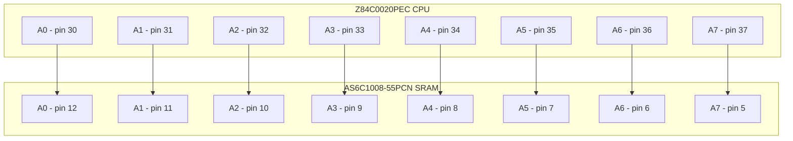
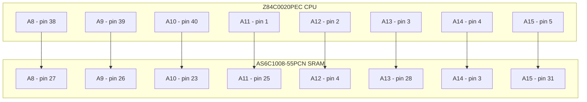
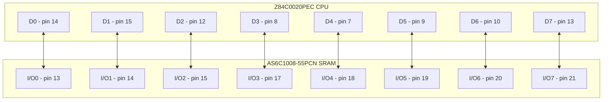
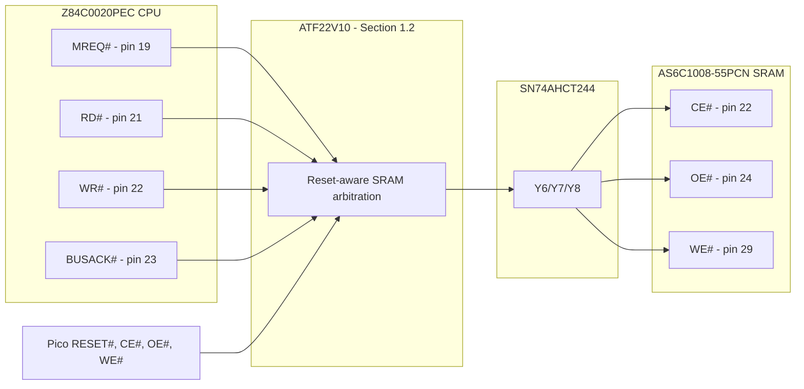
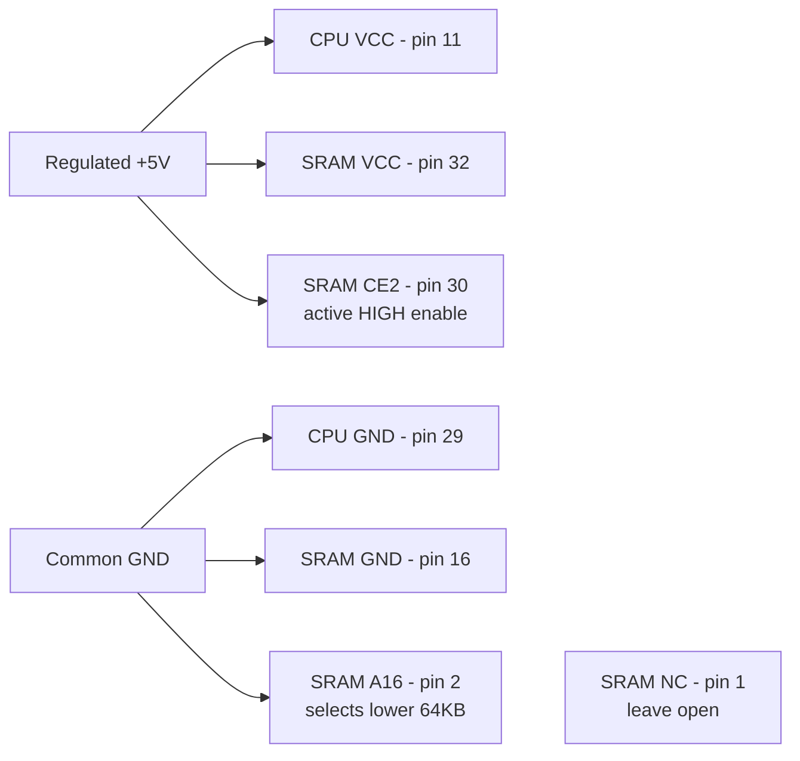
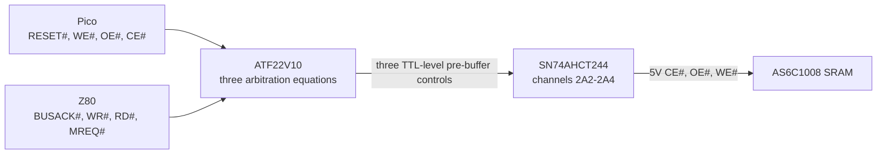
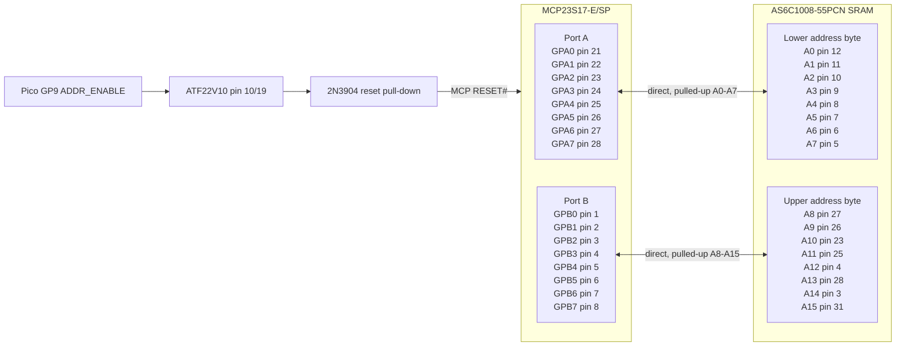
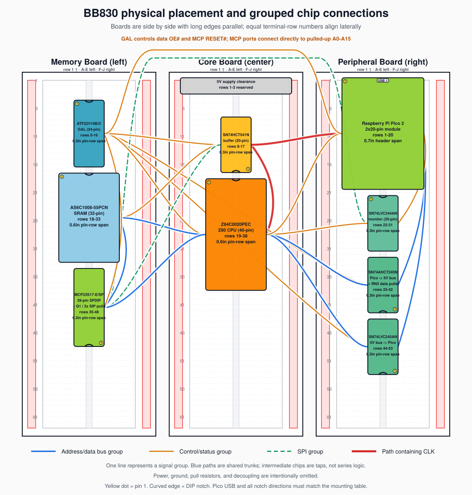
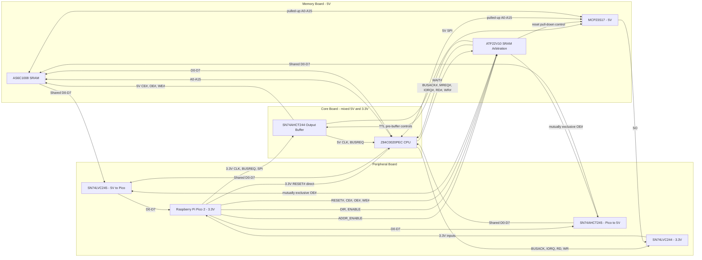
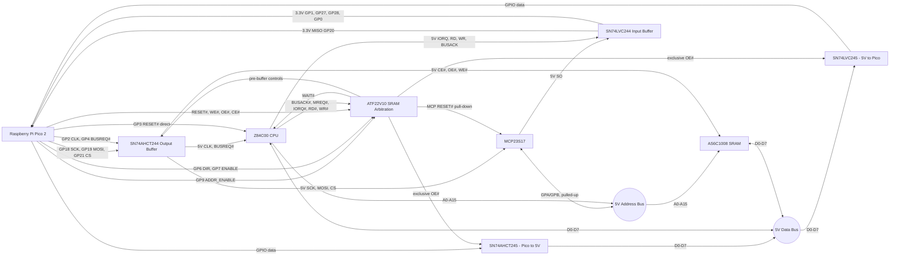

# Z80 ROMless SBC - WIP Engineering & Build Specification

**Repository:** [github.com/gloveboxes/Z80ROMlessSBC](https://github.com/gloveboxes/Z80ROMlessSBC)
**PDF edition:** [README.pdf](README.pdf)

<details class="web-toc" open>
<summary><strong>Table of Contents</strong></summary>

- [Overview](#overview)
- [0. Project Inventory](#0-project-inventory)
- [1. Reference Pin Mapping & Logic Domain Verification](#1-reference-pin-mapping--logic-domain-verification)
- [2. 16-Bit Address Expansion Interface: MCP23S17-E/SP](#2-16-bit-address-expansion-interface-mcp23s17-esp)
- [3. Physical Partitioning & Breadboard Topology](#3-physical-partitioning--breadboard-topology)
- [4. Output Buffer Mapping: SN74AHCT244N (DIP-20)](#4-output-buffer-mapping-sn74ahct244n-dip-20)
- [5. Transceiver Operating Modes & Isolation Tables](#5-transceiver-operating-modes--isolation-tables)
- [6. Architectural Operational Boundaries](#6-architectural-operational-boundaries)
- [7. Reference Firmware Implementations](#7-reference-firmware-implementations)
- [8. Progressive Build and Bring-Up Plan](#8-progressive-build-and-bring-up-plan)
- [Appendix A: Terms and Abbreviations](#appendix-a-terms-and-abbreviations)
- [Appendix B: Datasheet References](#appendix-b-datasheet-references)
- [Appendix C: Source Code Index](#appendix-c-source-code-index)
- [Appendix D: CP/M BIOS and dcc Compatibility](#appendix-d-cpm-bios-and-dcc-compatibility)
- [Generate the PDF](#generate-the-pdf)

</details>

## Overview

This document describes a theoretical Z80 single-board computer design
that has not yet been built, wired, or validated in hardware. Treat it
as an engineering proposal and bring-up plan, not as a proven reference
design. Every electrical assumption, timing margin, and firmware
interaction still needs bench validation with the staged tests in
Section 8 before the design should be considered reliable.

The proposed system is a ROMless Z80 computer supervised by a Raspberry
Pi Pico 2 W. The Pico supplies the Z80 clock, holds and releases reset,
loads a boot image directly into SRAM by taking the Z80 bus, and then
lets the Z80 execute from RAM. A 64 KB SRAM provides the Z80 memory
space; level shifters and bus transceivers isolate the Pico's 3.3 V GPIO
from the 5 V Z80/SRAM bus; an MCP23S17 expands the Pico's address-drive
capability during DMA and trapped I/O cycles.

The key design idea is that the Pico acts as both supervisor and virtual
peripheral controller. It can stop the fully static Z80 clock on an I/O
cycle while the GAL asserts WAIT#, inspect the requested port, exchange
one data byte, release WAIT# only after the selected data path is ready, and then
resume execution. Terminal I/O is intended to be one of those virtual
peripherals: Z80 `IN` and `OUT` instructions feed nonblocking queues on
the Pico, while a WebSocket terminal server runs on the Pico's other
core so Wi-Fi and browser traffic do not disturb Z80 timing.

Z80 software lives in a reserved region of the Pico's own onboard
flash rather than on removable media or compiled into the running
firmware image. The Pico reads boot binaries, monitor images, and CP/M
disk images directly from that memory-mapped flash region, then uses
the already-validated DMA path to populate SRAM before the Z80 is
released. Once the Z80 is running, the same I/O trap mechanism can
expose sector-oriented virtual disk ports backed by that same flash
partition (Section 6.3).

The build plan is deliberately phased. Early phases prove power,
translation, SPI expansion, bus isolation, SRAM DMA, and clock control
before the Z80 is installed. Later phases prove virtual-ROM boot,
synchronous I/O trapping, WebSocket terminal service, and finally the
maximum qualified clock rate. Passing an earlier phase is a prerequisite
for trusting the assumptions used by the next one.

## 0. Project Inventory

The quantities below build one complete three-breadboard prototype.
Purchase quantities include a small allowance for breadboard spares.

### 0.1 Semiconductors

| Required | Component | Package | Function |
|----:|----|----|----|
| 1 | Raspberry Pi Pico 2 W | Module with two 20-pin headers | Supervisor, clock, DMA, virtual I/O, and Wi-Fi terminal |
| 1 | Z84C0020PEC | 40-pin PDIP | CMOS Z80 CPU |
| 1 | AS6C1008-55PCN | 32-pin PDIP | SRAM; lower 64 KB used |
| 1 | MCP23S17-E/SP | 28-pin SPDIP | SPI-to-16-bit address interface |
| 1 | ATF22V10B-15PC or ATF22V10C-15PU | 24-pin PDIP | SRAM arbitration, data interlock, MCP reset, and I/O WAIT# control |
| 1 | SN74AHCT244N | 20-pin PDIP | Eight-channel 5 V output buffer for clock, BUSREQ#, SPI, and SRAM controls |
| 1 | SN74AHCT245N | 20-pin PDIP | Fixed Pico-to-5 V data-bus path; A side faces Pico, B side faces bus |
| 1 | SN74LVC245AN | 20-pin PDIP | Fixed 5 V-to-Pico data-bus path with 5 V-tolerant inputs and `Ioff` protection |
| 1 | SN74LVC244AN | 20-pin PDIP | 5 V-to-3.3 V buffering for Z80 status/control and MCP SO |
| 1 | 2N3904 | TO-92 | Pulls MCP23S17 RESET# LOW whenever GAL address access is disabled |
| 1 | 1N5819 | Axial diode | Schottky power OR from external +5 V to Pico VSYS |

> **Nine-package all-through-hole design:** The ATF22V10 computes all
> three SRAM controls from RESET#, BUSACK#, the Pico DMA
> controls, and the Z80 MREQ#/RD#/WR# outputs (Section 1.2). The
> ATF22V10 guarantees only a TTL-level 2.4 V HIGH, so its SRAM outputs
> pass through the SN74AHCT244N rather than driving the 5 V SRAM
> directly. The same AHCT244 translates Pico CLK, BUSREQ#, and the three
> MCP23S17 SPI inputs to guaranteed 5 V levels. Pico GP3 drives the
> Z80 RESET# input directly because the Z84C00 specifies a 2.2 V HIGH
> threshold for non-clock inputs; the Z80 clock uses the AHCT244 path to
> satisfy its stricter threshold. The data bus uses separate fixed-direction
> SN74AHCT245N and SN74LVC245AN devices because no single PDIP part
> provides a dual-supply, bidirectional, power-off-safe
> function. Two spare GAL inputs accept the existing DIR and
> master-enable controls, and two spare GAL outputs generate mutually
> exclusive active-low OEs. A third spare GAL output and one 2N3904
> hold the MCP23S17 in reset outside DMA/trap access, allowing its
> reset-default input ports to connect directly to pulled-up A0-A15 and
> safely share the address bus. The design uses 9 active packages with
> deterministic isolation and safe power sequencing. The
> SN74LVC244AN buffers RD#/WR# because Pico 2 GP27 and GP28 are
> standard ADC-capable pads, not 5 V-tolerant FT pads. It also buffers
> BUSACK#, IORQ#, and MCP SO: although GP0, GP1, and GP20 are FT pads,
> their 5.5 V tolerance requires RP2350 IOVDD to be present at 3.3 V.
> Using the spare LVC244 channels preserves safe power sequencing and
> powered-off isolation (Section 5.3).
>
> GAL pin 13 now accepts raw IORQ# and pin 20 drives WAIT#, adding the
> deterministic I/O interlock without another package.
>
> **AHCT244 sourcing:** Specify the exact `SN74AHCT244N` PDIP-20 part.
> TI lists this `N` package as active and in production. It is available
> from authorized distributors and in breadboard-friendly DIP form on
> AliExpress (for example, selectable-part listing `1005005865735693`).
> Do not substitute `SN74AHC244N`: at 5 V its CMOS input threshold does
> not guarantee recognition of Pico/GAL TTL HIGHs.

### 0.2 Sockets and Headers

| Quantity | Item | Used for | Width / form factor |
|----:|----|----|----|
| 1 | 40-pin DIP socket | Z84C0020PEC Z80 | **Wide: 0.6-inch (15.24 mm) row spacing** |
| 1 | 32-pin DIP socket | AS6C1008-55PCN SRAM | **Wide: 0.6-inch (15.24 mm) row spacing** |
| 1 | 28-pin DIP socket | MCP23S17-E/SP | Narrow: 0.3-inch (7.62 mm) row spacing |
| 1 | 24-pin DIP socket | ATF22V10B-15PC or ATF22V10C-15PU | Narrow: 0.3-inch (7.62 mm) row spacing |
| 4 | 20-pin DIP sockets | SN74AHCT244N, SN74AHCT245N, SN74LVC245AN, and SN74LVC244AN | Narrow: 0.3-inch (7.62 mm) row spacing |
| 2 | 20-pin 0.1-inch male headers | Pico 2 W, if headers are not fitted | Single-row header strips |
| 2 | 20-position 0.1-inch socket strips | Removable Pico 2 W mounting; do not substitute DIP IC sockets | Single-row socket strips |

### 0.3 Capacitors and Resistors

| Fitted | Purchase | Item | Purpose |
|----:|----:|----|----|
| 8 | 11 | 100 nF X7R ceramic capacitors, at least 10 V | One at every DIP logic supply pair |
| 3 | 5 | 22 uF capacitors, at least 10 V | One per breadboard |
| 1 | 2 | 100 uF electrolytic capacitor, at least 10 V | 5 V supply-entry bulk capacitance |
| 29 | 35 | 10 kOhm, 1/4 W resistors | Defined startup levels and temporary test pulls |
| 1 | 3 | 4.7 kOhm, 1/4 W resistor | GAL-to-2N3904 base current limiting |
| 1 | 3 | 47 kOhm, 1/4 W resistor | 2N3904 base-emitter pull-down |
| 3 | 4 | 8x10 kOhm bussed SIP resistor networks, 9-pin | Two A0-A15 pull-ups (common to +5 V) and one Pico D0-D7 pull-down (common to GND) |
| Reused for tests | 10 | 1 kOhm, 1/4 W resistors | First-drive current limiting and manual input tests |

Place each 100 nF capacitor directly across its IC supply pins with the
shortest practical leads. If scope captures show more than 250 mV rail
excursion at the farthest board, add 47-100 uF there and repeat the
capture; bulk capacitance does not replace local 100 nF capacitors. On
the 5 V side, fit 10 kOhm pull-ups to
BUSREQ#, BUSACK#, MREQ#, IORQ#, RD#, WR#, MCP SO, SRAM CE#, SRAM OE#,
SRAM WE#, WAIT#, INT#, and NMI#. RESET# is the direct GP3 node and must
not have a 5 V pull-up. Also pull SN74AHCT244 2A2, 2A3, and 2A4 up to 5 V
so its SRAM-control outputs remain inactive if the GAL is physically
absent. Fit 10 kOhm pull-ups on A0-A15 using two 9-pin bussed SIP
networks. On the Pico side, use 10 kOhm pull-ups to 3.3 V on GP4
(BUSREQ#), GP5 (SRAM CE#), GP21 (SPI CS#),
GP22 (SRAM WE#), and GP26 (SRAM OE#). Use 10 kOhm pull-downs to GND on
GP2 (CLK), GP3 (RESET#), GP6 (DATA_DIR), GP7 (DATA_ENABLE), GP9
(ADDR_ENABLE), and GP18/GP19 (SPI SCK/SI). Leave GP8 unconnected. Connect GP7 and GP6 directly
to ATF22V10 pins 9 and 11; its TTL-compatible inputs accept 3.3 V.
Fit the third 8x10 kOhm bussed SIP network from GP10-GP17 to GND so
the SN74AHCT245N A inputs stay defined while Pico GPIOs are inputs or
the Pico is absent. It loads each active HIGH by only 0.33 mA at 3.3 V.
Once the Pico 3.3 V rail is valid, these external resistors
establish safe levels before the firmware configures SIO. During a cold
power ramp the Pico-side pull-ups cannot hold active-low controls HIGH
while their 3.3 V rail is still at 0 V; RESET# remains asserted and SRAM
contents are therefore treated as indeterminate until the boot image is
loaded and verified. The AHCT244-input pull-ups cover an absent GAL, and
the final SRAM-node pull-ups cover an absent AHCT244. They do not provide
power-off isolation for an installed source IC. Tie every unused CMOS
input to a defined level.

### 0.4 Construction and Power

| Quantity | Item | Requirement |
|----:|----|----|
| 3 | 830-tie-point solderless breadboards (BusBoard/X-ON BB830, ABS body; 63 terminal rows plus two 100-point power-distribution strips per board) | Memory, CPU core, and peripheral zones |
| 1 | Regulated 5 V supply | At least 1 A; adjustable current limiting preferred |
| 1 | USB data cable | Pico programming and serial diagnostics |
| 1 set | 22 AWG solid-core hookup wire | Multiple colors for signal groups |
| 1 set | Short male-to-male jumpers | Inter-board and temporary connections |
| 1 set | Short ground and power-distribution links | Connects all three boards; includes +5 V, 3.3 V, and multiple GND links |
| 1 | In-line power switch or removable supply jumper | Emergency power removal; rated at least 1.5 A continuous |
| As required | Labels or wire markers | Bus bits, controls, and socket pin 1 |

Feed the breadboard's +5 V logic rail directly from the regulated
supply. Feed Pico VSYS from that rail only through the 1N5819: anode to
external +5 V, banded cathode to VSYS. Pico 2 already has a Schottky
diode from USB VBUS to VSYS, so this second diode safely ORs USB and
external power without back-powering either source. Never link the
external +5 V rail directly to Pico VBUS or VSYS. Feed the
SN74LVC245AN and SN74LVC244AN from the Pico 3.3 V rail. Connect the
SN74AHCT245N and all other logic to the regulated 5 V
rail. No 5 V output connects directly to a Pico GPIO; both LVC devices
provide power-off isolation. The GAL inputs do not source 5 V into
GP6/GP7, and
the SN74LVC244AN's `Ioff` protection keeps the five
monitored inputs isolated while its 3.3 V supply is absent or ramping.
Tie the Pico's AGND pin (pin 33) to the common digital ground: this
design does not use the ADC function on GP26-GP29, so no separate
analogue ground plane is needed.

All installed 5 V logic devices must be powered from the same 5 V rail
whenever that rail is energized. In particular, do not apply 5 V with
an installed ATF22V10 or SN74AHCT244 unpowered: downstream pull-ups can
otherwise raise an output above its `VCC + 0.75 V` GAL limit or the
corresponding logic-family absolute maximum. The absent-device pull-up
behavior is valid only when that device is physically removed from its
socket. Verify 5 V continuity at every installed IC before power-up; a
missing VCC socket contact is a fault, not a supported operating mode.

The plug-in supply shown on the middle breadboard may provide the 5 V
entry point only after a load test proves 4.75 V to 5.25 V at the board
under at least 500 mA load without regulator overheating. Do not connect
that module's 3.3 V output to the Pico 3V3 pin or the system 3.3 V rail;
the Pico must remain the only 3.3 V source. Reserve terminal rows 1-3
under the module body even if its pins enter only the distribution
strip. If the actual module obscures more than three terminal rows,
move it off-board or to the Memory Board rather than compressing the
Core Board placement.

### 0.5 Bring-Up Equipment

- Digital multimeter with resistance, continuity, and DC voltage modes.
- Available oscilloscope: PicoScope PQ012, two analog channels and
  50 MHz bandwidth. This is suitable for the specified 1-6 MHz
  functional, voltage-margin, duty-cycle, pulse-width, and paired-signal
  timing checks, subject to the limitations below.
- Logic analyzer with at least 16 channels; 24 or more is preferred.
- Current-limited bench supply or an in-line 5 V current meter.
- Fine probe hooks or test clips suitable for DIP pins.
- A programmer explicitly supporting the selected ATF22V10B or
  ATF22V10C device and generic 22V10 JEDEC files.

#### PicoScope PQ012 Setup and Capture Plan

The 50 MHz front end has a calculated rise time of approximately 7 ns
($0.35 / 50\,\text{MHz}$). A displayed edge near or below that value is
scope-limited; it does not prove the circuit's true edge rate or the
absence of higher-frequency ringing. Use the PQ012 for pass/fail logic
levels, threshold margin, duty cycle, pulse width, gross overshoot,
and relative timing. If a decision depends on sub-7 ns edge shape,
small high-frequency ringing, or an unexplained marginal waveform,
repeat that measurement on a borrowed scope with at least 100 MHz
bandwidth before qualification.

- Use compensated 10x passive probes. Check compensation against the
  scope calibration output before each bring-up session.
- Use a ground spring or a ground lead shorter than 20 mm at a ground
  point beside the measured IC. A long crocodile ground lead can create
  the ringing being investigated.
- Connect probe grounds only to common circuit GND. The USB scope ground
  is referenced through the host computer; never clip it to a signal or
  positive rail.
- Use DC coupling and the highest real-time block-mode sample rate that
  PicoScope 7 offers with both channels enabled. Do not use ETS to prove
  single-shot glitches, ownership transitions, or trap timing; ETS
  constructs a waveform from repeated acquisitions.
- Disable software bandwidth limiting for edge/ringing checks. A 20 MHz
  software limit may be enabled only for low-noise rail-ripple readings,
  and the capture must be labelled accordingly.

Because only two analog channels are available, repeat each test for
every listed signal rather than moving both probes during one capture:

| Measurement | Channel A / trigger | Channel B | Required repetitions |
| --- | --- | --- | --- |
| Clock translation | Pico GP2 | AHCT244 1Y1 / Z80 CLK pin 6 | 1 kHz, 100 kHz, 1 MHz, then each qualified frequency |
| GAL ownership transition | RESET# or BUSACK# | One of GAL pins 14-16 | Every input transition and each output |
| Data interlock | DATA_ENABLE or DATA_DIR | GAL pin 17 or 18 | Both outputs for every truth-table transition |
| Address integrity | Z80 CLK or MREQ# | SRAM A0, A7, A8, or A15 | Required address patterns at 1, 2, 3, and 4 MHz |
| SRAM read setup | Z80 CLK | SRAM D0-D7, one bit per capture | Representative 0x00, 0xFF, 0x55, and 0xAA reads |
| SRAM write pulse | SRAM CE# | SRAM WE# | Each qualified frequency and worst-case write loop |
| Supply integrity | 5 V entry | Farthest-board 5 V | Idle, DMA patterns, Z80 run, and Wi-Fi traffic |

The logic analyzer remains mandatory for simultaneous bus/control
correlation. The PQ012 validates analog voltage and waveform quality;
the logic analyzer proves multi-signal ordering and captures A0-A15,
D0-D7, and control activity concurrently.

### 0.6 Optional Items

- LEDs with 1 kOhm series resistors for low-speed diagnostics only; do
  not permanently load high-speed buses with LEDs.
- No card socket or extra storage hardware is needed for boot images or
  CP/M disks: they live in a reserved region of the Pico's own onboard
  flash (Section 6.3), provisioned once with `picotool` and read back
  over the existing memory-mapped XIP bus. Reflash that region with
  `picotool` to change a disk image; no wiring changes.
- Spare 100 nF capacitors, resistors, jumper wire, and an IC extractor.

## 1. Reference Pin Mapping & Logic Domain Verification

This architecture leverages the fully static nature of the Z84C0020PEC
CMOS CPU. The Pico controls the clock and uses the Z80 BUSREQ#/
BUSACK# handshake for DMA ownership. During RESET, the address and data
buses float and control outputs are inactive. During BUSACK#, A0-A15,
D0-D7, MREQ#, IORQ#, RD#, and WR# float while BUSACK# remains actively
driven LOW; M1#, RFSH#, and HALT# are not part of the floated bus set.

### 1.0 Raspberry Pi Pico 2 Header Pin Map

GPIO numbers in the firmware are not physical header numbers. Use this
table for construction; the ranges preserve ascending bit order.

| Pico function | GPIO | Physical header pin | Connection |
|----|----:|----:|----|
| BUSACK# monitor | GP0 | 1 | SN74LVC244AN 1Y1 |
| IORQ# trap input | GP1 | 2 | SN74LVC244AN 1Y2 |
| Z80 CLK | GP2 | 4 | SN74AHCT244 1A1 pin 2 |
| Z80 RESET# | GP3 | 5 | Z80 pin 26 and ATF22V10 pin 1, direct 3.3 V logic |
| Z80 BUSREQ# | GP4 | 6 | SN74AHCT244 1A2 pin 4 |
| SRAM CE# | GP5 | 7 | ATF22V10 pin 7 |
| Data DIR / ENABLE | GP6 / GP7 | 9 / 10 | ATF22V10 pins 11 / 9; GAL pins 17 / 18 generate mutually exclusive data OE# signals |
| Unused | GP8 | 11 | Leave open; no address transceivers are fitted |
| Address enable | GP9 | 12 | ATF22V10 pin 10; HIGH releases MCP RESET# through GAL pin 19 and Q1 |
| D0-D3 | GP10-GP13 | 14-17 | SN74AHCT245N and SN74LVC245AN A1-A4 pins 2-5 |
| D4-D7 | GP14-GP17 | 19-22 | SN74AHCT245N and SN74LVC245AN A5-A8 pins 6-9 |
| SPI SCK / MOSI / MISO / CS# | GP18-GP21 | 24-27 | AHCT244 1A4 pin 8 / 2A1 pin 11, LVC244 2Y1, AHCT244 1A3 pin 6 |
| SRAM WE# | GP22 | 29 | ATF22V10 pin 3 |
| SRAM OE# | GP26 | 31 | ATF22V10 pin 5 |
| Z80 RD# monitor | GP27 | 32 | SN74LVC244AN 1Y3 |
| Z80 WR# monitor | GP28 | 34 | SN74LVC244AN 1Y4 |
| 3.3 V output | - | 36 | SN74LVC245AN VCC, LVC244 VCC, and 3.3 V pull-ups |
| VSYS | - | 39 | 1N5819 banded cathode; anode to external +5 V |

Connect Pico GND pins 3, 8, 13, 18, 23, 28, and 38, plus AGND pin
33, to common ground with multiple short links. Leave RUN pin 30,
ADC_VREF pin 35, and 3V3_EN pin 37 open. Do not connect the external
5 V rail to VBUS pin 40; USB supplies that node internally.

<table>
<colgroup>
<col style="width: 25%" />
<col style="width: 25%" />
<col style="width: 25%" />
<col style="width: 25%" />
</colgroup>
<thead>
<tr>
<th>Component</th>
<th>Signal Name / Group</th>
<th>Hardware Pin Numbers</th>
<th>Electrical Constraint / Logic Domain</th>
</tr>
</thead>
<tbody>
<tr>
<td rowspan="14"><strong>Z84C0020PEC (CPU)</strong></td>
<td>CLK</td>
<td>Pin 6</td>
<td>Input. Driven by level-shifted 5V CMOS square wave. Clock can be
safely frozen indefinitely in either a HIGH or LOW state.</td>
</tr>
<tr>
<td>IORQ#</td>
<td>Pin 20</td>
<td>Output. Active Low. Buffered to 3.3 V through SN74LVC244AN channel
1A2/1Y2 and monitored by Pico 2 GP1 to trigger clock-stop trapping. The
raw 5 V node also feeds ATF22V10 pin 13 for hardware WAIT generation.</td>
</tr>
<tr>
<td>MREQ#</td>
<td>Pin 19</td>
<td>Output. Active Low, three-state. Connects to ATF22V10 pin 8 for
CPU-owned SRAM cycles; pulled HIGH when the CPU is absent.</td>
</tr>
<tr>
<td>RD#</td>
<td>Pin 21</td>
<td>Output. Active Low. Buffered to 3.3 V through SN74LVC244AN channel
1A3/1Y3 and sampled by Pico 2 GP27 to resolve cycle intent.</td>
</tr>
<tr>
<td>WR#</td>
<td>Pin 22</td>
<td>Output. Active Low. Buffered to 3.3 V through SN74LVC244AN channel
1A4/1Y4 and sampled by Pico 2 GP28 to resolve cycle intent alongside
RD#.</td>
</tr>
<tr>
<td>BUSACK#</td>
<td>Pin 23</td>
<td>Output. Active Low. Feeds ATF22V10 pin 2 for SRAM-source arbitration
(Section 1.2) and is buffered to 3.3 V through SN74LVC244AN
channel 1A1/1Y1 for monitoring at Pico 2 GP0.</td>
</tr>
<tr>
<td>BUSREQ#</td>
<td>Pin 25</td>
<td>Input. Active Low. Level-shifted up to 5V to request DMA
ownership.</td>
</tr>
<tr>
<td>RESET#</td>
<td>Pin 26</td>
<td>Input. Active Low. Driven directly by Pico GP3 at TTL-compatible
3.3 V and also connected to ATF22V10 pin 1 for SRAM-source arbitration.
Hold LOW for at least three full clock cycles.</td>
</tr>
<tr>
<td>M1#</td>
<td>Pin 27</td>
<td>Output. Active Low. Probe point for the Phase 7 opcode-fetch test;
not connected to Pico logic.</td>
</tr>
<tr>
<td>A0 – A15 (Address Bus)</td>
<td>Pins 30 – 40, 1 – 5</td>
<td>5V Tri-state Bus. Driven by CPU during active run, floats during
DMA/RESET.</td>
</tr>
<tr>
<td>D0 – D7 (Data Bus)</td>
<td>Pins 7 – 10, 12 – 15</td>
<td>5V Bi-directional Tri-state Bus. Connected directly to SRAM data bus
pins.</td>
</tr>
<tr>
<td>WAIT#</td>
<td>Pin 24</td>
<td>Input. Active Low. Driven by ATF22V10 pin 20 during I/O trapping and
pulled to +5 V through 10 kOhm so it remains inactive if the GAL is
physically absent.</td>
</tr>
<tr>
<td>INT#</td>
<td>Pin 16</td>
<td>Input. Active Low. Unused; pull to +5V through 10 kOhm to prevent a
spurious interrupt from a floating input.</td>
</tr>
<tr>
<td>NMI#</td>
<td>Pin 17</td>
<td>Input. Active Low, edge-sensed. Unused; pull to +5V through 10 kOhm
to prevent a spurious non-maskable interrupt from a floating input.</td>
</tr>
<tr>
<td rowspan="7"><strong>AS6C1008-55PCN (SRAM)</strong></td>
<td>A0 – A15 (Address lines)</td>
<td>Pins 12-10, 9-7, 6-5, 27-26, 23, 25, 4, 28, 3, 31</td>
<td>5V Input. Connected directly to the 5V Z80 address bus. Driven by
MCP23S17 during DMA.</td>
</tr>
<tr>
<td>A16</td>
<td>Pin 2</td>
<td>5V Input. Tie to GND to select the lower 64KB bank; do not leave
floating.</td>
</tr>
<tr>
<td>D0 – D7 (Data lines)</td>
<td>Pins 13 – 15, 17 – 21</td>
<td>5V Bi-directional Bus. Connected directly to the Z80 data bus.</td>
</tr>
<tr>
<td>WE#</td>
<td>Pin 29</td>
<td>Input. Active Low. Driven by SN74AHCT244 2Y2 pin 7 from the ATF22V10
arbitration output (Section 1.2): Z80 WR# during CPU ownership, Pico
DMA write signal during DMA ownership.</td>
</tr>
<tr>
<td>OE#</td>
<td>Pin 24</td>
<td>Input. Active Low. Driven by SN74AHCT244 2Y3 pin 5 from the ATF22V10
arbitration output (Section 1.2): Z80 RD# during CPU ownership, Pico
DMA read signal during DMA ownership.</td>
</tr>
<tr>
<td>CE#</td>
<td>Pin 22</td>
<td>Input. Active Low. Driven by SN74AHCT244 2Y4 pin 3 from the ATF22V10
arbitration output (Section 1.2): Z80 MREQ# during CPU ownership so
I/O cycles cannot access SRAM, Pico DMA chip-enable signal during DMA
ownership.</td>
</tr>
<tr>
<td>CE2</td>
<td>Pin 30</td>
<td>Input. Active High. Tie permanently to VCC (+5V) to enable the
device through the active-low CE# input.</td>
</tr>
</tbody>
</table>

### 1.1 Z84C0020PEC-to-AS6C1008-55PCN Wiring

The following is the direct run-mode connection verified against the
manufacturers' 40-pin PDIP and 32-pin PDIP pin assignments. The
AS6C1008 is a 128K x 8 device, so A16 must be tied LOW to expose its
lower 64KB as the Z80's address space. CE2 must be tied HIGH, and pin 1
is not connected.

Manufacturer datasheets:

- [Zilog Z84C00 CMOS Z80 CPU Product Specification](https://www.zilog.com/docs/z80/ps0178.pdf)
- [Alliance Memory AS6C1008 128K x 8 Low Power CMOS SRAM Datasheet](https://www.alliancememory.com/wp-content/uploads/AS6C1008_Mar_2023V1.2.pdf)

#### Package Pinouts

[](https://www.zilog.com/docs/z80/ps0178.pdf)

[](https://www.alliancememory.com/wp-content/uploads/AS6C1008_Mar_2023V1.2.pdf)

#### Address Bus A0-A7



#### Address Bus A8-A15



#### Data Bus D0-D7



#### Memory Control



#### Power and Fixed Pins



> **SRAM control-source arbitration:** MREQ#/RD#/WR# above are the
> CPU-owned run-mode inputs of the ATF22V10 described in Section 1.2,
> never directly to the SRAM. The programmed equations select either
> these inputs or the Pico DMA controls; the three results then pass
> through dedicated SN74AHCT244 channels to the SRAM.

### 1.2 SRAM Control-Source Arbitration: ATF22V10B/C

The Z80 and Pico must never drive SRAM CE#, OE#, or WE# simultaneously.
The ATF22V10 implements three combinational 2:1 selectors with a shared
ownership condition:

```text
CPU_OWNS_SRAM = RESET# AND BUSACK#

SRAM_WE_PRE# = CPU_OWNS_SRAM ? Z80_WR#   : PICO_WE#
SRAM_OE_PRE# = CPU_OWNS_SRAM ? Z80_RD#   : PICO_OE#
SRAM_CE_PRE# = CPU_OWNS_SRAM ? Z80_MREQ# : PICO_CE#
```

| RESET# | BUSACK# | Selected source | Required state |
|----:|----:|----|----|
| 0 | X | Pico | Held-reset DMA or Z80 absent |
| 1 | 0 | Pico | BUSREQ#/BUSACK# DMA ownership |
| 1 | 1 | Z80 | Normal CPU execution |

This covers the two cases that BUSACK# alone cannot distinguish. During
RESET the Z80 drives BUSACK# inactive HIGH, and with the Z80 physically
absent its pull-up also reads HIGH. RESET# LOW therefore selects the Pico
in both cases. Only an out-of-reset CPU that has not granted the bus can
select MREQ#/RD#/WR#.

The PLD source adds the logically redundant consensus term
`Z80_CONTROL# & PICO_CONTROL#` to each output. It does not change this
truth table, but it holds an inactive HIGH continuously while RESET# or
BUSACK# transfers ownership with both candidate controls HIGH. Without
that term, unequal GAL product-term delays can create a static-1 hazard,
seen externally as a short active-low SRAM control pulse. Each hardened
equation uses four product terms, within every ATF22V10 macrocell's
capacity.

Program the selected ATF22V10B or ATF22V10C with
[src/pld/sram_control.pld](src/pld/sram_control.pld). Use the exact
device algorithm listed by the programmer, write the generated JEDEC
file, read it back, and require a verify pass before installation. Do
not enable the optional power-down mode or security fuse.

| ATF22V10 pin | Signal | Connection |
|----:|----|----|
| 1 | RESET# | Pico GP3 and Z80 pin 26 direct node |
| 2 | BUSACK# | Z80 pin 23 |
| 3 | PICO_WE# | Pico GP22 |
| 4 | Z80_WR# | Z80 pin 22 |
| 5 | PICO_OE# | Pico GP26 |
| 6 | Z80_RD# | Z80 pin 21 |
| 7 | PICO_CE# | Pico GP5 |
| 8 | Z80_MREQ# | Z80 pin 19 |
| 9 | DATA_ENABLE | Pico GP7; 10 kOhm pull-down to GND |
| 10 | ADDR_ENABLE | Pico GP9; 10 kOhm pull-down to GND |
| 11 | DATA_DIR | Pico GP6; 10 kOhm pull-down to GND |
| 12 | GND | Common ground |
| 13 | Z80_IORQ# | Z80 pin 20 direct 5 V node; existing 10 kOhm pull-up |
| 14 | SRAM_WE_PRE# | SN74AHCT244 2A2 pin 13 |
| 15 | SRAM_OE_PRE# | SN74AHCT244 2A3 pin 15 |
| 16 | SRAM_CE_PRE# | SN74AHCT244 2A4 pin 17 |
| 17 | DATA_UP_OE# | SN74AHCT245N OE# pin 19 |
| 18 | DATA_DOWN_OE# | SN74LVC245AN OE# pin 19 |
| 19 | MCP_RESET_DRIVE | 4.7 kOhm to Q1 base; Q1 collector drives MCP RESET# |
| 20 | WAIT# | Z80 pin 24 direct node; existing 10 kOhm pull-up |
| 21-23 | Unused outputs | Program constant LOW; leave open |
| 24 | VCC | Regulated +5 V |

The ATF22V10's guaranteed HIGH output is 2.4 V, which satisfies the
AHCT244's 2.0 V input threshold but not the AS6C1008's 5 V CMOS input
threshold. Never bypass the AHCT244 on these three paths. Fit 10 kOhm
pull-ups at AHCT244 2A2-2A4 and at the final SRAM CE#/OE#/WE# nodes. The
input pull-ups keep the permanently enabled AHCT244 deterministic if the
GAL is missing; the output pull-ups keep the SRAM inactive if the
AHCT244 is physically missing. All installed source devices must be
powered as required by Section 0.4.

WAIT# may connect directly from GAL pin 20 to Z80 pin 24 because the
Z84C00 ordinary-input HIGH minimum is 2.2 V, below the GAL's guaranteed
2.4 V HIGH. The existing 10 kOhm pull-up defines WAIT# HIGH if the GAL
is physically absent; it is not a substitute for powering an installed
GAL.

The same 2.4 V guaranteed HIGH exceeds the 2.0 V input-HIGH minimum of
both data-transceiver OE# inputs. Two additional equations use two
product terms each:

```text
DATA_UP_OE#    = NOT DATA_ENABLE OR NOT DATA_DIR
DATA_DOWN_OE#  = NOT DATA_ENABLE OR DATA_DIR
MCP_RESET_DRIVE = NOT ADDR_ENABLE
WAIT_N          = Z80_IORQ_N OR DATA_ENABLE
```

Both paths are disabled whenever DATA_ENABLE is LOW. When it is HIGH,
exactly one path is enabled. Firmware changes DATA_DIR only while
DATA_ENABLE is LOW, so the shared `NOT DATA_ENABLE` product term holds
both OE# outputs inactive throughout the transition. SN74LVC245A `Ioff`
permits its OE# pin to remain driven from the 5 V GAL while the LVC
device's 3.3 V supply is absent.

While IORQ# is inactive HIGH, WAIT# is always HIGH. When IORQ# falls,
WAIT# goes LOW because DATA_ENABLE is still LOW. After the trap configures
the correct direction and stable read/write data, raising DATA_ENABLE both
enables exactly one data path and releases WAIT#. Firmware keeps
DATA_ENABLE HIGH until IORQ# and RD#/WR# are inactive; lowering it early
would reassert WAIT# in the same cycle.

For address isolation, connect GAL pin 19 through 4.7 kOhm to the base
of Q1 (2N3904), add 47 kOhm base-to-emitter, ground the emitter, pull
MCP RESET# up to 5 V through 10 kOhm, and connect the collector to
RESET#. ADDR_ENABLE LOW makes GAL pin 19 HIGH and Q1 asserts reset,
which forces all MCP GPIO registers back to input mode. ADDR_ENABLE
HIGH releases reset; firmware then configures IODIR before using the
address bus.

During Phase 6 with the Z80 absent, hold GP3 RESET# LOW. The programmed
logic then selects the Pico controls regardless of the pulled-up,
undriven BUSACK# input.



## 2. 16-Bit Address Expansion Interface: MCP23S17-E/SP

The MCP23S17 acts as the dedicated 16-bit register shifter interfacing
the Pico 2's SPI bus with the shared 5V address bus. During DMA block
injection, it drives the target SRAM locations. During an active I/O
trap, its GPIO ports remain inputs, allowing the MCP23S17 to monitor the
address bus states driven by the frozen Z80 CPU.

| MCP23S17 Pin Designation | Target Connection | System Logic Role |
|----|----|----|
| GPA0 – GPA7 (Port A) | Shared A0-A7 directly | Lower address byte drive/sample |
| GPB0 – GPB7 (Port B) | Shared A8-A15 directly | Upper address byte drive/sample |
| CS# (Pin 11) | SN74AHCT244 1Y3 pin 14, from Pico GP21 via 1A3 pin 6 | SPI Hardware Chip Select (Active Low), 5 V translated |
| CLK / SCK (Pin 12) | SN74AHCT244 1Y4 pin 12, from Pico GP18 via 1A4 pin 8 | SPI Master Clock Train Input, 5 V translated |
| SI (Pin 13) | SN74AHCT244 2Y1 pin 9, from Pico GP19 via 2A1 pin 11 | SPI Master-Out-Slave-In (MOSI Path), 5 V translated |
| SO (Pin 14) | SN74LVC244AN channel 2A1/2Y1 to Pico 2 GP20 | SPI Master-In-Slave-Out (MISO Path), buffered from 5 V to 3.3 V; fit the Section 0.3 pull-up because SO is high-impedance while CS# is HIGH |
| A0, A1, A2 (Pins 15-17) | Tied to GND | Hardware address = 000; matches the fixed 0x40/0x41 opcode used in firmware regardless of the IOCON.HAEN state, and prevents floating address-select inputs |
| RESET# (Pin 18) | 10 kOhm pull-up to 5 V and Q1 collector | LOW outside address access; reset default makes all GPIO inputs |

[Microchip MCP23017/MCP23S17 16-Bit I/O Expander with Serial Interface Datasheet](https://ww1.microchip.com/downloads/aemDocuments/documents/OTH/ProductDocuments/DataSheets/20001952C.pdf)

### 2.1 MCP23S17-to-SRAM Address Wiring

The MCP23S17 connects directly to the shared address bus: GPA0-GPA7 to
A0-A7 and GPB0-GPB7 to A8-A15. Fit one 8x10 kOhm bussed pull-up network
per byte, with each common pin at 5 V. The Z84C00 guarantees 4.2 V at
its light-load VOH2 point against the MCP's 4.0 V input minimum; the
external pull-ups improve the static HIGH level and add at most about
0.5 mA load per LOW bit. MCP GPIO outputs guarantee at least 4.3 V at
5 V, exceeding the SRAM's 3.5 V input minimum.

Hardware isolation comes from RESET#, not a bus transceiver. GP9
ADDR_ENABLE feeds GAL pin 10. When LOW, GAL pin 19 drives Q1 and holds
MCP RESET# LOW, forcing IODIRA/IODIRB to their all-input reset values.
When HIGH, Q1 releases RESET#; firmware waits, then programs OLAT before
changing IODIR to outputs. It reasserts reset before releasing the Z80.
GP9 has a 10 kOhm pull-down, so Pico reset or power loss fails closed.



## 3. Physical Partitioning & Breadboard Topology

The layout enforces a strict three-zone model across three 830-point
breadboards to minimize cross-talk and propagation delay across the
distinct 3.3V and 5V power domains. Each zone below lists the specific
chips to place on that board and where to seat them.

Place the three BB830s side by side with their long edges parallel:
Memory on the left, Core in the center, and Peripheral on the right.
Rows 1-63 run in the same direction on all three boards, so equal row
numbers align across both board boundaries. The Core Board's central
position is deliberate: the dominant Memory/Core paths are the shared
16-bit address and 8-bit data buses plus the MCP23S17 address/SPI
interface, while the dominant Core/Peripheral paths are the Pico's
8-bit data interface and supervisor controls. Seven Pico-to-GAL signals span both board boundaries
without a buffer: PICO_CE#, PICO_OE#, PICO_WE#, RESET#, DATA_ENABLE,
DATA_DIR, and ADDR_ENABLE. RESET# is a
three-way node also tapped by the Z80 on the Core Board; the others
simply cross the Core Board without connecting to a Core component.
MCP SO also crosses both boundaries to the Peripheral Board's LVC244.
Keep these low-activity paths away from CLK. Putting either outer cluster
in the center would shorten these four wires only by forcing one of the
much wider address/data interfaces to span two board widths.

- **Memory Board (Left Zone):** AS6C1008-55PCN SRAM, the programmed
  ATF22V10, and MCP23S17. The GAL's five CPU-side inputs (BUSACK#,
  MREQ#, IORQ#, RD#, WR#)
  cross from the Core Board, and its three pre-buffer outputs cross
  back to the Core Board's SN74AHCT244 before the buffered result
  returns here as SRAM CE#/OE#/WE#. This deliberate round trip keeps
  the AHCT244's clock channel local to the Z80 instead (see below), which
  matters far more than SRAM control length since SRAM CE#/OE#/WE# only
  toggle at the Z80 bus-cycle rate, the same class as MREQ#/RD#/WR#. The
  MCP23S17 now sits here so its 16 port lines join the pulled-up shared
  address bus at the Memory/Core boundary. Q1 beside it provides
  reset-based hardware isolation. AHCT244 SPI outputs also cross only
  the Memory/Core boundary. Its SO output is
  the one MCP signal that continues across Core to the LVC244. Row
  budget: 16 (SRAM) + 12 (ATF22V10) + 14 (MCP23S17) = 42 of 63 rows.

- **Core Board (Center Zone):** Z84C0020PEC CPU and the SN74AHCT244N
  output buffer. Keep the
  AHCT244 beside the Z80 so its
  Y1 clock output never crosses a board boundary, the same placement
  rule the discrete design used for its dedicated clock buffer. The
  Z80 address pins join the SRAM/MCP address trunk directly. The
  photographed plug-in supply reserves rows 1-3, leaving 60 usable
  terminal rows.
  The chip budget is 20 (Z80) + 10 (SN74AHCT244N) = 30 of those 60
  rows, leaving 30 rows for socket-body
  clearance, decoupling, and wiring. *No separate wait-state latch or
  flip-flop is used; the GAL drives WAIT# combinationally.*

- **Peripheral Board (Right Zone):** Raspberry Pi Pico 2,
  SN74LVC244AN monitor buffer, SN74AHCT245N upward data path,
  and SN74LVC245AN downward data path. The ATF22V10 on Memory provides
  the mutually exclusive enables. Rotate both data transceivers so
  their B-port pin rows face the Core Board and their A-port pin rows
  face the Pico; tie AHCT DIR HIGH and LVC DIR LOW. Orient the LVC244 so its 1A input pin
  row faces the Core Board and its 1Y output pin row faces inward toward
  the Pico; its fifth input, MCP SO, arrives from Memory across Core.
  Row budget: 20 (Pico) + 10 (LVC244) + 10 (AHCT245) + 10 (LVC245) =
  50 of 63 rows.

The following row-aligned schedule was selected by evaluating every
valid per-board package ordering and gap distribution against grouped
signal-count weights, iterating the comparison across all three boards.
This is a routing aid, not an instruction to equalize individual wire
lengths:

| Board | Terminal-row schedule | Unallocated rows |
|----|----|----:|
| Memory | Unallocated 1-4; GAL 5-16; gap 17; SRAM 18-33; gap 34; MCP23S17 35-48 | 1-4 and 49-63 (19) |
| Core / middle | Supply clearance 1-3; unallocated 4-7; AHCT244 8-17; gap 18; Z80 19-38 | 4-7 and 39-63 (29) |
| Peripheral | Pico 1-20; gap 21; LVC244 22-31; gap 32; AHCT245 33-42; gap 43; LVC245 44-53 | 54-63 (10) |

### 3.1 Package Orientation and Pin 1

Use this convention for both the table and the placement image: view
each BB830 from above and rotate it 90 degrees counter-clockwise from
the manufacturer's landscape drawing, so **row 1 is at the top, row 63
is at the bottom, A-E are on the left, and F-J are on the right**.
Memory, Core, and Peripheral then sit left-to-right. Do not mirror any
board.

Seat every DIP socket across the center ravine before wiring it. A
0.3-inch DIP uses the E/F holes immediately beside the ravine. The Z80
and SRAM are 0.6-inch-wide DIPs: dry-fit their specified 0.6-inch
sockets in two terminal columns matching the actual 15.24 mm lead-row
span; do not force or bend them into E/F. Both pin rows must remain on
opposite, electrically isolated sides of the ravine. Install the IC
only after marking the socket's pin-1 corner and matching the IC notch
or dot to the socket.

| Board / device | Occupied rows | Body orientation | Pin 1 location (top view) | Opposite corner check |
| --- | ---: | --- | --- | --- |
| Memory / ATF22V10 | 5-16 | Notch toward row 1 | E5 | Pin 24 at F5 |
| Memory / AS6C1008 SRAM | 18-33 | Notch toward row 1 | A-E pin-row side at row 18 | Pin 32 on F-J side at row 18 |
| Memory / MCP23S17 | 35-48 | Notch toward row 63 | F48 | Pin 28 at E48 |
| Core / SN74AHCT244 | 8-17 | Notch toward row 63 | F17 | Pin 20 at E17; 1Y1 pin 18 is then close to Z80 CLK |
| Core / Z84C0020 | 19-38 | Notch toward row 1 | A-E pin-row side at row 19 | Pin 40 on F-J side at row 19 |
| Peripheral / Pico 2 W | 1-20 | USB connector toward row 1 | Header pin 1 on A-E side at row 1 | Header pin 40 on F-J side at row 1 |
| Peripheral / SN74LVC244 | 22-31 | Notch toward row 1 | E22 | Pin 20 at F22; 1A inputs face Core |
| Peripheral / SN74AHCT245 | 33-42 | Notch toward row 63 | F42 | Pin 20 at E42; B1-B8 face Core |
| Peripheral / SN74LVC245 | 44-53 | Notch toward row 63 | F53 | Pin 20 at E53; B1-B8 face Core |

For the non-DIP keyed parts:

- **Q1 (2N3904):** place beside the MCP, not across the ravine. TO-92
  lead order can vary by manufacturer; use the purchased part's
  datasheet to identify emitter/base/collector and mark `E-B-C` beside
  its holes. Do not rely on flat-face orientation alone.
- **RN1/RN2:** place as single-row SIPs near SRAM/MCP, parallel to the
  ravine, with the dot/common pin toward row 1 and wired to +5 V.
- **RN3:** place beside the AHCT/LVC A-port node with its dot/common pin
  toward row 1 and wired to GND.
- **1N5819 and electrolytics:** the diode band faces Pico VSYS; every
  electrolytic `+` lead goes to its positive rail. Mark polarity on the
  breadboard before insertion.
- **Plug-in supply module:** orient it only from its printed `+`, `-`,
  input, and output labels, then confirm every rail with a meter while
  unloaded. There is no generic module orientation; never infer
  polarity from USB-jack position or board color.

Before applying power, inspect every socket from above and verify the
pin-1 location against this table. Then use continuity mode to prove
that opposite-side pins at the same row are not shorted through a
terminal strip.

This placement uses row alignment to reduce diagonal jumper length:

- **Memory/Core:** SRAM rows 18-33 overlap the Z80's rows 19-38 for the
  full A0-A15/D0-D7 trunk. GAL rows 5-16 overlap the AHCT244, while
  MCP23S17 rows 35-48 meet the lower end of the direct Z80 address trunk.
- **Core/Peripheral:** Pico rows 1-20 overlap AHCT244 and the top of the
  Z80. LVC244 rows 22-31 overlap the Z80 monitor sources. Both data
  transceivers overlap the lower Z80 region while remaining
  directly adjacent to the Pico on the same board.
- **Peripheral/Memory:** Pico rows 1-20 overlap GAL rows 5-16, reducing
  the vertical component of the seven Pico-to-GAL paths and two OE#
  returns. MCP SO
  remains one grouped low-activity crossing to the LVC244.

This schedule includes one empty row between every socket or module and
still fits all three boards. Mark the actual supply-module overhang and
socket outlines on the empty boards before wiring; the schedule is not
valid if the supply consumes more than the assumed three rows.



Use one supply-entry point and fan out +5 V and GND to each board; do
not daisy-chain the boards' power rails end-to-end. Run the Pico 3.3 V
rail separately to the two LVC devices. Bond adjacent boards with
multiple short ground jumpers, especially beside the address/data bus
crossings and CLK. Verify every BB830 distribution rail end-to-end with
a meter before fitting links; never assume visually aligned rail
segments are internally continuous.

### 3.2 KiCad Electrical Schematic

The native KiCad 10 schematic is the electrical source of truth for
pin numbers, named nets, explicit no-connect markers, and ERC. It uses
project-local symbols so the exact ATF22V10, Z80, SRAM, Pico, and
translator pin definitions travel with the repository. RESET# is drawn
as an explicit three-way Pico/Z80/GAL wire junction. Address, data,
SPI, monitor, and control paths are shown as unfolded KiCad vector or
group buses with every member named; matching labels on the chip-pin
stubs provide the exact electrical connections without implying that
signals pass through an intermediate chip as series logic.

| Artifact | Purpose |
| --- | --- |
| [KiCad project](hardware/kicad/z80_romless_sbc.kicad_pro) and [native schematic](hardware/kicad/z80_romless_sbc.kicad_sch) | Editable KiCad 10 source |
| [Project symbol library](hardware/kicad/z80sbc.kicad_sym) | Exact local pin names, numbers, and ERC electrical types |
| [SVG export](hardware/kicad/exports/z80_romless_sbc.svg) and [PDF export](hardware/kicad/exports/z80_romless_sbc.pdf) | Zoomable full schematic renderings |
| [KiCad netlist](hardware/kicad/reports/z80_romless_sbc.net) and [independent net manifest](hardware/kicad/reports/net_manifest.json) | Machine-readable connectivity |
| [ERC report](hardware/kicad/reports/z80_romless_sbc-erc.json) | KiCad 10.0.5 result: zero violations with errors, warnings, and exclusions included |

The schematic contains 59 physical components, including 31 discrete
resistors, three SIP networks, and 12 fitted capacitors, plus one nonphysical
`#FLG01` power marker used only by ERC. KiCad's exported netlist
matches the independently generated manifest exactly: 79 real nets
and 349 component pin endpoints. The ERC-only power marker and KiCad's
synthetic no-connect nets are excluded from that comparison.

To regenerate and validate the native source, exports, strict ERC
report, and independent netlist comparison:

```sh
python3 -m venv .venv-kicad
.venv-kicad/bin/pip install -r scripts/requirements-kicad.txt
PYTHON=.venv-kicad/bin/python npm run kicad
```

The command runs [build-kicad-schematic.py](scripts/build-kicad-schematic.py),
KiCad CLI upgrade/export/ERC, and
[check-kicad-netlist.py](scripts/check-kicad-netlist.py). Any ERC
violation or net/endpoint mismatch fails the build.

### 3.3 High-Speed Interconnect Routing

At the qualified 1-6 MHz clock rates, propagation skew from a few
millimetres of wire-length difference is negligible compared with the
Z80 timing budget. Solderless-breadboard reliability is instead
dominated by total wire length, stubs, loop area, contact resistance,
and fast-edge ringing. Route each bus as a short grouped trunk with
roughly similar paths, but do not add serpentine wire merely to make
lengths equal:

- **A0-A15 (hard construction rule):** keep the Z80, SRAM, MCP23S17,
  and both SIP pull-up networks on one short common trunk. Do not build
  this as a star and do not leave long branches to any device. A layout
  that cannot satisfy this rule fails the placement review and must be
  rearranged before wiring the remaining signals.
- **D0-D7:** join both Peripheral data-transceiver B ports to one short
  5 V trunk crossing to the Core Board, then continue that shared trunk
  through the Z80 to the adjacent SRAM. Keep the two A-port taps to the
  Pico short and parallel; never route one translator through the other.
- **SN74AHCT244 2Y2-2Y4 to SRAM WE#/OE#/CE#:** these cross from the Core
  Board's AHCT244 to the Memory Board's SRAM; route them as one grouped
  trunk at the board boundary. Exact length matching is unnecessary.
- **CLK (SN74AHCT244 1Y1 pin 18 to Z80 pin 6):** route this as the
  single shortest, most direct jumper, kept away from the address bus.
  Do not lengthen it to match other nets; clock is the most
  edge-rate-sensitive signal in the design. This is why the AHCT244 is
  seated on the Core Board rather than beside the GAL.

Route a ground jumper alongside every inter-board signal group and add
ground probe points near CLK, IORQ#, MREQ#, RD#, WR#, SRAM CE#/OE#/WE#,
and each bus transceiver. Keep all jumpers as short as the placement
allows.

### 3.4 Major Chip Interconnection Overview



## 4. Output Buffer Mapping: SN74AHCT244N (DIP-20)

The 5 V-powered SN74AHCT244 provides all eight required high-level
outputs. Its TTL-compatible inputs accept both Pico 3.3 V signals and
the ATF22V10's guaranteed 2.4 V HIGH. At the light CMOS loads used here,
its 5 V outputs satisfy the Z80 clock's strict $V_{IHC}$ threshold, the
MCP23S17's $0.8V_{DD}$ SPI threshold, and the SRAM's CMOS control-input
threshold. Its current TI datasheet specifies a worst-case 9.5 ns
A-to-Y delay at 5 V with a 50 pF load over -40°C to 85°C. Combined
with the ATF22V10C-15's 15 ns combinational delay and the SRAM's 55 ns
chip-enable access, these datasheet maxima give a conservative 79.5 ns
component-delay sum for the control-to-data path. This is not complete
timing closure: breadboard interconnect and Z80 setup allowance are
additional. This is why 1-6 MHz is measured rather than assumed, and
why this design is not a
20 MHz system despite using a 20 MHz-rated CPU.

| Channel | AHCT244 input | AHCT244 output | Function |
|----:|----|----|----|
| 1A1 | Pin 2 from Pico GP2 | 1Y1 pin 18 to Z80 CLK pin 6 | Master clock |
| 1A2 | Pin 4 from Pico GP4 | 1Y2 pin 16 to Z80 BUSREQ# pin 25 | DMA request |
| 1A3 | Pin 6 from Pico GP21 | 1Y3 pin 14 to MCP23S17 CS# pin 11 | SPI chip select |
| 1A4 | Pin 8 from Pico GP18 | 1Y4 pin 12 to MCP23S17 SCK pin 12 | SPI clock |
| 2A1 | Pin 11 from Pico GP19 | 2Y1 pin 9 to MCP23S17 SI pin 13 | SPI MOSI |
| 2A2 | Pin 13 from ATF22V10 pin 14 | 2Y2 pin 7 to SRAM WE# pin 29 | Arbitrated write enable |
| 2A3 | Pin 15 from ATF22V10 pin 15 | 2Y3 pin 5 to SRAM OE# pin 24 | Arbitrated output enable |
| 2A4 | Pin 17 from ATF22V10 pin 16 | 2Y4 pin 3 to SRAM CE# pin 22 | Arbitrated chip enable |

Tie both active-low output enables, OE1# pin 1 and OE2# pin 19, to GND.
Connect VCC pin 20 to regulated +5 V and GND pin 10 to common ground.
The buffer is permanently enabled; the Pico-side defaults and GAL
equations therefore establish safe inactive outputs before firmware
enables its GPIO drivers.

Pico GP3 RESET# bypasses the AHCT244 and connects directly to Z80 pin 26
and ATF22V10 pin 1. Its 3.3 V HIGH exceeds the Z84C00's 2.2 V and the
ATF22V10's 2.0 V input-HIGH minima. Keep its 10 kOhm pull-down to GND
and never fit a 5 V pull-up on this node.

## 5. Transceiver Operating Modes & Isolation Tables

The transceivers isolate the supervisor elements (Pico 2 and MCP23S17)
from the main bus during standard execution, preventing bus contention.

### 5.1 All-PDIP Data-Bus Translation and Interlock

No single PDIP part provides an SN74LVC8T245-equivalent combination of
dual supplies, bidirectional translation, deterministic direction,
three-state isolation, and partial-power-down safety. The breadboard
design therefore uses two fixed-direction transceivers:

- **SN74AHCT245N (5 V):** A port is Pico D0-D7, B port is the 5 V bus,
  and DIR pin 1 is tied HIGH. Its TTL-compatible A inputs accept 3.3 V
  and its B outputs provide full 5 V CMOS levels.
- **SN74LVC245AN (3.3 V):** A port is Pico D0-D7, B port is the 5 V bus,
  and DIR pin 1 is tied LOW. Its B inputs tolerate 5.5 V, A outputs stay
  in the Pico domain, and `Ioff` prevents back-powering while 3.3 V is
  absent.

| Bus bit | Pico GPIO / both A ports | 5 V bus / both B ports |
|----|----|----|
| D0 | GP10 / A1 pin 2 | B1 pin 18 |
| D1 | GP11 / A2 pin 3 | B2 pin 17 |
| D2 | GP12 / A3 pin 4 | B3 pin 16 |
| D3 | GP13 / A4 pin 5 | B4 pin 15 |
| D4 | GP14 / A5 pin 6 | B5 pin 14 |
| D5 | GP15 / A6 pin 7 | B6 pin 13 |
| D6 | GP16 / A7 pin 8 | B7 pin 12 |
| D7 | GP17 / A8 pin 9 | B8 pin 11 |

Connect both pin 10s to GND. Connect AHCT pin 20 to 5 V and LVC pin
20 to 3.3 V. Each device needs its own local 100 nF capacitor.

The existing ATF22V10 provides the hardware interlock using spare pins
and product terms. Connect GP7 DATA_ENABLE to GAL pin 9 and GP6
DATA_DIR to pin 11. GAL pin 17 drives AHCT245 OE# pin 19; pin 18 drives
LVC245 OE# pin 19. The two equations are documented in Section 1.2.
No 5 V output drives GP6/GP7: they are GAL inputs with 10 kOhm
pull-downs. During Pico power-off both inputs read LOW, so both GAL OE#
outputs are HIGH. The LVC245's `Ioff` specification protects its
3.3 V-powered side while GAL pin 18 remains at a 5 V-domain HIGH.

| System state | DATA_ENABLE GP7 | DATA_DIR GP6 | AHCT OE# | LVC OE# | Result |
|----|----:|----:|----:|----:|----|
| Isolated / run | 0 | X | 1 | 1 | Both Pico data paths high-impedance |
| DMA write | 1 | 1 | 0 | 1 | Pico → AHCT245 → 5 V bus |
| Readback / OUT trap | 1 | 0 | 1 | 0 | 5 V bus → LVC245 → Pico |

Firmware always drives DATA_ENABLE LOW, waits, changes DATA_DIR, waits,
and only then drives DATA_ENABLE HIGH. The GAL truth table also
makes simultaneous enables impossible for every static GP6/GP7 state.
Do not substitute TXS0108E, TXB0108, BSS138, or resistor-divider
breakouts: their automatic/pass-device behavior and loading assumptions
are not equivalent to this controlled, multi-load push-pull bus.

### 5.2 Direct MCP23S17 Address-Bus Modes

| System state | ADDR_ENABLE GP9 | MCP RESET# | IODIRA/B | Functional role |
|----|----:|----:|----|----|
| **DMA injection** | 1 | 1 | `0x00/0x00` after OLAT preload | MCP drives A0-A15 |
| **Trap address read** | 1 | 1 | `0xFF/0xFF` | MCP samples the frozen Z80 address |
| **Active execution / isolated** | 0 | 0 | Reset default `0xFF/0xFF` | MCP pins are inputs; Z80 owns A0-A15 |

Always assert ADDR_ENABLE LOW before releasing the CPU. Releasing MCP
reset is not itself permission to drive: firmware must preload OLAT and
hold Z80 RESET# or BUSACK# before writing IODIR outputs.

### 5.3 SN74LVC244AN 5 V-to-3.3 V Input Buffer

The RP2350's GP0-GP25 are 5 V-tolerant FT pads, but the 5.5 V rating
applies only while IOVDD is powered at 3.3 V; with IOVDD at 0 V their
absolute maximum is 3.63 V. GP26-GP29 are the QFN-60 package's
ADC-capable pads and are not FT at all. Buffering all five incoming
5 V signals therefore avoids a power-sequencing constraint and keeps
every Pico GPIO within its normal 3.3 V domain. Power the SN74LVC244AN
from the Pico 3.3 V rail. Its inputs accept up to 5.5 V and its `Ioff`
specification protects both sides when VCC is 0 V. Tie both output
enables (pins 1 and 19) to GND: every buffered signal -- BUSACK#,
IORQ#, RD#, WR#, and MCP SO -- must always be readable, and none of
them share a Pico GPIO with any other driver, so neither output enable
needs gating. Wire the channels as follows; tie every unused input to
GND and leave unused outputs open.

| 5 V source | LVC244 input | 3.3 V output | Pico destination |
|----|----:|----:|----|
| Z80 BUSACK# pin 23 | 1A1 pin 2 | 1Y1 pin 18 | GP0 |
| Z80 IORQ# pin 20 | 1A2 pin 4 | 1Y2 pin 16 | GP1 |
| Z80 RD# pin 21 | 1A3 pin 6 | 1Y3 pin 14 | GP27 |
| Z80 WR# pin 22 | 1A4 pin 8 | 1Y4 pin 12 | GP28 |
| MCP23S17 SO pin 14 | 2A1 pin 11 | 2Y1 pin 9 | GP20 |
| GND | 2A2/2A3/2A4 pins 13/15/17 | 2Y2/2Y3/2Y4 pins 7/5/3 open | Unused |

VCC (pin 20) connects to 3.3 V and GND (pin 10) to common ground. The
5 V-side pull-ups in Section 0.3 keep every input defined when its
source is absent or high-impedance.

### 5.4 Bus and Supervisor Signal Interconnections



## 6. Architectural Operational Boundaries

### 6.1 Hardware-WAIT-Assisted Clock-Stop Trap Protocol

When the Z80 executes an I/O instruction, IORQ# LOW reaches ATF22V10
pin 13 and drives WAIT# LOW through GAL pin 20 while DATA_ENABLE remains
LOW. In parallel, the buffered IORQ# falling edge trips a Pico interrupt.
The handler disables the hardware PWM clock slice after GPIO
synchronization and interrupt-entry latency. Because the Z84C00 is fully
static, the clock can then remain stopped indefinitely in either a HIGH
or LOW state.

After resolving RD#/WR#, the handler configures the appropriate data
path. The data-bus helper raises DATA_ENABLE only after direction and
data are stable; the GAL then releases WAIT#. The handler resumes CLK,
waits until both IORQ# and the active RD#/WR# control are HIGH, and only
then lowers DATA_ENABLE to isolate the bus and re-arm WAIT# for the next
cycle. Hardware WAIT# removes dependence on interrupt latency alone, but
the maximum qualified frequency remains measured because GAL delay, Z80
WAIT setup/hold, clock phase, and breadboard signal integrity still need
logic-analyzer evidence.

PIO is deliberately not placed in the WAIT# assertion path. Raw IORQ#
already reaches the GAL directly, so WAIT# is asserted after the GAL's
combinational propagation delay without GPIO synchronization, PIO sampling,
or processor interrupt latency. A PIO state machine could notify firmware or
gate a PIO-generated clock, but it would not make this existing assertion path
faster and C would still perform the MCP23S17 and data-bus service. The design
therefore keeps the GAL as the timing-critical interlock and uses the RP2350
interrupt only after the Z80 has been held safely.

### 6.2 Terminal I/O over Pico WebSocket

The final terminal is a virtual I/O peripheral implemented by the Pico,
not a Z80-side UART. Z80 software performs ordinary `IN` and `OUT`
instructions against a small terminal port pair; the Pico intercepts
those cycles through the Section 6.1 clock-stop trap, then resumes the
CPU after sampling or supplying the data byte. A browser connects to the
Pico over Wi-Fi and receives the terminal stream through a WebSocket
server running on the Pico 2 W.

Wi-Fi/WebSocket is the intended final and day-one operating terminal.
Before networking is introduced, Phase 8 uses USB CDC over the Pico's
existing USB connector as an intermediate terminal transport. USB CDC
consumes no GPIO and appears as `/dev/cu.usbmodem...` on macOS. It lets
the same `0x00`/`0x01` virtual-port contract and bounded queues be tested
without lwIP timing in the loop. Keep diagnostics framed or on a separate
CDC interface so debug text cannot become CP/M input. Phase 10 replaces
the USB transport endpoint with Wi-Fi/WebSocket; it does not remove USB
diagnostics or make USB the final user interface.

The WebSocket server must run on the Pico's other core so Wi-Fi, lwIP,
HTTP serving, and WebSocket polling cannot interfere with the timing of
the Z80-facing supervisor path. Core 0 owns GPIO, MCP23S17 SPI, clock
stop/resume, DMA, and the I/O trap. Core 1 owns Wi-Fi association, the
embedded terminal page, WebSocket accept/send/receive, and network
polling. The cores share terminal byte queues, one immutable disk-write
queue, a small request/result pair for Z80 bus ownership, and atomic
terminal/disk status words; they share no raw bus GPIO ownership.

Use the `pico-altair-8800` WebSocket console as the software pattern:
one embedded HTML terminal page, one WebSocket server, and byte queues
between the CPU-facing side and the network-facing side. The trap hook
must never call lwIP, print, sleep, wait for a browser, or block on a
queue. It may only enqueue Z80 output bytes, dequeue already-buffered
browser input bytes, and report terminal status. Core 1 may drop, drain,
or back-pressure network data; it must not take locks needed by the
trap or touch any Z80 bus GPIO.

The initial terminal decode is intentionally small:

| Port | Direction | Function |
|----:|----|----|
| `0x00` | Z80 `OUT` | Terminal transmit byte from Z80 to browser |
| `0x00` | Z80 `IN` | Terminal receive byte from browser to Z80; returns `0x00` if empty |
| `0x01` | Z80 `IN` | Terminal status: bit 0 = receive byte available, bit 1 = transmit queue has room, bit 7 = WebSocket client connected |

This is enough for ROM monitors, BASIC, CP/M console glue, and small
diagnostics. If later software needs modem-control style signals, add
more virtual status bits before adding hardware.

### 6.3 Onboard Flash CP/M Disk Storage

Boot images and CP/M disk images live in a reserved region of the
Pico's own onboard flash, not on any external card or bus. This needs
zero extra GPIO and zero extra parts: the same physical flash chip
that already holds the Pico's own firmware is memory-mapped and
directly readable by both cores at any time, so no SPI bus, socket, or
level-shifted chip-select is involved. GP27 and GP28 keep their
original job monitoring Z80 RD# and WR# (Section 5.3); nothing needs
reclaiming for storage.

**Capacity budget.** The Pico 2 W's onboard flash is 4 MiB. Reserve the
top 1.4375 MiB for a power-fail journal, a distinct Z80 boot package,
and four complete 320 KiB disks, leaving 2.5625 MiB for Pico firmware.
That still comfortably covers this project's code plus the Wi-Fi
firmware/CLM blob embedded by `pico_cyw43_arch`.

| Region | Flash offset (from flash base) | Size | Contents |
|----|----:|----:|----|
| Journal | `0x290000` | 64 KiB | Eight rotating metadata/data sector pairs |
| Boot | `0x2A0000` | 128 KiB | Manifest plus a maximum 64 KiB Z80 RAM image |
| Drive A | `0x2C0000` | 320 KiB | CP/M system disk |
| Drive B | `0x310000` | 320 KiB | CP/M data disk |
| Drive C | `0x360000` | 320 KiB | CP/M data disk |
| Drive D | `0x3B0000` | 320 KiB | CP/M data disk |

Each 320 KiB slot is exactly eighty 4 KiB flash erase sectors with no
partial sector left over, so every slot boundary is also a sector
boundary.

**Disk-image contract.** Here, "320 KiB" means exactly 327,680 bytes:
2,560 linear 128-byte CP/M records. The default BIOS presents those as
80 logical tracks of 32 records, numbered 1-32, with no skew. This is a
project-specific logical geometry, not the IBM 3740 8-inch SSSD format
(77 tracks x 26 records x 128 bytes = 256,256 bytes); existing images
in another 8-inch format must be converted rather than copied into a
slot unchanged. The matching CP/M 2.2 DPB is `SPT=32`, `BSH=4`,
`BLM=15`, `EXM=1`, `DSM=155`, `DRM=63`, `AL0=0x80`, `AL1=0x00`,
`CKS=0`, and `OFF=2`. Keep these values in the Z80 BIOS and host image
builder from one shared generated definition.

**Reservation mechanism.** Set the CMake variable
`PICO_FLASH_SIZE_BYTES` to `0x290000` before `pico_sdk_init()`. In Pico
SDK 2.2 this value sizes the generated linker's `FLASH` region, while
the `PICO_FLASH_SIZE_BYTES` C macro still comes from `pico2_w.h` and
must remain the physical 4 MiB. That deliberate same-name split lets
the linker reject code or `const` data that grows into storage while
`hardware_flash` still accepts physical offsets through `0x3FFFFF`.
Do not pass `-DPICO_FLASH_SIZE_BYTES=0x290000` to the compiler: its
flash erase/program bounds would then reject every storage write. Add
`static_assert(PICO_FLASH_SIZE_BYTES == 4u * 1024u * 1024u, "Pico 2 W flash size changed")`
to the storage module and inspect the link map in CI to require
`__flash_binary_end <= 0x10290000`.

The build must also link `pico_flash`, `hardware_flash`,
`hardware_watchdog`, `pico_multicore`, and `pico_util`. Define
`PICO_FLASH_ASSUME_CORE1_SAFE=1`: core 0 uses `flash_safe_execute()`
only for journal recovery before core 1 is launched, while later core-1
writes still lock out core 0 normally. Core 0 must never erase/program
flash after core 1 starts. The essential CMake ordering is:

```cmake
set(PICO_FLASH_SIZE_BYTES 0x290000)
pico_sdk_init()

target_compile_definitions(z80_supervisor PRIVATE
  PICO_FLASH_ASSUME_CORE1_SAFE=1)
target_link_libraries(z80_supervisor PRIVATE
  pico_flash hardware_flash hardware_watchdog pico_multicore pico_util)
```

**Provisioning.** Build each disk as a flat, exactly-320-KiB binary and
build the boot package described below, then write them outside the
running firmware. Use `-v` so `picotool` verifies every load:

```sh
picotool load -v -o 0x102A0000 -t bin z80boot.pkg
picotool load -v -o 0x102C0000 -t bin drive-a.img
picotool load -v -o 0x10310000 -t bin drive-b.img
picotool load -v -o 0x10360000 -t bin drive-c.img
picotool load -v -o 0x103B0000 -t bin drive-d.img
```

(`0x10000000` is the Pico's XIP flash base address, so these absolute
addresses are the flash-offset column above plus that base.) Reject any
disk file whose host-side size is not exactly 327,680 bytes. If an
RP2350 partition table is later embedded, declare these as data
partitions and load them by partition ID; do not casually add
`--ignore-partitions`. Firmware-only UF2 updates normally leave these
addresses untouched, but `flash_nuke.uf2`, mass erase, or a replacement
partition table destroys them, so keep host backups. There is no
runtime bulk-image upload path in this design.

`z80boot.pkg` is little-endian. Its first 20 bytes are, in order,
32-bit magic `0x5442385A` ("Z8BT"), 16-bit version 1, 16-bit header
length 20, 32-bit image length, 32-bit IEEE CRC32 of the image, and
32-bit IEEE CRC32 of the preceding 16 header bytes. Pad the remainder
of the first 4 KiB with `0xFF`; the image begins at package offset
`0x1000` and must be 1-65,536 bytes. The Z80 reset vector is at image
offset zero. Generate this package and the BIOS DPB constants from one
host tool so geometry and integrity metadata cannot drift.

**Read path.** A disk read copies from a single 4 KiB SRAM cache when it
matches the selected drive and flash block; otherwise it copies directly
from the memory-mapped flash region. There is no SPI transaction, DMA
request, or cross-core handshake. The READY status uses release/acquire
ordering, so core 0 cannot inspect the cache while core 1 is changing it.

**Write and recovery path.** CP/M still transfers 128-byte records, but the
Pico coalesces them in one 4 KiB erase-block cache. The BIOS passes the
standard CP/M `WRITE` classification from register C: normal writes and the
first record of a newly allocated CP/M block may remain dirty in SRAM;
directory writes flush immediately. Selecting another flash block flushes
the previous block first, 250 ms without another changed record triggers an
idle flush, and warm boot issues an explicit flush before it reloads CCP/BDOS.
Thus CP/M cannot persist directory metadata ahead of its referenced data, a
completed overwrite cannot remain indefinitely only in SRAM, and sequential
writes to one track need at most one journaled flash update instead of as many
as 32. An unchanged record does not dirty the cache.

The trap copies each complete write request into `disk_write_queue` and
reports BUSY; it never erases flash itself. When a flush is required, core 1
asks core 0 to acquire BUSACK# while trapping remains enabled, and core 0
disables the trap only after BUSACK# is LOW. Core 1 then uses a bounded
`flash_safe_execute()` call, which parks the registered core-0 victim and
disables core-1 interrupts.

Each update rotates through one of eight 8 KiB journal pairs:

1. Erase the pair, then program the replacement 4 KiB data block.
2. Program a one-page header containing sequence, target offset, and
  CRC32. Until this valid header exists, the target remains untouched.
3. Erase/program the target block and verify all 4 KiB through XIP.
4. Erase the journal header only after verification succeeds.

At cold boot, core 0 scans valid journal headers before loading the Z80
image and restores them in sequence order. Therefore power loss before
step 2 leaves the old target intact; power loss during or after step 3
leaves a valid replacement block from which boot recovery can finish.
After a write, core 0 arms the trap while BUSACK# is still LOW and only
then releases BUSREQ#, eliminating any interval in which the Z80 can
run without I/O trapping. A bus-acquisition failure leaves the trap
enabled; a release failure asserts RESET# and disables the trap.
IORQ#, RD#, and WR# all tri-state whenever BUSACK# is asserted (Z8400
datasheet), so `io_trap_handler()` itself first confirms BUSACK# is
still HIGH before touching anything; a stray edge while the Pico holds
the bus disables the IORQ# interrupt and is ignored. The fitted 5 V-side
10 kOhm pull-ups in Section 0.3 keep the LVC244 inputs defined throughout
the grant; Pico-side pulls cannot bias an input on the other side of the
buffer.
A successful write or recovery requires both a `PICO_OK` safe-execute
result and callback verification of the flash contents. A runtime
safe-execute failure asserts RESET#, isolates the buses, stops CLK, and
forces a watchdog reboot before attempting another core-0 request:
SDK lockout-exit failure can leave core 0 parked, so continuing to its
release queue would deadlock instead of recovering.

Flash write endurance is finite and chip-specific; confirm the Pico 2 W's
actual onboard flash part's rated erase-cycle endurance before relying on
this for a write-heavy workload. The erase-block cache substantially reduces
wear for sequential CP/M writes, but this partition remains a poor fit for a
disk used as constant scratch/swap space.

**Core assignment.** Reads happen inline in `io_trap_handler()` on core 0.
Writes and flushes are deferred to core 1, the same task that owns the
WebSocket terminal (Section 6.2). A cache-only write returns READY without a
flash operation; after 250 ms of write inactivity, core 1 flushes it. Every
required flush asks core 0's foreground loop to freeze the Z80, performs the
journaled update, clears the cache's dirty state, and only then releases the
Z80. A successful idle flush does not modify protocol status, so it cannot
consume or overwrite a foreground command state. Wi-Fi association is a
bounded polling state machine, so storage remains available with no access
point. Flash access never touches SPI0, the MCP23S17, or any Z80 bus GPIO.

### 6.4 System Performance Envelope & Constraints

- **I/O Decode Width:** Strictly limited to **8-bit** decoding
  (monitoring address lines A0-A7 via the lower expander port).

- **Trap Latency Profile:** GAL-generated WAIT# covers the interval from
  IORQ# falling until DATA_ENABLE reports a configured data path. The
  Pico still stops the static CPU clock for unrestricted SPI servicing.
  Measure IORQ#-to-WAIT#, WAIT# setup/hold, the final PWM edge, and
  DATA_ENABLE-to-WAIT# release at every claimed rate. The design remains
  suitable for low-rate virtual peripherals, not high-speed line tracing.

- **Clock Validation Targets:**

  - *Bring-Up Target:* **1 MHz**, qualified only after a logic-analyzer
    capture proves every I/O cycle stops before the Z80 samples or
    releases its data.

  - *Qualification Range:* **2 MHz – 6 MHz**, tested in the increments
    in Section 8.12. No rate in this range is guaranteed in advance.

  - *Experimental Range:* **6.5 MHz – 8 MHz** may be attempted in
    500 kHz steps only after 6 MHz passes. These rates are exploratory,
    not design claims, because the 55 ns SRAM and breadboard margin
    dominate despite the faster buffer.

  - *Failure Boundary:* Any WAIT setup/hold failure, SRAM setup failure,
    malformed clock edge, or repeatable memory/I/O error ends
    qualification at the preceding passing step.

  - *20 MHz CPU Rating:* The `Z84C0020PEC` rating applies to the CPU,
    not this no-wait-state breadboard system. At 20 MHz a clock period
    is 50 ns, shorter than the conservative 79.5 ns component-delay sum
    for the worst-case GAL + AHCT244 + SRAM select-to-data path. That sum
    excludes Z80 setup and breadboard delay. Reaching 20 MHz requires a
    redesigned control path, hardware-generated memory and I/O wait
    states (or deterministic clock gating), and a PCB-level signal-
    integrity review; changing the Pico PWM frequency is insufficient.

  - *Future PCB:* A PCB should make 6-8 MHz more credible by reducing
    stubs, contact resistance, loop area, and uncontrolled return paths.
    It cannot remove the 55 ns SRAM or GAL delays. A true zero-wait
    20 MHz PCB needs roughly 10-15 ns SRAM plus faster decode/control
    logic; alternatively it can apply hardware WAIT# to memory cycles.

## 7. Reference Firmware Implementations

The maintained, buildable firmware is the canonical implementation:
[browse the source tree](https://github.com/gloveboxes/Z80ROMlessSBC/tree/main/src)
or use the [complete source index](#appendix-c-source-code-index). The
corresponding phase sections in Section 8 provide design-level excerpts for
the safety invariants and integration order: variable-frequency clock
generation, bus acquisition, synchronous I/O trapping, flash image loading,
and terminal integration. Do not copy those excerpts in place of the
maintained source.

### 7.1 Firmware and CP/M Build

The repository implements the ten cumulative firmware stages under `src/`.
Stage 10 includes the journaled flash disks, CP/M boot loader, and WebSocket
terminal. Its host build also assembles the board-native CP/M 2.2 BIOS,
reconstructs pristine CCP/BDOS bytes from the preserved Altair source image,
and emits all provisionable images.

Install CMake, Ninja, Python 3, `picotool`, and `z80asm`. The firmware needs a
complete Arm GNU bare-metal toolchain with Newlib; the Homebrew compiler alone
does not provide the required runtime. A known working setup is:

```sh
brew install cmake ninja picotool z80asm
export PATH="$HOME/.local/share/arm-gnu-toolchain-15.3.rel1/bin:$PATH"
cmake -S . -B build -G Ninja \
  -DPICO_BOARD=pico2_w \
  -DZ80_WIFI_SSID='your-network' \
  -DZ80_WIFI_PASSWORD='your-password'
cmake --build build --target z80_cpm_images -j
```

Wi-Fi credentials are written only to the generated build tree. An empty SSID
leaves networking disabled while flash-disk service continues to operate. The
`z80_cpm_images` target builds Stage 10 and writes these files to `build/cpm/`:

| Artifact | Purpose |
| --- | --- |
| `z80boot.pkg` | Manifest, CRCs, and the reset-ready 64 KiB Z80 image |
| `drive_a_cpm63k.img` | Native CP/M system disk with the SBC BIOS |
| `drive_b_bdsc.img` through `drive_d_blank.img` | Converted 320 KiB disks |
| `z80romless-flash.bin` | Complete 4 MiB initial-provisioning image |
| `manifest.json` | Geometry, addresses, sizes, and SHA-256 values |

Run the host regression checks with:

```sh
python3 -m unittest discover -s src/cpm -p 'test_*.py' -v
```

### 7.2 Flash Provisioning

For a new or disposable flash, put the Pico in BOOTSEL mode and write the
complete image. This erases existing CP/M disk contents and the journal:

```sh
picotool load -v build/cpm/z80romless-flash.bin -t bin -o 0x10000000
picotool reboot
```

For normal updates, load only the firmware and selected storage regions. These
commands preserve regions not named by the input file:

```sh
picotool load -v build/src/stage10_websocket_terminal/z80_stage10_websocket_terminal.uf2
picotool load -v build/cpm/z80boot.pkg -t bin -o 0x102A0000
picotool load -v build/cpm/drive_a_cpm63k.img -t bin -o 0x102C0000
picotool load -v build/cpm/drive_b_bdsc.img -t bin -o 0x10310000
picotool load -v build/cpm/drive_c_escape.img -t bin -o 0x10360000
picotool load -v build/cpm/drive_d_blank.img -t bin -o 0x103B0000
picotool reboot
```

After association, browse to `http://<pico-dhcp-address>:8088/`. The USB serial
console reports Stage 10 startup and accepts `s` to print terminal queue/drop
counts and disk/fatal status. CP/M disk writes are persistent, so retain host
backups before full reprovisioning.

## 8. Progressive Build and Bring-Up Plan

Build and test one functional block at a time. Do not install the next
chip until the current phase passes. Use sockets for all DIP devices,
place a 100 nF ceramic capacitor directly across each IC's supply pins,
and fit at least one 22 uF bulk capacitor per breadboard. Use a
current-limited 5 V supply, multimeter, oscilloscope, and preferably a
logic analyzer. Start each first power-up at a 100 mA current limit and
remove power immediately if a rail falls by more than 5%, current rises
unexpectedly, or a device becomes warm.

Fit the pull-ups and pull-downs in Section 0.3 so every signal has its
specified state before firmware starts. Use temporary 1 kOhm series
resistors when first connecting two potentially driven nodes. Record
idle current after every phase. Unless stated otherwise, keep all chips
from later phases out of their sockets.

The phase-specific Pico SDK fragments below show the safety-critical core
of each test and finish with the required two-core `main()` integration
order. Board-specific Wi-Fi/WebSocket hooks and the optional nonblocking
USB command parser remain external. Every diagnostic command must print
`PASS` or a detailed failure and call `isolate_buses()` before returning.
`PIN_BUSACK_N` is GP0, driven from Z80 BUSACK#
(pin 23) through the SN74LVC244AN input buffer (Section 5.3); IORQ#,
RD#, and MCP SO use the same buffer, so no 5 V output reaches the
Pico directly. `PIN_SRAM_CE_N` is fixed at GP5 (ATF22V10 pin 7;
Section 1.2). GP23 on the Pico 2 W is dedicated to the CYW43439
wireless module's control interface (shared
with GP24/GP25/GP29) and must never be repurposed. `PIN_DATA_0`-
`PIN_DATA_7` occupy GP10-GP17. There is no `PIN_SRAM_SOURCE_SELECT`
GPIO: the ATF22V10 combines RESET# and BUSACK# inside each programmed
SRAM-control equation (Section 1.2), so ownership still switches
automatically with no extra Pico pin. `PIN_WR_N` is GP28, buffered
through the same SN74LVC244AN (Section 5.3); `io_trap_handler()` reads
both `PIN_RD_N` and `PIN_WR_N` to resolve cycle intent.

### 8.1 Phase 0 - Empty Sockets and Power Distribution

**Install:** Breadboards, sockets, decoupling capacitors, pull-ups,
power wiring, and signal wiring. Install no active device, including the
Pico 2.

**Implementation:** [Phase 0 power checklist](https://github.com/gloveboxes/Z80ROMlessSBC/blob/main/src/stage00_power/README.md).

**Test plan:**

1. With every IC still removed, verify each socket's occupied rows,
  notch direction, pin-1 corner, and width against Section 3.1. Mark
  pin 1 on the breadboard and socket with a paint pen, and photograph
  the empty-board orientation before wiring over the socket outlines.
2. With power disconnected, check resistance from each supply rail to
  ground. Investigate readings below 1 kOhm after capacitors charge.
3. **GAL removed:** Check every address, data, and control net
  end-to-end, then verify no continuity between neighboring bus lines.
  At the empty GAL socket, verify each signal has no unintended short
  to GND, 5 V, or an adjacent pin. Do not attempt to verify GAL output
  levels while the GAL is removed.
4. Apply 5 V and measure every 5 V-powered DIP socket supply pin.
  Require 4.75 V to 5.25 V at VCC and less than 50 mV at each ground
  pin. The AHCT245 and GAL VCC socket contacts must read 5 V, while the
  LVC245 and LVC244 VCC contacts must remain at 0 V because their 3.3 V
  source, the absent Pico, is not yet installed. With the GAL removed,
  do not test GAL output levels. Verify the GAL socket and associated
  nets have no unintended continuity to GND, 5 V, or adjacent signals.
  GAL output-level verification is performed in Phase 2 after the GAL
  is installed.
5. If using the photographed plug-in supply, confirm that its body
  obscures no more than Core Board rows 1-3. Load its 5 V output to at
  least 500 mA, require 4.75 V to 5.25 V at the farthest board, and
  confirm no regulator becomes too hot to touch. Leave its 3.3 V output
  disconnected.
6. Verify the external +5 V rail reaches Pico VSYS only through the
  1N5819 and does not reach Pico VBUS, the 3.3 V rail, or any GPIO
  contact. With external power applied, VSYS must be one Schottky drop
  below the +5 V rail. Verify each 5 V-side active-low control is pulled
  HIGH. With power removed, measure approximately 10 kOhm from every
  Pico-side pull-up contact to the unpowered 3.3 V rail and from every
  pull-down contact to GND, as listed in Section 0.3; powered Pico-side
  logic levels are checked in Phase 1. Measure approximately 10 kOhm
  from each GP10-GP17 contact to GND through the data SIP network.
  Specifically require approximately 10 kOhm from Z80 WAIT# pin 24 / GAL
  pin 20 to +5 V, continuity from Z80 IORQ# pin 20 to GAL pin 13, and no
  WAIT# short to IORQ#, GND, or an adjacent GAL pin.

**Pass gate:** No shorts or crossed nets, correct supply voltage at
every socket, and negligible current with all devices removed.

### 8.2 Phase 1 - Raspberry Pi Pico 2 Supervisor

**Install:** Pico 2 only.

**Firmware feature:** A diagnostic image must establish safe output
levels before enabling any GPIO output: GP7 and GP9 LOW to isolate
the data path and hold MCP RESET# asserted; GP3 LOW to assert Z80 RESET#; GP4, GP5,
GP21, GP22, and GP26 HIGH to deassert BUSREQ#, SRAM CE#, SPI CS#,
SRAM WE#, and SRAM OE#; GP2 LOW to stop the clock; and GP6 LOW for
the inactive data direction. GP8 remains an input. It must also provide a slow
walking-one GPIO test selected through the USB serial console.

**Implementation:** [Phase 1 application](https://github.com/gloveboxes/Z80ROMlessSBC/blob/main/src/stage01_supervisor/main.c),
backed by the shared [supervisor module](https://github.com/gloveboxes/Z80ROMlessSBC/blob/main/src/common/supervisor.c).

#### Safe Startup and Walking Output (Phases 1-2)

**Maintained source:** [pins.h](https://github.com/gloveboxes/Z80ROMlessSBC/blob/main/src/common/include/z80sbc/pins.h),
[supervisor.h](https://github.com/gloveboxes/Z80ROMlessSBC/blob/main/src/common/include/z80sbc/supervisor.h), and
[supervisor.c](https://github.com/gloveboxes/Z80ROMlessSBC/blob/main/src/common/supervisor.c).

Preload each output latch while the pin is still an input, then enable
the output driver. This prevents a brief LOW pulse on active-low lines.

```c
#include <stdint.h>
#include <stdio.h>
#include "pico/stdlib.h"

enum {
  PIN_IORQ_N = 1, PIN_CLK = 2, PIN_RESET_N = 3,
  PIN_BUSREQ_N = 4, PIN_BUSACK_N = 0,
  PIN_DATA_DIR = 6, PIN_DATA_ENABLE = 7,
  PIN_UNUSED_8 = 8, PIN_ADDR_ENABLE = 9,
  PIN_DATA_0 = 10, PIN_DATA_1 = 11, PIN_DATA_2 = 12, PIN_DATA_3 = 13,
  PIN_DATA_4 = 14, PIN_DATA_5 = 15, PIN_DATA_6 = 16, PIN_DATA_7 = 17,
  PIN_SPI_SCK = 18, PIN_SPI_MOSI = 19, PIN_SPI_MISO = 20,
  PIN_SPI_CS_N = 21,
  PIN_SRAM_WE_N = 22, PIN_SRAM_CE_N = 5, PIN_SRAM_OE_N = 26,
  PIN_RD_N = 27, PIN_WR_N = 28
};

static void output_with_initial_level(uint pin, bool level) {
  gpio_init(pin);
  gpio_put(pin, level);       // Preload SIO output latch.
  gpio_set_dir(pin, GPIO_OUT);
}

static void input_with_no_pull(uint pin) {
  gpio_init(pin);
  gpio_set_dir(pin, GPIO_IN);
  gpio_disable_pulls(pin);
}

static void diagnostic_safe_startup(void) {
  output_with_initial_level(PIN_DATA_ENABLE, 0);
  output_with_initial_level(PIN_ADDR_ENABLE, 0);
  output_with_initial_level(PIN_RESET_N, 0); // Hold CPU reset.
  output_with_initial_level(PIN_BUSREQ_N, 1);
  output_with_initial_level(PIN_SRAM_WE_N, 1);
  output_with_initial_level(PIN_SRAM_CE_N, 1);
  output_with_initial_level(PIN_SRAM_OE_N, 1);
  output_with_initial_level(PIN_SPI_CS_N, 1);
  output_with_initial_level(PIN_CLK, 0);
  output_with_initial_level(PIN_DATA_DIR, 0);
  input_with_no_pull(PIN_BUSACK_N);
  input_with_no_pull(PIN_IORQ_N); // Section 0.3 pulls up the LVC244 input.
  input_with_no_pull(PIN_RD_N);
  input_with_no_pull(PIN_WR_N);
}

static void walking_output_test(const uint *pins, size_t count) {
  for (size_t active = 0; active < count; ++active) {
    for (size_t index = 0; index < count; ++index)
      gpio_put(pins[index], index == active);
    sleep_ms(250);          // Probe or logic-analyzer capture point.
  }
  diagnostic_safe_startup();
}
```

Run `walking_output_test()` only in Phases 1-2 while the destination
driver/bus chips are absent. It deliberately changes raw pin levels and
is not safe as an in-system diagnostic after Phase 3.

**Test plan:**

1. With the Section 0.4 1N5819 fitted, USB and external power may be
  connected together. Confirm neither source back-powers the other,
  then require 3.20 V to 3.40 V on the Pico 3.3 V rail, at the
  still-absent SN74LVC245AN and SN74LVC244AN VCC contacts.
2. Scope GP7 and GP9 through reset and startup; GP7 must remain LOW and
  GP9 must remain LOW so both bus interfaces stay isolated.
3. Verify GP3 and the directly connected Z80 RESET# socket pin are LOW,
  and all other
  Pico control pins have the inactive levels listed above before,
  during, and after startup. Verify the RESET# node never exceeds the
  Pico 3.3 V rail; no 5 V pull-up is permitted on it.
4. Before configuring GP10-GP17 as outputs, require all eight to read
  LOW from the external SIP network. Drive each HIGH in turn and verify
  3.20-3.40 V while the other seven remain LOW.
5. Run the walking-one test and probe each destination socket. Require
  one-to-one routing, 0 V/3.3 V levels, and no change on neighboring
  pins. Restore safe levels when the test ends or the USB link drops.

**Pass gate:** Stable 3.3 V, safe startup levels, and correct routing
for every Pico signal.

### 8.3 Phase 2 - ATF22V10 Arbitration and SN74AHCT244 Buffer

**Install:** Program and verify the ATF22V10 outside the circuit, then
install it with the SN74AHCT244 and SRAM still removed. After the GAL
truth-table tests pass, install the AHCT244. Keep the Z80, MCP23S17, and
SRAM removed. Connect GAL pins 9/10/11 to GP7/GP9/GP6 with their fitted
pull-downs, connect raw IORQ# to GAL pin 13, connect GAL pin 20 to the
pulled-up Z80 WAIT# node, and tie both AHCT244
output-enable pins LOW. Require 4.75 V to 5.25 V at GAL VCC before
testing any pulled-up GAL output.

**Firmware feature:** Add commands to toggle each supervisor output at
10 Hz and generate selectable 1 kHz, 100 kHz, and 1 MHz 50% duty-cycle
clocks on GP2.

**Implementation:** [Phase 2 application](https://github.com/gloveboxes/Z80ROMlessSBC/blob/main/src/stage02_buffers_clock/main.c),
using the shared [clock module](https://github.com/gloveboxes/Z80ROMlessSBC/blob/main/src/common/clock.c).

#### Variable-Frequency Clock Generation (Phase 2, Phases 7-8 Run Modes)

**Maintained source:** [clock.h](https://github.com/gloveboxes/Z80ROMlessSBC/blob/main/src/common/include/z80sbc/clock.h)
and [clock.c](https://github.com/gloveboxes/Z80ROMlessSBC/blob/main/src/common/clock.c).

Configure `PIN_CLK` as a PWM output once during Phase 2 bring-up. Reuse
the same slice for the selectable 10 Hz/1 kHz/100 kHz/1 MHz run modes in
Phases 7-8, and to freeze the clock during the Phase 8 I/O trap.

```c
#include "hardware/pwm.h"
#include "hardware/clocks.h"

static bool set_z80_clock_hz(uint32_t hz) {
  if (hz < 10 || hz > 8000000)
    return false;

  uint slice_num = pwm_gpio_to_slice_num(PIN_CLK);
  pwm_set_enabled(slice_num, false);
  uint32_t sys_clk = clock_get_hz(clk_sys);
  uint64_t sys_clk16 = (uint64_t)sys_clk * 16u;
  uint32_t best_divider16 = 0;
  uint32_t best_count = 0;
  uint64_t best_error = UINT64_MAX;

  // Search all legal 8.4 dividers; this runs only when frequency changes.
  for (uint32_t divider16 = 16; divider16 <= 4095; ++divider16) {
    uint64_t denominator = (uint64_t)hz * divider16;
    uint64_t count = (sys_clk16 + denominator / 2u) / denominator;
    if (count < 1) count = 1;
    if (count > 65536) count = 65536;
    uint64_t product = (uint64_t)divider16 * count;
    uint64_t target_product = (uint64_t)hz * product;
    uint64_t error = sys_clk16 > target_product ?
      sys_clk16 - target_product : target_product - sys_clk16;
    uint64_t best_product = (uint64_t)best_divider16 * best_count;
    if (best_divider16 == 0 ||
      error * best_product < best_error * product) {
      best_divider16 = divider16;
      best_count = (uint32_t)count;
      best_error = error;
    }
  }

  uint16_t wrap = (uint16_t)(best_count - 1u);
  pwm_set_clkdiv(slice_num, (float)best_divider16 / 16.0f);
  pwm_set_wrap(slice_num, wrap);
  pwm_set_chan_level(slice_num, PWM_CHAN_A,
    (uint16_t)(best_count / 2u)); // Exact 50% when count is even.
  pwm_set_counter(slice_num, 0);
  gpio_set_function(PIN_CLK, GPIO_FUNC_PWM);
  pwm_set_enabled(slice_num, true);
  return true;
}

static void stop_z80_clock(void) {
  pwm_set_enabled(pwm_gpio_to_slice_num(PIN_CLK), false); // May freeze HIGH or LOW.
}

static void resume_z80_clock(void) {
  pwm_set_enabled(pwm_gpio_to_slice_num(PIN_CLK), true);
}
```

**Test plan:**

1. Require a successful programmer readback/verify of the exact
  `src/pld/sram_control.pld` JEDEC image before inserting the GAL.
2. With RESET# LOW, toggle Pico CE#/OE#/WE# one at a time and require
  the corresponding GAL pin 16/15/14 to follow while the other two
  remain HIGH. Then set RESET# HIGH and manually exercise pulled-up
  BUSACK#/MREQ#/RD#/WR# through 1 kOhm; verify all three CPU-side truth
  table paths and the BUSACK# LOW override.
3. With each Pico and Z80 candidate control held HIGH, toggle RESET#
  and BUSACK# separately while observing GAL pins 14-16 on the scope.
  The consensus terms must hold every output continuously HIGH; any
  active-low pulse fails the programmed image.
4. **GAL installed; data transceivers removed:** Hold DATA_ENABLE pin 9
  LOW and toggle DATA_DIR pin 11; GAL pins 17
  and 18 must both remain HIGH. Drive DATA_ENABLE HIGH: pin 17 must be
  LOW only when DATA_DIR is HIGH, and pin 18 must be LOW only when
  DATA_DIR is LOW. Scope both outputs while changing DATA_DIR with
  DATA_ENABLE LOW; neither may pulse LOW.
5. Hold DATA_ENABLE LOW. Drive the pulled-up pin-13 IORQ# test node LOW
  through 1 kOhm and require GAL pin 20 / WAIT# LOW. Raise DATA_ENABLE
  and require WAIT# HIGH; release IORQ# and require WAIT# to remain HIGH
  for either DATA_ENABLE state. Scope IORQ#-to-WAIT# assertion and
  DATA_ENABLE-to-WAIT# release; any glitch or inverted case fails.
6. Install the AHCT244. Use the Stage 2 walking command to toggle its
  eight functional input paths independently; RESET# was already tested
  in Phase 1 and is not an AHCT244 input. At the selected output require
  LOW below 0.3 V, HIGH at or above 4.4 V, correct polarity, and no
  activity on adjacent outputs.
7. Test AHCT244 channel 1A1 at each clock frequency. Require 45% to 55%
  duty cycle and clean transitions at Z80 socket pin 6.
8. After the Pico 3.3 V rail reaches 3.20 V, verify RESET# remains LOW
  while BUSREQ#, SRAM CE#/WE#/OE#, and SPI CS# remain HIGH for at least
  100 ms. Before 3.3 V is valid, RESET# must remain LOW but SRAM control
  levels are not used as a retention guarantee.
9. Power-cycle ten times while monitoring these signals. Any active-low
  transition after 3.3 V becomes valid fails the phase.

**Pass gate:** Programmer verification and every GAL truth-table case
pass, all eight AHCT244 outputs have valid 5 V levels and correct
polarity, the 1 MHz clock is clean, and startup creates no active-low
glitch.

### 8.4 Phase 3 - MCP23S17 SPI Address Generator

**Install:** The 3.3 V-powered SN74LVC244AN first, then Q1 and the
MCP23S17-E/SP. The already-tested AHCT244 supplies all three SPI inputs.
Keep Z80 and SRAM removed; their empty sockets expose the pulled-up
shared address bus for probing.

**Electrical hold point:** Fit level translation on all SPI inputs. The
MCP23S17 datasheet specifies $V_{IH} \ge 0.8V_{DD}$ for CS#, SCK, and
SI, which is 4.0 V with a 5 V supply; a Pico 3.3 V HIGH is therefore
not compliant. Translate Pico CS#, SCK, and MOSI through SN74AHCT244
channels 3-5 (Section 4). Buffer MCP SO/MISO down through SN74LVC244AN
channel 2A1/2Y1 (Section 5.3); do not connect it directly to GP20. Tie the
MCP23S17 A0/A1/A2 hardware address pins to GND (Section 2). Confirm
this wiring against the schematic before proceeding.

**Firmware feature:** Add byte-level SPI register read/write, a
write-then-read register test, and 16-bit walking-one/walking-zero tests
that can configure both MCP ports as either inputs or outputs.

**Implementation:** [Phase 3 application](https://github.com/gloveboxes/Z80ROMlessSBC/blob/main/src/stage03_mcp23s17/main.c),
using the shared [MCP23S17 driver](https://github.com/gloveboxes/Z80ROMlessSBC/blob/main/src/common/mcp23s17.c).

#### MCP23S17 Register and Port Test (Phases 3-4)

**Maintained source:** [mcp23s17.h](https://github.com/gloveboxes/Z80ROMlessSBC/blob/main/src/common/include/z80sbc/mcp23s17.h)
and [mcp23s17.c](https://github.com/gloveboxes/Z80ROMlessSBC/blob/main/src/common/mcp23s17.c).

The SPI translator sits between these Pico pins and the 5 V MCP23S17;
MISO/SO returns through the SN74LVC244AN. The register test proves
communication before either address transceiver is enabled.

```c
#include "hardware/spi.h"

enum { MCP_WRITE = 0x40, MCP_READ = 0x41 };
enum { IODIRA = 0x00, IODIRB = 0x01, GPIOA = 0x12, GPIOB = 0x13,
     OLATA = 0x14, OLATB = 0x15 };

static void mcp_spi_init(void) {
  output_with_initial_level(PIN_SPI_CS_N, 1);
  spi_init(spi0, 4000000);
  gpio_set_function(PIN_SPI_SCK, GPIO_FUNC_SPI);
  gpio_set_function(PIN_SPI_MOSI, GPIO_FUNC_SPI);
  gpio_set_function(PIN_SPI_MISO, GPIO_FUNC_SPI);
}

static void mcp_write(uint8_t reg, uint8_t value) {
  uint8_t frame[] = { MCP_WRITE, reg, value };
  gpio_put(PIN_SPI_CS_N, 0);
  spi_write_blocking(spi0, frame, sizeof frame);
  gpio_put(PIN_SPI_CS_N, 1);
}

static uint8_t mcp_read(uint8_t reg) {
  uint8_t tx[] = { MCP_READ, reg, 0x00 };
  uint8_t rx[sizeof tx];
  gpio_put(PIN_SPI_CS_N, 0);
  spi_write_read_blocking(spi0, tx, rx, sizeof tx);
  gpio_put(PIN_SPI_CS_N, 1);
  return rx[2];
}

static bool mcp_register_test(void) {
  const uint8_t patterns[] = { 0x55, 0xAA };
  mcp_write(IODIRA, 0x00);
  mcp_write(IODIRB, 0x00);
  for (size_t i = 0; i < sizeof patterns; ++i) {
    mcp_write(OLATA, patterns[i]);
    mcp_write(OLATB, (uint8_t)~patterns[i]);
    if (mcp_read(OLATA) != patterns[i] ||
      mcp_read(OLATB) != (uint8_t)~patterns[i])
      return false;
  }
  return true;
}
```

**Test plan:**

1. Before fitting the MCP, pull each used LVC244 input LOW through
  1 kOhm, then release it HIGH through its fitted 10 kOhm pull-up.
  Verify the matching Pico input reads LOW and HIGH at 3.3 V levels
  and unused channels do not change.
2. With GP9 LOW, verify Q1 holds MCP RESET# LOW and all A0-A15 nodes
  read HIGH through the two SIP networks. Drive GP9 HIGH and require a
  clean 5 V RESET# release.
3. With compliant translation fitted, write and read back 0x55 and 0xAA
  in IODIRA, IODIRB, OLATA, and OLATB.
4. Configure outputs and probe walking-one and walking-zero patterns at
  the empty Z80 and SRAM sockets.
5. Configure inputs, apply 0 V or 5 V through 10 kOhm to each pin, and
  verify only the corresponding GPIO register bit changes.
6. Run 10,000 alternating register writes and reads with zero errors.

**Pass gate:** Compliant SPI levels, error-free register access, and
correct operation of all 16 port bits in both directions.

### 8.5 Phase 4 - Direct Address Bus and Reset Isolation

**Install:** No additional IC. Keep Z80 and SRAM removed.

**Firmware feature:** Address helpers must assert ADDR_ENABLE LOW,
release MCP reset, wait, preload OLAT, and only then set IODIR outputs.
On every exit they must assert reset again.

**Implementation:** [Phase 4 application](https://github.com/gloveboxes/Z80ROMlessSBC/blob/main/src/stage04_address_bus/main.c),
using the shared [bus module](https://github.com/gloveboxes/Z80ROMlessSBC/blob/main/src/common/bus.c).

#### Contention-Safe Bus Isolation (Phases 4-6)

**Maintained source:** [bus.h](https://github.com/gloveboxes/Z80ROMlessSBC/blob/main/src/common/include/z80sbc/bus.h)
and [bus.c](https://github.com/gloveboxes/Z80ROMlessSBC/blob/main/src/common/bus.c).

ADDR_ENABLE and DATA_ENABLE must both be LOW for isolation. DATA_ENABLE
must remain LOW before DATA_DIR changes.

```c
static void isolate_buses(void) {
  gpio_put(PIN_ADDR_ENABLE, 0);
  gpio_put(PIN_DATA_ENABLE, 0);
}
```

#### Data and Address Bus GPIO Helpers (Phases 4-6)

**Maintained source:** [bus.h](https://github.com/gloveboxes/Z80ROMlessSBC/blob/main/src/common/include/z80sbc/bus.h)
and [bus.c](https://github.com/gloveboxes/Z80ROMlessSBC/blob/main/src/common/bus.c).

`PIN_DATA_0`-`PIN_DATA_7` (GP10-GP17) connect to both fixed-direction
data transceivers. `PIN_DATA_DIR` and `PIN_DATA_ENABLE` feed the GAL,
which enables exactly one selected path. Address bytes reach the shared bus through the
MCP23S17's own output latches, already exercised in the Phase 3-4
register test. Call these helpers only while RESET# is asserted or
`request_cpu_bus()` has returned true, and keep SRAM CE# HIGH while
changing address or data direction.

```c
static const uint DATA_PINS[8] = {
  PIN_DATA_0, PIN_DATA_1, PIN_DATA_2, PIN_DATA_3,
  PIN_DATA_4, PIN_DATA_5, PIN_DATA_6, PIN_DATA_7
};

static void data_bus_drive(uint8_t value) {
  gpio_put(PIN_DATA_ENABLE, 0);
  for (size_t i = 0; i < 8; ++i) {
    gpio_put(DATA_PINS[i], (value >> i) & 1);  // Preload before enabling output.
    gpio_set_dir(DATA_PINS[i], GPIO_OUT);
  }
  gpio_put(PIN_DATA_DIR, 1); // Select AHCT Pico-to-bus path.
  busy_wait_us_32(1);
  gpio_put(PIN_DATA_ENABLE, 1);
}

static void data_bus_prepare_input(void) {
  gpio_put(PIN_DATA_ENABLE, 0);
  for (size_t i = 0; i < 8; ++i)
    gpio_set_dir(DATA_PINS[i], GPIO_IN);
  gpio_put(PIN_DATA_DIR, 0); // Select LVC bus-to-Pico path.
  busy_wait_us_32(1);
  gpio_put(PIN_DATA_ENABLE, 1);
}

static uint8_t data_bus_sample(void) {
  uint8_t value = 0;
  for (size_t i = 0; i < 8; ++i)
    value |= gpio_get(DATA_PINS[i]) << i;
  return value;
}

static void address_bus_drive(uint16_t address) {
  gpio_put(PIN_ADDR_ENABLE, 0);
  busy_wait_us_32(1);            // MCP RESET# low-pulse minimum.
  gpio_put(PIN_ADDR_ENABLE, 1); // Release MCP reset; ports default to inputs.
  busy_wait_us_32(1);
  mcp_write(OLATA, (uint8_t)address);
  mcp_write(OLATB, (uint8_t)(address >> 8));
  mcp_write(IODIRA, 0x00);
  mcp_write(IODIRB, 0x00);
}
```

**Test plan:**

1. With ADDR_ENABLE LOW, verify RESET# LOW and all 16 MCP pins
  high-impedance; each bus line must sit HIGH through its 10 kOhm pull-up.
2. Release reset, select MCP output direction, and test 0x55, 0xAA, walking-one, and
  walking-zero patterns on every shared address line.
3. Assert reset and use a 1 kOhm test pull-down to prove each bus line
  moves independently while MCP is isolated.
4. Release reset with IODIR inputs. Drive each bus line through 1 kOhm and
  verify the MCP reads it without driving back.
5. Test 0x0000, 0xFFFF, 0x5555, 0xAAAA, and a walking one across A0-A15,
  repeat with a walking zero, then run 1,000 release/configure/reset
  cycles while checking current. Scope A0, A7, A8, and A15 at their
  SRAM socket contacts during 0x0000, 0xFFFF, 0x5555, and 0xAAAA;
  require valid levels without double-clocking, sustained mid-rail
  plateaus, or ringing that crosses the MCP/SRAM input thresholds.

**Pass gate:** Every address bit passes in both directions and MCP reset
reliably returns every port to high-impedance input mode.

### 8.6 Phase 5 - All-PDIP Data Transceivers and Interlock

**Install sequence:** Start with the verified GAL installed and both
data transceivers removed. Perform test 1, power off, then install the
SN74AHCT245N and SN74LVC245AN in that order. Keep Z80 and SRAM removed.
Tie AHCT DIR HIGH and LVC DIR LOW before insertion.

**Firmware feature:** Add an 8-bit data-bus test using the same
disable-change-enable sequence and fixed, walking-one, and walking-zero
patterns on the Pico data GPIOs.

**Implementation:** [Phase 5 application](https://github.com/gloveboxes/Z80ROMlessSBC/blob/main/src/stage05_data_bus/main.c),
using the shared [bus module](https://github.com/gloveboxes/Z80ROMlessSBC/blob/main/src/common/bus.c).

**Test plan:**

1. **GAL installed; data transceivers removed:** With GP6/GP7 LOW,
  verify GAL pins 17 and 18 are both HIGH. Toggle
  GP7 HIGH and GP6 LOW/HIGH; require exactly one GAL OE# output to go
  LOW and verify the other remains HIGH.
2. **GAL and data transceivers installed:** With GP7 LOW, verify GAL
  pins 17/18 and both transceiver OE# pin 19 contacts are HIGH. Confirm
  both A and B buses remain high-impedance and neither supply current
  changes abnormally. This is the end-to-end safety-property check:
  DATA_ENABLE LOW must disable both physical data drivers.
  Verify the AHCT A1-A8 pins remain below 0.8 V while Pico data GPIOs
  are inputs.
3. Select Pico-to-bus direction and test 0x00, 0xFF, 0x55, 0xAA,
  walking-one, and walking-zero. Verify levels and bit order.
4. Drive GP7 LOW, change GP6 LOW, and drive GP7 HIGH. Drive each bus input with
  0 V and 5 V through 1 kOhm and verify the Pico reading.
5. Run 1,000 disable-change-enable cycles while checking readback and
  supply current.

**Pass gate:** All eight bits pass both ways, isolation works, and no
direction change causes contention or unexpected current.

### 8.7 Phase 6 - AS6C1008 SRAM and DMA Path

**Install:** The AS6C1008-55PCN only after the programmed ATF22V10,
AHCT244 channels 2A2-2A4, and final SRAM-side pull-ups have passed Phase 2.
Keep the Z80 removed.

**Electrical hold point:** During DMA the GAL must select only Pico
CE#/OE#/WE#; during execution it must select only Z80 MREQ#/RD#/WR#.
CE# must not be tied LOW, and no Pico output is joined directly to a
Z80 output. With the Z80 removed, BUSACK# floats HIGH via its pull-up;
hold RESET# LOW so the programmed equations select the Pico side
regardless. Do not install SRAM until all three GAL outputs and all
three corresponding AHCT244 outputs have passed static truth-table,
continuity, and voltage-level tests.

**Firmware feature:** Add single-byte DMA read/write primitives, a
walking address/data test, a two-pass full-memory pattern test, and a
March C- or equivalent RAM test. Every failure must report its address,
expected byte, and actual byte over USB serial.

**Implementation:** [Phase 6 application](https://github.com/gloveboxes/Z80ROMlessSBC/blob/main/src/stage06_sram_dma/main.c),
using the shared [SRAM DMA module](https://github.com/gloveboxes/Z80ROMlessSBC/blob/main/src/common/sram.c).

#### SRAM DMA Access and Pattern Test (Phase 6)

**Maintained source:** [sram.h](https://github.com/gloveboxes/Z80ROMlessSBC/blob/main/src/common/include/z80sbc/sram.h)
and [sram.c](https://github.com/gloveboxes/Z80ROMlessSBC/blob/main/src/common/sram.c).

The address and data helper functions above represent the already
tested MCP23S17 and GPIO bus operations. The control-source selector
must grant exclusive SRAM control to the Pico before this code runs.

```c
static void dma_write_byte(uint16_t address, uint8_t value) {
  gpio_put(PIN_SRAM_CE_N, 1);
  gpio_put(PIN_SRAM_OE_N, 1);
  gpio_put(PIN_SRAM_WE_N, 1);
  address_bus_drive(address);       // MCP directly drives A0-A15.
  data_bus_drive(value);            // Pico -> AHCT245 -> D0-D7.
  gpio_put(PIN_SRAM_CE_N, 0);
  busy_wait_us_32(1);
  gpio_put(PIN_SRAM_WE_N, 0);
  busy_wait_us_32(1);
  gpio_put(PIN_SRAM_WE_N, 1);
  gpio_put(PIN_SRAM_CE_N, 1);
}

static uint8_t dma_read_byte(uint16_t address) {
  uint8_t value;
  gpio_put(PIN_SRAM_CE_N, 1);
  gpio_put(PIN_SRAM_WE_N, 1);
  address_bus_drive(address);
  data_bus_prepare_input();         // Disable, reverse, then enable.
  gpio_put(PIN_SRAM_CE_N, 0);
  gpio_put(PIN_SRAM_OE_N, 0);
  busy_wait_us_32(1);
  value = data_bus_sample();
  gpio_put(PIN_SRAM_OE_N, 1);
  gpio_put(PIN_SRAM_CE_N, 1);
  gpio_put(PIN_DATA_ENABLE, 0);
  return value;
}

static bool sram_pattern_test(bool complement) {
  for (uint32_t address = 0; address < 65536; ++address) {
    uint8_t expected = (uint8_t)address ^ (uint8_t)(address >> 8);
    dma_write_byte((uint16_t)address,
             complement ? (uint8_t)~expected : expected);
  }
  for (uint32_t address = 0; address < 65536; ++address) {
    uint8_t expected = (uint8_t)address ^ (uint8_t)(address >> 8);
    if (complement)
      expected = (uint8_t)~expected;
    uint8_t actual = dma_read_byte((uint16_t)address);
    if (actual != expected) {
      printf("FAIL %04lx expected=%02x actual=%02x\n",
           (unsigned long)address, expected, actual);
      isolate_buses();
      return false;
    }
  }
  isolate_buses();
  return true;
}
```

**Test plan:**

1. With transceivers disabled, require A16 LOW, CE2 HIGH, and CE#, OE#,
  and WE# HIGH directly at the SRAM.
2. **GAL -> AHCT244 -> SRAM end-to-end:** Keep the data transceivers
  disabled. With RESET# LOW, toggle one Pico CE#/OE#/WE# candidate at a
  time and probe the corresponding GAL pre-buffer pin, AHCT244 output,
  and final SRAM pin. Keep CE# HIGH while testing OE#/WE#; test CE# only
  with OE#/WE# HIGH. Then set RESET# and pulled-up BUSACK# HIGH and repeat
  by pulling MREQ#/RD#/WR# LOW individually through 1 kOhm. Require the
  selected path to reach below 0.3 V at the SRAM, return to at least
  4.4 V, preserve polarity, and leave the other two SRAM controls HIGH.
3. In DMA mode, write and read one byte. Require WE# HIGH before address
  or data changes, and disable the Pico data driver before asserting
  OE# for readback.
4. Write unique values at 0x0000 and each power-of-two address from
  0x0001 through 0x8000. Verify every value remains independent.
5. At several addresses test 0x00, 0xFF, 0x55, 0xAA, walking-one, and
  walking-zero data.
6. Fill all 65,536 bytes with the XOR of the address bytes, verify it,
  then repeat with the complement. Run the March test afterward.
7. Repeat after ten power cycles and with the intended 1 MHz timing.

**Pass gate:** Every end-to-end control path reaches the correct SRAM
pin with no adjacent-control activity, zero address/data/full-range
pattern or March-test errors, and no overlap between CPU and Pico SRAM
control sources.

### 8.8 Phase 7 - Z84C0020PEC CPU, Installed Last

**Install:** Z84C0020PEC. Preload SRAM first. Disable both bus
transceivers, drive the Pico-side SRAM CE#/OE#/WE# controls inactive,
hold RESET# LOW and BUSREQ# HIGH, and stop the clock LOW before
insertion and power-up. RESET# LOW deliberately keeps the programmed
logic on the inactive Pico side; the GAL equations switch to CPU controls
automatically only when RESET# is released with BUSACK# HIGH.

**Firmware feature:** Add clock single-step and selectable 10 Hz, 1 kHz,
100 kHz, and 1 MHz run modes; reset pulse control; timed BUSREQ#/BUSACK#
acquisition; and a command that preloads and verifies a small test
program before releasing reset.

**Implementation:** [Phase 7 application](https://github.com/gloveboxes/Z80ROMlessSBC/blob/main/src/stage07_z80_cpu/main.c),
using the shared [CPU ownership module](https://github.com/gloveboxes/Z80ROMlessSBC/blob/main/src/common/cpu.c).

#### Z80 Single-Step and Timed Bus Request (Phases 7-8)

**Maintained source:** [cpu.h](https://github.com/gloveboxes/Z80ROMlessSBC/blob/main/src/common/include/z80sbc/cpu.h)
and [cpu.c](https://github.com/gloveboxes/Z80ROMlessSBC/blob/main/src/common/cpu.c).

Single-step uses SIO rather than PWM. `request_cpu_bus()` and
`release_cpu_bus()` each take an explicit `timeout_us` bound so a
wiring fault or a missing Z80 cannot hang the supervisor waiting on
BUSACK#. The clock must be running while requesting or releasing BUSREQ#;
after using `clock_one_cycle()`, call `set_z80_clock_hz()` to restore
the CLK pin's PWM function before either handshake.

```c
static void clock_one_cycle(uint32_t half_period_us) {
  pwm_set_enabled(pwm_gpio_to_slice_num(PIN_CLK), false);
  gpio_set_function(PIN_CLK, GPIO_FUNC_SIO);
  gpio_set_dir(PIN_CLK, GPIO_OUT);
  gpio_put(PIN_CLK, 0);
  busy_wait_us_32(half_period_us);
  gpio_put(PIN_CLK, 1);
  busy_wait_us_32(half_period_us);
  gpio_put(PIN_CLK, 0);
}

static bool request_cpu_bus(uint32_t timeout_us) {
  absolute_time_t deadline = make_timeout_time_us(timeout_us);
  isolate_buses();
  gpio_put(PIN_BUSREQ_N, 0);
  while (gpio_get(PIN_BUSACK_N) != 0) {
    if (time_reached(deadline)) {
      gpio_put(PIN_BUSREQ_N, 1);
      return false;
    }
    tight_loop_contents();
  }
  return true;               // RESET# HIGH: BUSACK# LOW selects DMA controls.
}

static bool release_cpu_bus(uint32_t timeout_us) {
  absolute_time_t deadline = make_timeout_time_us(timeout_us);
  gpio_put(PIN_SRAM_CE_N, 1);
  gpio_put(PIN_SRAM_OE_N, 1);
  gpio_put(PIN_SRAM_WE_N, 1);
  isolate_buses();
  gpio_put(PIN_BUSREQ_N, 1);
  while (gpio_get(PIN_BUSACK_N) == 0) {
    if (time_reached(deadline)) {
      gpio_put(PIN_RESET_N, 0);
      return false;
    }
    tight_loop_contents();
  }
  return true;               // BUSACK# HIGH restores CPU controls.
}
```

**Test plan:**

1. Verify RESET# LOW, BUSREQ# HIGH, both transceiver OE# signals HIGH,
  and SRAM write inactive immediately after power-up.
2. Clock at 10 Hz with RESET# asserted for at least three full cycles.
  Release reset and verify the first opcode fetch at 0x0000, including
  the expected M1#, MREQ#, and RD# sequence.
3. Preload `NOP; NOP; JP 0000h`. Single-step and verify address
  progression and the repeating jump while Pico bus drivers stay
  high-impedance.
4. Repeat at 1 kHz, 100 kHz, and 1 MHz with no unexpected SRAM writes.
5. Assert BUSREQ# while clocking. Require BUSACK# LOW after the current
  machine cycle and verify CPU bus outputs are high-impedance. Release
  BUSREQ# and require execution to resume.
6. Assert RESET# for at least three clocks during execution, release it,
  and verify a new fetch from 0x0000.

**Pass gate:** Correct reset fetch and execution through 1 MHz, valid
BUSREQ#/BUSACK# transfer, and no bus contention.

### 8.9 Phase 8 - Integrated Virtual-ROM Boot and I/O Trap

**Install:** No further chips. Load final supervisor firmware.

**Firmware feature:** Combine safe startup, timed bus acquisition,
image injection and readback, run control, and the synchronous IN/OUT
trap. Maintain counters for boots, DMA failures, readback mismatches,
trap timeouts, and unexpected RD#/WR# control states.

**Implementation:** [Phase 8 application](https://github.com/gloveboxes/Z80ROMlessSBC/blob/main/src/stage08_virtual_io/main.c),
using the shared [I/O trap](https://github.com/gloveboxes/Z80ROMlessSBC/blob/main/src/common/io_trap.c),
[CPU](https://github.com/gloveboxes/Z80ROMlessSBC/blob/main/src/common/cpu.c), and
[SRAM](https://github.com/gloveboxes/Z80ROMlessSBC/blob/main/src/common/sram.c) modules.

#### Synchronous I/O Trap Handler (Phase 8)

**Maintained source:** [io_trap.h](https://github.com/gloveboxes/Z80ROMlessSBC/blob/main/src/common/include/z80sbc/io_trap.h)
and [io_trap.c](https://github.com/gloveboxes/Z80ROMlessSBC/blob/main/src/common/io_trap.c).

A falling-edge IRQ on `PIN_IORQ_N` freezes the clock, reverses the
address transceiver with the same contention-safe helper used
elsewhere, reads the trapped port from the lower MCP23S17 port
(Section 6.4's 8-bit decode limit), and reuses the already-tested data
bus helpers from the SRAM DMA code to sample or drive the data byte.
The handler first confirms `PIN_BUSACK_N` is still HIGH; IORQ#
tri-states along with RD#/WR# whenever BUSACK# is asserted
(Section 6.3), so a falling edge seen while the Pico already owns the
bus cannot be a real Z80 cycle and is ignored before any bus or SPI0
state is touched.
The GAL has already asserted WAIT# before the handler runs. Both MCP
ports must be forced to inputs before the two transceivers'
shared OE# is enabled, even though only GPIOA is read; otherwise the
still-output GPB port fights Z80 A8-A15. For `IN`, the data byte must
stay driven until the Z80 samples it, so the clock resumes and `RD#`
is polled before the data bus is isolated.
DATA_ENABLE is also the GAL's WAIT-ready input, so the selected data path
must remain enabled until IORQ# and RD#/WR# have both returned HIGH.

`process_virtual_io_read` and `process_virtual_io_write` are the only
application-supplied hooks. They must use the signatures below, finish
without sleeping, printing, waiting on USB, or taking a lock held by
main code, and must not start another bus operation. Move expensive
work to the main loop through a lock-free queue.

```c
#include "hardware/watchdog.h"

uint8_t process_virtual_io_read(uint8_t port);
void process_virtual_io_write(uint8_t port, uint8_t value);

enum { TRAP_RELEASE_TIMEOUT_US = 500000 }; // Covers the 10 Hz test mode.
static volatile uint32_t trap_timeout_count;
static volatile uint32_t unexpected_control_count;

static _Noreturn void reset_after_trap_fault(void) {
  isolate_buses();
  gpio_put(PIN_RESET_N, 0);
  stop_z80_clock();
  for (unsigned int cycle = 0; cycle < 3; ++cycle)
    clock_one_cycle(1); // RESET# setup and each half-cycle exceed Z80 minima.
  watchdog_reboot(0, 0, 0); // Fail-closed: same recovery path as flash faults.
  while (true)
    tight_loop_contents(); // watchdog_reboot() takes effect asynchronously.
}

static void resume_and_wait_for_release(uint control_pin) {
  absolute_time_t deadline = make_timeout_time_us(TRAP_RELEASE_TIMEOUT_US);
  resume_z80_clock();
  while (!gpio_get(PIN_IORQ_N) || !gpio_get(control_pin)) {
    if (time_reached(deadline)) {
      ++trap_timeout_count;
      reset_after_trap_fault();
    }
    tight_loop_contents();
  }
}

static void io_trap_handler(uint gpio, uint32_t events) {
  (void)events;
  if (gpio != PIN_IORQ_N)
    return;  // Only IORQ# is ever armed, but never trust a shared callback.
  if (!gpio_get(PIN_BUSACK_N)) {
    gpio_set_irq_enabled(PIN_IORQ_N, GPIO_IRQ_EDGE_FALL, false);
    return;  // The foreground release path re-arms this interrupt.
  }
  stop_z80_clock();
  gpio_put(PIN_ADDR_ENABLE, 1);                     // Release MCP reset.
  busy_wait_us_32(1);
  mcp_write(IODIRA, 0xFF);
  mcp_write(IODIRB, 0xFF);
  uint8_t port = mcp_read(GPIOA);                  // 8-bit I/O decode.
  gpio_put(PIN_ADDR_ENABLE, 0);                    // Reset makes all ports inputs.

  bool is_read = !gpio_get(PIN_RD_N);
  bool is_write = !gpio_get(PIN_WR_N);
  if (is_read == is_write) {      // Neither or both asserted: hardware fault.
    ++unexpected_control_count;
    reset_after_trap_fault();
  }

  if (is_write) {
    data_bus_prepare_input();                          // Bus -> Pico.
    uint8_t value = data_bus_sample();
    process_virtual_io_write(port, value);
    resume_and_wait_for_release(PIN_WR_N);
    isolate_buses();
  } else {
    data_bus_drive(process_virtual_io_read(port));     // Pico -> Bus.
    resume_and_wait_for_release(PIN_RD_N);
    isolate_buses();
  }
}

static void enable_io_trap(void) {
  input_with_no_pull(PIN_IORQ_N); // Pull-up is on the LVC244's 5 V input.
  gpio_acknowledge_irq(PIN_IORQ_N, GPIO_IRQ_EDGE_FALL);
  gpio_set_irq_enabled_with_callback(PIN_IORQ_N, GPIO_IRQ_EDGE_FALL,
    true, &io_trap_handler);
}

static void disable_io_trap(void) {
  gpio_set_irq_enabled(PIN_IORQ_N, GPIO_IRQ_EDGE_FALL, false);
  gpio_acknowledge_irq(PIN_IORQ_N, GPIO_IRQ_EDGE_FALL);
}
```

**Test plan:**

1. Acquire ownership by one of two complete procedures. Either use the
  timed BUSREQ#/BUSACK# handshake, or drive the Pico SRAM controls
  inactive, assert RESET#, continue the clock for at least three full
  cycles, and then stop it. In either case, verify the Z80 address and
  data buses are high-impedance before enabling a transceiver. The
  Section 1.2 AND gate then grants the Pico exclusive SRAM control;
  inject a known 64 KB image, read back every byte, and compare it
  before CPU release.
2. Run a RAM increment loop for one hour at 1 MHz without corruption or
  supervisor timeout.
3. Execute OUT on ports 0x00, 0x01, 0x55, 0xAA, and 0xFF with matching
  data. Verify correct clock stop, address/data capture, driver disable,
  and clock resume.
4. Execute matching IN tests and verify each Pico-generated byte is
  stored correctly in SRAM.
5. Bind the same terminal ports to a bounded USB CDC queue. On macOS,
  connect through `/dev/cu.usbmodem...`; verify bidirectional bytes,
  disconnect/reconnect, full-queue counters, and no blocking call in the
  trap. This is an intermediate transport test, not the final terminal.
6. With a logic analyzer, prove IORQ# asserts WAIT# before the Z80 WAIT
  sampling edge, DATA_ENABLE releases WAIT# only after direction/data are
  stable, and WAIT# remains released until IORQ# and RD#/WR# are HIGH.
7. With a logic analyzer, prove both transceiver OE# signals are HIGH
  during CPU cycles, the CPU bus is high-impedance before DMA enable,
  both DIR controls change only while their OE# is HIGH, and no overlap
  occurs between SRAM control sources.
8. Repeat cold boot, injection, execution, and I/O tests 100 times with
  zero logged failures.

**Pass gate:** Zero image or boot failures, correct IN/OUT behavior,
one-hour stable execution, and contention-free ownership transitions.

### 8.10 Phase 9 - Flash Disk Image Loader and CP/M Storage

**Install:** No hardware rework. Set `PICO_FLASH_SIZE_BYTES` to
`0x290000` in `CMakeLists.txt`, define
`PICO_FLASH_ASSUME_CORE1_SAFE=1`, and link the libraries listed in
Section 6.3. Provision the manifest-backed boot package and all four
320 KiB disk slots with the verified `picotool` commands there.

**Firmware feature:** With RESET# held LOW, recover any valid journal,
validate the boot manifest and CRC32, DMA-write its payload to SRAM,
and compare every byte before RESET# release. Do not wait for BUSACK#
during this cold-boot path: RESET# itself selects the Pico's SRAM
controls through Section 1.2's GAL equations. Once running, ports `0x10`-`0x14`
provide command/status, drive, 16-bit LBA, and 128-byte data transfers.
Reads are synchronous XIP copies; writes use the journaled core-1
service and BUSY/READY/ERROR status defined in Section 8.9.

**Implementation:** [Phase 9 application](https://github.com/gloveboxes/Z80ROMlessSBC/blob/main/src/stage09_flash_storage/main.c),
with the shared [disk device](https://github.com/gloveboxes/Z80ROMlessSBC/blob/main/src/common/disk_device.c),
[flash backend](https://github.com/gloveboxes/Z80ROMlessSBC/blob/main/src/common/flash_backend.c), and
[flash layout](https://github.com/gloveboxes/Z80ROMlessSBC/blob/main/src/common/include/z80sbc/flash_layout.h).

#### Flash Disk Image Loader (Final Phase 9 Integration)

**Maintained source:** [flash_disk.h](https://github.com/gloveboxes/Z80ROMlessSBC/blob/main/src/common/include/z80sbc/flash_disk.h),
[flash_layout.h](https://github.com/gloveboxes/Z80ROMlessSBC/blob/main/src/common/include/z80sbc/flash_layout.h),
[disk_device.c](https://github.com/gloveboxes/Z80ROMlessSBC/blob/main/src/common/disk_device.c), and
[flash_backend.c](https://github.com/gloveboxes/Z80ROMlessSBC/blob/main/src/common/flash_backend.c).

Loading a boot image is now a synchronous, core-0-only operation: a
flash read is an ordinary memory access through the XIP-mapped pointer
(Section 6.3), so bringing the initial image into SRAM needs no
filesystem, blocking I/O call, or core 1 task. Only CP/M's live
disk-sector *writes* still need to run on
core 1 and cross back to core 0's foreground loop, because only they
need to freeze the Z80 around a flash erase/program cycle
(Section 6.3).

```c
#include <stdint.h>
#include <stdbool.h>
#include <stddef.h>
#include <stdio.h>
#include <string.h>

#include "hardware/flash.h"
#include "hardware/watchdog.h"
#include "pico/flash.h"
#include "pico/util/queue.h"

enum {
  FLASH_JOURNAL_BASE_OFFSET = 0x290000u,
  FLASH_JOURNAL_BYTES = 0x10000u,
  FLASH_JOURNAL_PAIR_BYTES = 2u * FLASH_SECTOR_SIZE,
  FLASH_JOURNAL_PAIR_COUNT = FLASH_JOURNAL_BYTES / FLASH_JOURNAL_PAIR_BYTES,
  FLASH_BOOT_BASE_OFFSET = 0x2A0000u,
  FLASH_BOOT_REGION_BYTES = 0x20000u,
  FLASH_BOOT_PAYLOAD_OFFSET = FLASH_BOOT_BASE_OFFSET + FLASH_SECTOR_SIZE,
  FLASH_DISK_BASE_OFFSET = 0x2C0000u,   // Section 6.3 partition table.
  FLASH_DISK_SLOT_BYTES = 0x50000u,     // 320 KiB per drive.
  FLASH_DISK_SLOT_COUNT = 4u,
  FLASH_DISK_RECORD_BYTES = 128u,
  FLASH_DISK_RECORD_COUNT = 2560u,
  SRAM_SIZE_BYTES = 65536
};

_Static_assert(PICO_FLASH_SIZE_BYTES == 4u * 1024u * 1024u,
  "Pico 2 W physical flash size changed");
_Static_assert(FLASH_DISK_SLOT_BYTES ==
  FLASH_DISK_RECORD_BYTES * FLASH_DISK_RECORD_COUNT,
  "disk geometry does not fill its slot");
_Static_assert(FLASH_BOOT_PAYLOAD_OFFSET + SRAM_SIZE_BYTES <=
  FLASH_BOOT_BASE_OFFSET + FLASH_BOOT_REGION_BYTES,
  "boot payload exceeds its reserved region");
_Static_assert(FLASH_DISK_BASE_OFFSET +
  FLASH_DISK_SLOT_COUNT * FLASH_DISK_SLOT_BYTES == PICO_FLASH_SIZE_BYTES,
  "disk slots must end at physical flash boundary");
_Static_assert(FLASH_JOURNAL_PAIR_COUNT == 8,
  "journal layout no longer matches the partition table");
_Static_assert(PICO_FLASH_ASSUME_CORE1_SAFE,
  "core 0 journal recovery runs only before core 1 is launched");

static const uint8_t *flash_disk_slot_ptr(unsigned drive) {
  uint32_t offset = FLASH_DISK_BASE_OFFSET + drive * FLASH_DISK_SLOT_BYTES;
  return (const uint8_t *)(XIP_BASE + offset);
}

static uint32_t crc32_bytes(const uint8_t *data, size_t length) {
  uint32_t crc = UINT32_MAX;
  for (size_t i = 0; i < length; ++i) {
    crc ^= data[i];
    for (unsigned int bit = 0; bit < 8; ++bit)
      crc = (crc >> 1) ^ (0xEDB88320u & (uint32_t)-(int32_t)(crc & 1u));
  }
  return ~crc;
}

enum { Z80_BOOT_MAGIC = 0x5442385Au, Z80_BOOT_VERSION = 1u }; // "Z8BT".

typedef struct {
  uint32_t magic;
  uint16_t version;
  uint16_t header_bytes;
  uint32_t image_bytes;
  uint32_t image_crc32;
  uint32_t header_crc32;
} z80_boot_manifest_t;

_Static_assert(sizeof(z80_boot_manifest_t) == 20,
  "boot manifest layout must match the host packer");

// Core 0 only, entirely synchronous: a flash read needs no filesystem,
// queue, or core 1 task.
static bool prepare_reset_held_dma(void) {
  isolate_buses();
  gpio_put(PIN_RESET_N, 0);
  for (unsigned int cycle = 0; cycle < 3; ++cycle)
    clock_one_cycle(1); // Bit-banged SIO pulses; set_z80_clock_hz() runs later.
  stop_z80_clock();

  if (!gpio_get(PIN_BUSACK_N) || !gpio_get(PIN_IORQ_N) ||
      !gpio_get(PIN_RD_N) || !gpio_get(PIN_WR_N))
    return false;

  return true;  // RESET# LOW selects the Pico SRAM controls (Section 1.2).
}

static bool boot_image_from_flash(void) {
  const z80_boot_manifest_t *manifest =
    (const z80_boot_manifest_t *)(XIP_BASE + FLASH_BOOT_BASE_OFFSET);
  const uint8_t *source =
    (const uint8_t *)(XIP_BASE + FLASH_BOOT_PAYLOAD_OFFSET);

  if (manifest->magic != Z80_BOOT_MAGIC ||
      manifest->version != Z80_BOOT_VERSION ||
      manifest->header_bytes != sizeof(*manifest) ||
      manifest->image_bytes == 0 || manifest->image_bytes > SRAM_SIZE_BYTES)
    return false;

  uint32_t header_crc = crc32_bytes((const uint8_t *)manifest,
    offsetof(z80_boot_manifest_t, header_crc32));
  if (header_crc != manifest->header_crc32 ||
      crc32_bytes(source, manifest->image_bytes) != manifest->image_crc32)
    return false;

  if (!prepare_reset_held_dma())
    return false;

  for (uint32_t i = 0; i < manifest->image_bytes; ++i)
    dma_write_byte((uint16_t)i, source[i]);

  bool ok = true;
  for (uint32_t i = 0; i < manifest->image_bytes; ++i) {
    if (dma_read_byte((uint16_t)i) != source[i]) {
      printf("boot verify failed near %04lx\n", (unsigned long)i);
      ok = false;
      break;
    }
  }

  if (ok)
    printf("loaded boot bytes=%lu crc32=%08lx\n",
      (unsigned long)manifest->image_bytes,
      (unsigned long)manifest->image_crc32);
  isolate_buses();
  // RESET# remains asserted; the caller releases it only after success.
  return ok;
}

static bool flash_recover_journal(void);

static bool boot_cpm_from_flash(void) {
  return flash_recover_journal() && boot_image_from_flash();
}

enum { FLASH_SERVICE_ACQUIRE_BUS, FLASH_SERVICE_RELEASE_BUS };

typedef struct {
  uint8_t operation;
} flash_service_request_t;

static queue_t flash_service_request_queue;  // Core 1 -> Core 0.
static queue_t flash_service_result_queue;   // Core 0 -> Core 1.

static void flash_service_queues_init(void) {
  queue_init(&flash_service_request_queue, sizeof(flash_service_request_t), 4);
  queue_init(&flash_service_result_queue, sizeof(bool), 4);
}

// Core 0's foreground loop only; never called from io_trap_handler().
static void core0_service_flash_requests(void) {
  flash_service_request_t request;
  if (!queue_try_remove(&flash_service_request_queue, &request))
    return;

  bool ok;
  switch (request.operation) {
    case FLASH_SERVICE_ACQUIRE_BUS:
      ok = request_cpu_bus(500000);
      if (ok)
        disable_io_trap();              // BUSACK# LOW: no new cycle can start.
      break;
    case FLASH_SERVICE_RELEASE_BUS:
      enable_io_trap();                 // Arm before BUSACK# lets the Z80 run.
      ok = release_cpu_bus(500000);
      if (!ok)
        disable_io_trap();              // release_cpu_bus() asserted RESET#.
      break;
    default:
      ok = false;
      break;
  }
  queue_add_blocking(&flash_service_result_queue, &ok);
}

// Core 1 only; blocks its caller, never core 0's foreground loop.
static bool core0_request(uint8_t operation) {
  flash_service_request_t request = { operation };
  queue_add_blocking(&flash_service_request_queue, &request);
  bool ok = false;
  queue_remove_blocking(&flash_service_result_queue, &ok);
  return ok;
}

enum { FLASH_JOURNAL_MAGIC = 0x314C4E4Au }; // "JNL1".

typedef struct {
  uint32_t magic;
  uint32_t sequence;
  uint32_t target_offset;
  uint32_t data_crc32;
  uint32_t header_crc32;
  uint8_t reserved[FLASH_PAGE_SIZE - 20u];
} flash_journal_header_t;

_Static_assert(sizeof(flash_journal_header_t) == FLASH_PAGE_SIZE,
  "journal header must occupy one flash page");

typedef struct {
  uint32_t header_offset;
  uint32_t data_offset;
  uint32_t target_offset;
  uint8_t *data;
  flash_journal_header_t header;
  bool committed;
} flash_write_params_t;

static bool flash_disk_block_offset_valid(uint32_t offset) {
  uint32_t disk_end = FLASH_DISK_BASE_OFFSET +
    FLASH_DISK_SLOT_COUNT * FLASH_DISK_SLOT_BYTES;
  return offset >= FLASH_DISK_BASE_OFFSET &&
    offset <= disk_end - FLASH_SECTOR_SIZE &&
    (offset & (FLASH_SECTOR_SIZE - 1u)) == 0;
}

static _Noreturn void reboot_after_flash_safe_failure(void) {
  gpio_put(PIN_RESET_N, 0);
  isolate_buses();
  stop_z80_clock();
  watchdog_reboot(0, 0, 0);
  while (true)
    tight_loop_contents();
}

static void flash_write_callback(void *param) {
  flash_write_params_t *p = (flash_write_params_t *)param;
  flash_range_erase(p->header_offset, FLASH_JOURNAL_PAIR_BYTES);
  flash_range_program(p->data_offset, p->data, FLASH_SECTOR_SIZE);
  flash_range_program(p->header_offset, (const uint8_t *)&p->header,
    FLASH_PAGE_SIZE);
  flash_range_erase(p->target_offset, FLASH_SECTOR_SIZE);
  flash_range_program(p->target_offset, p->data, FLASH_SECTOR_SIZE);

  p->committed = memcmp((const void *)(XIP_BASE + p->target_offset),
    p->data, FLASH_SECTOR_SIZE) == 0;
  if (p->committed) {
    flash_range_erase(p->header_offset, FLASH_SECTOR_SIZE);
    p->committed = *(const uint32_t *)(XIP_BASE + p->header_offset) ==
      UINT32_MAX;
  }
}

typedef struct {
  uint32_t header_offset;
  uint32_t target_offset;
  uint8_t *data;
  bool restored;
} flash_restore_params_t;

static void flash_restore_callback(void *param) {
  flash_restore_params_t *p = (flash_restore_params_t *)param;
  flash_range_erase(p->target_offset, FLASH_SECTOR_SIZE);
  flash_range_program(p->target_offset, p->data, FLASH_SECTOR_SIZE);
  p->restored = memcmp((const void *)(XIP_BASE + p->target_offset),
    p->data, FLASH_SECTOR_SIZE) == 0;
  if (p->restored) {
    flash_range_erase(p->header_offset, FLASH_SECTOR_SIZE);
    p->restored = *(const uint32_t *)(XIP_BASE + p->header_offset) ==
      UINT32_MAX;
  }
}

// Core 0 only, before core 1 launch and before RESET# release.
static bool flash_recover_journal(void) {
  static flash_journal_header_t headers[FLASH_JOURNAL_PAIR_COUNT];
  static bool valid[FLASH_JOURNAL_PAIR_COUNT];
  static uint8_t recovery_block[FLASH_SECTOR_SIZE];

  for (unsigned pair = 0; pair < FLASH_JOURNAL_PAIR_COUNT; ++pair) {
    uint32_t header_offset = FLASH_JOURNAL_BASE_OFFSET +
      pair * FLASH_JOURNAL_PAIR_BYTES;
    memcpy(&headers[pair], (const void *)(XIP_BASE + header_offset),
      sizeof headers[pair]);
    valid[pair] = headers[pair].magic == FLASH_JOURNAL_MAGIC &&
      headers[pair].header_crc32 == crc32_bytes((const uint8_t *)&headers[pair],
        offsetof(flash_journal_header_t, header_crc32)) &&
      flash_disk_block_offset_valid(headers[pair].target_offset);
  }

  for (unsigned recovered = 0; recovered < FLASH_JOURNAL_PAIR_COUNT;
      ++recovered) {
    int selected = -1;
    for (unsigned pair = 0; pair < FLASH_JOURNAL_PAIR_COUNT; ++pair) {
      if (valid[pair] && (selected < 0 || headers[pair].sequence <
          headers[(unsigned)selected].sequence))
        selected = (int)pair;
    }
    if (selected < 0)
      break;

    unsigned pair = (unsigned)selected;
    uint32_t header_offset = FLASH_JOURNAL_BASE_OFFSET +
      pair * FLASH_JOURNAL_PAIR_BYTES;
    uint32_t data_offset = header_offset + FLASH_SECTOR_SIZE;
    memcpy(recovery_block, (const void *)(XIP_BASE + data_offset),
      sizeof recovery_block);
    if (crc32_bytes(recovery_block, sizeof recovery_block) !=
        headers[pair].data_crc32)
      return false;

    flash_restore_params_t params = {
      header_offset, headers[pair].target_offset, recovery_block, false
    };
    int rc = flash_safe_execute(flash_restore_callback, &params, 1000);
    if (rc != PICO_OK || !params.restored)
      return false;
    valid[pair] = false;
  }
  return true;
}

typedef struct {
  bool valid;
  bool dirty;
  unsigned drive;
  uint32_t block_offset;
  uint8_t data[FLASH_SECTOR_SIZE];
} flash_disk_cache_t;

static flash_disk_cache_t disk_cache;
static absolute_time_t disk_cache_flush_deadline;

// Core 1 only. Commits the cached erase block, freezing the Z80 while
// flash_safe_execute() pauses XIP fetches on both cores (Section 6.3).
static bool flash_disk_flush_cache(void) {
  if (!disk_cache.dirty)
    return true;

  uint32_t flash_offset = FLASH_DISK_BASE_OFFSET +
    disk_cache.drive * FLASH_DISK_SLOT_BYTES + disk_cache.block_offset;

  if (!core0_request(FLASH_SERVICE_ACQUIRE_BUS))
    return false;

  static uint32_t sequence;
  static unsigned next_pair;
  unsigned pair = next_pair++ % FLASH_JOURNAL_PAIR_COUNT;
  uint32_t header_offset = FLASH_JOURNAL_BASE_OFFSET +
    pair * FLASH_JOURNAL_PAIR_BYTES;

  flash_write_params_t params;
  memset(&params, 0, sizeof params);
  params.header_offset = header_offset;
  params.data_offset = header_offset + FLASH_SECTOR_SIZE;
  params.target_offset = flash_offset;
  params.data = disk_cache.data;
  memset(&params.header, 0xFF, sizeof params.header);
  params.header.magic = FLASH_JOURNAL_MAGIC;
  params.header.sequence = ++sequence;
  params.header.target_offset = flash_offset;
  params.header.data_crc32 = crc32_bytes(disk_cache.data,
    sizeof disk_cache.data);
  params.header.header_crc32 = crc32_bytes((const uint8_t *)&params.header,
    offsetof(flash_journal_header_t, header_crc32));

  int rc = flash_safe_execute(flash_write_callback, &params, 1000);
  if (rc != PICO_OK)
    reboot_after_flash_safe_failure();
  if (params.committed)
    disk_cache.dirty = false;
  bool released = core0_request(FLASH_SERVICE_RELEASE_BUS);
  return released && params.committed;
}

static bool flash_disk_select_cache(unsigned drive, uint16_t lba) {
  uint32_t sector_offset = (uint32_t)lba * FLASH_DISK_RECORD_BYTES;
  uint32_t block_offset = sector_offset & ~(FLASH_SECTOR_SIZE - 1u);
  if (disk_cache.valid && disk_cache.drive == drive &&
      disk_cache.block_offset == block_offset)
    return true;
  if (!flash_disk_flush_cache())
    return false;

  uint32_t flash_offset = FLASH_DISK_BASE_OFFSET +
    drive * FLASH_DISK_SLOT_BYTES + block_offset;
  memcpy(disk_cache.data, (const void *)(XIP_BASE + flash_offset),
    sizeof disk_cache.data);
  disk_cache.drive = drive;
  disk_cache.block_offset = block_offset;
  disk_cache.valid = true;
  return true;
}

static bool flash_disk_write_record(unsigned drive, uint16_t lba,
    const uint8_t *data, uint8_t write_type) {
  if (!flash_disk_select_cache(drive, lba))
    return false;
  size_t offset = ((size_t)lba * FLASH_DISK_RECORD_BYTES) &
    (FLASH_SECTOR_SIZE - 1u);
  if (memcmp(disk_cache.data + offset, data, FLASH_DISK_RECORD_BYTES)) {
    memcpy(disk_cache.data + offset, data, FLASH_DISK_RECORD_BYTES);
    disk_cache.dirty = true;
    disk_cache_flush_deadline = make_timeout_time_ms(250);
  }
  return write_type == 1 ? flash_disk_flush_cache() : true;
}

static bool flash_disk_read_record(unsigned drive, uint16_t lba,
    uint8_t *data) {
  uint32_t sector_offset = (uint32_t)lba * FLASH_DISK_RECORD_BYTES;
  uint32_t block_offset = sector_offset & ~(FLASH_SECTOR_SIZE - 1u);
  uint32_t within_block = sector_offset - block_offset;
  if (disk_cache.valid && disk_cache.drive == drive &&
      disk_cache.block_offset == block_offset) {
    memcpy(data, disk_cache.data + within_block, FLASH_DISK_RECORD_BYTES);
  } else {
    uint32_t flash_offset = FLASH_DISK_BASE_OFFSET +
      drive * FLASH_DISK_SLOT_BYTES + sector_offset;
    memcpy(data, (const void *)(XIP_BASE + flash_offset),
      FLASH_DISK_RECORD_BYTES);
  }
  return true;
}

enum {
  DISK_COMMAND_STATUS_PORT = 0x10,
  DISK_DRIVE_PORT = 0x11,
  DISK_LBA_LOW_PORT = 0x12,
  DISK_LBA_HIGH_PORT = 0x13,
  DISK_DATA_PORT = 0x14,
  DISK_COMMAND_CLEAR = 0,
  DISK_COMMAND_READ = 1,
  DISK_COMMAND_WRITE_NORMAL = 2,
  DISK_COMMAND_WRITE_DIRECTORY = 3,
  DISK_COMMAND_WRITE_UNALLOCATED = 4,
  DISK_COMMAND_FLUSH = 5,
  DISK_STATUS_READY = 1u << 0,
  DISK_STATUS_DATA_READY = 1u << 1,
  DISK_STATUS_DATA_ROOM = 1u << 2,
  DISK_STATUS_BUSY = 1u << 3,
  DISK_STATUS_ERROR = 1u << 7,
  DISK_WRITE_QUEUE_DEPTH = 2
};

typedef struct {
  uint8_t command;
  uint8_t drive;
  uint16_t lba;
  uint8_t data[FLASH_DISK_RECORD_BYTES];
} disk_request_t;

static queue_t disk_write_queue;             // Z80/Core 0 -> Core 1.
static uint32_t disk_status = DISK_STATUS_READY;
static uint32_t disk_fatal_error;
static uint8_t disk_drive;
static uint16_t disk_lba;
static uint8_t disk_write_drive;   // Snapshot of drive/lba at WRITE issue,
static uint16_t disk_write_lba;    // immune to changes during data transfer.
static uint8_t disk_write_type;
static uint16_t disk_data_index;
static uint8_t disk_data[FLASH_DISK_RECORD_BYTES];

static uint32_t disk_status_load(void) {
  return __atomic_load_n(&disk_status, __ATOMIC_ACQUIRE);
}

static void disk_status_store(uint32_t status) {
  __atomic_store_n(&disk_status, status, __ATOMIC_RELEASE);
}

static bool disk_address_valid(void) {
  return disk_drive < FLASH_DISK_SLOT_COUNT &&
    disk_lba < FLASH_DISK_RECORD_COUNT;
}

static void disk_service_init(void) {
  queue_init(&disk_write_queue, sizeof(disk_request_t),
    DISK_WRITE_QUEUE_DEPTH);
  __atomic_store_n(&disk_fatal_error, 0, __ATOMIC_RELEASE);
  disk_status_store(DISK_STATUS_READY);
}

static void disk_start_command(uint8_t command) {
  if (disk_status_load() & DISK_STATUS_BUSY)
    return;

  bool fatal = __atomic_load_n(&disk_fatal_error, __ATOMIC_ACQUIRE);
  if (command == DISK_COMMAND_CLEAR) {
    disk_data_index = 0;
    disk_status_store(DISK_STATUS_READY | (fatal ? DISK_STATUS_ERROR : 0));
    return;
  }
  if (fatal) {
    disk_status_store(DISK_STATUS_READY | DISK_STATUS_ERROR);
    return;
  }

  if (command == DISK_COMMAND_FLUSH) {
    disk_request_t request = { .command = command };
    if (queue_try_add(&disk_write_queue, &request))
      disk_status_store(DISK_STATUS_BUSY);
    else
      disk_status_store(DISK_STATUS_READY | DISK_STATUS_ERROR);
    return;
  }
  if (!disk_address_valid()) {
    disk_status_store(DISK_STATUS_READY | DISK_STATUS_ERROR);
    return;
  }

  disk_data_index = 0;
  if (command == DISK_COMMAND_READ) {
    bool ok = flash_disk_read_record(disk_drive, disk_lba, disk_data);
    disk_status_store(DISK_STATUS_READY |
      (ok ? DISK_STATUS_DATA_READY : DISK_STATUS_ERROR));
  } else if (command >= DISK_COMMAND_WRITE_NORMAL &&
      command <= DISK_COMMAND_WRITE_UNALLOCATED) {
    disk_write_drive = disk_drive;
    disk_write_lba = disk_lba;
    disk_write_type = command - DISK_COMMAND_WRITE_NORMAL;
    disk_status_store(DISK_STATUS_READY | DISK_STATUS_DATA_ROOM);
  } else {
    disk_status_store(DISK_STATUS_READY | DISK_STATUS_ERROR);
  }
}

static uint8_t disk_virtual_io_read(uint8_t port) {
  if (port == DISK_COMMAND_STATUS_PORT)
    return (uint8_t)disk_status_load();
  if (port != DISK_DATA_PORT ||
      !(disk_status_load() & DISK_STATUS_DATA_READY))
    return 0;

  uint8_t value = disk_data[disk_data_index++];
  if (disk_data_index == sizeof disk_data)
    disk_status_store(DISK_STATUS_READY);
  return value;
}

static void disk_virtual_io_write(uint8_t port, uint8_t value) {
  uint32_t status = disk_status_load();
  if (port == DISK_COMMAND_STATUS_PORT) {
    disk_start_command(value);
  } else if (status & DISK_STATUS_BUSY) {
    return;
  } else if (port == DISK_DRIVE_PORT) {
    disk_drive = value;
  } else if (port == DISK_LBA_LOW_PORT) {
    disk_lba = (uint16_t)((disk_lba & 0xFF00u) | value);
  } else if (port == DISK_LBA_HIGH_PORT) {
    disk_lba = (uint16_t)((disk_lba & 0x00FFu) | ((uint16_t)value << 8));
  } else if (port == DISK_DATA_PORT &&
      (status & DISK_STATUS_DATA_ROOM)) {
    disk_data[disk_data_index++] = value;
    if (disk_data_index == sizeof disk_data) {
      disk_request_t request = {
        .command = DISK_COMMAND_WRITE_NORMAL + disk_write_type,
        .drive = disk_write_drive,
        .lba = disk_write_lba
      };
      memcpy(request.data, disk_data, sizeof request.data);
      if (queue_try_add(&disk_write_queue, &request))
        disk_status_store(DISK_STATUS_BUSY);
      else
        disk_status_store(DISK_STATUS_READY | DISK_STATUS_ERROR);
    }
  }
}

// Core 1 only; call on every loop iteration, including while Wi-Fi is down.
static void core1_service_disk_request(void) {
  disk_request_t request;
  if (!queue_try_remove(&disk_write_queue, &request)) {
    if (!disk_cache.dirty || !time_reached(disk_cache_flush_deadline))
      return;
    bool ok = flash_disk_flush_cache();
    if (!ok)
      __atomic_store_n(&disk_fatal_error, 1, __ATOMIC_RELEASE);
    if (!ok)
      disk_status_store(DISK_STATUS_READY | DISK_STATUS_ERROR);
    return;
  }

  bool ok = request.command == DISK_COMMAND_FLUSH
    ? flash_disk_flush_cache()
    : flash_disk_write_record(request.drive, request.lba, request.data,
        request.command - DISK_COMMAND_WRITE_NORMAL);
  if (!ok)
    __atomic_store_n(&disk_fatal_error, 1, __ATOMIC_RELEASE);
  disk_status_store(DISK_STATUS_READY | (ok ? 0 : DISK_STATUS_ERROR));
}
```

The Z80 BIOS sets drive and 16-bit LBA, then writes command 1 for a read.
Write commands 2, 3, and 4 mean normal, directory, and first record of a newly
allocated CP/M block respectively; command 5 explicitly flushes the cache.
A read returns 128 bytes from the data port. A write accepts exactly 128 bytes
there, then changes status to BUSY until core 1 has cached it and completed
any required journaled flush. Command 0 clears a transient protocol/queue
error when not busy; a flash or journal failure remains latched until reboot
and recovery. The BIOS polls READY/DATA_READY/DATA_ROOM/BUSY instead of
assuming Pico timing, but reads each status only once per poll and uses Z80
`INIR`/`OTIR` for payload transfer. It also waits for READY before writing a
command's drive/LBA registers. Idle flushes are serialized separately by
holding BUSACK# from before the flash operation until dirty state is cleared.
No erase, program, blocking queue, or flash-safe call runs inside
`io_trap_handler()`.

**Test plan:**

1. With the Z80 socket populated and Phase 8 passing, confirm
  `io_trap_handler()` still passes every Phase 8 IN/OUT test unchanged;
  Phase 9 adds no new pins or rework to disturb it.
2. Confirm the link fails if code crosses `0x10290000`, while a runtime
  print/static assertion still reports the physical C macro as 4 MiB.
3. Provision the boot package and four exact-size disk images with
  `picotool -v`; read every region's first and last page back and compare
  host CRC32 values.
4. Cold-boot with RESET# held LOW. Require journal recovery and SRAM
  verification to finish without waiting for BUSACK#, then release
  RESET# only after success. Corrupt the manifest, payload, and SRAM
  readback separately and require each case to remain fail-closed.
5. Exercise all 2,560 LBAs on every drive through ports `0x10`-`0x14`.
  Verify exact 128-byte transfers, invalid drive/LBA rejection, command
  while BUSY rejection, and test-injected queue-full/error clearing
  behavior. After an injected flash or journal failure, require every
  READ/WRITE command to retain READY|ERROR until reboot recovery.
6. Probe BUSREQ#, BUSACK#, IORQ#, and CLK during a write. Require the
  trap to remain armed until BUSACK# is LOW and to be armed again before
  BUSACK# returns HIGH, with no untrapped I/O edge in either interval.
  Inject an IORQ# falling edge while BUSACK# is LOW and require the
  handler to disable the IRQ without touching CLK, SPI0, or either bus.
7. Add test-only power-cut hooks after journal-data program, header
  program, target erase, partial target program, target verification,
  and header clear. Reboot after every hook and require recovery to
  produce either the complete old block (before valid header) or the
  complete new block (after valid header), never a mixture.
8. Repeat reads and writes with Wi-Fi absent, associating, connected,
  and reconnecting. Disk completion must not depend on network state,
  and WebSocket queue overflow must remain counted rather than block.
9. Rewrite hot directory blocks repeatedly while tracking journal-pair
  rotation and the flash part's rated erase endurance. Treat this as a
  smoke test, not proof of lifetime.
10. Inject safe-execute entry and exit failures. Require RESET# LOW,
  isolated buses, stopped CLK, and a watchdog reboot without waiting on
  the core-0 release queue; recovery must retain the verified old or new
  disk block.

**Pass gate:** Boot and all four disks match host CRC32 values, every
fault-injection reboot recovers an intact old or new block, all bounds
and manifest failures remain fail-closed, disk service works without
Wi-Fi, the linker protects the storage boundary, and logic-analyzer
captures show no untrapped Z80 cycle around a flash write.

### 8.11 Phase 10 - WebSocket Terminal Console

**Install:** No further bus hardware. Use a Pico 2 W for the final
networked terminal build. Wi-Fi/WebSocket is the required final user
terminal; the Phase 8 USB CDC transport remains available for bring-up
and diagnostics but is not the target operating interface. A non-W Pico
2 may compile the same hooks as stubs only for host-side development.

**Firmware feature:** Start the WebSocket console service on core 1
after core 0 has completed safe GPIO startup, queue initialization, and
the Phase 9 boot-image load (which finishes entirely on core 0 before
core 1 is launched). Core 0 continues to own the Z80 clock, bus
transceivers, MCP23S17, SRAM DMA, and I/O trap. Core 1 owns Wi-Fi
connection management, the embedded HTTP terminal page, WebSocket
client state, network polling, and the Section 6.3 flash disk-write
service -- all in the same `core1_main()` task, since
`multicore_launch_core1()` only accepts one entry point. The two cores
exchange only terminal bytes, flash disk-write requests, and status
through nonblocking queues, following the `pico-altair-8800` console
bridge pattern.

**Implementation:** [Phase 10 application](https://github.com/gloveboxes/Z80ROMlessSBC/blob/main/src/stage10_websocket_terminal/main.c),
with the shared [terminal bridge](https://github.com/gloveboxes/Z80ROMlessSBC/blob/main/src/common/terminal_bridge.c),
[network service](https://github.com/gloveboxes/Z80ROMlessSBC/blob/main/src/common/terminal_network.cpp), and
[browser terminal](https://github.com/gloveboxes/Z80ROMlessSBC/blob/main/src/stage10_websocket_terminal/terminal.html).

#### WebSocket Terminal I/O Bridge (Final Phase 10 Integration)

**Maintained source:** [terminal.h](https://github.com/gloveboxes/Z80ROMlessSBC/blob/main/src/common/include/z80sbc/terminal.h),
[terminal_bridge.c](https://github.com/gloveboxes/Z80ROMlessSBC/blob/main/src/common/terminal_bridge.c), and
[terminal_network.cpp](https://github.com/gloveboxes/Z80ROMlessSBC/blob/main/src/common/terminal_network.cpp).

The terminal bridge follows the `pico-altair-8800` model: initialize the
queues on core 0, load the boot image from flash (Section 6.3, entirely
on core 0), then launch core 1 to own Wi-Fi and WebSocket work -- and,
per Section 6.3, the flash disk-write service, in the same task. The
exact HTTP/WebSocket library can be `pico-ws-server` as in that project,
or another lwIP-based server with the same callback shape. Only the
queue functions are visible to the Z80 trap.

```c
#include "pico/time.h"
#include "pico/multicore.h"
#include "pico/util/queue.h"

enum {
  TERM_DATA_PORT = 0x00,
  TERM_STATUS_PORT = 0x01,
  TERM_RX_DEPTH = 128,
  TERM_TX_DEPTH = 512,
  TERM_STATUS_RX_READY = 1u << 0,
  TERM_STATUS_TX_ROOM = 1u << 1,
  TERM_STATUS_CLIENT = 1u << 7
};

static queue_t terminal_rx_queue;  // Browser/Core 1 -> Z80/Core 0.
static queue_t terminal_tx_queue;  // Z80/Core 0 -> Browser/Core 1.
static uint32_t terminal_client_connected;
static uint32_t terminal_rx_drop_count;
static uint32_t terminal_tx_drop_count;

static void terminal_queues_init(void) {
  queue_init(&terminal_rx_queue, sizeof(uint8_t), TERM_RX_DEPTH);
  queue_init(&terminal_tx_queue, sizeof(uint8_t), TERM_TX_DEPTH);
}

uint8_t process_virtual_io_read(uint8_t port) {
  if (port >= DISK_COMMAND_STATUS_PORT && port <= DISK_DATA_PORT)
    return disk_virtual_io_read(port);

  if (port == TERM_DATA_PORT) {
    uint8_t value = 0;
    queue_try_remove(&terminal_rx_queue, &value);
    return value;
  }

  if (port == TERM_STATUS_PORT) {
    uint8_t status = 0;
    if (queue_get_level(&terminal_rx_queue) != 0)
      status |= TERM_STATUS_RX_READY;
    if (queue_get_level(&terminal_tx_queue) < TERM_TX_DEPTH)
      status |= TERM_STATUS_TX_ROOM;
    if (__atomic_load_n(&terminal_client_connected, __ATOMIC_ACQUIRE))
      status |= TERM_STATUS_CLIENT;
    return status;
  }

  return 0xFF;
}

void process_virtual_io_write(uint8_t port, uint8_t value) {
  if (port >= DISK_COMMAND_STATUS_PORT && port <= DISK_DATA_PORT) {
    disk_virtual_io_write(port, value);
    return;
  }
  if (port != TERM_DATA_PORT)
    return;
  if (!queue_try_add(&terminal_tx_queue, &value))
    __atomic_fetch_add(&terminal_tx_drop_count, 1, __ATOMIC_RELAXED);
}

// Called by the WebSocket server on core 1 when browser bytes arrive.
static bool terminal_ws_receive(const uint8_t *payload, size_t length,
    void *user_data) {
  (void)user_data;
  for (size_t i = 0; i < length; ++i) {
    uint8_t value = payload[i] == '\n' ? '\r' : payload[i];
    if (!queue_try_add(&terminal_rx_queue, &value)) {
      uint8_t discard;
      queue_try_remove(&terminal_rx_queue, &discard);
      if (!queue_try_add(&terminal_rx_queue, &value))
        __atomic_fetch_add(&terminal_rx_drop_count, 1, __ATOMIC_RELAXED);
    }
  }
  return true;
}

// Called by the WebSocket server on core 1 when it can send browser data.
static size_t terminal_ws_supply(uint8_t *buffer, size_t max_length,
    void *user_data) {
  (void)user_data;
  size_t count = 0;
  while (count < max_length && queue_try_remove(&terminal_tx_queue,
      &buffer[count]))
    ++count;
  return count;
}

static void terminal_ws_connected(void *user_data) {
  (void)user_data;
  __atomic_store_n(&terminal_client_connected, 1, __ATOMIC_RELEASE);
}

static void terminal_ws_disconnected(void *user_data) {
  (void)user_data;
  __atomic_store_n(&terminal_client_connected, 0, __ATOMIC_RELEASE);
  uint8_t discard;
  while (queue_try_remove(&terminal_rx_queue, &discard)) {}
  while (queue_try_remove(&terminal_tx_queue, &discard)) {}
}

enum { WS_OUTPUT_TIMER_INTERVAL_MS = 20, WS_INPUT_TIMER_INTERVAL_MS = 10 };

static uint32_t pending_ws_output;
static uint32_t pending_ws_input;
static struct repeating_timer ws_output_timer;
static struct repeating_timer ws_input_timer;

static bool ws_output_timer_callback(struct repeating_timer *t) {
  (void)t;
  __atomic_store_n(&pending_ws_output, 1, __ATOMIC_RELEASE);
  return true;                      // Keep repeating.
}

static bool ws_input_timer_callback(struct repeating_timer *t) {
  (void)t;
  __atomic_store_n(&pending_ws_input, 1, __ATOMIC_RELEASE);
  return true;
}

bool wifi_service_poll(void);
void terminal_websocket_server_start(uint16_t port,
  bool (*receive)(const uint8_t *, size_t, void *),
  size_t (*supply)(uint8_t *, size_t, void *),
  void (*connected)(void *), void (*disconnected)(void *));
void terminal_websocket_server_poll_output(void);
void terminal_websocket_server_poll_input(void);
void supervisor_usb_poll_nonblocking(void);

// The single core 1 entry point: WebSocket terminal and the Section 6.3
// flash disk-write service share this one task, as
// `multicore_launch_core1()` only accepts one function. The boot image
// is already in SRAM by the time this runs (Section 6.3/8.10).
static void core1_main(void) {
  bool websocket_started = false;

  while (true) {
    core1_service_disk_request();

    bool network_ready = wifi_service_poll();
    if (network_ready && !websocket_started) {
      terminal_websocket_server_start(8088, terminal_ws_receive,
        terminal_ws_supply, terminal_ws_connected, terminal_ws_disconnected);
      websocket_started = true;
    }
    if (network_ready && websocket_started &&
        __atomic_exchange_n(&pending_ws_output, 0, __ATOMIC_ACQ_REL)) {
      terminal_websocket_server_poll_output();
    }
    if (network_ready && websocket_started &&
        __atomic_exchange_n(&pending_ws_input, 0, __ATOMIC_ACQ_REL)) {
      terminal_websocket_server_poll_input();
    }
    tight_loop_contents();
  }
}

static bool start_core1_services(void) {
  terminal_queues_init();          // Core 0 creates queues before launch.
  flash_service_queues_init();
  disk_service_init();
  if (!flash_safe_execute_core_init())
    return false;                  // Core 0 registers as lockout victim.
  if (!add_repeating_timer_ms(-WS_OUTPUT_TIMER_INTERVAL_MS,
      ws_output_timer_callback, NULL, &ws_output_timer))
    return false;
  if (!add_repeating_timer_ms(-WS_INPUT_TIMER_INTERVAL_MS,
      ws_input_timer_callback, NULL, &ws_input_timer)) {
    cancel_repeating_timer(&ws_output_timer);
    return false;
  }
  multicore_launch_core1(core1_main);
  return true;
}

static void supervisor_fail_closed(const char *reason) {
  gpio_put(PIN_RESET_N, 0);
  isolate_buses();
  stop_z80_clock();
  printf("supervisor halted: %s\n", reason);
  while (true)
    tight_loop_contents();
}

int main(void) {
  diagnostic_safe_startup();       // First GPIO action; RESET# stays LOW.
  stdio_init_all();
  mcp_spi_init();

  if (!boot_cpm_from_flash())
    supervisor_fail_closed("boot package or journal recovery failed");
  if (!start_core1_services())
    supervisor_fail_closed("flash lockout or timer initialization failed");
  if (!set_z80_clock_hz(1000000))
    supervisor_fail_closed("invalid Z80 clock configuration");

  enable_io_trap();                // Arm before the Z80 can issue I/O.
  gpio_put(PIN_RESET_N, 1);        // Boot image verified; begin execution.

  while (true) {
    core0_service_flash_requests();
    supervisor_usb_poll_nonblocking();
    tight_loop_contents();
  }
}
```

`wifi_service_poll()`,
`terminal_websocket_server_start()`, and the two server poll functions
stand for the network layer, not new Z80-facing logic. Their
implementation belongs entirely to core 1 and should mirror the
reference project's `core1_io_mgr.c` pattern. `wifi_service_poll()` is
an idempotent, bounded lifecycle state machine: it initializes CYW43,
enables station mode, and associates without sleeping; after a partial
initialization failure it cleans up and retries with an internal
backoff. Core 1 calls it on every loop even after the server starts. It
returns false while unavailable, re-enters association after link loss,
and returns true once the station link is usable again. This guarantees
`core1_service_disk_request()` runs even with Wi-Fi absent or reconnecting.
Once associated, disable power-saving with
`cyw43_wifi_pm(&cyw43_state, CYW43_NO_POWERSAVE_MODE)` for lower
terminal latency. `supervisor_usb_poll_nonblocking()` similarly stands
for an optional command parser that must return promptly so core 0
cannot starve flash ownership requests.

#### Required Integration Order

**Maintained source:** [Stage 10 main.c](https://github.com/gloveboxes/Z80ROMlessSBC/blob/main/src/stage10_websocket_terminal/main.c)
and [Stage 10 CMakeLists.txt](https://github.com/gloveboxes/Z80ROMlessSBC/blob/main/src/stage10_websocket_terminal/CMakeLists.txt).

The command-loop application must call `diagnostic_safe_startup()` as
its first GPIO action. After Phase 3 hardware is fitted, call
`mcp_spi_init()` before any MCP access. Keep `enable_io_trap()` disabled
during DMA and single-step operation; call `set_z80_clock_hz()` first,
then enable the trap immediately before releasing RESET# for a PWM-run
test. Before returning to DMA from a running CPU, call
`disable_io_trap()` and either request the CPU bus while the clock still
runs or assert RESET# and supply at least three further full clocks.
Only after the selected ownership procedure completes and the Z80 bus
is verified high-impedance may the firmware enable either transceiver.
While the trap is enabled, reserve SPI0 for the handler: no other IRQ,
core, or main-loop operation may access the MCP23S17. Drain
`core0_service_flash_requests()` continuously from core 0's nonblocking
foreground loop. For acquisition, leave trapping enabled while
asserting BUSREQ# and waiting for BUSACK# LOW, then disable it. For
release, enable trapping while BUSACK# is still LOW, then deassert
BUSREQ# and wait for BUSACK# HIGH. Core 0 must call and check
`flash_safe_execute_core_init()` before launching core 1 and must not
use the multicore FIFO for anything else, because the lockout handler
owns it. Journal recovery is the only core-0 flash write and occurs
before core 1 launch; all runtime writes execute on core 1 while the
Z80 is held in BUSACK#.

**Test plan:**

1. Boot with no browser connected. Verify the Z80 still runs the Phase 8
  I/O tests, `IN 0x01` reports no client, and terminal output does not
  accumulate without bound.
2. Connect a browser to `http://<pico-ip>:8088/`, or a WebSocket client
  to `ws://<pico-ip>:8088/`. Verify `IN 0x01` sets the client-connected
  bit without disturbing the Z80 clock.
3. Run a Z80 program that writes a continuous alphabet pattern to
  `OUT 0x00`. Verify the browser receives the stream in order and that
  queue-full conditions are counted rather than blocking the trap.
4. Type from the browser and verify the Z80 receives each byte through
  `IN 0x00` only after `IN 0x01` reports data available.
5. Disconnect and reconnect the browser while the Z80 test program runs.
  Verify stale input is cleared, output resumes for the new client, and
  no trap timeout counter increments.
6. Exhaust the default alarm pool before service startup and require the
  supervisor to remain fail-closed rather than launching core 1 without
  both WebSocket polling timers.

**Pass gate:** The WebSocket service remains responsive while the Z80
runs at the Phase 8 qualified 1 MHz setting, no network path runs on the
core that services Z80 timing, and all terminal queue overflow or client
disconnect conditions are visible through counters rather than blocking
the CPU trap.

### 8.12 Frequency Qualification

Begin only after Phase 10 passes at 1 MHz. Test 2 MHz, then increase in
500 kHz steps to 6 MHz. If and only if 6 MHz passes with margin, continue
experimentally in 500 kHz steps to 8 MHz. At each step repeat SRAM readback, the one-hour
memory loop, and continuous IN/OUT tests while measuring stop latency.
At 1, 2, 3, 4, 5, and 6 MHz, plus every experimental step, also apply address patterns 0x0000, 0xFFFF,
0x5555, 0xAAAA, walking one, and walking zero while capturing A0, A7,
A8, and A15 at the SRAM pins. Capture CLK, MREQ#, RD#/WR#, SRAM
CE#/OE#/WE#, and D0-D7 as well; require
valid read data before the Z80 setup deadline and every SRAM write pulse
to meet the 45 ns minimum after propagation through the GAL and AHCT244.
For every I/O cycle, also require WAIT# LOW before the Z80 sampling edge,
WAIT# HIGH only after DATA_ENABLE and data direction are valid, and no
WAIT# reassertion until IORQ# and RD#/WR# are inactive.
Use the Section 0.5 PQ012 channel pairs and repeat sequentially for each
analog signal. Use the logic analyzer for the simultaneous digital
capture; do not infer whole-bus ordering from two analog channels.
The qualified frequency is the highest error-free step at or below
6 MHz for which the logic analyzer proves memory timing and the complete
WAIT/clock-stop handshake. Report 6.5-8 MHz separately as experimental
even if they pass; do not claim any rate without equivalent timing
evidence and repeated cold/runtime tests.

## Appendix A: Terms and Abbreviations

This glossary explains the recurring terminology used in this document.
Signal names ending in `#` are **active LOW**: for example, `RESET#` is
asserted (active) at 0 V and deasserted (inactive) at a valid HIGH voltage.
An overbar or `_N` suffix in a datasheet or source file commonly means the
same thing.

### System and Processor Terms

| Term | Meaning | Purpose in this project |
| --- | --- | --- |
| SBC | Single-board computer | The complete Z80 computer built across the three breadboards. |
| Z80 | Zilog 8-bit microprocessor family | Executes the monitor, test programs, and CP/M after the Pico loads SRAM. |
| CPU | Central processing unit | The Z84C0020PEC Z80 that executes program instructions. |
| Pico / Pico 2 W | Raspberry Pi Pico 2 W microcontroller board | Supervises startup, loads SRAM, traps I/O, provides virtual disks, and hosts the Wi-Fi terminal. |
| Supervisor | Controller responsible for safe startup and system management | The Pico firmware that owns reset, clock, DMA, trapped I/O, and fault handling. |
| Bus | Shared group of electrical signals | Carries addresses, data, or control information between the Z80, SRAM, Pico interface, and MCP23S17. |
| Address bus / `A0-A15` | Sixteen wires selecting a memory location or I/O port | Addresses 65,536 byte locations; `A0` is the least-significant bit and `A15` the most-significant bit. |
| Data bus / `D0-D7` | Eight bidirectional wires carrying one byte | Transfers instruction, memory, and I/O data between devices. |
| Control bus | Timing and ownership signals such as `MREQ#`, `RD#`, and `BUSACK#` | Identifies the type and phase of each Z80 transaction. |
| I/O | Input/output | Communication with peripherals rather than ordinary memory. This design implements most peripherals in Pico firmware. |
| Port | An I/O address selected by a Z80 `IN` or `OUT` instruction | Selects terminal, disk, status, or other virtual-device registers. |
| Trap | Firmware interception of a Z80 I/O cycle | Stops the static Z80 clock so the Pico can inspect or complete the cycle. |
| DMA | Direct memory access | Lets the Pico take ownership of the buses and read or write SRAM without Z80 execution. |
| ROMless | Having no physical Z80 ROM | The Pico writes the boot image into SRAM before releasing the Z80. |
| Static CPU | CPU whose clock may be stopped without losing internal state | Allows the Pico to freeze the Z80 safely during a trapped I/O cycle. |
| Clock / `CLK` | Repeating timing signal | Advances the Z80 state machine; generated by the Pico and translated by the AHCT244. |
| Machine cycle | Group of clock periods used for one bus operation | Defines when addresses, controls, and data must become valid. |
| Wait state | Extra clock period inserted into a bus cycle | Not used by this design; operation is limited to frequencies that pass measurement without one. |

### Memory, Storage, and Software Terms

| Term | Meaning | Purpose in this project |
| --- | --- | --- |
| RAM | Random-access memory | Read/write working memory; contents are normally lost when power is removed. |
| SRAM | Static random-access memory | The AS6C1008 provides the Z80's 64 KiB address space and needs no refresh clock. |
| Flash | Nonvolatile electrically erasable storage | Pico onboard flash holds firmware, the Z80 boot package, CP/M disks, and the write journal. |
| XIP | Execute in place | Pico address mapping that permits flash contents to be read like ordinary memory. |
| CP/M | Control Program for Microcomputers | The disk operating system run by the Z80. |
| BIOS | Basic Input/Output System | CP/M's board-specific layer for console and disk access. It is unrelated to a modern PC BIOS. |
| BDOS | Basic Disk Operating System | CP/M service layer implementing files, console functions, and other operating-system calls. |
| CCP | Console Command Processor | CP/M command interpreter that reads and runs commands. |
| DPB | Disk Parameter Block | CP/M table describing logical disk geometry and allocation rules. |
| LBA | Logical block address | Linear number identifying one 128-byte virtual-disk record. |
| Sector / record | Fixed-size disk transfer unit | CP/M exchanges one 128-byte record; flash updates preserve its containing 4 KiB erase sector. |
| Journal | Temporary recovery record written before changing disk data | Allows an interrupted flash write to recover the complete old or new block after reboot. |
| Manifest | Header describing an image and its integrity data | Gives boot-image length, version, and CRC values before SRAM loading. |
| CRC / CRC32 | Cyclic redundancy check, using a 32-bit result here | Detects corruption in boot images, journal entries, and generated artifacts. |
| SHA-256 | 256-bit cryptographic hash | Records reproducible host-artifact identities; it is not calculated by the Z80. |
| Firmware | Software executed by a microcontroller | The staged Pico applications under `src/`. |
| Boot loader | Code that prepares and starts another program | Validates the flash package, copies the Z80 image to SRAM, then releases reset. |
| UF2 | USB Flashing Format | Drag-and-drop or `picotool` firmware image format supported by Pico boot ROM. |
| BOOTSEL | Pico USB boot-selection mode | Allows firmware or complete flash images to be loaded while the application is not running. |

### Digital Electronics Terms

| Term | Meaning | Purpose in this project |
| --- | --- | --- |
| GPIO | General-purpose input/output | Individually programmable Pico pins used for clocks, controls, buses, and status. |
| SPI | Serial Peripheral Interface | Four-wire link used by the Pico to control the MCP23S17. |
| SCK / SCLK | SPI serial clock | Times each SPI bit sent to or received from the MCP23S17. |
| MOSI / SI | Master-out, slave-in | SPI data from Pico to MCP23S17. |
| MISO / SO | Master-in, slave-out | SPI data from MCP23S17 to Pico through the LVC244. |
| `CS#` | Chip select | Active-LOW SPI signal selecting the MCP23S17 for a transaction. |
| PWM | Pulse-width modulation hardware | Pico peripheral used to generate an accurate, variable-frequency Z80 clock. |
| SIO | Single-cycle I/O block in the RP2350 | Direct Pico GPIO hardware used for static levels and manual clock stepping; not Z80 serial I/O. |
| IRQ | Interrupt request | Hardware event that diverts Pico execution to the I/O trap handler. |
| ISR / handler | Interrupt service routine | Time-critical Pico function that freezes and services a trapped Z80 cycle. |
| PLD | Programmable logic device | General class of programmable logic; the ATF22V10 implements arbitration and interlocks. |
| GAL | Generic Array Logic | Reprogrammable PLD family; shorthand used here for the ATF22V10. |
| JEDEC / JED file | Standard programming-data format for a PLD | File written to the ATF22V10 by a compatible programmer. |
| Logic equation / product term | Boolean expression implemented inside the GAL | Selects SRAM control ownership and guarantees mutually exclusive data drivers. |
| Consensus term | Redundant Boolean term that removes a static hazard | Prevents a brief false SRAM-control pulse while ownership inputs change. |
| Static hazard / glitch | Unwanted short output pulse caused by unequal logic delays | Could accidentally assert SRAM `CE#`, `OE#`, or `WE#`; explicitly prevented and tested. |
| Buffer | Logic device that strengthens, isolates, or translates a signal | AHCT244 drives 5 V clock/SPI/SRAM controls; LVC244 protects Pico inputs. |
| Transceiver | Bidirectional or direction-controlled bus buffer | AHCT245 and LVC245 form separate Pico-to-bus and bus-to-Pico data paths. |
| Tri-state / high-impedance / Hi-Z | Output state that electrically disconnects its driver | Permits several devices to share a bus as long as only the intended owner drives it. |
| Bus contention | Two outputs driving different levels on one wire | Can corrupt data or damage parts; GAL and firmware interlocks are designed to prevent it. |
| Level shifting / translation | Converting signals between voltage domains | Safely connects Pico 3.3 V logic to the 5 V Z80, SRAM, GAL, and MCP23S17. |
| 5 V tolerant | Input may safely receive a specified 5 V-domain signal | Required for every path from installed 5 V logic into a 3.3 V-powered device. |
| `Ioff` | Partial-power-down input/output protection | Prevents LVC devices from being back-powered through their pins while their supply is off. |
| Pull-up / pull-down | Resistor weakly biasing a signal HIGH / LOW | Establishes a safe default when no active device drives the signal. |
| Decoupling / bypass capacitor | Small capacitor beside an IC supply pair | Supplies brief switching current locally and suppresses rail noise. |
| Bulk capacitor | Larger capacitor on a board or supply entry | Reduces slower supply dips; it does not replace local decoupling. |
| Power domain / rail | Group of devices sharing a supply voltage | The design has regulated 5 V logic and Pico-derived 3.3 V logic domains with common ground. |
| GND | Common electrical reference, nominally 0 V | Return path and voltage reference shared by all boards and instruments. |
| VCC / VDD | Positive IC supply voltage | Usually 5 V for Z80-side logic and 3.3 V for Pico-side LVC devices in this design. |
| VSYS / VBUS / 3V3 | Pico system-input, USB 5 V, and regulated 3.3 V rails | Must be connected exactly as specified to avoid back-powering USB or the Pico regulator. |
| Schottky diode | Low-forward-voltage diode | The 1N5819 safely ORs external 5 V into Pico VSYS. |
| NPN transistor | Three-terminal bipolar transistor type | Q1, a 2N3904, pulls MCP `RESET#` LOW when address access is disabled. |

### Signal Names and Bus Notation

The descriptions below state the signal's purpose when it is asserted. Because
most Z80 controls are active LOW, an inactive signal normally sits HIGH.

| Signal or notation | Meaning | Purpose in this project |
| --- | --- | --- |
| `CLK` | Clock | Advances the Z80. The Pico generates it and the AHCT244 translates it to a compliant 5 V clock level. |
| `RESET#` | Reset | LOW initializes the Z80 and also forces GAL arbitration to select the Pico's SRAM controls. |
| `BUSREQ#` | Bus request | Pico drives it LOW to ask the Z80 to release its address, data, and main control buses for DMA. |
| `BUSACK#` | Bus acknowledge | Z80 drives it LOW after granting `BUSREQ#`; tells the Pico and GAL that DMA ownership is established. |
| `MREQ#` | Memory request | Z80 drives it LOW during a memory transaction; becomes the CPU-owned source for SRAM `CE#`. |
| `IORQ#` | Input/output request | Z80 drives it LOW during an I/O transaction; its falling edge starts the Pico clock-stop trap. |
| `RD#` | Read | Z80 drives it LOW when the selected memory or I/O device must place data onto `D0-D7`. |
| `WR#` | Write | Z80 drives it LOW when the selected memory or I/O device must accept data from `D0-D7`. |
| `M1#` | Machine-cycle-one | Z80 drives it LOW during an opcode fetch and interrupt acknowledgement; used here as a Phase 7 probe point. |
| `RFSH#` | Dynamic-memory refresh | Z80 output for refreshing DRAM after an opcode fetch; this SRAM design does not use it. |
| `HALT#` | Halt state | Z80 drives it LOW after executing `HALT`; not connected to the Pico in this design. |
| `WAIT#` | Wait request | GAL pin 20 drives it LOW for an I/O cycle until DATA_ENABLE reports that the selected data path is ready; a 10 kOhm pull-up defines it if the GAL is absent. |
| `INT#` | Maskable interrupt request | An external device could pull it LOW to request a normal Z80 interrupt; unused and pulled HIGH here. |
| `NMI#` | Non-maskable interrupt request | A falling edge requests the Z80's highest-priority interrupt; unused and pulled HIGH here. |
| `CE#` / `CS#` | Chip enable / chip select | LOW selects an IC. `CE#` selects SRAM; `CS#` selects the MCP23S17 for SPI. |
| `CE2` | Second chip-enable input | Active-HIGH SRAM enable tied permanently to 5 V; `CE#` remains the switched enable. |
| `OE#` | Output enable | LOW allows a memory, buffer, or transceiver to drive its output pins. |
| `WE#` | Write enable | LOW commands SRAM to store the current data-bus value. |
| `DIR` / `DATA_DIR` | Direction select | Chooses which fixed-direction data transceiver may be enabled; firmware changes it only while isolated. |
| `DATA_ENABLE` | Data-interface master enable | HIGH permits the GAL to enable exactly one data path; LOW makes both paths high-impedance. |
| `ADDR_ENABLE` | Address-interface enable | HIGH releases MCP reset for address access; LOW resets it so all address pins return to inputs. |
| `DATA_UP_OE#` | Pico-to-5 V data-path output enable | GAL output that enables the AHCT245 only for Pico-to-bus transfers. |
| `DATA_DOWN_OE#` | 5 V-to-Pico data-path output enable | GAL output that enables the LVC245 only for bus-to-Pico transfers. |
| `SRAM_*_PRE#` | Pre-buffer SRAM control | GAL-generated TTL-level `CE#`, `OE#`, or `WE#` signal before the AHCT244 raises it to 5 V CMOS levels. |
| `PICO_*` / `Z80_*` | Source-name prefix | Distinguishes Pico-generated controls from Z80-generated controls in equations and net names. |
| `A0-A15` | Address bits 0 through 15 | Shared 16-bit address bus; `A0` is least significant and `A15` most significant. |
| `A16` | SRAM address bit 16 | Tied LOW so only the lower 64 KiB of the 128 KiB SRAM is used. |
| `D0-D7` | Data bits 0 through 7 | Shared 8-bit bidirectional data bus; `D0` is least significant. |
| `GPA0-GPA7` / `GPB0-GPB7` | MCP23S17 port A / B bits | Connect directly to address buses `A0-A7` / `A8-A15`. These are not Pico `GP` pins. |
| `SCK` / `SI` / `SO` | Serial clock / serial input / serial output | MCP23S17 datasheet names for SPI clock, MOSI, and MISO respectively. |
| `IN` / `OUT` | Z80 input / output instructions | Read a byte from, or write a byte to, an I/O port serviced by the Pico trap. |
| `#`, `_N`, or overbar | Active-LOW notation | Indicates that LOW means asserted. For example, `PIN_RD_N` in source code represents hardware `RD#`. |
| `X` in a truth table | Don't-care value | Either LOW or HIGH is allowed because that input cannot alter the stated result. |

### Component Names and Pin Labels

| Name or fragment | Meaning | Purpose in this project |
| --- | --- | --- |
| `Z84C0020PEC` | Zilog CMOS Z80, 20 MHz grade, plastic DIP commercial part | The exact CPU specified for the build; 20 MHz is a part rating, not the qualified system speed. |
| `AS6C1008-55PCN` | Alliance Memory 128 KiB x 8 SRAM, 55 ns, plastic DIP | Provides the Z80's lower 64 KiB memory space. |
| `MCP23S17-E/SP` | Microchip 16-bit SPI GPIO expander in SPDIP | Drives or samples the 16-bit address bus under Pico control. |
| `ATF22V10B/C` | Microchip 22-input/10-output reprogrammable GAL variants | Implements SRAM arbitration, data interlocking, MCP reset control, and I/O WAIT#. |
| `SN74AHCT244N` / `AHCT244` | 8-channel non-inverting 5 V buffer with TTL inputs | Translates clock, bus request, SPI, and GAL SRAM controls to 5 V outputs. |
| `SN74AHCT245N` / `AHCT245` | 8-bit 5 V bus transceiver with TTL inputs | Implements the fixed Pico-to-5 V data path. |
| `SN74LVC245AN` / `LVC245` | 8-bit low-voltage bus transceiver with 5 V-tolerant inputs | Implements the fixed 5 V-to-Pico data path. |
| `SN74LVC244AN` / `LVC244` | 8-channel low-voltage input buffer with 5 V-tolerant inputs | Buffers Z80 status/control and MCP `SO` into the Pico domain. |
| `2N3904` / `Q1` | General-purpose NPN transistor / schematic reference for transistor 1 | Pulls MCP `RESET#` LOW under GAL control. |
| `1N5819` | Schottky rectifier diode | ORs external 5 V into Pico `VSYS` without feeding the USB `VBUS` node. |
| `RN1`, `RN2`, `RN3` | Resistor-network references | RN1/RN2 pull up address bits; RN3 pulls down Pico data GPIOs. |
| `A1-A8` / `B1-B8` | The two eight-bit ports of a `245` transceiver | A faces the Pico and B faces the 5 V bus in this design. |
| `1A1`, `1Y1`, etc. | Input and output labels on a `244`/`541` buffer bank | `A` is a buffer input and `Y` is its corresponding output; the leading digit selects a bank where present. |
| `OE1#` / `OE2#` | Output-enable inputs for buffer bank 1 / 2 | Tied LOW on the always-readable LVC244 and AHCT244 buffers. A `245` transceiver instead has one `OE#` for all eight bits. |
| `GP0`, `GP1`, etc. | Pico general-purpose pin number | RP2350 GPIO index used by firmware; it is not the Pico header's physical pin number. |
| `pin 1`, notch, dot | Package orientation references | Identify how to insert a device without rotation or mirroring. |
| `N`, `AN`, `PCN`, `PEC`, `PU`, `SP` suffixes | Manufacturer package/grade codes | Distinguish exact orderable parts; consult that manufacturer's datasheet rather than assuming suffixes are interchangeable. |

### Pico Pad, Power, and MCP Register Terms

| Term | Meaning | Purpose in this project |
| --- | --- | --- |
| RP2350 | Microcontroller chip used by Pico 2 | Executes the supervisor firmware and provides GPIO, PWM, SPI, flash access, and two CPU cores. |
| `GP0-GP29` | RP2350 GPIO numbers exposed or used by Pico 2 | Firmware-level pin names; map them to physical header pins with Section 1.0. |
| Pad | Physical input/output cell on the RP2350 die | Determines electrical properties such as 5 V tolerance and ADC capability. |
| FT pad | Five-volt-tolerant digital pad | GP0-GP25 pad type; tolerance still depends on RP2350 power conditions. |
| ADC pad | Analog-to-digital-converter-capable pad | GP26-GP29 pad type; not 5 V tolerant, so GP27/GP28 monitors require the LVC244. |
| ADC | Analog-to-digital converter | Converts voltage to a number; not used for Z80 monitoring despite GP26-GP29 being ADC-capable. |
| `IOVDD` | RP2350 input/output supply | Must be present at 3.3 V for the FT-pad 5.5 V absolute-maximum condition to apply. |
| `AGND` | Pico analog ground pin | Bonded to common ground because this project does not use a separate analog subsystem. |
| `ADC_VREF` | Pico ADC reference-voltage pin | Left open because the project does not use Pico ADC measurements. |
| `3V3` / `3V3(OUT)` | Pico regulated 3.3 V output | Powers LVC244/LVC245 and 3.3 V pull-ups. |
| `3V3_EN` | Pico 3.3 V regulator enable | Left open; pulling it LOW would disable the Pico's 3.3 V rail. |
| `RUN` | Pico reset input | Left open; pulling it LOW resets the RP2350. |
| `VBUS` | USB connector's nominal 5 V node | Must not be tied to the external 5 V rail. |
| `VSYS` | Pico system power input | Receives external 5 V only through the 1N5819 and USB power through Pico's onboard diode. |
| `IODIRA` / `IODIRB` | MCP port A / B direction registers | Bit value 1 selects input; 0 selects output. Reset makes both registers `0xFF`. |
| `OLATA` / `OLATB` | MCP port A / B output-latch registers | Preload the next address value before changing port direction to outputs. |
| `GPIOA` / `GPIOB` | MCP port A / B pin-value registers | Read the actual logic levels present on the address-bus pins. |
| `IOCON` | MCP I/O configuration register | Holds global expander options, including hardware-address enable. |
| `HAEN` | MCP hardware-address-enable bit | Enables SPI opcode comparison with A0/A1/A2 pins; those pins are tied LOW here regardless. |
| `SPI0` | RP2350 SPI controller instance 0 | Dedicated to MCP23S17 access while the I/O trap is armed. |
| Core 0 / Core 1 | The two RP2350 processor cores | Core 0 owns timing and buses; core 1 owns networking and runtime flash writes. |
| FIFO | First-in, first-out queue | Ordered communication buffer; the multicore FIFO is reserved by Pico flash lockout support. |

### Software, Network, File, and Test Abbreviations

| Term | Meaning | Purpose in this project |
| --- | --- | --- |
| SDK | Software development kit | Pico headers, libraries, tools, and build support used by the firmware. |
| API | Application programming interface | Defined functions through which code or tools access a subsystem. |
| CLI | Command-line interface | Text-based invocation of tools such as CMake, `picotool`, and test scripts. |
| CI | Continuous integration | Automated build/test environment that can reject boundary or artifact failures. |
| USB | Universal Serial Bus | Programs the Pico, carries diagnostics, and connects test instruments to the Mac. |
| UART | Universal asynchronous receiver/transmitter | Common serial protocol supported by decoders; the Z80 terminal itself is virtual, not a UART chip. |
| I2C / I²C | Inter-Integrated Circuit | Two-wire serial protocol supported by tools but not used for the MCP23S17 in this design. |
| TCP/IP | Transmission Control Protocol / Internet Protocol | Networking foundation used by HTTP and WebSocket traffic. |
| HTTP | Hypertext Transfer Protocol | Serves the browser terminal page from Pico port 8088. |
| HTML | Hypertext Markup Language | Source format of the embedded browser terminal interface. |
| JSON | JavaScript Object Notation | Structured text format used for generated manifests. |
| CSV | Comma-separated values | Plain-text tabular export format for captures, measurements, and generated data. |
| SVG | Scalable Vector Graphics | Vector image format used for diagrams and schematic exports. |
| PDF | Portable Document Format | Generated printable edition of this specification and schematic. |
| FFT | Fast Fourier transform | Converts sampled time-domain data into a frequency spectrum. |
| DVM | Digital voltmeter | Instrument function that reports numeric voltage measurements. |
| RLE | Run-length encoding | Compression that stores repeated identical digital samples efficiently. |
| IEEE CRC32 | Standard 32-bit CRC convention | Exact CRC algorithm used by boot and journal formats. |
| `XIP_BASE` | Base address of Pico's memory-mapped external flash | Added to a flash offset to obtain a readable pointer. |
| `PICO_OK` | Pico SDK success result | Required return from `flash_safe_execute()` before a flash operation is accepted. |
| watchdog | Hardware recovery timer | Reboots into journal recovery if runtime flash coordination cannot continue safely. |
| atomic | Operation observed as indivisible between cores | Protects shared status words without a lock needed by the trap. |
| nonblocking | Returns immediately rather than waiting | Required for trap hooks and foreground services that must not stall another critical task. |
| CRC, hash, verify | Different integrity checks | CRC detects transfer/storage corruption, SHA-256 identifies host artifacts, and verify compares programmed/read-back contents. |

### Units, Numeric Notation, and Data Sizes

| Notation | Meaning | How to read it here |
| --- | --- | --- |
| `0x` prefix | Hexadecimal (base-16) number | `0xFF` is decimal 255; convenient for bytes, addresses, masks, and register values. |
| bit | One binary digit | Has value 0 or 1. Eight bits form one byte. |
| byte | Eight bits | One Z80 data-bus transfer and one addressable SRAM location. |
| `K`, `M`, `G` in rates | Decimal kilo, mega, giga | Multipliers of 1,000; for example, 1 MHz is 1,000,000 cycles per second. |
| `KiB` / `MiB` | Kibibyte / mebibyte | Binary sizes of 1,024 bytes / 1,048,576 bytes. |
| `KB` / `MB` | Kilobyte / megabyte | Sometimes used informally in prose or vendor material; exact project image sizes are stated in bytes or KiB. |
| `Hz`, `kHz`, `MHz` | Hertz, kilohertz, megahertz | Cycles per second; used for clock, signal, and bandwidth values. |
| `S/s`, `MS/s`, `GSa/s` | Samples per second, mega-samples/s, giga-samples/s | Logic-analyzer or oscilloscope sampling rate, not signal frequency. |
| `s`, `ms`, `us`, `ns` | Second, millisecond, microsecond, nanosecond | Time units: each step is one thousand times smaller than the previous. Source identifiers use `us` for microseconds. |
| `V`, `mV` | Volt, millivolt | Electrical potential; 1 V equals 1,000 mV. |
| `A`, `mA` | Ampere, milliampere | Electrical current; 1 A equals 1,000 mA. |
| `Ohm`, `kOhm` | Ohm, kilo-ohm | Resistance; 10 kOhm means 10,000 ohms. |
| `pF`, `nF`, `uF` | Picofarad, nanofarad, microfarad | Capacitance units; adjacent steps differ by 1,000. `uF` is ASCII notation for µF. |
| `Mpts`, samples | Million points / recorded measurements | Capture-memory depth; available duration depends on sample rate and active channels. |
| `x` or `×` | Multiplication or count | `128K x 8` means 128K locations each eight bits wide; `8x10 kOhm` means eight resistors. |
| `1x` / `10x` | Probe attenuation | Probe delivers full voltage / one tenth voltage to the scope; software must use the matching setting. |

### Logic Families, Levels, and Timing

| Term | Meaning | Purpose in this project |
| --- | --- | --- |
| TTL | Transistor-transistor logic levels | A TTL-compatible input accepts a lower HIGH voltage than a 5 V CMOS input. |
| CMOS | Complementary metal-oxide-semiconductor logic | Technology used by the static Z80, SRAM, Pico, and most interface devices. |
| HCT | High-speed CMOS with TTL-compatible inputs | Slower family considered for U4; the final design uses AHCT instead. |
| AHCT | Faster HCT-family logic | AHCT244 buffers clock/control/SPI and AHCT245 drives the 5 V data bus from Pico 3.3 V outputs. |
| LVC | Low-voltage CMOS logic family | LVC244/LVC245 run at 3.3 V while accepting protected 5 V inputs. |
| HIGH / LOW | The two digital logic states | Voltage ranges, not exact voltages; valid limits are defined by each datasheet. |
| Assert / deassert | Make a control active / inactive | Independent of voltage wording; asserting `RESET#` means driving it LOW. |
| $V_{IH}$ / $V_{IL}$ | Minimum input-HIGH / maximum input-LOW voltage | Determines whether a receiving input is guaranteed to recognize a signal. |
| $V_{OH}$ / $V_{OL}$ | Guaranteed output-HIGH / output-LOW voltage | Determines whether a driver meets the receiving device's input thresholds under load. |
| Propagation delay | Time from an input transition to its output response | Delays through GAL, AHCT244, and SRAM constrain the maximum clock rate. |
| Setup time | Time data must be stable before a sampling clock edge | SRAM read data must arrive early enough for the Z80 to sample it correctly. |
| Hold time | Time data must remain stable after a sampling edge | Drivers must not release or change the bus too soon. |
| Rise / fall time | Time for a signal edge to change between LOW and HIGH | Fast edges, rather than only clock frequency, cause breadboard ringing and crosstalk. |
| Duty cycle | Percentage of a period that a signal is HIGH | The Z80 clock is targeted at 50%, with a stated acceptance range. |
| Ringing / overshoot | Oscillation or voltage excursion following an edge | Can cross logic thresholds or exceed ratings; checked with short-ground scope probing. |
| Crosstalk | Unwanted coupling from one signal into another | Reduced by short grouped wiring and nearby ground returns. |
| Timing margin | Remaining safe time or voltage beyond a required limit | Measured during qualification rather than inferred from part speed ratings alone. |

### Package, Construction, and Schematic Terms

| Term | Meaning | Purpose in this project |
| --- | --- | --- |
| IC | Integrated circuit | A packaged electronic device such as the Z80, SRAM, or logic buffer. |
| DIP / PDIP | Dual in-line package / plastic dual in-line package | Through-hole IC package with two parallel pin rows, suitable for sockets and breadboards. |
| SPDIP | Shrink plastic dual in-line package | Narrower-pin-pitch DIP variant used by the MCP23S17. |
| SIP | Single in-line package | Resistor network with one common pin and eight resistor pins. |
| TO-92 | Small three-lead transistor package | Package used by Q1; its lead order must be checked against the purchased datasheet. |
| Pin 1 / notch / dot | Package orientation marks | Prevent an IC from being inserted rotated or mirrored. |
| Breadboard ravine | Insulating center gap of a solderless breadboard | Separates the two IC pin rows so opposite pins are not shorted together. |
| Net | All electrically connected points sharing one signal name | Fundamental connection represented and checked in the KiCad schematic. |
| Junction | Explicit connection where wires meet | Distinguishes an intended shared node from crossing but unconnected wires. |
| ERC | Electrical rules check | KiCad check for incompatible, missing, or improperly driven schematic connections. |
| Netlist | Machine-readable list of components, pins, and nets | Independently compared with the generated manifest to validate schematic connectivity. |
| BOM | Bill of materials | List and quantity of components needed to build the system. |

### Measurement and Build Terms

| Term | Meaning | Purpose in this project |
| --- | --- | --- |
| Oscilloscope / scope | Instrument displaying voltage versus time | Measures analog levels, edge shape, pulse width, ringing, and timing between two signals. |
| Logic analyzer | Instrument recording many digital HIGH/LOW signals | Correlates bus values and control ordering across many channels simultaneously. |
| MSO | Mixed-signal oscilloscope | Instrument combining analog scope channels with synchronized digital inputs; the available PQ012 is not an MSO. |
| Probe | Instrument lead designed to minimize loading | A compensated 10x scope probe is used for analog measurements; logic probes capture digital states. |
| 1x / 10x probe | Probe attenuation ratio | 10x mode usually loads fast logic less and provides better bandwidth than 1x mode. |
| Ground spring | Very short probe-ground attachment | Prevents the probe's own ground-loop inductance from creating apparent ringing. |
| Bandwidth | Highest sine-wave frequency passed within a stated attenuation | A 50 MHz scope has about 7 ns calculated rise time and cannot prove faster edge detail. |
| Sample rate | Number of measurements recorded per second | Determines time resolution; it is distinct from analog bandwidth. |
| ETS | Equivalent-time sampling | Builds a high-resolution view from repeated events; unsuitable for proving one-off glitches. |
| Block mode | Capture first into instrument memory, then transfer | Provides the PicoScope's highest real-time sample rate for transient checks. |
| AWG | Arbitrary waveform generator | Produces programmable test waveforms; available in many USB scopes but not required for Z80 operation. |
| SCPI | Standard Commands for Programmable Instruments | Text-command interface for automating compatible bench instruments. |
| KiCad | Electronic schematic and PCB design application | Holds the native electrical schematic and runs ERC. |
| CMake / Ninja | Build-system generator / build executor | Configure and compile the Pico firmware and generated CP/M artifacts. |
| Toolchain | Compiler, assembler, linker, libraries, and utilities | Converts source code into executable Pico and Z80 images. |
| Bare metal | Software running without a hosted desktop operating system | The Pico firmware links its own embedded runtime rather than macOS libraries. |
| lwIP | Lightweight IP networking stack | Supplies TCP/IP networking used by the Pico WebSocket terminal. |
| WebSocket | Persistent bidirectional browser/server connection | Carries terminal bytes between the browser and Pico with low overhead. |

## Appendix B: Datasheet References

- [Z84C00 CPU datasheet](datasheets/Z8400.PDF)
- [AS6C1008 SRAM datasheet](datasheets/AS6C1008_Mar_2023V1.2.pdf)
- [MCP23017/MCP23S17 datasheet](datasheets/MCP23017-MCP23S17-Data-Sheet-DS20001952.pdf)
- [ATF22V10C datasheet](https://ww1.microchip.com/downloads/en/DeviceDoc/doc0735.pdf)
- [SN74AHCT244 datasheet](datasheets/SN74AHCT244.pdf)
- [SN74AHCT245 datasheet](https://www.ti.com/lit/ds/symlink/sn74ahct245.pdf)
- [SN74LVC245A datasheet](https://www.ti.com/lit/ds/symlink/sn74lvc245a.pdf)
- [SN74LVC244A datasheet](datasheets/SN74LVC244A.pdf)
- [1N5817/1N5818/1N5819 Schottky diode datasheet](datasheets/1N5817-D.pdf)
- [RP2350 datasheet](datasheets/RP2350-Datasheet.pdf)
- [Raspberry Pi Pico 2 board datasheet](datasheets/Pico-2-Datasheet.pdf)
- [BusBoard BB830 breadboard datasheet](datasheets/BB830-Datasheet.pdf)
- [PicoScope 2000 Series datasheet](https://www.picotech.com/download/datasheets/picoscope-2000-series-data-sheet-en.pdf)

## Appendix C: Source Code Index

Canonical repository: [github.com/gloveboxes/Z80ROMlessSBC](https://github.com/gloveboxes/Z80ROMlessSBC).
All phase applications are cumulative: each stage links the shared modules
proven by earlier stages, while remaining independently buildable for hardware
bring-up.

#### Project Build Files

| File | Purpose |
| --- | --- |
| [CMakeLists.txt](https://github.com/gloveboxes/Z80ROMlessSBC/blob/main/CMakeLists.txt) | Pico SDK import, Pico 2 W target, project languages, and protected firmware flash linker boundary |
| [src/CMakeLists.txt](https://github.com/gloveboxes/Z80ROMlessSBC/blob/main/src/CMakeLists.txt) | Shared firmware libraries, stage registration, and the `z80_cpm_images` artifact target |
| [.gitignore](https://github.com/gloveboxes/Z80ROMlessSBC/blob/main/.gitignore) | Generated build, Python cache, and assembler-output exclusions |
| [package.json](https://github.com/gloveboxes/Z80ROMlessSBC/blob/main/package.json), [package-lock.json](https://github.com/gloveboxes/Z80ROMlessSBC/blob/main/package-lock.json) | Locked Mermaid and browser-automation dependencies plus the `npm run pdf` command |
| [scripts/build-readme-pdf.mjs](https://github.com/gloveboxes/Z80ROMlessSBC/blob/main/scripts/build-readme-pdf.mjs) | Pandoc, Mermaid, and Chromium PDF renderer with full-page diagram layout |

#### Cumulative Stage Applications

| Phase | Application | Target definition | Responsibility |
| ---: | --- | --- | --- |
| 0 | [Power checklist](https://github.com/gloveboxes/Z80ROMlessSBC/blob/main/src/stage00_power/README.md) | Hardware-only | Empty-socket wiring, rail, resistance, and startup-state checks |
| 1 | [main.c](https://github.com/gloveboxes/Z80ROMlessSBC/blob/main/src/stage01_supervisor/main.c) | [CMakeLists.txt](https://github.com/gloveboxes/Z80ROMlessSBC/blob/main/src/stage01_supervisor/CMakeLists.txt) | Safe supervisor startup and GPIO walk |
| 2 | [main.c](https://github.com/gloveboxes/Z80ROMlessSBC/blob/main/src/stage02_buffers_clock/main.c) | [CMakeLists.txt](https://github.com/gloveboxes/Z80ROMlessSBC/blob/main/src/stage02_buffers_clock/CMakeLists.txt) | Buffered controls and variable-frequency clock |
| 3 | [main.c](https://github.com/gloveboxes/Z80ROMlessSBC/blob/main/src/stage03_mcp23s17/main.c) | [CMakeLists.txt](https://github.com/gloveboxes/Z80ROMlessSBC/blob/main/src/stage03_mcp23s17/CMakeLists.txt) | MCP23S17 register and port diagnostics |
| 4 | [main.c](https://github.com/gloveboxes/Z80ROMlessSBC/blob/main/src/stage04_address_bus/main.c) | [CMakeLists.txt](https://github.com/gloveboxes/Z80ROMlessSBC/blob/main/src/stage04_address_bus/CMakeLists.txt) | 16-bit address-bus drive, sample, and isolation tests |
| 5 | [main.c](https://github.com/gloveboxes/Z80ROMlessSBC/blob/main/src/stage05_data_bus/main.c) | [CMakeLists.txt](https://github.com/gloveboxes/Z80ROMlessSBC/blob/main/src/stage05_data_bus/CMakeLists.txt) | 8-bit data-bus drive, sample, and isolation tests |
| 6 | [main.c](https://github.com/gloveboxes/Z80ROMlessSBC/blob/main/src/stage06_sram_dma/main.c) | [CMakeLists.txt](https://github.com/gloveboxes/Z80ROMlessSBC/blob/main/src/stage06_sram_dma/CMakeLists.txt) | SRAM DMA and full-memory validation |
| 7 | [main.c](https://github.com/gloveboxes/Z80ROMlessSBC/blob/main/src/stage07_z80_cpu/main.c) | [CMakeLists.txt](https://github.com/gloveboxes/Z80ROMlessSBC/blob/main/src/stage07_z80_cpu/CMakeLists.txt) | Z80 reset, execution, clock, and BUSREQ/BUSACK tests |
| 8 | [main.c](https://github.com/gloveboxes/Z80ROMlessSBC/blob/main/src/stage08_virtual_io/main.c) | [CMakeLists.txt](https://github.com/gloveboxes/Z80ROMlessSBC/blob/main/src/stage08_virtual_io/CMakeLists.txt) | Virtual-ROM preload and synchronous I/O trapping |
| 9 | [main.c](https://github.com/gloveboxes/Z80ROMlessSBC/blob/main/src/stage09_flash_storage/main.c) | [CMakeLists.txt](https://github.com/gloveboxes/Z80ROMlessSBC/blob/main/src/stage09_flash_storage/CMakeLists.txt) | Manifest boot, journal recovery, and persistent flash disks |
| 10 | [main.c](https://github.com/gloveboxes/Z80ROMlessSBC/blob/main/src/stage10_websocket_terminal/main.c) | [CMakeLists.txt](https://github.com/gloveboxes/Z80ROMlessSBC/blob/main/src/stage10_websocket_terminal/CMakeLists.txt) | Final CP/M, flash-disk, Wi-Fi, and WebSocket integration |

#### Shared Firmware Modules

| Module | Public interface | Implementation | Responsibility |
| --- | --- | --- | --- |
| Pin map | [pins.h](https://github.com/gloveboxes/Z80ROMlessSBC/blob/main/src/common/include/z80sbc/pins.h) | Header-only | Authoritative Pico GPIO assignments |
| Supervisor | [supervisor.h](https://github.com/gloveboxes/Z80ROMlessSBC/blob/main/src/common/include/z80sbc/supervisor.h) | [supervisor.c](https://github.com/gloveboxes/Z80ROMlessSBC/blob/main/src/common/supervisor.c) | Safe GPIO startup and fail-safe isolation defaults |
| Clock | [clock.h](https://github.com/gloveboxes/Z80ROMlessSBC/blob/main/src/common/include/z80sbc/clock.h) | [clock.c](https://github.com/gloveboxes/Z80ROMlessSBC/blob/main/src/common/clock.c) | PWM frequency selection, stop/resume, and single-cycle clocking |
| MCP23S17 | [mcp23s17.h](https://github.com/gloveboxes/Z80ROMlessSBC/blob/main/src/common/include/z80sbc/mcp23s17.h) | [mcp23s17.c](https://github.com/gloveboxes/Z80ROMlessSBC/blob/main/src/common/mcp23s17.c) | SPI register access and 16-bit address expansion |
| Buses | [bus.h](https://github.com/gloveboxes/Z80ROMlessSBC/blob/main/src/common/include/z80sbc/bus.h) | [bus.c](https://github.com/gloveboxes/Z80ROMlessSBC/blob/main/src/common/bus.c) | Contention-safe address/data direction, isolation, drive, and sample operations |
| SRAM | [sram.h](https://github.com/gloveboxes/Z80ROMlessSBC/blob/main/src/common/include/z80sbc/sram.h) | [sram.c](https://github.com/gloveboxes/Z80ROMlessSBC/blob/main/src/common/sram.c) | DMA byte access, image load/verify, and RAM diagnostics |
| CPU | [cpu.h](https://github.com/gloveboxes/Z80ROMlessSBC/blob/main/src/common/include/z80sbc/cpu.h) | [cpu.c](https://github.com/gloveboxes/Z80ROMlessSBC/blob/main/src/common/cpu.c) | Reset-held DMA, run control, bus ownership, and fail-closed state |
| I/O trap | [io_trap.h](https://github.com/gloveboxes/Z80ROMlessSBC/blob/main/src/common/include/z80sbc/io_trap.h) | [io_trap.c](https://github.com/gloveboxes/Z80ROMlessSBC/blob/main/src/common/io_trap.c) | Synchronous Z80 IN/OUT interception and fault counters |
| Flash disk | [flash_disk.h](https://github.com/gloveboxes/Z80ROMlessSBC/blob/main/src/common/include/z80sbc/flash_disk.h) | [disk_device.c](https://github.com/gloveboxes/Z80ROMlessSBC/blob/main/src/common/disk_device.c) | Z80-facing command/status, drive, LBA, and 128-byte data ports |
| Flash layout | [flash_layout.h](https://github.com/gloveboxes/Z80ROMlessSBC/blob/main/src/common/include/z80sbc/flash_layout.h) | Header-only | Firmware, journal, boot-package, and disk-slot offsets |
| Flash backend | [flash_backend.h](https://github.com/gloveboxes/Z80ROMlessSBC/blob/main/src/common/flash_backend.h) | [flash_backend.c](https://github.com/gloveboxes/Z80ROMlessSBC/blob/main/src/common/flash_backend.c) | Manifest validation, SRAM boot load, journal recovery, and core-1 commits |
| Terminal | [terminal.h](https://github.com/gloveboxes/Z80ROMlessSBC/blob/main/src/common/include/z80sbc/terminal.h) | [terminal_bridge.c](https://github.com/gloveboxes/Z80ROMlessSBC/blob/main/src/common/terminal_bridge.c), [terminal_network.cpp](https://github.com/gloveboxes/Z80ROMlessSBC/blob/main/src/common/terminal_network.cpp) | Queue-backed terminal ports, Wi-Fi lifecycle, HTTP, and WebSocket service |

#### CP/M, Disk, and Web Tooling

| Area | Files | Purpose |
| --- | --- | --- |
| Native CP/M | [README](https://github.com/gloveboxes/Z80ROMlessSBC/blob/main/src/cpm/README.md), [z80_bios.asm](https://github.com/gloveboxes/Z80ROMlessSBC/blob/main/src/cpm/z80_bios.asm), [build_images.py](https://github.com/gloveboxes/Z80ROMlessSBC/blob/main/src/cpm/build_images.py), [test_build_images.py](https://github.com/gloveboxes/Z80ROMlessSBC/blob/main/src/cpm/test_build_images.py) | 64K CCP/BDOS image, native BIOS, boot package, full-flash composition, and host regression tests |
| Disk geometry and conversion | [README](https://github.com/gloveboxes/Z80ROMlessSBC/blob/main/src/disks/README.md), [geometry.py](https://github.com/gloveboxes/Z80ROMlessSBC/blob/main/src/disks/geometry.py), [convert_altair_disks.py](https://github.com/gloveboxes/Z80ROMlessSBC/blob/main/src/disks/convert_altair_disks.py) | Shared CP/M geometry and deterministic Altair-media conversion |
| Generated disk artifacts | [generated directory](https://github.com/gloveboxes/Z80ROMlessSBC/tree/main/src/disks/generated), [manifest.json](https://github.com/gloveboxes/Z80ROMlessSBC/blob/main/src/disks/generated/manifest.json) | Four exact 320 KiB intermediate disk slots and source/output hashes |
| Preserved source media | [source-altair directory](https://github.com/gloveboxes/Z80ROMlessSBC/tree/main/src/disks/source-altair), [altair_88dskrom.h](https://github.com/gloveboxes/Z80ROMlessSBC/blob/main/src/disks/source-altair/altair_88dskrom.h), [altair_disk_loader.h](https://github.com/gloveboxes/Z80ROMlessSBC/blob/main/src/disks/source-altair/altair_disk_loader.h) | Original framed disks, Altair loader references, and upstream license |
| Browser terminal | [terminal.html](https://github.com/gloveboxes/Z80ROMlessSBC/blob/main/src/stage10_websocket_terminal/terminal.html), [embed_html.py](https://github.com/gloveboxes/Z80ROMlessSBC/blob/main/src/stage10_websocket_terminal/embed_html.py) | Embedded Stage 10 terminal client and build-time HTML conversion |
| Network configuration | [lwipopts.h](https://github.com/gloveboxes/Z80ROMlessSBC/blob/main/src/stage10_websocket_terminal/lwipopts.h), [wifi_config.h.in](https://github.com/gloveboxes/Z80ROMlessSBC/blob/main/src/stage10_websocket_terminal/wifi_config.h.in) | lwIP settings and build-time Wi-Fi credential template |

## Appendix D: CP/M BIOS and dcc Compatibility

This system runs CP/M 2.2 with a custom BIOS designed specifically for this
board. The image builder packages the 64K CP/M CCP and BDOS with the native
BIOS assembled from
[src/cpm/z80_bios.asm](https://github.com/gloveboxes/Z80ROMlessSBC/blob/main/src/cpm/z80_bios.asm).
The BIOS is the layer that translates standard CP/M console and disk
operations into this board's Pico-serviced virtual I/O ports. Applications do
not need to know that the terminal is a WebSocket or that disk records reside
in Pico flash.

[dcc](https://github.com/gloveboxes/dcc) targets CP/M 2.2 on the Z80 and emits
ordinary `.COM` programs linked with its Z80 runtime. That execution model is
compatible with this system: the dcc runtime enters CP/M through the standard
page-zero vectors, CP/M BDOS performs console and file-system policy, and the
custom BIOS performs the final hardware-dependent transfer.

### D.1 CP/M Image Provenance and Machine Boundary

The resident CCP and BDOS come from the Burcon CP/M 2.2 distribution for the
MITS Altair 88-DCDD controller. Its BIOS reservation is `0x0700` bytes, so a
64K generation places the CCP at `0xE300`, BDOS at `0xEB00`, and BIOS at
`0xF900`. The checked-in `src/cpm/cpm64_system.bin` is the 5,632-byte CCP/BDOS
RAM region captured after the matching Burcon `MOVCPM 64` and `SYSGEN` tools
produced a system that cold-booted successfully in the Altair emulator. Its
SHA-256 fingerprint is enforced by the image builder.

CP/M generators are machine-specific. To reproduce this artifact, use the
[Burcon CP/M 2.2 utilities](https://deramp.com/downloads/altair/software/8_inch_floppy/CPM/CPM%202.2/Burcon%20CPM/):
the archive's `MOVCPM.COM` and `SYSGEN.COM`, following its
[Using MOVCPM guide](https://deramp.com/downloads/altair/software/8_inch_floppy/CPM/CPM%202.2/Burcon%20CPM/Using%20MOVCPM.pdf).
The matching generator reports `SAVE 38` after `MOVCPM 64`. Preserve the
Burcon `0x0700` BIOS reservation and verify the relocated entry vectors before
accepting any regenerated CCP/BDOS image.

The fingerprinted binary has also been recursively disassembled as Intel 8080
source in `src/cpm/cpm64_i8080.asm`; its control-flow, opcode-compatibility, and
optimization findings are recorded in `src/cpm/cpm64_i8080_audit.md`. The
boot-proven binary remains immutable. The image builder assembles the separate
`src/cpm/cpm64_z80.asm` port, whose unoptimized generation mode reproduces the
reference byte-for-byte. The active port replaces 242 eligible absolute jumps
with relative jumps and applies three independently checked substitutions,
reclaiming 245 bytes while preserving the fixed memory ABI.

Only the CCP/BDOS and their memory ABI are reused. The Altair disk BIOS and
cold loader use ports `0x08`-`0x0A` and are reference material, not executable
code for this board. At image-build time they are replaced by the SBC-native
BIOS assembled from `src/cpm/z80_bios.asm`, which uses the Pico-serviced terminal
and flash-disk ports described below.
It intentionally targets the Z80 rather than the 8080-compatible subset, using
relative branches, `DJNZ`, `BIT`, rotate/carry status tests, carry-to-mask
`SBC A,A`, and `INIR`/`OTIR` block I/O. Build it with `z80asm`.

### D.2 CP/M Memory Map and Entry Points

The reset-ready SRAM image uses the following upper-memory layout:

| Region | Address range | Role |
| --- | --- | --- |
| Page zero | `0x0000`-`0x00FF` | CP/M vectors, default FCBs, DMA buffer, and command tail |
| Transient Program Area (TPA) | `0x0100`-`0xE2FF` | `.COM` program, dcc runtime, static data, heap, and stack |
| CCP | `0xE300`-`0xEAFF` | Console Command Processor, reloaded after a warm boot |
| BDOS | `0xEB00`-`0xF8FF` | CP/M console, file, and disk service layer; entry at `0xEB06` |
| BIOS | `0xF900`-`0xFBBE` | 703-byte Z80-optimized boot, console, disk, and translation routines |

The TPA contains `0xE200` bytes, or 57,856 bytes, before the CCP boundary. A
dcc program and every runtime block selected for it must fit in this space
together with its stack and heap. On entry, the dcc runtime reads the BDOS
vector at `0x0006` and uses that address as the exclusive top of available
transient memory. This agrees with the installed `JP 0xEB06` vector.

The BIOS cold boot installs `JP` instructions at `0x0000` and `0x0005` for
warm boot and BDOS respectively. A dcc program normally starts at `0x0100` and
returns to CP/M through the warm-boot vector. Because a transient program may
overwrite the resident CCP while using the TPA, the custom warm boot reloads
the 44 CCP/BDOS system records before returning to the command prompt.

### D.3 Custom BIOS Responsibilities

The BIOS supplies the standard CP/M 2.2 jump table expected by BDOS and by
dcc's optional direct-BIOS functions. Its principal mappings are:

| CP/M BIOS operation | Board implementation |
| --- | --- |
| `BOOT` / `WBOOT` | Initialize page zero or reload CCP/BDOS from Drive A |
| `CONST` | Read terminal status port `0x01`; return `0xFF` when bit 0 reports input ready |
| `CONIN` | Wait for receive-ready, then read terminal data port `0x00` |
| `CONOUT` | Wait for transmit-room bit 1, then write the character to port `0x00` |
| `READER` | Return CP/M text EOF (`0x1A`); no reader device is implemented |
| `LIST` / `PUNCH` | Discard output; printer and punch devices are intentionally not implemented |
| `LISTST` | Return not ready because no list device exists |
| `SELDSK` | Validate drives A-D and return the corresponding disk parameter header |
| `SETTRK` / `SETSEC` / `SETDMA` | Record the logical CP/M transfer location and SRAM DMA address |
| `READ` / `WRITE` | Convert track and sector to a linear 128-byte LBA, transfer through ports `0x10`-`0x14`, and preserve CP/M write-type semantics for flash caching |
| `SECTRAN` | Return the sector unchanged because native disk images use linear sector order |

CP/M BDOS remains responsible for filenames, FCBs, directory searches,
allocation, sequential/random record selection, and text-file conventions.
The BIOS sees only drive selection and 128-byte logical records. Consequently,
dcc file APIs do not require a board-specific runtime backend: their BDOS file
calls eventually reach the custom `READ` and `WRITE` entries.

Console ports occupy the aligned `0x00` group and disk ports the aligned
`0x10` group. Moving them would not reduce Pico trap work because the same
8-bit port decoder handles every I/O cycle, so these established direct-I/O
addresses remain stable.

### D.4 dcc Console and File-I/O Paths

The normal dcc runtime paths are compatible without recompiling the runtime for
these port numbers:

| dcc application operation | Runtime and operating-system path |
| --- | --- |
| `printf`, `puts`, `putchar`, and stdout/stderr writes | dcc console buffering -> BDOS functions 9 and 2 -> BIOS `CONOUT` -> terminal ports |
| `getchar`, `scanf`, and stdin reads | BDOS function 1 -> BIOS `CONST`/`CONIN` -> terminal ports |
| `kbhit` and `getch` | BDOS direct-console function 6 -> BIOS console entries -> terminal ports |
| `fopen`, `fread`, `fwrite`, `fclose`, and related file calls | CP/M FCB operations in BDOS -> BIOS `READ`/`WRITE` -> flash-disk ports |
| Program exit or abort | Page-zero warm boot -> BIOS `WBOOT` -> system reload and CCP prompt |

dcc's console runtime performs CP/M-oriented character handling above the BIOS.
In particular, normal text input treats Ctrl-Z as end-of-file, converts an
entered carriage return to C `\n`, and supplies the accompanying line-feed
echo. Console output converts C `\n` to CR/LF. The BIOS deliberately transports
bytes and reports readiness; it does not duplicate those runtime policies.

Buffered dcc output may not reach the browser immediately. A newline, an
explicit `fflush`, a full buffer, an input operation, or program termination
flushes it. Separately, the Pico terminal transmit queue is bounded. With no
WebSocket client, limited output can queue for later delivery, but an
output-heavy program eventually waits in BIOS `CONOUT` when status bit 1
reports no room. This wait occurs in the Z80 program, not in the Pico's I/O
trap, and a connected client allows transmission to resume.

### D.5 Direct CP/M, BIOS, and Port Access

dcc also exposes non-C89 target extensions for software that intentionally
bypasses part of the normal runtime:

| API | Compatibility on this system |
| --- | --- |
| `bdos()` / `bdoshl()` | Compatible for implemented CP/M 2.2 BDOS functions through `CALL 0x0005` |
| `bios()` / `bioshl()` / `biosreg()` | Compatible with the standard 17-entry BIOS jump table installed at `0xF900` |
| `inp(port)` | Executes an 8-bit Z80 `IN`; suitable for reading the virtual terminal or disk ports |
| `outp(port, value)` | Executes an 8-bit Z80 `OUT`; suitable for writing the virtual terminal or disk ports |

Only the low eight bits of a dcc `inp` or `outp` port argument are significant,
which matches the supervisor's eight-bit I/O decode. Direct terminal code must
poll receive-ready before reading port `0x00` and transmit-room before writing
it. Direct disk code must follow the complete command/status and exact
128-byte-transfer protocol in Section 6.3. Using BDOS is preferred for ordinary
console and file access because it preserves CP/M buffering, FCB, error, and
warm-boot behavior.

A normal dcc `.COM` file linked with the dcc runtime is not a standalone
bare-metal binary even if it uses `inp` and `outp`: startup, memory discovery,
file services, and exit still depend on CP/M page zero, BDOS, and BIOS. A truly
bare-metal dcc program would need a different startup/runtime arrangement and
is outside this compatibility claim.

### D.6 Compatibility Boundaries

- Programs must fit within the `0x0100`-`0xE2FF` TPA after runtime, globals,
  heap, and stack requirements are included.
- The installed operating system is CP/M 2.2. Optional CP/M 3 or emulator-only
  BDOS extensions are not supplied by this BIOS/BDOS image. In particular,
  software should treat dcc's BDOS-105-backed clock functions as unavailable
  unless separately demonstrated on this target.
- CP/M filenames and disks retain CP/M 2.2 semantics: 8.3 names, FCB-based
  access, 128-byte logical records, and Ctrl-Z text-file conventions where the
  dcc API documents them.
- The terminal data port returns `0x00` if read while empty. Correct software
  must test status bit 0 first; BDOS and the custom BIOS already do so.
- Status bit 7 reports WebSocket client connection state to direct-port
  software, but CP/M and dcc do not require it for their standard console ABI.
- dcc's own emulator and physical-Z80 test history establishes general CP/M
  runtime portability, but it does not by itself qualify this board's Pico
  trap, custom BIOS, flash backend, or electrical timing.

### D.7 Validation Status and Required Qualification

The host regression suite assembles the custom BIOS and verifies its placement,
the CCP/BDOS fingerprint, page-zero reset target, boot-package headers and CRCs,
native disk construction, CP/M geometry, and complete 4 MiB flash layout. These
are structural and reproducibility checks; they do not execute dcc programs
through this BIOS or measure a physical I/O cycle.

Separately, the source Burcon system has been cold-booted in the Altair host
emulator as 64K CP/M, reached the `A>` prompt, and completed `DIR`. That test
validates the relocated CCP/BDOS artifact and Burcon memory ABI, but it executes
the Altair BIOS rather than this board's custom BIOS. It therefore does not
validate the Pico I/O trap, virtual terminal and disk ports, flash persistence,
or Z80 bus timing.

The design remains unvalidated in hardware as stated in the Overview. Before
claiming dcc compatibility on the completed machine, perform the Phase 8-10
tests and additionally run representative dcc `.COM` programs that cover:

1. `printf`/`puts`, literal `$`, CR/LF conversion, buffering, and `fflush`.
2. `getchar`, `scanf`, `kbhit`, `getch`, Ctrl-Z, and browser reconnect behavior.
3. File create, close, reopen, sequential read/write, random access, rename,
   delete, directory updates, disk-full handling, and warm boot.
4. Transfers on drives A-D, including repeated writes followed by power-cycle
   recovery and byte-for-byte host comparison.
5. A dcc program near the TPA limit, confirming that stack/heap growth does not
  cross `0xE300` and that exit reliably reloads the CCP.

Passing those application tests, the existing all-LBA and fault-injection disk
plan, and the logic-analyzer requirements is the point at which console and
file-I/O compatibility may be described as proven on this hardware.

## Generate the PDF

The PDF renderer requires Node.js, Pandoc, and Microsoft Edge, Google Chrome,
or Chromium. On macOS, install the command-line prerequisites with:

```sh
brew install node pandoc
```

From the repository root, install the locked dependencies and generate
`README.pdf`:

```sh
npm ci
npm run pdf
```

The renderer preserves tables, code highlighting, local images, links, and
MathML. Mermaid diagrams are emitted as vector graphics on dedicated pages;
wide diagrams automatically use A4 landscape orientation.

Set `BROWSER_EXECUTABLE` if the browser is installed in a nonstandard location:

```sh
BROWSER_EXECUTABLE="/path/to/chrome" npm run pdf
```

To render another Markdown file or choose another output path, pass both paths
after `--`:

```sh
npm run pdf -- README.md README.pdf
```
