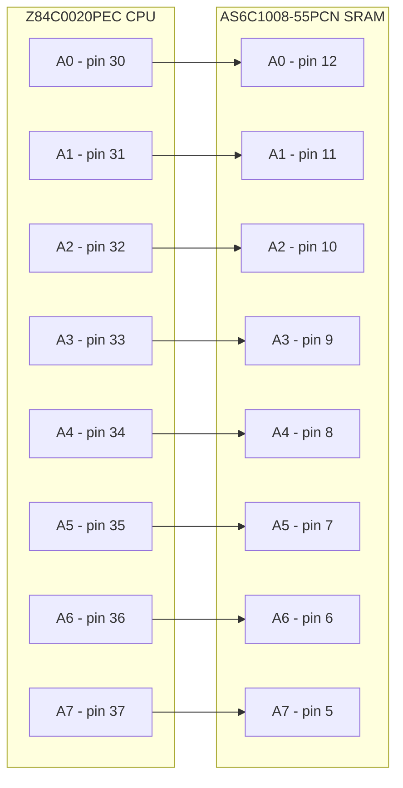
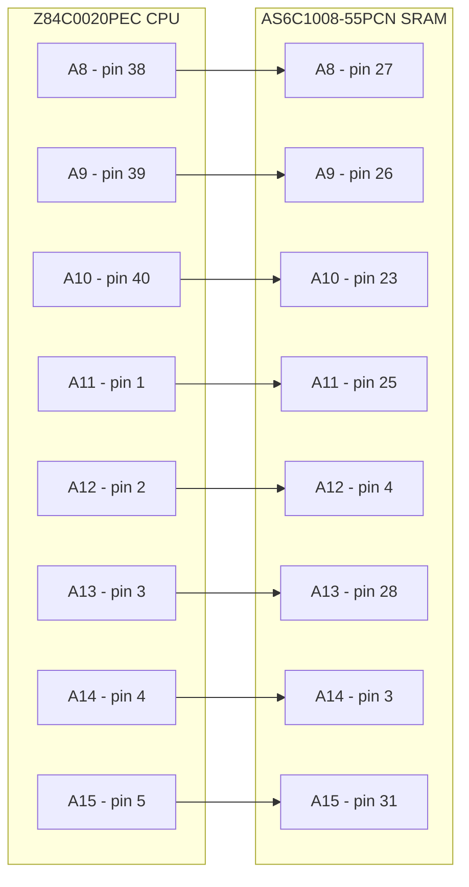
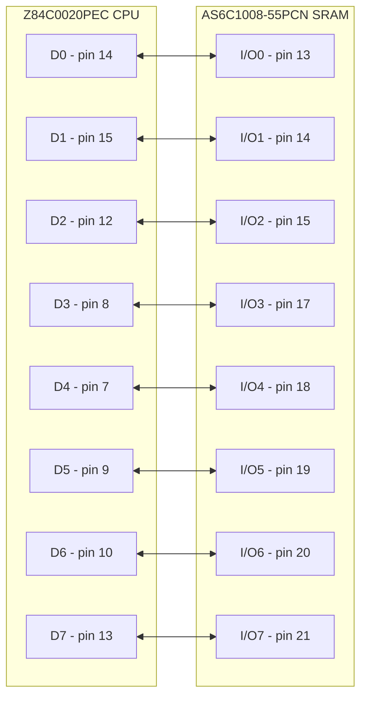
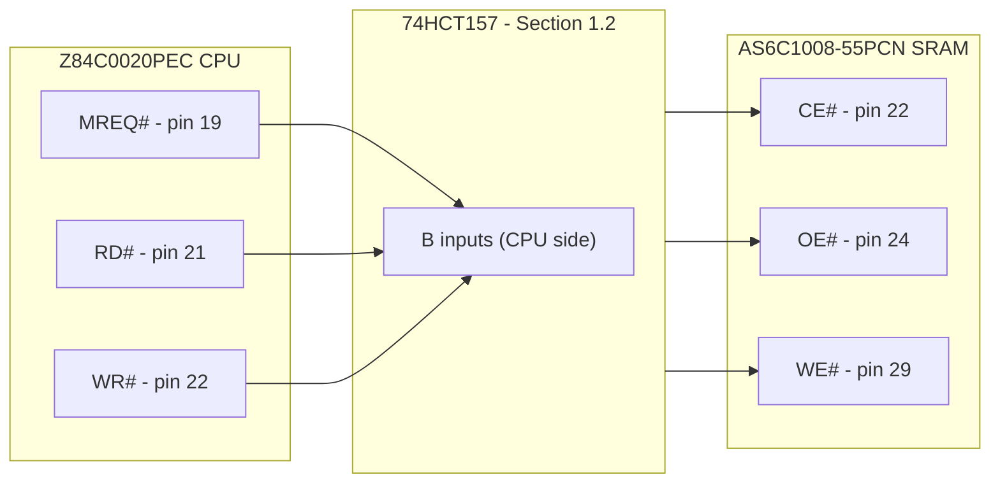
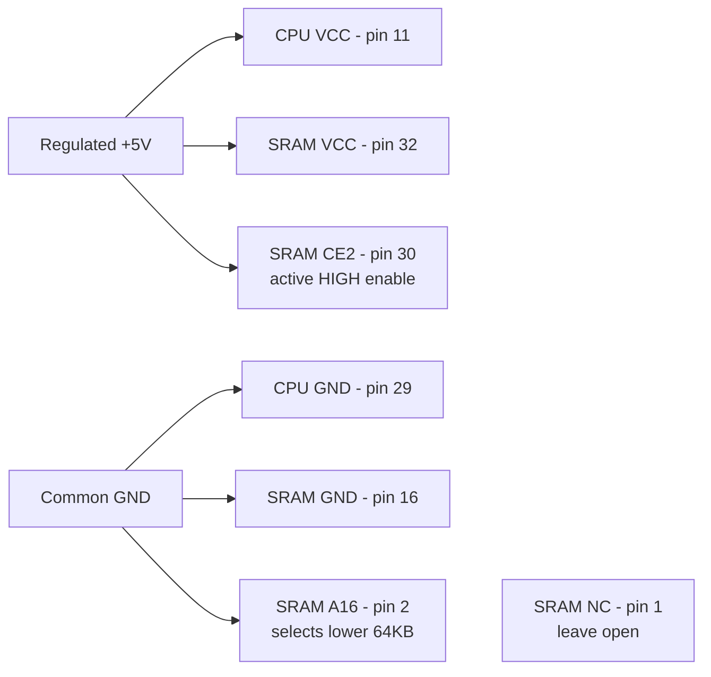
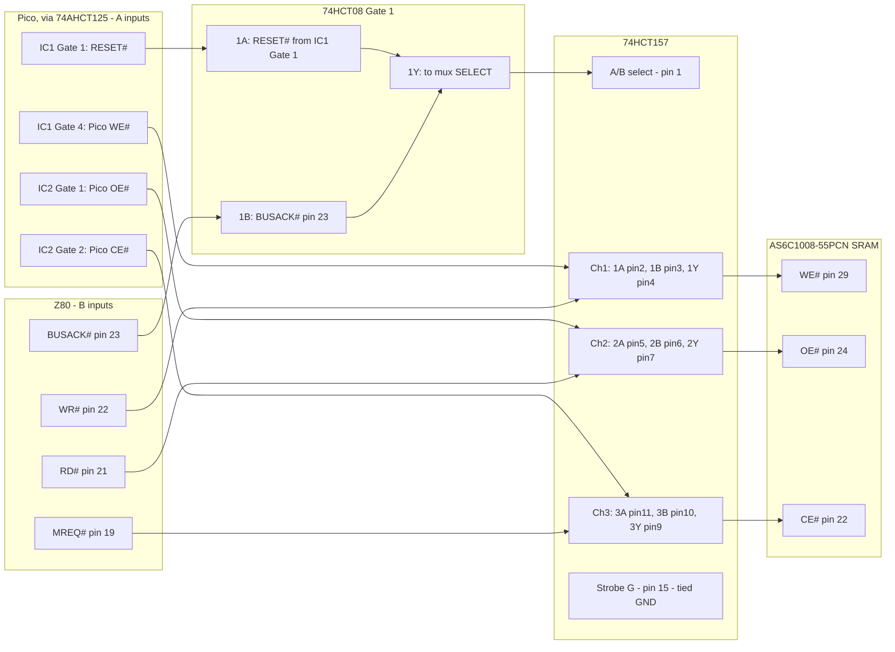
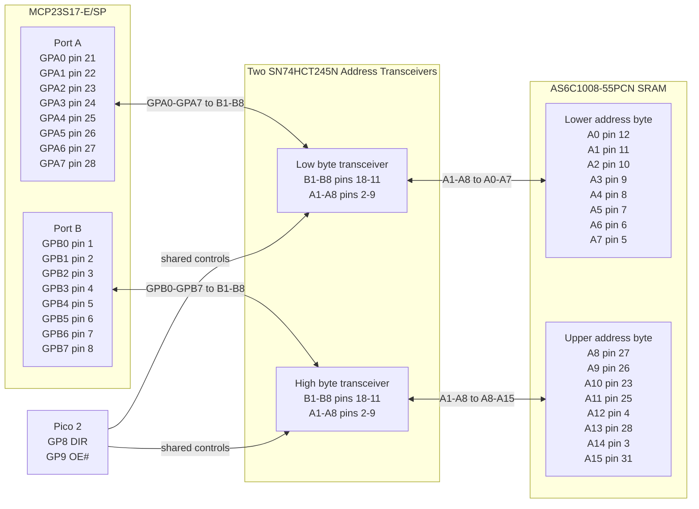
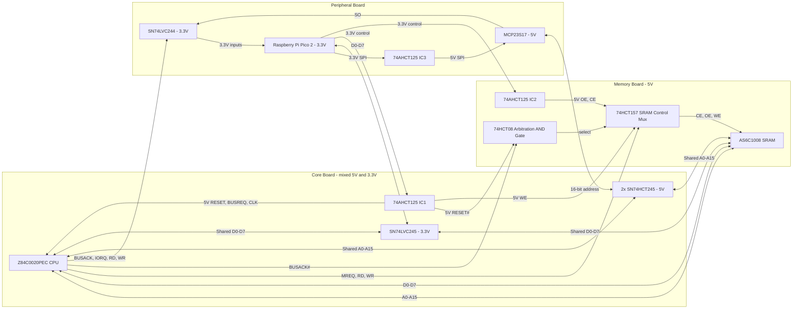
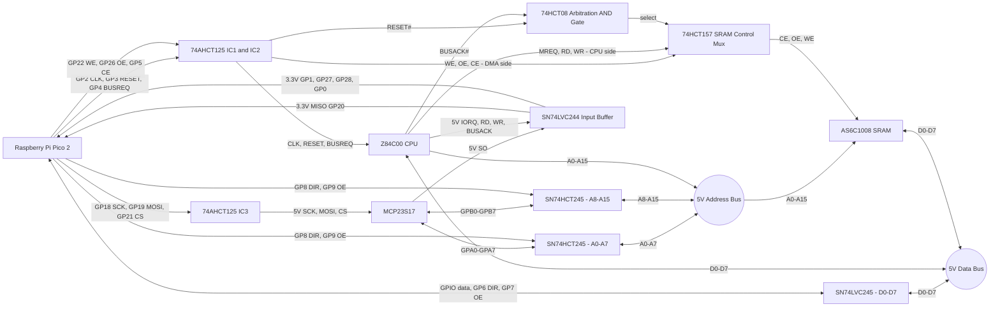

# Z80 ROMless SBC - Final Engineering & Build Specification (v21)

## 0. Project Inventory

The quantities below build one complete three-breadboard prototype.
Purchase quantities include a small allowance for breadboard spares.

### 0.1 Semiconductors

| Required | Component | Package | Function |
|----:|----|----|----|
| 1 | Raspberry Pi Pico 2 | Module with two 20-pin headers | Supervisor, clock, DMA, and virtual I/O |
| 1 | Z84C0020PEC | 40-pin PDIP | CMOS Z80 CPU |
| 1 | AS6C1008-55PCN | 32-pin PDIP | SRAM; lower 64 KB used |
| 1 | MCP23S17-E/SP | 28-pin SPDIP | SPI-to-16-bit address interface |
| 3 | SN74AHCT125N | 14-pin PDIP | Pico 3.3 V-to-5 V control and SPI translation |
| 2 | SN74HCT245N | 20-pin PDIP | Bidirectional address-bus isolation |
| 1 | SN74LVC245AN | 20-pin PDIP | Pico data-bus interface |
| 1 | SN74LVC244AN | 20-pin PDIP | 5 V-to-3.3 V buffering for Z80 status/control and MCP SO |
| 1 | 74HCT157 | 16-pin PDIP | SRAM CE#/OE#/WE# source arbitration |
| 1 | 74HCT08 | 14-pin PDIP | AND-gates RESET# and BUSACK# to drive the 74HCT157 select line |
| 1 | 1N5819 | Axial diode | Schottky power OR from external +5 V to Pico VSYS |

> **New required additions:** The original design required SRAM control
> arbitration but did not assign a part; the 74HCT157 implements that
> requirement (Section 1.2). The design also needs a Pico-driven SRAM
> CE# line and full 5 V translation of the MCP23S17 SPI inputs, which
> together need 9 translated signals (RESET#, BUSREQ#, CLK, SRAM WE#,
> SRAM OE#, SRAM CE#, SPI CS#, SPI SCK, SPI SI) and do not fit in the
> original two 74AHCT125N packages (8 gates). A third SN74AHCT125N
> (IC3) is added; see Section 4. Selecting the 74HCT157 purely from
> BUSACK# also leaves SRAM control unreachable by the Pico whenever
> RESET# is held (Section 8.9) or the Z80 is physically absent from its
> socket (Section 8.7); a 74HCT08 AND gate combines RESET# and BUSACK#
> ahead of the select input to fix both cases (Section 1.2). The
> SN74LVC244AN buffers RD#/WR# because Pico 2 GP27 and GP28 are
> standard ADC-capable pads, not 5 V-tolerant FT pads. It also buffers
> BUSACK#, IORQ#, and MCP SO: although GP0, GP1, and GP20 are FT pads,
> their 5.5 V tolerance requires RP2350 IOVDD to be present at 3.3 V.
> Using the spare LVC244 channels preserves safe power sequencing and
> powered-off isolation (Section 5.3).

### 0.2 Sockets and Headers

| Quantity | Item |
|----:|----|
| 1 | 40-pin DIP socket |
| 1 | 32-pin DIP socket |
| 1 | 28-pin DIP socket |
| 4 | 20-pin DIP sockets |
| 1 | 16-pin DIP socket |
| 4 | 14-pin DIP sockets |
| 2 | 20-pin 0.1-inch male headers for the Pico 2, if not fitted |
| 2 | 20-position 0.1-inch socket strips for removable Pico mounting; do not substitute DIP IC sockets |

### 0.3 Capacitors and Resistors

| Fitted | Purchase | Item | Purpose |
|----:|----:|----|----|
| 12 | 15 | 100 nF X7R ceramic capacitors, at least 10 V | One at every DIP IC supply pair |
| 3 | 5 | 10 uF capacitors, at least 10 V | One per breadboard |
| 1 | 2 | 47 uF electrolytic capacitor, at least 10 V | 5 V supply-entry bulk capacitance |
| 24 | 30 | 10 kOhm, 1/4 W resistors | Defined startup levels and temporary test pulls |
| Reused for tests | 10 | 1 kOhm, 1/4 W resistors | First-drive current limiting and manual input tests |

Place each 100 nF capacitor directly across its IC supply pins with the
shortest practical leads. On the 5 V side, fit 10 kOhm pull-ups to
RESET#, BUSREQ#, BUSACK#, MREQ#, IORQ#, RD#, WR#, MCP SO, WAIT#, INT#,
and NMI#. On the Pico side, use 10 kOhm pull-ups to 3.3 V on GP4
(BUSREQ#), GP5 (SRAM CE#), GP7/GP9 (transceiver OE#), GP21 (SPI CS#),
GP22 (SRAM WE#), and GP26 (SRAM OE#). Use 10 kOhm pull-downs to GND on
GP2 (CLK), GP3 (RESET#), GP6/GP8 (transceiver DIR), and GP18/GP19 (SPI
SCK/SI). These external resistors establish safe levels before the
firmware configures SIO; the 5 V pull-ups alone cannot override an
enabled AHCT output. Tie every unused CMOS input to a defined level.

### 0.4 Construction and Power

| Quantity | Item | Requirement |
|----:|----|----|
| 3 | 830-tie-point solderless breadboards (BusBoard/X-ON BB830, ABS body; 63 terminal rows plus two 100-point power-distribution strips per board) | Memory, CPU core, and peripheral zones |
| 1 | Regulated 5 V supply | At least 1 A; adjustable current limiting preferred |
| 1 | USB data cable | Pico programming and serial diagnostics |
| 1 set | 22 AWG solid-core hookup wire | Multiple colors for signal groups |
| 1 set | Short male-to-male jumpers | Inter-board and temporary connections |
| 1 set | Short ground and power-distribution links | Connects all three boards; includes +5 V, 3.3 V, and multiple GND links |
| 1 | In-line power switch or removable supply jumper | Emergency power removal; rated at least 1.5 A continuous |
| As required | Labels or wire markers | Bus bits, controls, and socket pin 1 |

Feed the breadboard's +5 V logic rail directly from the regulated
supply. Feed Pico VSYS from that rail only through the 1N5819: anode to
external +5 V, banded cathode to VSYS. Pico 2 already has a Schottky
diode from USB VBUS to VSYS, so this second diode safely ORs USB and
external power without back-powering either source. Never link the
external +5 V rail directly to Pico VBUS or VSYS. Feed the
SN74LVC245AN and SN74LVC244AN only from the Pico 3.3 V rail; all other
logic uses the regulated 5 V rail. No 5 V output connects directly to
a Pico GPIO; the SN74LVC244AN's `Ioff` protection keeps the five
monitored inputs isolated while its 3.3 V supply is absent or ramping.
Tie the Pico's AGND pin (pin 33) to the common digital ground: this
design does not use the ADC function on GP26-GP29, so no separate
analogue ground plane is needed.

### 0.5 Bring-Up Equipment

- Digital multimeter with resistance, continuity, and DC voltage modes.
- Two-channel oscilloscope rated for at least 100 MHz for edge-integrity
  checks; a 20 MHz instrument is adequate only for low-speed functional
  bring-up.
- Logic analyzer with at least 16 channels; 24 or more is preferred.
- Current-limited bench supply or an in-line 5 V current meter.
- Fine probe hooks or test clips suitable for DIP pins.

### 0.6 Optional Items

- LEDs with 1 kOhm series resistors for low-speed diagnostics only; do
  not permanently load high-speed buses with LEDs.
- Spare 100 nF capacitors, resistors, jumper wire, and an IC extractor.

## 1. Reference Pin Mapping & Logic Domain Verification

This architecture leverages the fully static nature of the Z84C0020PEC
CMOS CPU. The Pico controls the clock and uses the Z80 BUSREQ#/
BUSACK# handshake for DMA ownership. During RESET, the address and data
buses float and control outputs are inactive. During BUSACK#, A0-A15,
D0-D7, MREQ#, IORQ#, RD#, and WR# float while BUSACK# remains actively
driven LOW; M1#, RFSH#, and HALT# are not part of the floated bus set.

### 1.0 Raspberry Pi Pico 2 Header Pin Map

GPIO numbers in the firmware are not physical header numbers. Use this
table for construction; the ranges preserve ascending bit order.

| Pico function | GPIO | Physical header pin | Connection |
|----|----:|----:|----|
| BUSACK# monitor | GP0 | 1 | SN74LVC244AN 1Y1 |
| IORQ# trap input | GP1 | 2 | SN74LVC244AN 1Y2 |
| Z80 CLK | GP2 | 4 | 74AHCT125 IC1 Gate 3 input |
| Z80 RESET# | GP3 | 5 | 74AHCT125 IC1 Gate 1 input |
| Z80 BUSREQ# | GP4 | 6 | 74AHCT125 IC1 Gate 2 input |
| SRAM CE# | GP5 | 7 | 74AHCT125 IC2 Gate 2 input |
| Data DIR / OE# | GP6 / GP7 | 9 / 10 | SN74LVC245 pins 1 / 19 |
| Address DIR / OE# | GP8 / GP9 | 11 / 12 | Both SN74HCT245 pins 1 / 19 |
| D0-D3 | GP10-GP13 | 14-17 | SN74LVC245 B1-B4 |
| D4-D7 | GP14-GP17 | 19-22 | SN74LVC245 B5-B8 |
| SPI SCK / MOSI / MISO / CS# | GP18-GP21 | 24-27 | IC3 Gates 2/3, LVC244 2Y1, IC3 Gate 1 |
| SRAM WE# | GP22 | 29 | 74AHCT125 IC1 Gate 4 input |
| SRAM OE# | GP26 | 31 | 74AHCT125 IC2 Gate 1 input |
| Z80 RD# / WR# monitors | GP27 / GP28 | 32 / 34 | SN74LVC244AN 1Y3 / 1Y4 |
| 3.3 V output | - | 36 | SN74LVC245/LVC244 VCC and 3.3 V pull-ups |
| VSYS | - | 39 | 1N5819 banded cathode; anode to external +5 V |

Connect Pico GND pins 3, 8, 13, 18, 23, 28, and 38, plus AGND pin
33, to common ground with multiple short links. Leave RUN pin 30,
ADC_VREF pin 35, and 3V3_EN pin 37 open. Do not connect the external
5 V rail to VBUS pin 40; USB supplies that node internally.

<table>
<colgroup>
<col style="width: 25%" />
<col style="width: 25%" />
<col style="width: 25%" />
<col style="width: 25%" />
</colgroup>
<thead>
<tr>
<th>Component</th>
<th>Signal Name / Group</th>
<th>Hardware Pin Numbers</th>
<th>Electrical Constraint / Logic Domain</th>
</tr>
</thead>
<tbody>
<tr>
<td rowspan="14"><strong>Z84C0020PEC (CPU)</strong></td>
<td>CLK</td>
<td>Pin 6</td>
<td>Input. Driven by level-shifted 5V CMOS square wave. Clock can be
safely frozen indefinitely in either a HIGH or LOW state.</td>
</tr>
<tr>
<td>IORQ#</td>
<td>Pin 20</td>
<td>Output. Active Low. Buffered to 3.3 V through SN74LVC244AN channel
1A2/1Y2 and monitored by Pico 2 GP1 to trigger clock-stop trapping.</td>
</tr>
<tr>
<td>MREQ#</td>
<td>Pin 19</td>
<td>Output. Active Low, three-state. Connects to 74HCT157 channel 3B
for CPU-owned SRAM cycles; pulled HIGH when the CPU is absent.</td>
</tr>
<tr>
<td>RD#</td>
<td>Pin 21</td>
<td>Output. Active Low. Buffered to 3.3 V through SN74LVC244AN channel
1A3/1Y3 and sampled by Pico 2 GP27 to resolve cycle intent.</td>
</tr>
<tr>
<td>WR#</td>
<td>Pin 22</td>
<td>Output. Active Low. Buffered to 3.3 V through SN74LVC244AN channel
1A4/1Y4 and sampled by Pico 2 GP28 to resolve cycle intent.</td>
</tr>
<tr>
<td>BUSACK#</td>
<td>Pin 23</td>
<td>Output. Active Low. Feeds 74HCT157 arbitration via the 74HCT08 AND
gate (Section 1.2) and is buffered to 3.3 V through SN74LVC244AN
channel 1A1/1Y1 for monitoring at Pico 2 GP0.</td>
</tr>
<tr>
<td>BUSREQ#</td>
<td>Pin 25</td>
<td>Input. Active Low. Level-shifted up to 5V to request DMA
ownership.</td>
</tr>
<tr>
<td>RESET#</td>
<td>Pin 26</td>
<td>Input. Active Low. Driven by 74AHCT125 IC1 Gate 1 and also feeds
74HCT08 Gate 1 for SRAM-source arbitration. Hold LOW for at least three
full clock cycles.</td>
</tr>
<tr>
<td>M1#</td>
<td>Pin 27</td>
<td>Output. Active Low. Probe point for the Phase 7 opcode-fetch test;
not connected to Pico logic.</td>
</tr>
<tr>
<td>A0 – A15 (Address Bus)</td>
<td>Pins 30 – 40, 1 – 5</td>
<td>5V Tri-state Bus. Driven by CPU during active run, floats during
DMA/RESET.</td>
</tr>
<tr>
<td>D0 – D7 (Data Bus)</td>
<td>Pins 7 – 10, 12 – 15</td>
<td>5V Bi-directional Tri-state Bus. Connected directly to SRAM data bus
pins.</td>
</tr>
<tr>
<td>WAIT#</td>
<td>Pin 24</td>
<td>Input. Active Low. Unused; pull to +5V through 10 kOhm so it never
floats LOW and stalls the CPU in a permanent wait state.</td>
</tr>
<tr>
<td>INT#</td>
<td>Pin 16</td>
<td>Input. Active Low. Unused; pull to +5V through 10 kOhm to prevent a
spurious interrupt from a floating input.</td>
</tr>
<tr>
<td>NMI#</td>
<td>Pin 17</td>
<td>Input. Active Low, edge-sensed. Unused; pull to +5V through 10 kOhm
to prevent a spurious non-maskable interrupt from a floating input.</td>
</tr>
<tr>
<td rowspan="7"><strong>AS6C1008-55PCN (SRAM)</strong></td>
<td>A0 – A15 (Address lines)</td>
<td>Pins 12-10, 9-7, 6-5, 27-26, 23, 25, 4, 28, 3, 31</td>
<td>5V Input. Connected directly to the 5V Z80 address bus. Driven by
MCP23S17 during DMA.</td>
</tr>
<tr>
<td>A16</td>
<td>Pin 2</td>
<td>5V Input. Tie to GND to select the lower 64KB bank; do not leave
floating.</td>
</tr>
<tr>
<td>D0 – D7 (Data lines)</td>
<td>Pins 13 – 15, 17 – 21</td>
<td>5V Bi-directional Bus. Connected directly to the Z80 data bus.</td>
</tr>
<tr>
<td>WE#</td>
<td>Pin 29</td>
<td>Input. Active Low. Driven through the 74HCT157 arbitration mux
(Section 1.2): Z80 WR# during CPU ownership, Pico DMA write signal
during DMA ownership.</td>
</tr>
<tr>
<td>OE#</td>
<td>Pin 24</td>
<td>Input. Active Low. Driven through the 74HCT157 arbitration mux
(Section 1.2): Z80 RD# during CPU ownership, Pico DMA read signal
during DMA ownership.</td>
</tr>
<tr>
<td>CE#</td>
<td>Pin 22</td>
<td>Input. Active Low. Driven through the 74HCT157 arbitration mux
(Section 1.2): Z80 MREQ# during CPU ownership so I/O cycles cannot
access SRAM, Pico DMA chip-enable signal during DMA ownership.</td>
</tr>
<tr>
<td>CE2</td>
<td>Pin 30</td>
<td>Input. Active High. Tie permanently to VCC (+5V) to enable the
device through the active-low CE# input.</td>
</tr>
</tbody>
</table>

### 1.1 Z84C0020PEC-to-AS6C1008-55PCN Wiring

The following is the direct run-mode connection verified against the
manufacturers' 40-pin PDIP and 32-pin PDIP pin assignments. The
AS6C1008 is a 128K x 8 device, so A16 must be tied LOW to expose its
lower 64KB as the Z80's address space. CE2 must be tied HIGH, and pin 1
is not connected.

Manufacturer datasheets:

- [Zilog Z84C00 CMOS Z80 CPU Product Specification](https://www.zilog.com/docs/z80/ps0178.pdf)
- [Alliance Memory AS6C1008 128K x 8 Low Power CMOS SRAM Datasheet](https://www.alliancememory.com/wp-content/uploads/AS6C1008_Mar_2023V1.2.pdf)

#### Package Pinouts

[](https://www.zilog.com/docs/z80/ps0178.pdf)

[](https://www.alliancememory.com/wp-content/uploads/AS6C1008_Mar_2023V1.2.pdf)

#### Address Bus A0-A7



#### Address Bus A8-A15



#### Data Bus D0-D7



#### Memory Control



#### Power and Fixed Pins



> **SRAM control-source arbitration:** MREQ#/RD#/WR# above are the
> CPU-owned run-mode paths and connect only to the 74HCT157 "B" inputs
> described in Section 1.2, never directly to the SRAM. The 74HCT157
> selects between this path and the Pico's level-shifted DMA controls
> so the two sources are never joined.

### 1.2 SRAM Control-Source Arbitration: 74HCT157 and 74HCT08

The Z80 and the Pico must never drive SRAM CE#, OE#, or WE# at the same
time. A 74HCT157 quad 2:1 multiplexer selects between the two sources.
Per the SN74HCT157 datasheet function table, SELECT (pin 1, "A/B") =
HIGH routes the "B" inputs to the outputs, and SELECT = LOW routes the
"A" inputs; the strobe (pin 15, "G") forces every output LOW when HIGH,
so it must be tied to GND to keep the mux permanently enabled.

Selecting purely on the Z80's own BUSACK# output does not cover two
cases this design needs. First, BUSACK# is driven to its inactive HIGH
level throughout RESET, not floated (Section 1), so a held-reset DMA
injection per Section 8.9 would still route SRAM control to the Z80's
own inactive MREQ#/RD#/WR# lines instead of to the Pico. Second, with
the Z80 physically absent from its socket, as Phase 6 (Section 8.7)
requires, BUSACK# has no driver at all and only floats HIGH through its
pull-up (Section 0.3), again selecting the Z80 side when the Pico needs
DMA control. A single 74HCT08 AND gate resolves both cases by combining
RESET# and BUSACK# ahead of the mux's select input: `SELECT = RESET#
AND BUSACK#`. Because both inputs are active-low, `SELECT` is LOW
(Pico "A" side) whenever *either* RESET# or BUSACK# is asserted, and
HIGH (Z80 "B" side) only once the CPU is out of reset and holds the
bus — exactly the three states this design needs.

- **74HCT08 Gate 1 inputs:** 1A (pin 1) from 74AHCT125 IC1 Gate 1
  output (5 V RESET#, the same node driving Z80 pin 26); 1B (pin 2)
  from Z80 BUSACK# (pin 23), direct connection.
- **74HCT08 Gate 1 output:** 1Y (pin 3) to 74HCT157 SELECT (pin 1),
  replacing a direct BUSACK# connection.
- **74HCT08 unused gates:** Tie 2A/2B (pins 4-5), 3A/3B (pins 9-10),
  and 4A/4B (pins 12-13) to GND; leave 2Y/3Y/4Y (pins 6, 8, 11) open.
- **74HCT08 power:** VCC (pin 14) to +5 V; GND (pin 7) to ground.
- **Select (74HCT157 pin 1):** 74HCT08 Gate 1 output (above). HIGH
  (CPU running, out of reset) selects the Z80 "B" side; LOW (RESET#
  asserted or DMA active) selects the Pico "A" side.
- **Channel 1 (WE#):** 1A pin 2 from 74AHCT125 IC1 Gate 4 (Pico WE#,
  5 V); 1B pin 3 from Z80 WR# (pin 22); 1Y pin 4 to SRAM WE# (pin 29).
- **Channel 2 (OE#):** 2A pin 5 from 74AHCT125 IC2 Gate 1 (Pico OE#,
  5 V); 2B pin 6 from Z80 RD# (pin 21); 2Y pin 7 to SRAM OE# (pin 24).
- **Channel 3 (CE#):** 3A pin 11 from 74AHCT125 IC2 Gate 2 (Pico CE#,
  5 V, new signal; Section 4); 3B pin 10 from Z80 MREQ# (pin 19); 3Y
  pin 9 to SRAM CE# (pin 22).
- **Channel 4:** Unused. Tie 4A (pin 14) and 4B (pin 13) to GND and
  leave 4Y (pin 12) open.
- **Strobe and power:** G (pin 15) to GND; VCC (pin 16) to +5V; GND
  (pin 8) to ground.

During Phase 6 bring-up with the Z80 absent, hold RESET# LOW (its
Phase-1 default) so the AND gate forces the Pico "A" side regardless of
the floating, pulled-up BUSACK# input; do not rely on BUSACK# alone
during that phase.

[Texas Instruments SN74HCT157 Data Selector/Multiplexer Datasheet](https://www.ti.com/lit/ds/symlink/sn74hct157.pdf)
[Texas Instruments SN74HCT08 Quadruple 2-Input AND Gate Datasheet](https://www.ti.com/lit/ds/symlink/sn74hct08.pdf)



## 2. 16-Bit Address Expansion Interface: MCP23S17-E/SP

The MCP23S17 acts as the dedicated 16-bit register shifter interfacing
the Pico 2's SPI bus with the shared 5V address bus. During DMA block
injection, it drives the target SRAM locations. During an active I/O
trap, the transceiver directions are reversed, allowing the MCP23S17 to
monitor the address bus states driven by the frozen Z80 CPU.

| MCP23S17 Pin Designation | Target Connection | System Logic Role |
|----|----|----|
| GPA0 – GPA7 (Port A) | SN74HCT245N Transceiver \#1 (B1 – B8) | Lower Address Byte Control (\$A_0 – A_7\$) |
| GPB0 – GPB7 (Port B) | SN74HCT245N Transceiver \#2 (B1 – B8) | Upper Address Byte Control (\$A_8 – A\_{15}\$) |
| CS# (Pin 11) | 74AHCT125 IC3 Gate 1, from Pico GP21 | SPI Hardware Chip Select (Active Low), 5V translated |
| CLK / SCK (Pin 12) | 74AHCT125 IC3 Gate 2, from Pico GP18 | SPI Master Clock Train Input, 5V translated |
| SI (Pin 13) | 74AHCT125 IC3 Gate 3, from Pico GP19 | SPI Master-Out-Slave-In (MOSI Path), 5V translated |
| SO (Pin 14) | SN74LVC244AN channel 2A1/2Y1 to Pico 2 GP20 | SPI Master-In-Slave-Out (MISO Path), buffered from 5 V to 3.3 V; fit the Section 0.3 pull-up because SO is high-impedance while CS# is HIGH |
| A0, A1, A2 (Pins 15-17) | Tied to GND | Hardware address = 000; matches the fixed 0x40/0x41 opcode used in firmware regardless of the IOCON.HAEN state, and prevents floating address-select inputs |
| RESET# (Pin 18) | Tied to VCC (5V) | Hardware reset overridden for continuous software operation |

[Microchip MCP23017/MCP23S17 16-Bit I/O Expander with Serial Interface Datasheet](https://ww1.microchip.com/downloads/aemDocuments/documents/OTH/ProductDocuments/DataSheets/20001952C.pdf)

### 2.1 MCP23S17-to-SRAM Address Wiring

The MCP23S17 connects to the SRAM address inputs through two
SN74HCT245N transceivers; it must not be connected directly to the
shared address bus. Both transceivers share the Pico's GP8 direction
control and GP9 active-low output-enable control described in Section
5.2. Side B faces the MCP23S17 and side A faces the SRAM and shared Z80
address bus.



## 3. Physical Partitioning & Breadboard Topology

The layout enforces a strict three-zone model across three 830-point
breadboards to minimize cross-talk and propagation delay across the
distinct 3.3V and 5V power domains. Each zone below lists the specific
chips to place on that board and where to seat them.

- **Memory Board (Left Zone):** AS6C1008-55PCN SRAM, 74HCT157 SRAM
  control mux, 74HCT08 arbitration gate, and 74AHCT125N IC2. Put IC2
  beside the mux because it supplies the Pico-side SRAM OE#/CE# inputs.
  Row budget: 16 (SRAM) + 8 (74HCT157) + 7 (74HCT08) + 7 (IC2) = 38
  of 63 terminal rows.

- **Core Board (Center Zone):** Z84C0020PEC CPU, both SN74HCT245N
  address transceivers, 74AHCT125N IC1, and the SN74LVC245AN data
  transceiver. Keep IC1 beside the Z80 so its Gate 3 CLK output never
  crosses a board boundary. Put the address transceivers at the edge
  facing the Peripheral Board to shorten the MCP23S17's 16-bit feed,
  while their bus-facing side joins the local Z80 address bus and the
  adjacent SRAM. Row budget: 20 (Z80) + 20 (2x SN74HCT245N) + 7 (IC1)
  + 10 (SN74LVC245AN) = 57 of 63 terminal rows. *No hardware wait-state
  latches or flip-flops are used.*

- **Peripheral Board (Right Zone):** Raspberry Pi Pico 2, MCP23S17,
  74AHCT125N IC3, and the SN74LVC244AN input buffer. Put the MCP23S17
  and IC3 together and the LVC244 nearest the Core Board for the four
  Z80 status/control inputs; its fifth input, MCP SO, remains local.
  Row budget: 20 (Pico 2) + 14 (MCP23S17) + 7 (IC3) + 10
  (SN74LVC244AN) = 51 of 63 terminal rows.

Use one supply-entry point and fan out +5 V and GND to each board; do
not daisy-chain the boards' power rails end-to-end. Run the Pico 3.3 V
rail separately to the two LVC devices. Bond adjacent boards with
multiple short ground jumpers, especially beside the address/data bus
crossings and CLK. Verify every BB830 distribution rail end-to-end with
a meter before fitting links; never assume visually aligned rail
segments are internally continuous.

### 3.1 High-Speed Interconnect Routing

At the qualified 1-4 MHz clock rates, propagation skew from a few
millimetres of wire-length difference is negligible compared with the
Z80 timing budget. Solderless-breadboard reliability is instead
dominated by total wire length, stubs, loop area, contact resistance,
and fast-edge ringing. Route each bus as a short grouped trunk with
roughly similar paths, but do not add serpentine wire merely to make
lengths equal:

- **A0-A15:** keep the Z80, SRAM, and SN74HCT245N taps on one short
  trunk; avoid star branches and long unterminated stubs.
- **D0-D7:** group the Z80, SRAM, and SN74LVC245AN runs and keep the
  transceiver tap short.
- **74HCT157 outputs to SRAM CE#/OE#/WE#:** keep all three local to the
  SRAM and mux; exact length matching is unnecessary.
- **CLK (74AHCT125 IC1 Gate 3 output to Z80 pin 6):** route this as the
  single shortest, most direct jumper, kept away from the address bus.
  Do not lengthen it to match other nets; clock is the most
  edge-rate-sensitive signal in the design.

Route a ground jumper alongside every inter-board signal group and add
ground probe points near CLK, IORQ#, MREQ#, RD#, WR#, SRAM CE#/OE#/WE#,
and each bus transceiver. Keep all jumpers as short as the placement
allows.

### 3.2 Major Chip Interconnection Overview



## 4. Level-Shifter Gate Mapping: 74AHCT125N (DIP-14)

Unidirectional signals generated by the 3.3 V Pico 2 are stepped up by
three 5 V-powered 74AHCT125N arrays. Their TTL-compatible inputs accept
a 3.3 V HIGH, while their lightly loaded outputs are guaranteed at
least 4.4 V HIGH at VCC = 4.5 V, satisfying the Z80 clock input's
stricter CMOS threshold. Nine Pico-driven signals need translation (RESET#,
BUSREQ#, CLK, SRAM WE#/OE#/CE#, and SPI CS#/SCK/SI), which is one more
than the two original packages could hold; IC3 was added to carry the
remaining SRAM and SPI gates (Section 0.1).

<table>
<colgroup>
<col style="width: 20%" />
<col style="width: 20%" />
<col style="width: 20%" />
<col style="width: 20%" />
<col style="width: 20%" />
</colgroup>
<thead>
<tr>
<th>IC Designation</th>
<th>Gate No.</th>
<th>Input Pin (3.3V from Pico)</th>
<th>Output Pin (5V to Target)</th>
<th>Functional Block Allocation</th>
</tr>
</thead>
<tbody>
<tr>
<td rowspan="4"><strong>IC1: Buffer Array A</strong></td>
<td>Gate 1</td>
<td>Pin 2 (from Pico GP3)</td>
<td>Pin 3 (to Z80 Pin 26 RESET#)</td>
<td>System Reset Generation</td>
</tr>
<tr>
<td>Gate 2</td>
<td>Pin 5 (from Pico GP4)</td>
<td>Pin 6 (to Z80 Pin 25 BUSREQ#)</td>
<td>DMA Request Line</td>
</tr>
<tr>
<td>Gate 3</td>
<td>Pin 9 (from Pico GP2)</td>
<td>Pin 8 (to Z80 Pin 6 CLK)</td>
<td>Master Clock Pulse Train</td>
</tr>
<tr>
<td>Gate 4</td>
<td>Pin 12 (from Pico GP22)</td>
<td>Pin 11 (to 74HCT157 pin 2, channel 1 "A"; Section 1.2)</td>
<td>SRAM Write Enable (DMA side, via mux)</td>
</tr>
<tr>
<td rowspan="3"><strong>IC2: Buffer Array B</strong></td>
<td>Gate 1</td>
<td>Pin 2 (from Pico GP26)</td>
<td>Pin 3 (to 74HCT157 pin 5, channel 2 "A"; Section 1.2)</td>
<td>SRAM Output Enable (DMA side, via mux)</td>
</tr>
<tr>
<td>Gate 2</td>
<td>Pin 5 (from Pico GP5)</td>
<td>Pin 6 (to 74HCT157 pin 11, channel 3 "A"; Section 1.2)</td>
<td>SRAM Chip Enable (DMA side, via mux; new signal)</td>
</tr>
<tr>
<td>Gates 3-4</td>
<td>Tied to GND</td>
<td>Leave Open</td>
<td>Unused channels grounded to prevent oscillation</td>
</tr>
<tr>
<td rowspan="4"><strong>IC3: Buffer Array C</strong></td>
<td>Gate 1</td>
<td>Pin 2 (from Pico GP21)</td>
<td>Pin 3 (to MCP23S17 Pin 11 CS#)</td>
<td>SPI Chip Select Translation</td>
</tr>
<tr>
<td>Gate 2</td>
<td>Pin 5 (from Pico GP18)</td>
<td>Pin 6 (to MCP23S17 Pin 12 SCK)</td>
<td>SPI Clock Translation</td>
</tr>
<tr>
<td>Gate 3</td>
<td>Pin 9 (from Pico GP19)</td>
<td>Pin 8 (to MCP23S17 Pin 13 SI)</td>
<td>SPI MOSI Translation</td>
</tr>
<tr>
<td>Gate 4</td>
<td>Tied to GND</td>
<td>Leave Open</td>
<td>Unused channel grounded to prevent oscillation</td>
</tr>
</tbody>
</table>

Tie every OE# input (pins 1, 4, 10, and 13 on each IC) to GND. For an
unused gate, also tie its data input to GND and leave its output open,
as shown above; the grounded OE# input then enables only a harmless LOW
on that unconnected output.

The Pico-side default resistors in Section 0.3 are mandatory because
the used AHCT125 gates are permanently enabled. Pulling only their 5 V
outputs HIGH does not prevent the RP2350 reset-state pull-downs from
driving BUSREQ#, SRAM CE#/OE#/WE#, and SPI CS# active before firmware
starts.

## 5. Transceiver Operating Modes & Isolation Tables

The transceivers isolate the supervisor elements (Pico 2 and MCP23S17)
from the main bus during standard execution, preventing bus contention.

### 5.1 SN74LVC245AN Data Bus Transceiver (3.3V Powered)

The bus-facing outputs reach approximately 3.3 V HIGH. This is valid
for the Z80's ordinary data inputs (\$V_{IH} \ge 2.2\text{ V}\$) and the
AS6C1008 inputs; only the Z80 CLK pin uses the stricter
\$V_{IHC}=V_{CC}-0.6\text{ V}\$ threshold and is therefore translated
through 74AHCT125 IC1.

Wire side A to the shared 5 V data bus and side B to the Pico. This
orientation is required by the DIR values used below and in Section
8.11; preserve bit order exactly:

| Bus bit | LVC245 side A | LVC245 side B | Pico GPIO |
|----|----:|----:|----:|
| D0 | A1 pin 2 | B1 pin 18 | GP10 |
| D1 | A2 pin 3 | B2 pin 17 | GP11 |
| D2 | A3 pin 4 | B3 pin 16 | GP12 |
| D3 | A4 pin 5 | B4 pin 15 | GP13 |
| D4 | A5 pin 6 | B5 pin 14 | GP14 |
| D5 | A6 pin 7 | B6 pin 13 | GP15 |
| D6 | A7 pin 8 | B7 pin 12 | GP16 |
| D7 | A8 pin 9 | B8 pin 11 | GP17 |

Connect DIR pin 1 to GP6, OE# pin 19 to GP7, VCC pin 20 to the Pico
3.3 V rail, and GND pin 10 to common ground.

| System Operating State | OE# (GP7) | DIR (GP6) | Signal Direction | Functional Role |
|----|----|----|----|----|
| **Boot / Write Mode** | 0 (Low) | 0 (Low) | Side B → Side A (Pico → Bus) | Pico streams virtual ROM blocks into the SRAM. |
| **Readback / Trap Mode** | 0 (Low) | 1 (High) | Side A → Side B (Bus → Pico) | Pico reads data bus during verification or OUT traps. |
| **Active Execution (Run)** | 1 (High) | X (Don't Care) | High-Impedance (High-Z) | Z80 and SRAM handle data operations directly; Pico data bus isolated. |

### 5.2 SN74HCT245N Address Bus Transceivers (5V Powered)

| System Operating State | OE# (GP9) | DIR (GP8) | Signal Direction | Functional Role |
|----|----|----|----|----|
| **DMA Injection Mode** | 0 (Low) | 0 (Low) | Side B → Side A (Expander → Bus) | MCP23S17 dictates memory-injected target address variables. |
| **Trap Address Read Mode** | 0 (Low) | 1 (High) | Side A → Side B (Bus → Expander) | Reverses transceivers so MCP23S17 can read the active port. |
| **Active Execution (Run)** | 1 (High) | X (Don't Care) | High-Impedance (High-Z) | Z80 drives system address lines directly; expander isolated. |

### 5.3 SN74LVC244AN 5 V-to-3.3 V Input Buffer

The RP2350's GP0-GP25 are 5 V-tolerant FT pads, but the 5.5 V rating
applies only while IOVDD is powered at 3.3 V; with IOVDD at 0 V their
absolute maximum is 3.63 V. GP26-GP29 are the QFN-60 package's
ADC-capable pads and are not FT at all. Buffering all five incoming
5 V signals therefore avoids a power-sequencing constraint and keeps
every Pico GPIO within its normal 3.3 V domain. Power the SN74LVC244AN
from the Pico 3.3 V rail. Its inputs accept up to 5.5 V and its `Ioff`
specification protects both sides when VCC is 0 V. Tie both active-low
output enables (pins 1 and 19) to GND. Wire the channels as follows;
tie every unused input to GND and leave unused outputs open.

| 5 V source | LVC244 input | 3.3 V output | Pico destination |
|----|----:|----:|----|
| Z80 BUSACK# pin 23 | 1A1 pin 2 | 1Y1 pin 18 | GP0 |
| Z80 IORQ# pin 20 | 1A2 pin 4 | 1Y2 pin 16 | GP1 |
| Z80 RD# pin 21 | 1A3 pin 6 | 1Y3 pin 14 | GP27 |
| Z80 WR# pin 22 | 1A4 pin 8 | 1Y4 pin 12 | GP28 |
| MCP23S17 SO pin 14 | 2A1 pin 11 | 2Y1 pin 9 | GP20 |
| GND | 2A2/2A3/2A4 pins 13/15/17 | 2Y2/2Y3/2Y4 pins 7/5/3 open | Unused |

VCC (pin 20) connects to 3.3 V and GND (pin 10) to common ground. The
5 V-side pull-ups in Section 0.3 keep every input defined when its
source is absent or high-impedance.

### 5.4 Bus and Supervisor Signal Interconnections



## 6. Architectural Operational Boundaries

### 6.1 Synchronous Clock-Stop Trap Protocol

When the Z80 executes an I/O instruction, the falling edge of IORQ#
trips a hardware edge interrupt on the Pico 2. The handler disables the
hardware PWM clock slice after GPIO synchronization and interrupt-entry
latency. Because the Z84C00 is fully static, the clock can then remain
stopped indefinitely in either a HIGH or LOW state. The design has no
hardware WAIT# or combinational clock gate, so safe trap frequency is a
measured property, not an assumption.

### 6.2 System Performance Envelope & Constraints

- **I/O Decode Width:** Strictly limited to **8-bit** decoding
  (monitoring address lines A0-A7 via the lower expander port).

- **Trap Latency Profile:** Only the interval from IORQ# falling to the
  final PWM edge determines whether the Z80 is frozen in time; the
  subsequent SPI servicing time is unrestricted while the static CPU
  is stopped. Measure that initial interval at every claimed clock
  rate. The design is suitable for low-rate virtual peripherals, not
  high-speed line tracing.

- **Clock Validation Targets:**

  - *Bring-Up Target:* **1 MHz**, qualified only after a logic-analyzer
    capture proves every I/O cycle stops before the Z80 samples or
    releases its data.

  - *Qualification Range:* **2 MHz – 4 MHz**, tested in the increments
    in Section 8.10. No rate in this range is guaranteed in advance.

  - *Failure Boundary:* If the PWM cannot be stopped in time at a
    desired rate, add hardware WAIT#/clock gating rather than relying
    on faster firmware. Operation above 4 MHz is outside this design's
    qualification plan.

## 7. Reference Firmware Implementations

This section previously duplicated firmware code with its own,
ungrounded pin names, separate from the pin map and build phases in
Section 8. To keep one definitive source, that code has been merged
into Section 8.11, updated to the current pin numbers and to use
8.11's contention-safe helpers: the variable-frequency clock generator
now appears under "Variable-Frequency Clock Generation" (Phase 2), bus
acquisition under "Z80 Single-Step and Timed Bus Request" (Phases 7-8),
and the I/O trap ISR under "Synchronous I/O Trap Handler" (Phase 8).
Use Section 8.11 as the only firmware source for this specification.

## 8. Progressive Build and Bring-Up Plan

Build and test one functional block at a time. Do not install the next
chip until the current phase passes. Use sockets for all DIP devices,
place a 100 nF ceramic capacitor directly across each IC's supply pins,
and fit at least one 10 uF bulk capacitor per breadboard. Use a
current-limited 5 V supply, multimeter, oscilloscope, and preferably a
logic analyzer. Start each first power-up at a 100 mA current limit and
remove power immediately if a rail falls by more than 5%, current rises
unexpectedly, or a device becomes warm.

Fit the pull-ups and pull-downs in Section 0.3 so every signal has its
specified state before firmware starts. Use temporary 1 kOhm series
resistors when first connecting two potentially driven nodes. Record
idle current after every phase. Unless stated otherwise, keep all chips
from later phases out of their sockets.

### 8.1 Phase 0 - Empty Sockets and Power Distribution

**Install:** Breadboards, sockets, decoupling capacitors, pull-ups,
power wiring, and signal wiring. Install no active device, including the
Pico 2.

**Test plan:**

1. With power disconnected, check resistance from each supply rail to
  ground. Investigate readings below 1 kOhm after capacitors charge.
2. Check every address, data, and control net end-to-end, then verify no
  continuity between neighboring bus lines.
3. Apply 5 V and measure every 5 V-powered DIP socket supply pin.
  Require 4.75 V to 5.25 V at VCC and less than 50 mV at each ground
  pin. The SN74LVC245AN and SN74LVC244AN VCC pins must remain at 0 V
  because their 3.3 V source, the absent Pico, is not yet installed.
4. Verify the external +5 V rail reaches Pico VSYS only through the
  1N5819 and does not reach Pico VBUS, the 3.3 V rail, or any GPIO
  contact. With external power applied, VSYS must be one Schottky drop
  below the +5 V rail. Verify each 5 V-side active-low control is pulled
  HIGH. With power removed, measure approximately 10 kOhm from every
  Pico-side pull-up contact to the unpowered 3.3 V rail and from every
  pull-down contact to GND, as listed in Section 0.3; powered Pico-side
  logic levels are checked in Phase 1.

**Pass gate:** No shorts or crossed nets, correct supply voltage at
every socket, and negligible current with all devices removed.

### 8.2 Phase 1 - Raspberry Pi Pico 2 Supervisor

**Install:** Pico 2 only.

**Firmware feature:** A diagnostic image must establish safe output
levels before enabling any GPIO output: GP7 and GP9 HIGH to isolate the
data and address transceivers; GP3 LOW to assert RESET#; GP4, GP5,
GP21, GP22, and GP26 HIGH to deassert BUSREQ#, SRAM CE#, SPI CS#,
SRAM WE#, and SRAM OE#; GP2 LOW to stop the clock; and GP6/GP8 LOW for
the inactive transceiver directions. It must also provide a slow
walking-one GPIO test selected through the USB serial console.

**Test plan:**

1. With the Section 0.4 1N5819 fitted, USB and external power may be
  connected together. Confirm neither source back-powers the other,
  then require 3.20 V to 3.40 V on the Pico 3.3 V rail and at the VCC
  socket contacts for the still-absent SN74LVC245AN and
  SN74LVC244AN.
2. Scope GP7 and GP9 through reset and startup; both must remain HIGH.
3. Verify GP3 (the future RESET# buffer input) is LOW and all other
  Pico control pins have the inactive levels listed above before,
  during, and after startup. The 5 V RESET# destination cannot be
  asserted until IC1 is installed in Phase 2.
4. Run the walking-one test and probe each destination socket. Require
  one-to-one routing, 0 V/3.3 V levels, and no change on neighboring
  pins. Restore safe levels when the test ends or the USB link drops.

**Pass gate:** Stable 3.3 V, safe startup levels, and correct routing
for every Pico signal.

### 8.3 Phase 2 - 74AHCT125N Buffers

**Install:** IC1 first. Install IC2 only after IC1 passes. Keep the Z80
and SRAM removed. Tie every gate OE# pin LOW and every unused data input
LOW; never leave an AHCT input floating.

**Firmware feature:** Add commands to toggle one buffered control at
10 Hz and generate selectable 1 kHz, 100 kHz, and 1 MHz 50% duty-cycle
clocks on GP2.

**Test plan:**

1. Toggle one Pico source at a time. At its buffer output require LOW
  below 0.3 V, HIGH at or above 4.4 V, correct polarity, and no activity on
  adjacent outputs.
2. Test IC1 gate 3 at each clock frequency. Require 45% to 55% duty
  cycle and clean transitions at Z80 socket pin 6.
3. Verify RESET# becomes and remains LOW while BUSREQ#, SRAM CE#/WE#/
  OE#, and SPI CS# remain HIGH for at least 100 ms after startup.
4. Power-cycle ten times while monitoring these signals. Any unintended
  transition fails the phase.

**Pass gate:** All translated outputs have valid 5 V levels and correct
polarity, the 1 MHz clock is clean, and startup creates no active-low
glitch.

### 8.4 Phase 3 - MCP23S17 SPI Address Generator

**Install:** The 3.3 V-powered SN74LVC244AN first, then 74AHCT125 IC3,
then the MCP23S17-E/SP. Keep both SN74HCT245N devices removed so the
MCP ports cannot drive the shared address bus.

**Electrical hold point:** Fit level translation on all SPI inputs. The
MCP23S17 datasheet specifies $V_{IH} \ge 0.8V_{DD}$ for CS#, SCK, and
SI, which is 4.0 V with a 5 V supply; a Pico 3.3 V HIGH is therefore
not compliant. Translate Pico CS#, SCK, and MOSI up with 74AHCT125 IC3
(Section 4). Buffer MCP SO/MISO down through SN74LVC244AN channel
2A1/2Y1 (Section 5.3); do not connect it directly to GP20. Tie the
MCP23S17 A0/A1/A2 hardware address pins to GND (Section 2). Confirm
this wiring against the schematic before proceeding.

**Firmware feature:** Add byte-level SPI register read/write, a
write-then-read register test, and 16-bit walking-one/walking-zero tests
that can configure both MCP ports as either inputs or outputs.

**Test plan:**

1. Before fitting the MCP, pull each used LVC244 input LOW through
  1 kOhm, then release it HIGH through its fitted 10 kOhm pull-up.
  Verify the matching Pico input reads LOW and HIGH at 3.3 V levels
  and unused channels do not change.
2. With SPI disconnected, verify MCP VDD, VSS, RESET#, and hardware
  address levels at the package.
3. With compliant translation fitted, write and read back 0x55 and 0xAA
  in IODIRA, IODIRB, OLATA, and OLATB.
4. Configure outputs and probe walking-one and walking-zero patterns at
  the empty SN74HCT245N sockets.
5. Configure inputs, apply 0 V or 5 V through 10 kOhm to each pin, and
  verify only the corresponding GPIO register bit changes.
6. Run 10,000 alternating register writes and reads with zero errors.

**Pass gate:** Compliant SPI levels, error-free register access, and
correct operation of all 16 port bits in both directions.

### 8.5 Phase 4 - SN74HCT245N Address Transceivers

**Install:** The low-byte SN74HCT245N first, then the high-byte device
after repeating and passing the tests. Keep the Z80 and SRAM removed.

**Firmware feature:** Add an address-bus test that always performs OE#
HIGH, set DIR, set or sample the MCP ports, then OE# LOW. It must disable
OE# before every direction change and on exit.

**Test plan:**

1. Before insertion, require HIGH at OE# pin 19. Verify the shared bus
  remains high-impedance after insertion.
2. Select MCP-to-bus direction and test 0x55, 0xAA, walking-one, and
  walking-zero patterns on every shared address line.
3. Disable OE#. Use a 10 kOhm test pull-up or pull-down to prove each
  bus line moves independently while the transceiver is disabled.
4. Select bus-to-MCP direction. Drive each bus line through 1 kOhm and
  verify the MCP reads it without driving back.
5. Repeat for the high byte, then test 0x0000, 0xFFFF, 0x5555, 0xAAAA,
  and a walking one across A0-A15.

**Pass gate:** Every address bit passes in both directions and both
devices reliably enter high-impedance mode before DIR changes.

### 8.6 Phase 5 - SN74LVC245AN Data Transceiver

**Install:** SN74LVC245AN powered at 3.3 V. Keep the Z80 and SRAM
removed. The TI datasheet permits inputs up to 5.5 V at this VCC.

**Firmware feature:** Add an 8-bit data-bus test using the same
disable-change-enable sequence and fixed, walking-one, and walking-zero
patterns on the Pico data GPIOs.

**Test plan:**

1. Require OE# HIGH before insertion and verify the bus-facing pins are
  high-impedance afterward.
2. Select Pico-to-bus direction and test 0x00, 0xFF, 0x55, 0xAA,
  walking-one, and walking-zero. Verify levels and bit order.
3. Disable OE#, reverse DIR, and re-enable. Drive each bus input with
  0 V and 5 V through 1 kOhm and verify the Pico reading.
4. Run 1,000 disable-change-enable cycles while checking readback and
  supply current.

**Pass gate:** All eight bits pass both ways, isolation works, and no
direction change causes contention or unexpected current.

### 8.7 Phase 6 - AS6C1008 SRAM and DMA Path

**Install:** The 74HCT08 arbitration gate first, then the 74HCT157 mux
(Section 1.2), then the AS6C1008-55PCN. Keep the Z80 removed.

**Electrical hold point:** Confirm the 74HCT157 and 74HCT08
control-source arbitration from Section 1.2 is fitted. During DMA the
Pico must exclusively control SRAM CE#, OE#, and WE# through the mux's
"A" channels; during execution the Z80 must exclusively control them
through MREQ#, RD#, and WR# on the mux's "B" channels. CE# must not be
tied LOW in the finished system, and Pico and Z80 outputs must never be
joined. With the Z80 removed for this phase, BUSACK# floats HIGH via
its pull-up (Section 0.3); hold RESET# LOW (its Phase-1 default) so the
74HCT08 AND gate still forces the Pico "A" side regardless. Do not
install SRAM until the mux and AND gate have passed static continuity
and select-line tests.

**Firmware feature:** Add single-byte DMA read/write primitives, a
walking address/data test, a two-pass full-memory pattern test, and a
March C- or equivalent RAM test. Every failure must report its address,
expected byte, and actual byte over USB serial.

**Test plan:**

1. With transceivers disabled, require A16 LOW, CE2 HIGH, and CE#, OE#,
  and WE# HIGH directly at the SRAM.
2. In DMA mode, write and read one byte. Require WE# HIGH before address
  or data changes, and disable the Pico data driver before asserting
  OE# for readback.
3. Write unique values at 0x0000 and each power-of-two address from
  0x0001 through 0x8000. Verify every value remains independent.
4. At several addresses test 0x00, 0xFF, 0x55, 0xAA, walking-one, and
  walking-zero data.
5. Fill all 65,536 bytes with the XOR of the address bytes, verify it,
  then repeat with the complement. Run the March test afterward.
6. Repeat after ten power cycles and with the intended 1 MHz timing.

**Pass gate:** Zero address, data, full-range pattern, or March-test
errors and no overlap between CPU and Pico SRAM control sources.

### 8.8 Phase 7 - Z84C0020PEC CPU, Installed Last

**Install:** Z84C0020PEC. Preload SRAM first. Disable both bus
transceivers, drive the Pico-side SRAM CE#/OE#/WE# controls inactive,
hold RESET# LOW and BUSREQ# HIGH, and stop the clock LOW before
insertion and power-up. RESET# LOW deliberately keeps the mux on the
inactive Pico side; it switches to CPU controls automatically only when
RESET# is released with BUSACK# HIGH.

**Firmware feature:** Add clock single-step and selectable 10 Hz, 1 kHz,
100 kHz, and 1 MHz run modes; reset pulse control; timed BUSREQ#/BUSACK#
acquisition; and a command that preloads and verifies a small test
program before releasing reset.

**Test plan:**

1. Verify RESET# LOW, BUSREQ# HIGH, both transceiver OE# signals HIGH,
  and SRAM write inactive immediately after power-up.
2. Clock at 10 Hz with RESET# asserted for at least three full cycles.
  Release reset and verify the first opcode fetch at 0x0000, including
  the expected M1#, MREQ#, and RD# sequence.
3. Preload `NOP; NOP; JP 0000h`. Single-step and verify address
  progression and the repeating jump while Pico bus drivers stay
  high-impedance.
4. Repeat at 1 kHz, 100 kHz, and 1 MHz with no unexpected SRAM writes.
5. Assert BUSREQ# while clocking. Require BUSACK# LOW after the current
  machine cycle and verify CPU bus outputs are high-impedance. Release
  BUSREQ# and require execution to resume.
6. Assert RESET# for at least three clocks during execution, release it,
  and verify a new fetch from 0x0000.

**Pass gate:** Correct reset fetch and execution through 1 MHz, valid
BUSREQ#/BUSACK# transfer, and no bus contention.

### 8.9 Phase 8 - Integrated Virtual-ROM Boot and I/O Trap

**Install:** No further chips. Load final supervisor firmware.

**Firmware feature:** Combine safe startup, timed bus acquisition,
image injection and readback, run control, and the synchronous IN/OUT
trap. Maintain counters for boots, DMA failures, readback mismatches,
trap timeouts, and unexpected control states.

**Test plan:**

1. Acquire ownership by one of two complete procedures. Either use the
  timed BUSREQ#/BUSACK# handshake, or drive the Pico SRAM controls
  inactive, assert RESET#, continue the clock for at least three full
  cycles, and then stop it. In either case, verify the Z80 address and
  data buses are high-impedance before enabling a transceiver. The
  Section 1.2 AND gate then grants the Pico exclusive SRAM control;
  inject a known 64 KB image, read back every byte, and compare it
  before CPU release.
2. Run a RAM increment loop for one hour at 1 MHz without corruption or
  supervisor timeout.
3. Execute OUT on ports 0x00, 0x01, 0x55, 0xAA, and 0xFF with matching
  data. Verify correct clock stop, address/data capture, driver disable,
  and clock resume.
4. Execute matching IN tests and verify each Pico-generated byte is
  stored correctly in SRAM.
5. With a logic analyzer, prove both transceiver OE# signals are HIGH
  during CPU cycles, the CPU bus is high-impedance before DMA enable,
  both DIR controls change only while their OE# is HIGH, and no overlap
  occurs between SRAM control sources.
6. Repeat cold boot, injection, execution, and I/O tests 100 times with
  zero logged failures.

**Pass gate:** Zero image or boot failures, correct IN/OUT behavior,
one-hour stable execution, and contention-free ownership transitions.

### 8.10 Frequency Qualification

Begin only after Phase 8 passes at 1 MHz. Test 2 MHz, then increase in
500 kHz steps to 4 MHz. At each step repeat SRAM readback, the one-hour
memory loop, and continuous IN/OUT tests while measuring stop latency.
The qualified frequency is the highest error-free step for which the
logic analyzer proves the clock always stops before the Z80 advances
beyond the safe trap point. Do not claim operation above 4 MHz without
equivalent timing evidence.

### 8.11 Pico Diagnostic Firmware Core Features

These Pico SDK fragments show the safety-critical core of each test,
not a complete application. A USB serial command loop should call them,
print `PASS` or a detailed failure, and always call `isolate_buses()`
before returning. `PIN_BUSACK_N` is GP0, driven from Z80 BUSACK#
(pin 23) through the SN74LVC244AN input buffer (Section 5.3); IORQ#,
RD#, WR#, and MCP SO use the same buffer, so no 5 V output reaches the
Pico directly. `PIN_SRAM_CE_N` is fixed at GP5 (74AHCT125
IC2 Gate 2; Section 4), moved off GP23, which the Pico 2 datasheet
reserves for on-board SMPS control and must never be repurposed.
`PIN_DATA_0`-`PIN_DATA_7` occupy GP10-GP17. There is no
`PIN_SRAM_SOURCE_SELECT` GPIO: the 74HCT157 select input is driven by a
74HCT08 AND gate combining RESET# and BUSACK# (Section 1.2), so it
still switches automatically with no extra Pico pin.

#### Safe Startup and Walking Output (Phases 1-2)

Preload each output latch while the pin is still an input, then enable
the output driver. This prevents a brief LOW pulse on active-low lines.

```c
#include <stdint.h>
#include <stdio.h>
#include "pico/stdlib.h"

enum {
  PIN_IORQ_N = 1, PIN_CLK = 2, PIN_RESET_N = 3,
  PIN_BUSREQ_N = 4, PIN_BUSACK_N = 0,
  PIN_DATA_DIR = 6, PIN_DATA_OE_N = 7,
  PIN_ADDR_DIR = 8, PIN_ADDR_OE_N = 9,
  PIN_DATA_0 = 10, PIN_DATA_1 = 11, PIN_DATA_2 = 12, PIN_DATA_3 = 13,
  PIN_DATA_4 = 14, PIN_DATA_5 = 15, PIN_DATA_6 = 16, PIN_DATA_7 = 17,
  PIN_SPI_SCK = 18, PIN_SPI_MOSI = 19, PIN_SPI_MISO = 20,
  PIN_SPI_CS_N = 21,
  PIN_SRAM_WE_N = 22, PIN_SRAM_CE_N = 5, PIN_SRAM_OE_N = 26,
  PIN_RD_N = 27, PIN_WR_N = 28
};

static void output_with_initial_level(uint pin, bool level) {
  gpio_init(pin);
  gpio_put(pin, level);       // Preload SIO output latch.
  gpio_set_dir(pin, GPIO_OUT);
}

static void input_with_no_pull(uint pin) {
  gpio_init(pin);
  gpio_set_dir(pin, GPIO_IN);
  gpio_disable_pulls(pin);
}

static void diagnostic_safe_startup(void) {
  output_with_initial_level(PIN_DATA_OE_N, 1);
  output_with_initial_level(PIN_ADDR_OE_N, 1);
  output_with_initial_level(PIN_RESET_N, 0); // Hold CPU reset.
  output_with_initial_level(PIN_BUSREQ_N, 1);
  output_with_initial_level(PIN_SRAM_WE_N, 1);
  output_with_initial_level(PIN_SRAM_CE_N, 1);
  output_with_initial_level(PIN_SRAM_OE_N, 1);
  output_with_initial_level(PIN_SPI_CS_N, 1);
  output_with_initial_level(PIN_CLK, 0);
  output_with_initial_level(PIN_DATA_DIR, 0);
  output_with_initial_level(PIN_ADDR_DIR, 0);
  input_with_no_pull(PIN_BUSACK_N);
  input_with_no_pull(PIN_IORQ_N);
  input_with_no_pull(PIN_RD_N);
  input_with_no_pull(PIN_WR_N);
}

static void walking_output_test(const uint *pins, size_t count) {
  for (size_t active = 0; active < count; ++active) {
    for (size_t index = 0; index < count; ++index)
      gpio_put(pins[index], index == active);
    sleep_ms(250);          // Probe or logic-analyzer capture point.
  }
  diagnostic_safe_startup();
}
```

Run `walking_output_test()` only in Phases 1-2 while the destination
driver/bus chips are absent. It deliberately changes raw pin levels and
is not safe as an in-system diagnostic after Phase 3.

#### Variable-Frequency Clock Generation (Phase 2, Phases 7-8 Run Modes)

Configure `PIN_CLK` as a PWM output once during Phase 2 bring-up. Reuse
the same slice for the selectable 10 Hz/1 kHz/100 kHz/1 MHz run modes in
Phases 7-8, and to freeze the clock during the Phase 8 I/O trap.

```c
#include "hardware/pwm.h"
#include "hardware/clocks.h"

static bool set_z80_clock_hz(uint32_t hz) {
  if (hz < 10 || hz > 4000000)
    return false;

  uint slice_num = pwm_gpio_to_slice_num(PIN_CLK);
  pwm_set_enabled(slice_num, false);
  uint32_t sys_clk = clock_get_hz(clk_sys);
  uint64_t sys_clk16 = (uint64_t)sys_clk * 16u;
  uint32_t best_divider16 = 0;
  uint32_t best_count = 0;
  uint64_t best_error = UINT64_MAX;

  // Search all legal 8.4 dividers; this runs only when frequency changes.
  for (uint32_t divider16 = 16; divider16 <= 4095; ++divider16) {
    uint64_t denominator = (uint64_t)hz * divider16;
    uint64_t count = (sys_clk16 + denominator / 2u) / denominator;
    if (count < 1) count = 1;
    if (count > 65536) count = 65536;
    uint64_t product = (uint64_t)divider16 * count;
    uint64_t target_product = (uint64_t)hz * product;
    uint64_t error = sys_clk16 > target_product ?
      sys_clk16 - target_product : target_product - sys_clk16;
    uint64_t best_product = (uint64_t)best_divider16 * best_count;
    if (best_divider16 == 0 ||
      error * best_product < best_error * product) {
      best_divider16 = divider16;
      best_count = (uint32_t)count;
      best_error = error;
    }
  }

  uint16_t wrap = (uint16_t)(best_count - 1u);
  pwm_set_clkdiv(slice_num, (float)best_divider16 / 16.0f);
  pwm_set_wrap(slice_num, wrap);
  pwm_set_chan_level(slice_num, PWM_CHAN_A,
    (uint16_t)(best_count / 2u)); // Exact 50% when count is even.
  pwm_set_counter(slice_num, 0);
  gpio_set_function(PIN_CLK, GPIO_FUNC_PWM);
  pwm_set_enabled(slice_num, true);
  return true;
}

static void stop_z80_clock(void) {
  pwm_set_enabled(pwm_gpio_to_slice_num(PIN_CLK), false); // May freeze HIGH or LOW.
}

static void resume_z80_clock(void) {
  pwm_set_enabled(pwm_gpio_to_slice_num(PIN_CLK), true);
}
```

#### MCP23S17 Register and Port Test (Phases 3-4)

The SPI translator sits between these Pico pins and the 5 V MCP23S17;
MISO/SO returns through the SN74LVC244AN. The register test proves
communication before either address transceiver is enabled.

```c
#include "hardware/spi.h"

enum { MCP_WRITE = 0x40, MCP_READ = 0x41 };
enum { IODIRA = 0x00, IODIRB = 0x01, GPIOA = 0x12, GPIOB = 0x13,
     OLATA = 0x14, OLATB = 0x15 };

static void mcp_spi_init(void) {
  output_with_initial_level(PIN_SPI_CS_N, 1);
  spi_init(spi0, 4000000);
  gpio_set_function(PIN_SPI_SCK, GPIO_FUNC_SPI);
  gpio_set_function(PIN_SPI_MOSI, GPIO_FUNC_SPI);
  gpio_set_function(PIN_SPI_MISO, GPIO_FUNC_SPI);
}

static void mcp_write(uint8_t reg, uint8_t value) {
  uint8_t frame[] = { MCP_WRITE, reg, value };
  gpio_put(PIN_SPI_CS_N, 0);
  spi_write_blocking(spi0, frame, sizeof frame);
  gpio_put(PIN_SPI_CS_N, 1);
}

static uint8_t mcp_read(uint8_t reg) {
  uint8_t tx[] = { MCP_READ, reg, 0x00 };
  uint8_t rx[sizeof tx];
  gpio_put(PIN_SPI_CS_N, 0);
  spi_write_read_blocking(spi0, tx, rx, sizeof tx);
  gpio_put(PIN_SPI_CS_N, 1);
  return rx[2];
}

static bool mcp_register_test(void) {
  const uint8_t patterns[] = { 0x55, 0xAA };
  mcp_write(IODIRA, 0x00);
  mcp_write(IODIRB, 0x00);
  for (size_t i = 0; i < sizeof patterns; ++i) {
    mcp_write(OLATA, patterns[i]);
    mcp_write(OLATB, (uint8_t)~patterns[i]);
    if (mcp_read(OLATA) != patterns[i] ||
      mcp_read(OLATB) != (uint8_t)~patterns[i])
      return false;
  }
  return true;
}
```

#### Contention-Safe Transceiver Changes (Phases 4-6)

OE# must be HIGH before DIR changes. Keep this invariant in one helper
instead of duplicating raw GPIO writes throughout the test firmware.

```c
static void isolate_buses(void) {
  gpio_put(PIN_ADDR_OE_N, 1);
  gpio_put(PIN_DATA_OE_N, 1);
}

static void set_transceiver(uint oe_n, uint dir, bool direction) {
  gpio_put(oe_n, 1);
  busy_wait_us_32(1);
  gpio_put(dir, direction);
  busy_wait_us_32(1);
  gpio_put(oe_n, 0);
}
```

#### Data and Address Bus GPIO Helpers (Phases 4-6)

`PIN_DATA_0`-`PIN_DATA_7` (GP10-GP17) carry D0-D7 through the
SN74LVC245AN; direction and isolation reuse the existing
`PIN_DATA_DIR`/`PIN_DATA_OE_N` pair and `set_transceiver()`/
`isolate_buses()`. Address bytes reach the shared bus through the
MCP23S17's own output latches, already exercised in the Phase 3-4
register test. Call these helpers only while RESET# is asserted or
`request_cpu_bus()` has returned true, and keep SRAM CE# HIGH while
changing address or data direction.

```c
static const uint DATA_PINS[8] = {
  PIN_DATA_0, PIN_DATA_1, PIN_DATA_2, PIN_DATA_3,
  PIN_DATA_4, PIN_DATA_5, PIN_DATA_6, PIN_DATA_7
};

static void data_bus_drive(uint8_t value) {
  gpio_put(PIN_DATA_OE_N, 1);
  for (size_t i = 0; i < 8; ++i) {
    gpio_put(DATA_PINS[i], (value >> i) & 1);  // Preload before enabling output.
    gpio_set_dir(DATA_PINS[i], GPIO_OUT);
  }
  set_transceiver(PIN_DATA_OE_N, PIN_DATA_DIR, 0); // Pico -> Bus.
}

static void data_bus_prepare_input(void) {
  gpio_put(PIN_DATA_OE_N, 1);
  for (size_t i = 0; i < 8; ++i)
    gpio_set_dir(DATA_PINS[i], GPIO_IN);
  set_transceiver(PIN_DATA_OE_N, PIN_DATA_DIR, 1); // Bus -> Pico.
}

static uint8_t data_bus_sample(void) {
  uint8_t value = 0;
  for (size_t i = 0; i < 8; ++i)
    value |= gpio_get(DATA_PINS[i]) << i;
  return value;
}

static void address_bus_drive(uint16_t address) {
  gpio_put(PIN_ADDR_OE_N, 1);
  mcp_write(OLATA, (uint8_t)address);
  mcp_write(OLATB, (uint8_t)(address >> 8));
  mcp_write(IODIRA, 0x00);
  mcp_write(IODIRB, 0x00);
  set_transceiver(PIN_ADDR_OE_N, PIN_ADDR_DIR, 0); // Expander -> Bus.
}
```

#### SRAM DMA Access and Pattern Test (Phase 6)

The address and data helper functions above represent the already
tested MCP23S17 and GPIO bus operations. The control-source selector
must grant exclusive SRAM control to the Pico before this code runs.

```c
static void dma_write_byte(uint16_t address, uint8_t value) {
  gpio_put(PIN_SRAM_CE_N, 1);
  gpio_put(PIN_SRAM_OE_N, 1);
  gpio_put(PIN_SRAM_WE_N, 1);
  address_bus_drive(address);       // MCP -> HCT245 -> A0-A15.
  data_bus_drive(value);            // Pico -> LVC245 -> D0-D7.
  gpio_put(PIN_SRAM_CE_N, 0);
  busy_wait_us_32(1);
  gpio_put(PIN_SRAM_WE_N, 0);
  busy_wait_us_32(1);
  gpio_put(PIN_SRAM_WE_N, 1);
  gpio_put(PIN_SRAM_CE_N, 1);
}

static uint8_t dma_read_byte(uint16_t address) {
  uint8_t value;
  gpio_put(PIN_SRAM_CE_N, 1);
  gpio_put(PIN_SRAM_WE_N, 1);
  address_bus_drive(address);
  data_bus_prepare_input();         // Disable, reverse, then enable.
  gpio_put(PIN_SRAM_CE_N, 0);
  gpio_put(PIN_SRAM_OE_N, 0);
  busy_wait_us_32(1);
  value = data_bus_sample();
  gpio_put(PIN_SRAM_OE_N, 1);
  gpio_put(PIN_SRAM_CE_N, 1);
  gpio_put(PIN_DATA_OE_N, 1);
  return value;
}

static bool sram_pattern_test(bool complement) {
  for (uint32_t address = 0; address < 65536; ++address) {
    uint8_t expected = (uint8_t)address ^ (uint8_t)(address >> 8);
    dma_write_byte((uint16_t)address,
             complement ? (uint8_t)~expected : expected);
  }
  for (uint32_t address = 0; address < 65536; ++address) {
    uint8_t expected = (uint8_t)address ^ (uint8_t)(address >> 8);
    if (complement)
      expected = (uint8_t)~expected;
    uint8_t actual = dma_read_byte((uint16_t)address);
    if (actual != expected) {
      printf("FAIL %04lx expected=%02x actual=%02x\n",
           (unsigned long)address, expected, actual);
      isolate_buses();
      return false;
    }
  }
  isolate_buses();
  return true;
}
```

#### Z80 Single-Step and Timed Bus Request (Phases 7-8)

Single-step uses SIO rather than PWM. `request_cpu_bus()` and
`release_cpu_bus()` each take an explicit `timeout_us` bound so a
wiring fault or a missing Z80 cannot hang the supervisor waiting on
BUSACK#. The clock must be running while requesting or releasing BUSREQ#;
after using `clock_one_cycle()`, call `set_z80_clock_hz()` to restore
the CLK pin's PWM function before either handshake.

```c
static void clock_one_cycle(uint32_t half_period_us) {
  pwm_set_enabled(pwm_gpio_to_slice_num(PIN_CLK), false);
  gpio_set_function(PIN_CLK, GPIO_FUNC_SIO);
  gpio_set_dir(PIN_CLK, GPIO_OUT);
  gpio_put(PIN_CLK, 0);
  busy_wait_us_32(half_period_us);
  gpio_put(PIN_CLK, 1);
  busy_wait_us_32(half_period_us);
  gpio_put(PIN_CLK, 0);
}

static bool request_cpu_bus(uint32_t timeout_us) {
  absolute_time_t deadline = make_timeout_time_us(timeout_us);
  isolate_buses();
  gpio_put(PIN_BUSREQ_N, 0);
  while (gpio_get(PIN_BUSACK_N) != 0) {
    if (time_reached(deadline)) {
      gpio_put(PIN_BUSREQ_N, 1);
      return false;
    }
    tight_loop_contents();
  }
  return true;               // RESET# HIGH: BUSACK# LOW selects DMA controls.
}

static bool release_cpu_bus(uint32_t timeout_us) {
  absolute_time_t deadline = make_timeout_time_us(timeout_us);
  gpio_put(PIN_SRAM_CE_N, 1);
  gpio_put(PIN_SRAM_OE_N, 1);
  gpio_put(PIN_SRAM_WE_N, 1);
  isolate_buses();
  gpio_put(PIN_BUSREQ_N, 1);
  while (gpio_get(PIN_BUSACK_N) == 0) {
    if (time_reached(deadline)) {
      gpio_put(PIN_RESET_N, 0);
      return false;
    }
    tight_loop_contents();
  }
  return true;               // BUSACK# HIGH restores CPU controls.
}
```

#### Synchronous I/O Trap Handler (Phase 8)

A falling-edge IRQ on `PIN_IORQ_N` freezes the clock, reverses the
address transceiver with the same contention-safe helper used
elsewhere, reads the trapped port from the lower MCP23S17 port
(Section 6.2's 8-bit decode limit), and reuses the already-tested data
bus helpers from the SRAM DMA code to sample or drive the data byte.
Both MCP ports must be forced to inputs before the two transceivers'
shared OE# is enabled, even though only GPIOA is read; otherwise the
still-output GPB port fights Z80 A8-A15. For `IN`, the data byte must
stay driven until the Z80 samples it, so the clock resumes and `RD#`
is polled before the data bus is isolated.

`process_virtual_io_read` and `process_virtual_io_write` are the only
application-supplied hooks. They must use the signatures below, finish
without sleeping, printing, waiting on USB, or taking a lock held by
main code, and must not start another bus operation. Move expensive
work to the main loop through a lock-free queue.

```c
uint8_t process_virtual_io_read(uint8_t port);
void process_virtual_io_write(uint8_t port, uint8_t value);

enum { TRAP_RELEASE_TIMEOUT_US = 500000 }; // Covers the 10 Hz test mode.
static volatile uint32_t trap_timeout_count;
static volatile uint32_t unexpected_control_count;

static void reset_after_trap_fault(void) {
  isolate_buses();
  gpio_put(PIN_RESET_N, 0);
  stop_z80_clock();
  for (unsigned int cycle = 0; cycle < 3; ++cycle)
    clock_one_cycle(1); // RESET# setup and each half-cycle exceed Z80 minima.
}

static void io_trap_handler(uint gpio, uint32_t events) {
  (void)gpio;
  (void)events;
  stop_z80_clock();
  mcp_write(IODIRA, 0xFF);
  mcp_write(IODIRB, 0xFF);                         // Both share the enabled transceiver path.
  set_transceiver(PIN_ADDR_OE_N, PIN_ADDR_DIR, 1); // Bus -> Expander.
  uint8_t port = mcp_read(GPIOA);                  // 8-bit I/O decode.
  gpio_put(PIN_ADDR_OE_N, 1);                      // Address captured; isolate now.
  mcp_write(IODIRA, 0x00);                         // Restore DMA output mode.
  mcp_write(IODIRB, 0x00);

  bool is_write = !gpio_get(PIN_WR_N);
  bool is_read = !gpio_get(PIN_RD_N);
  if (is_write == is_read) {
    ++unexpected_control_count;                    // Neither or both asserted is invalid.
    reset_after_trap_fault();
    return;
  }

  if (is_write) {
    data_bus_prepare_input();                          // Bus -> Pico.
    uint8_t value = data_bus_sample();
    isolate_buses();
    process_virtual_io_write(port, value);
    resume_z80_clock();
  } else {
    data_bus_drive(process_virtual_io_read(port));     // Pico -> Bus.
    absolute_time_t deadline = make_timeout_time_us(TRAP_RELEASE_TIMEOUT_US);
    resume_z80_clock();
    while (!gpio_get(PIN_RD_N)) {                      // Hold data through the sample edge.
      if (time_reached(deadline)) {
        ++trap_timeout_count;
        reset_after_trap_fault();
        return;
      }
      tight_loop_contents();
    }
    isolate_buses();
  }
}

static void enable_io_trap(void) {
  input_with_no_pull(PIN_IORQ_N);
  gpio_acknowledge_irq(PIN_IORQ_N, GPIO_IRQ_EDGE_FALL);
  gpio_set_irq_enabled_with_callback(PIN_IORQ_N, GPIO_IRQ_EDGE_FALL,
    true, &io_trap_handler);
}

static void disable_io_trap(void) {
  gpio_set_irq_enabled(PIN_IORQ_N, GPIO_IRQ_EDGE_FALL, false);
  gpio_acknowledge_irq(PIN_IORQ_N, GPIO_IRQ_EDGE_FALL);
}
```

#### Required Integration Order

The command-loop application must call `diagnostic_safe_startup()` as
its first GPIO action. After Phase 3 hardware is fitted, call
`mcp_spi_init()` before any MCP access. Keep `enable_io_trap()` disabled
during DMA and single-step operation; call `set_z80_clock_hz()` first,
then enable the trap immediately before releasing RESET# for a PWM-run
test. Before returning to DMA from a running CPU, call
`disable_io_trap()` and either request the CPU bus while the clock still
runs or assert RESET# and supply at least three further full clocks.
Only after the selected ownership procedure completes and the Z80 bus
is verified high-impedance may the firmware enable either transceiver.
While the trap is enabled, reserve SPI0 for the handler: no other IRQ,
core, or main-loop operation may access the MCP23S17.


### 8.12 Local Datasheet Set

- [Z84C00 CPU datasheet](datasheets/Z8400.PDF)
- [AS6C1008 SRAM datasheet](datasheets/AS6C1008_Mar_2023V1.2.pdf)
- [MCP23017/MCP23S17 datasheet](datasheets/MCP23017-MCP23S17-Data-Sheet-DS20001952.pdf)
- [SN74AHCT125 datasheet](datasheets/SN74AHCT125.pdf)
- [SN74HCT245 datasheet](datasheets/SN74HCT245.pdf)
- [SN74LVC245A datasheet](datasheets/SN74LVC245A.pdf)
- [SN74LVC244A datasheet](datasheets/SN74LVC244A.pdf)
- [SN74HCT157 datasheet](datasheets/SN74HCT157.pdf)
- [SN74HCT08 datasheet](datasheets/SN74HCT08.pdf)
- [1N5817/1N5818/1N5819 Schottky diode datasheet](datasheets/1N5817-D.pdf)
- [RP2350 datasheet](datasheets/RP2350-Datasheet.pdf)
- [Raspberry Pi Pico 2 board datasheet](datasheets/Pico-2-Datasheet.pdf)
- [BusBoard BB830 breadboard datasheet](datasheets/BB830-Datasheet.pdf)
