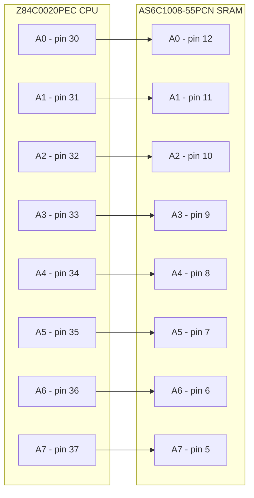
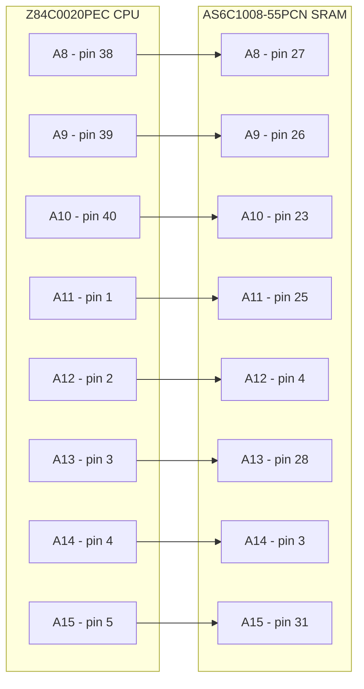
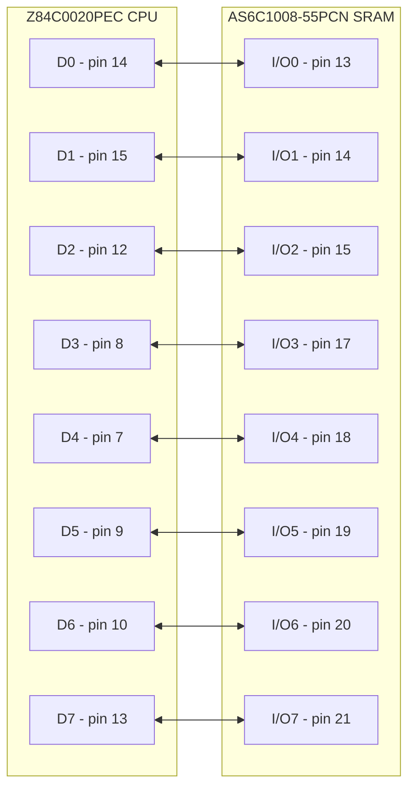
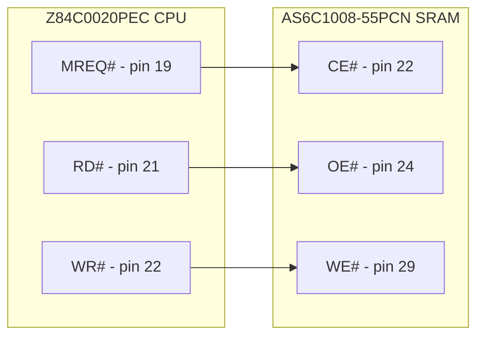
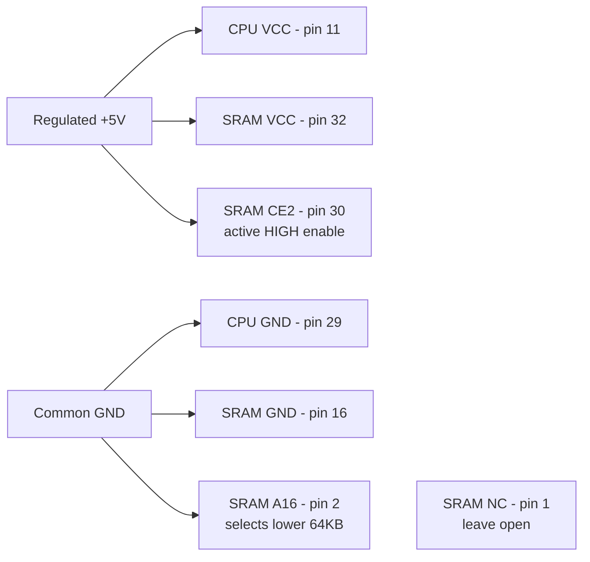
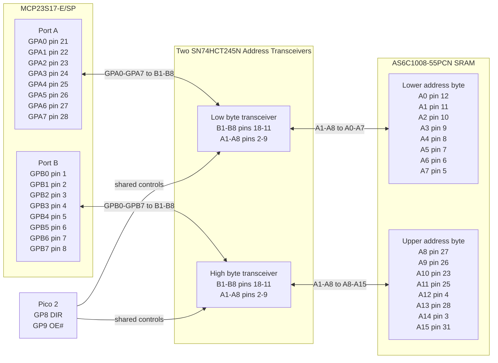
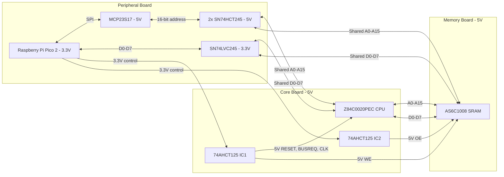
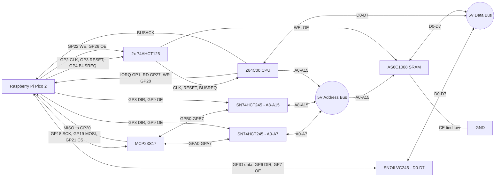

# Z80 ROMless SBC - Final Engineering & Build Specification (v21)

## 1. Reference Pin Mapping & Logic Domain Verification

This architecture leverages the fully static nature of the Z84C0020PEC
CMOS CPU. By controlling the clock train via the supervisor, hardware
handshake lines are eliminated. All hardware assignments have been
audited against official manufacturer specifications. During RESET or
BUSACK states, the Z80 bus pins enter a High-Impedance (floating) state
rather than a driven ground logic level.

<table>
<colgroup>
<col style="width: 25%" />
<col style="width: 25%" />
<col style="width: 25%" />
<col style="width: 25%" />
</colgroup>
<thead>
<tr>
<th>Component</th>
<th>Signal Name / Group</th>
<th>Hardware Pin Numbers</th>
<th>Electrical Constraint / Logic Domain</th>
</tr>
</thead>
<tbody>
<tr>
<td rowspan="8"><strong>Z84C0020PEC (CPU)</strong></td>
<td>CLK</td>
<td>Pin 6</td>
<td>Input. Driven by level-shifted 5V CMOS square wave. Clock can be
safely frozen indefinitely in either a HIGH or LOW state.</td>
</tr>
<tr>
<td>IORQ#</td>
<td>Pin 20</td>
<td>Output. Active Low. Monitored directly by Pico 2 (GP1) to trigger
synchronous clock-stop trapping.</td>
</tr>
<tr>
<td>RD#</td>
<td>Pin 21</td>
<td>Output. Active Low. Sampled by Pico 2 (GP27) to resolve instruction
cycle intent.</td>
</tr>
<tr>
<td>WR#</td>
<td>Pin 22</td>
<td>Output. Active Low. Sampled by Pico 2 (GP28) to resolve instruction
cycle intent.</td>
</tr>
<tr>
<td>BUSACK#</td>
<td>Pin 23</td>
<td>Output. Active Low. Confirms CPU bus lines are in a High-Impedance
float state.</td>
</tr>
<tr>
<td>BUSREQ#</td>
<td>Pin 25</td>
<td>Input. Active Low. Level-shifted up to 5V to request DMA
ownership.</td>
</tr>
<tr>
<td>A0 – A15 (Address Bus)</td>
<td>Pins 30 – 40, 1 – 5</td>
<td>5V Tri-state Bus. Driven by CPU during active run, floats during
DMA/RESET.</td>
</tr>
<tr>
<td>D0 – D7 (Data Bus)</td>
<td>Pins 7 – 10, 12 – 15</td>
<td>5V Bi-directional Tri-state Bus. Connected directly to SRAM data bus
pins.</td>
</tr>
<tr>
<td rowspan="7"><strong>AS6C1008-55PCN (SRAM)</strong></td>
<td>A0 – A15 (Address lines)</td>
<td>Pins 12-10, 9-7, 6-5, 27-26, 23, 25, 4, 28, 3, 31</td>
<td>5V Input. Connected directly to the 5V Z80 address bus. Driven by
MCP23S17 during DMA.</td>
</tr>
<tr>
<td>A16</td>
<td>Pin 2</td>
<td>5V Input. Tie to GND to select the lower 64KB bank; do not leave
floating.</td>
</tr>
<tr>
<td>D0 – D7 (Data lines)</td>
<td>Pins 13 – 15, 17 – 21</td>
<td>5V Bi-directional Bus. Connected directly to the Z80 data bus.</td>
</tr>
<tr>
<td>WE#</td>
<td>Pin 29</td>
<td>Input. Active Low. Driven by Z80 WR# (Pin 22) during CPU ownership;
select the Pico's level-shifted DMA write signal through control-source
arbitration during DMA ownership.</td>
</tr>
<tr>
<td>OE#</td>
<td>Pin 24</td>
<td>Input. Active Low. Driven by Z80 RD# (Pin 21) during CPU ownership;
select the Pico's level-shifted DMA read signal through control-source
arbitration during DMA ownership.</td>
</tr>
<tr>
<td>CE#</td>
<td>Pin 22</td>
<td>Input. Active Low. Driven by Z80 MREQ# (Pin 19) during CPU ownership
so I/O cycles cannot access SRAM; assert through control-source
arbitration during DMA ownership.</td>
</tr>
<tr>
<td>CE2</td>
<td>Pin 30</td>
<td>Input. Active High. Tie permanently to VCC (+5V) to enable the
device through the active-low CE# input.</td>
</tr>
</tbody>
</table>

### 1.1 Z84C0020PEC-to-AS6C1008-55PCN Wiring

The following is the direct run-mode connection verified against the
manufacturers' 40-pin PDIP and 32-pin PDIP pin assignments. The
AS6C1008 is a 128K x 8 device, so A16 must be tied LOW to expose its
lower 64KB as the Z80's address space. CE2 must be tied HIGH, and pin 1
is not connected.

Manufacturer datasheets:

- [Zilog Z84C00 CMOS Z80 CPU Product Specification](https://www.zilog.com/docs/z80/ps0178.pdf)
- [Alliance Memory AS6C1008 128K x 8 Low Power CMOS SRAM Datasheet](https://www.alliancememory.com/wp-content/uploads/AS6C1008_Mar_2023V1.2.pdf)

#### Package Pinouts

#### Address Bus A0-A7

#### Address Bus A8-A15

#### Data Bus D0-D7

#### Memory Control

#### Power and Fixed Pins

> **DMA control requirement:** The direct MREQ#/RD#/WR# connections
> shown above are the CPU-owned run-mode paths. If the Pico also drives
> SRAM CE#/OE#/WE# during DMA, select between the CPU and Pico control
> sources with tri-state buffers or a multiplexer controlled by bus
> ownership. Never connect two actively driven outputs directly
> together.

## 2. 16-Bit Address Expansion Interface: MCP23S17-E/SP

The MCP23S17 acts as the dedicated 16-bit register shifter interfacing
the Pico 2's SPI bus with the shared 5V address bus. During DMA block
injection, it drives the target SRAM locations. During an active I/O
trap, the transceiver directions are reversed, allowing the MCP23S17 to
monitor the address bus states driven by the frozen Z80 CPU.

| MCP23S17 Pin Designation | Target Connection | System Logic Role |
|----|----|----|
| GPA0 – GPA7 (Port A) | SN74HCT245N Transceiver \#1 (B1 – B8) | Lower Address Byte Control (\$A_0 – A_7\$) |
| GPB0 – GPB7 (Port B) | SN74HCT245N Transceiver \#2 (B1 – B8) | Upper Address Byte Control (\$A_8 – A\_{15}\$) |
| CS# (Pin 11) | Pico 2 GP21 | SPI Hardware Chip Select (Active Low) |
| CLK / SCK (Pin 12) | Pico 2 GP18 | SPI Master Clock Train Input |
| SI (Pin 13) | Pico 2 GP19 | SPI Master-Out-Slave-In (MOSI Path) |
| SO (Pin 14) | Pico 2 GP20 | SPI Master-In-Slave-Out (MISO Path) |
| RESET# (Pin 18) | Tied to VCC (5V) | Hardware reset overridden for continuous software operation |

[Microchip MCP23017/MCP23S17 16-Bit I/O Expander with Serial Interface Datasheet](https://ww1.microchip.com/downloads/aemDocuments/documents/OTH/ProductDocuments/DataSheets/20001952C.pdf)

### 2.1 MCP23S17-to-SRAM Address Wiring

The MCP23S17 connects to the SRAM address inputs through two
SN74HCT245N transceivers; it must not be connected directly to the
shared address bus. Both transceivers share the Pico's GP8 direction
control and GP9 active-low output-enable control described in Section
5.2. Side B faces the MCP23S17 and side A faces the SRAM and shared Z80
address bus.

## 3. Physical Partitioning & Breadboard Topology

The layout enforces a strict three-zone model across three 830-point
breadboards to minimize cross-talk and propagation delay across the
distinct 3.3V and 5V power domains:

- **Memory Board (Left Zone):** Houses the AS6C1008 64KB SRAM,
  permanently and directly routed to the main 5V system Address and Data
  buses.

- **Core Board (Center Zone):** Houses the Z84C00 CMOS CPU and two
  74AHCT125N level shifters. *No hardware wait-state latches or
  flip-flops are used.*

- **Peripheral Board (Right Zone):** Houses the Raspberry Pi Pico 2, the
  MCP23S17 port expander, and three bus isolation transceivers (1x
  SN74LVC245AN, 2x SN74HCT245N).

### 3.1 Major Chip Interconnection Overview

## 4. Dual Level-Shifter Gate Mapping: 74AHCT125N (DIP-14)

Unidirectional signals generated by the 3.3V Pico 2 are stepped up to a
solid 5V CMOS swing (\$V\_{IH} \ge 3.5\text{V}\$) via two 74AHCT125N
arrays powered at 5V.

<table>
<colgroup>
<col style="width: 20%" />
<col style="width: 20%" />
<col style="width: 20%" />
<col style="width: 20%" />
<col style="width: 20%" />
</colgroup>
<thead>
<tr>
<th>IC Designation</th>
<th>Gate No.</th>
<th>Input Pin (3.3V from Pico)</th>
<th>Output Pin (5V to Target)</th>
<th>Functional Block Allocation</th>
</tr>
</thead>
<tbody>
<tr>
<td rowspan="4"><strong>IC1: Buffer Array A</strong></td>
<td>Gate 1</td>
<td>Pin 2 (from Pico GP3)</td>
<td>Pin 3 (to Z80 Pin 26 RESET#)</td>
<td>System Reset Generation</td>
</tr>
<tr>
<td>Gate 2</td>
<td>Pin 5 (from Pico GP4)</td>
<td>Pin 6 (to Z80 Pin 25 BUSREQ#)</td>
<td>DMA Request Line</td>
</tr>
<tr>
<td>Gate 3</td>
<td>Pin 9 (from Pico GP2)</td>
<td>Pin 8 (to Z80 Pin 6 CLK)</td>
<td>Master Clock Pulse Train</td>
</tr>
<tr>
<td>Gate 4</td>
<td>Pin 12 (from Pico GP22)</td>
<td>Pin 11 (to SRAM Pin 29 WE#)</td>
<td>SRAM Write Enable</td>
</tr>
<tr>
<td rowspan="2"><strong>IC2: Buffer Array B</strong></td>
<td>Gate 1</td>
<td>Pin 2 (from Pico GP26)</td>
<td>Pin 3 (to SRAM Pin 24 OE#)</td>
<td>SRAM Output Enable</td>
</tr>
<tr>
<td>Gates 2-4</td>
<td>Tied to GND</td>
<td>Leave Open</td>
<td>Unused channels grounded to prevent oscillation</td>
</tr>
</tbody>
</table>

## 5. Transceiver Operating Modes & Isolation Tables

The transceivers isolate the supervisor elements (Pico 2 and MCP23S17)
from the main bus during standard execution, preventing bus contention.

### 5.1 SN74LVC245AN Data Bus Transceiver (3.3V Powered)

| System Operating State | OE# (GP7) | DIR (GP6) | Signal Direction | Functional Role |
|----|----|----|----|----|
| **Boot / Write Mode** | 0 (Low) | 0 (Low) | Side B → Side A (Pico → Bus) | Pico streams virtual ROM blocks into the SRAM. |
| **Readback / Trap Mode** | 0 (Low) | 1 (High) | Side A → Side B (Bus → Pico) | Pico reads data bus during verification or OUT traps. |
| **Active Execution (Run)** | 1 (High) | X (Don't Care) | High-Impedance (High-Z) | Z80 and SRAM handle data operations directly; Pico data bus isolated. |

### 5.2 SN74HCT245N Address Bus Transceivers (5V Powered)

| System Operating State | OE# (GP9) | DIR (GP8) | Signal Direction | Functional Role |
|----|----|----|----|----|
| **DMA Injection Mode** | 0 (Low) | 0 (Low) | Side B → Side A (Expander → Bus) | MCP23S17 dictates memory-injected target address variables. |
| **Trap Address Read Mode** | 0 (Low) | 1 (High) | Side A → Side B (Bus → Expander) | Reverses transceivers so MCP23S17 can read the active port. |
| **Active Execution (Run)** | 1 (High) | X (Don't Care) | High-Impedance (High-Z) | Z80 drives system address lines directly; expander isolated. |

### 5.3 Bus and Supervisor Signal Interconnections

## 6. Architectural Operational Boundaries

### 6.1 Synchronous Clock-Stop Trap Protocol

When the Z80 executes an I/O instruction, the falling edge of IORQ#
trips a hardware edge interrupt on the Pico 2. The Pico 2 immediately
shuts down the hardware PWM clock slice. Because the Z84C00 is fully
static, the clock can stop safely mid-cycle in either a HIGH or LOW
state. Latency is governed by the constraints listed below.

### 6.2 System Performance Envelope & Constraints

- **I/O Decode Width:** Strictly limited to **8-bit** decoding
  (monitoring address lines A0-A7 via the lower expander port).

- **Trap Latency Profile:** Trap servicing duration is heavily dominated
  by the SPI transactions required to communicate with the MCP23S17.
  This is safe for virtual peripheral emulation, but not suitable for
  high-speed line tracing.

- **Clock Validation Targets:**

  - *Validated Operation Target:* **1 MHz** (Recommended baseline for
    breadboard testing).

  - *Expected Operational Limit:* **2 MHz – 4 MHz** (Pico interrupt
    latency safely stops the clock before the Z80 advances past cycle
    T2).

  - *High-Frequency Boundary (\>4 MHz):* Operation beyond 4 MHz requires
    validation via a logic analyzer to verify interrupt latency
    constraints.

## 7. Reference Firmware Implementations

### 7.1 Parameterized Clock Block with Fractional Divider Mapping

void set_z80_clock_hz(uint32_t hz) {\
gpio_set_function(PIN_SYS_CLK, GPIO_FUNC_PWM);\
uint slice_num = pwm_gpio_to_slice_num(PIN_SYS_CLK);\
uint32_t sys_clk = clock_get_hz(clk_sys);\
\
// Configure integer divider to prevent 16-bit register wrap underflows
at low frequencies\
float divider = 1.0f;\
if (hz \< 2000000) {\
divider = 4.0f;\
}\
\
uint32_t wrap = (uint32_t)((float)sys_clk / ((float)hz \* divider)) -
1;\
\
pwm_set_clkdiv(slice_num, divider);\
pwm_set_wrap(slice_num, wrap);\
pwm_set_chan_level(slice_num, PWM_CHAN_A, (wrap + 1) / 2); // 50% Duty
Cycle\
pwm_set_enabled(slice_num, true);\
}

### 7.2 Bus Acquisition with Safety Timeout

bool take_z80_bus() {\
gpio_put(PIN_BUSREQ, 0); // Assert request to Z80\
\
absolute_time_t timeout = make_timeout_time_ms(100);\
while(gpio_get(PIN_BUSACK) != 0) {\
if (time_reached(timeout)) {\
gpio_put(PIN_BUSREQ, 1); // Drop failed line request\
return false; // Prevent hard lockup from a wiring error\
}\
tight_loop_contents();\
}\
\
gpio_put(PIN_ADDR_DIR, 0); // Direction: Expander -\> Bus\
gpio_put(PIN_ADDR_OE, 0); // Enable address pass-through\
return true;\
}

### 7.3 Synchronous Clock-Stop I/O Trap Handler

// Falling-edge ISR for Z80_IORQ# (Pico GP1)\
void io_trap_handler(uint gpio, uint32_t events) {\
// 1. Instantly freeze the master clock pulse train (may halt in either
a HIGH or LOW state)\
uint slice_num = pwm_gpio_to_slice_num(PIN_SYS_CLK);\
pwm_set_enabled(slice_num, false);\
\
// 2. Open Address transceivers in reverse direction (Bus -\> Expander)
to observe port\
gpio_put(PIN_ADDR_DIR, 1);\
gpio_put(PIN_ADDR_OE, 0);\
asm volatile("nop \n nop"); // Settle time for bus levels\
\
// 3. Extract target I/O port address (8-bit decode boundary)\
uint16_t port = mcp23s17_read_word() & 0xFF;\
\
bool is_read = !gpio_get(PIN_Z80_RD);\
bool is_write = !gpio_get(PIN_Z80_WR);\
\
if (is_write) {\
// OUT instruction handling: Bus -\> Pico\
gpio_put(PIN_DATA_DIR, 1);\
gpio_put(PIN_DATA_OE, 0);\
uint8_t data = (gpio_get_all() \>\> 10) & 0xFF;\
process_virtual_io_write(port, data);\
} else if (is_read) {\
// IN instruction handling: Pico -\> Bus\
uint8_t data = process_virtual_io_read(port);\
gpio_put(PIN_DATA_DIR, 0);\
gpio_put_masked(0xFF \<\< 10, data \<\< 10);\
gpio_put(PIN_DATA_OE, 0);\
}\
\
// 4. Return supervisor elements to high-impedance isolation states\
gpio_put(PIN_DATA_OE, 1);\
gpio_put(PIN_ADDR_OE, 1);\
\
// 5. Re-enable the hardware clock slice; Z80 safely resumes execution\
pwm_set_enabled(slice_num, true);\
}

## 8. Hardware Verification Checklist

Perform these hardware validation checks sequentially on the breadboard
prototype:

1.  With no ICs installed, verify that the 5V and Ground rails maintain
    electrical separation across all three boards.

2.  Install the Pico 2 and level shifters. Run a 1MHz clock test and
    verify that the 74AHCT125N output reaches a solid 4.9V to 5.0V
    square wave.

3.  Perform a block-level read/write sequence across the entire 64KB
    SRAM using the Pico 2 to confirm data bus integrity before inserting
    the CPU.

4.  Install the Z80 CPU. Assert a hardware reset while the clock is
    running. Verify that processing activity halts and pins enter a
    high-impedance state, confirming the system is ready for virtual ROM
    injection.
