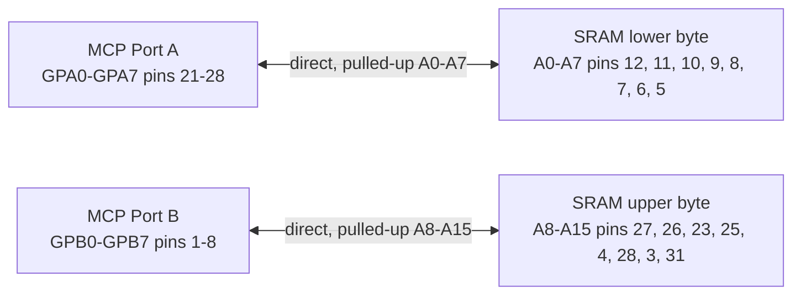
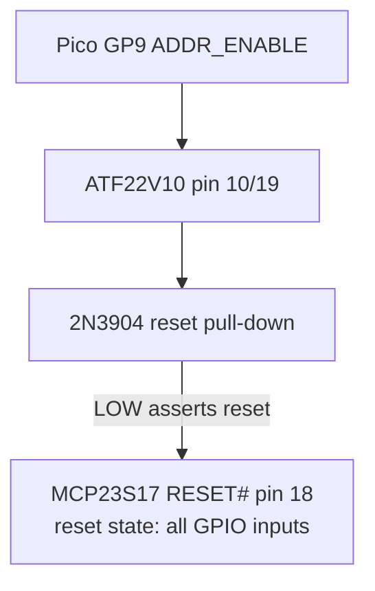

# 2. 16-Bit Address Expansion Interface: MCP23S17-E/SP

The MCP23S17 acts as the dedicated 16-bit register shifter interfacing
the Pico 2's SPI bus with the shared 5V address bus. During DMA block
injection, it drives the target SRAM locations. During an active I/O
trap, its GPIO ports remain inputs, allowing the MCP23S17 to monitor the
address bus states driven by the frozen Z80 CPU.

| MCP23S17 Pin Designation | Target Connection | System Logic Role |
|----|----|----|
| GPA0 – GPA7 (Port A) | Shared A0-A7 directly | Lower address byte drive/sample |
| GPB0 – GPB7 (Port B) | Shared A8-A15 directly | Upper address byte drive/sample |
| CS# (Pin 11) | SN74AHCT244 1Y3 pin 14, from Pico GP21 via 1A3 pin 6 | SPI Hardware Chip Select (Active Low), 5 V translated |
| CLK / SCK (Pin 12) | SN74AHCT244 1Y4 pin 12, from Pico GP18 via 1A4 pin 8 | SPI Master Clock Train Input, 5 V translated |
| SI (Pin 13) | SN74AHCT244 2Y1 pin 9, from Pico GP19 via 2A1 pin 11 | SPI Master-Out-Slave-In (MOSI Path), 5 V translated |
| SO (Pin 14) | SN74LVC244AN channel 2A1/2Y1 to Pico 2 GP20 | SPI Master-In-Slave-Out (MISO Path), buffered from 5 V to 3.3 V; fit the [specified pull-up](inventory.md#03-capacitors-and-resistors) because SO is high-impedance while CS# is HIGH |
| A0, A1, A2 (Pins 15-17) | Tied to GND | Hardware address = 000; matches the fixed 0x40/0x41 opcode used in firmware regardless of the IOCON.HAEN state, and prevents floating address-select inputs |
| RESET# (Pin 18) | 10 kOhm pull-up to 5 V and Q1 collector | LOW outside address access; reset default makes all GPIO inputs |

[Microchip MCP23017/MCP23S17 16-Bit I/O Expander with Serial Interface Datasheet](https://ww1.microchip.com/downloads/aemDocuments/documents/APID/ProductDocuments/DataSheets/MCP23017-MCP23S17-16-Bit-IO-Expander-with-Serial-Interface-DS20001952.pdf)

## 2.1 MCP23S17-to-SRAM Address Wiring

The MCP23S17 connects directly to the shared address bus: GPA0-GPA7 to
A0-A7 and GPB0-GPB7 to A8-A15. Fit one 8x10 kOhm bussed pull-up network
per byte, with each common pin at 5 V. The Z84C00 guarantees 4.2 V at
its light-load VOH2 point against the MCP's 4.0 V input minimum; the
external pull-ups improve the static HIGH level and add at most about
0.5 mA load per LOW bit. MCP GPIO outputs guarantee at least 4.3 V at
5 V, exceeding the SRAM's 3.5 V input minimum.

Hardware isolation comes from RESET#, not a bus transceiver. GP9
ADDR_ENABLE feeds GAL pin 10. When LOW, GAL pin 19 drives Q1 and holds
MCP RESET# LOW, forcing IODIRA/IODIRB to their all-input reset values.
When HIGH, Q1 releases RESET#; firmware waits, then programs OLAT before
changing IODIR to outputs. It reasserts reset before releasing the Z80.
GP9 has a 10 kOhm pull-down, so Pico reset or power loss fails closed.

### Address byte paths

### Reset isolation path

