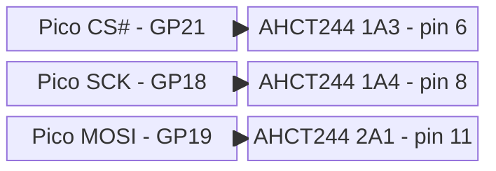
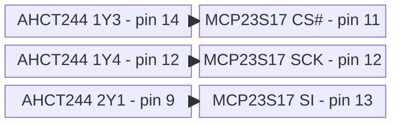
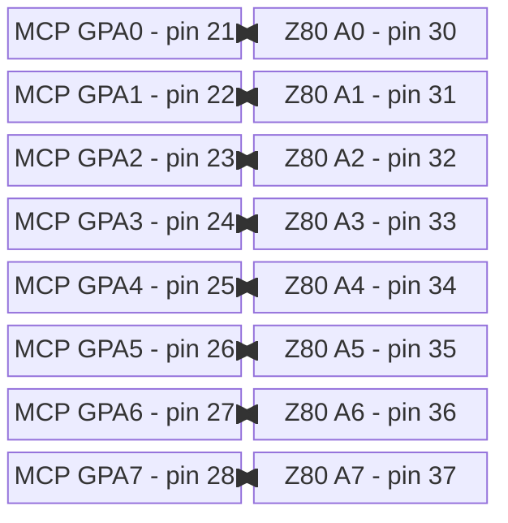
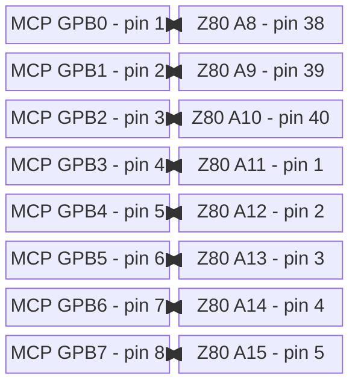
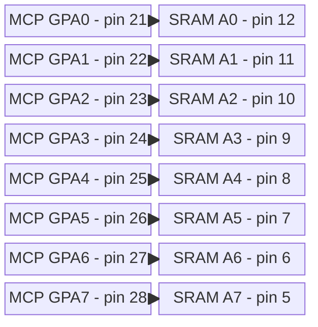
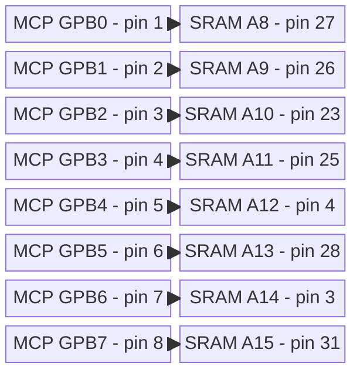

# 2. 16-Bit Address Expansion Interface: MCP23S17-E/SP

The MCP23S17 acts as the dedicated 16-bit I/O expander connecting the
Pico 2 W's SPI bus to the shared 5 V address bus. During DMA block
injection, it drives the target SRAM locations. During an active I/O
trap, its GPIO ports remain inputs, allowing the MCP23S17 to monitor the
address bus states driven by the frozen Z80 CPU.

## 2.0 SPI and reset interconnects

The complete SPI and reset wiring is installed in
[Phase 3](../implementation/phase-3-address-generator.md#wiring-spi-and-mcp23s17-reset).

<template id="phase-3-spi-reset-wiring">

### Pico 2 W to SN74AHCT244

### SN74AHCT244 to MCP23S17

### MCP23S17 to SN74LVC244

### SN74LVC244 to Pico 2 W

Fit the [specified pull-up](../implementation/phase-0-power.md#passive-component-installation) on SO
because it is high-impedance while CS# is HIGH.

### Pico 2 W to ATF22V10

### ATF22V10 to Q1

### Q1 to MCP23S17

Tie MCP23S17 A0, A1, and A2 (pins 15-17) directly to common GND. This selects
hardware address `000`, matching the fixed
`0x40`/`0x41` firmware opcodes regardless of IOCON.HAEN. RESET# has a 10 kOhm
pull-up to 5 V; Q1 holds it LOW outside address access, returning every MCP GPIO
to input mode.

[Microchip MCP23017/MCP23S17 16-Bit I/O Expander with Serial Interface Datasheet](https://ww1.microchip.com/downloads/aemDocuments/documents/APID/ProductDocuments/DataSheets/MCP23017-MCP23S17-16-Bit-IO-Expander-with-Serial-Interface-DS20001952.pdf)

phase-3-spi-reset-wiring-end</template>

## 2.1 MCP23S17 Address-Bus Interconnects

The MCP23S17 connects directly to the shared address bus: GPA0-GPA7 to
A0-A7 and GPB0-GPB7 to A8-A15. Fit one 8x10 kOhm bussed pull-up network
per byte, with each common pin at 5 V. The Z84C00 guarantees 4.2 V at
its light-load VOH2 point against the MCP's 4.0 V input minimum; the
external pull-ups improve the static HIGH level and add at most about
0.5 mA load per LOW bit. MCP GPIO outputs guarantee at least 4.3 V at
5 V, exceeding the SRAM's 3.5 V input minimum.

Hardware isolation comes from RESET#, not a bus transceiver. GP9
ADDR_ENABLE feeds GAL pin 10. When LOW, GAL pin 19 drives Q1 and holds
MCP RESET# LOW, forcing IODIRA/IODIRB to their all-input reset values.
When HIGH, Q1 releases RESET#; firmware waits, then programs OLAT before
changing IODIR to outputs. It reasserts reset before releasing the Z80.
GP9 has a 10 kOhm pull-down, so Pico reset or power loss fails closed.

Every corresponding MCP23S17, Z84C00, and SRAM address pin below is a tap on
one common pulled-up address trunk. The separate chip-pair views do not imply
independent point-to-point nets or a series path through either device.

The complete address-trunk wiring is installed in
[Phase 3](../implementation/phase-3-address-generator.md#wiring-spi-and-mcp23s17-reset).

<template id="phase-3-address-trunk-wiring">

### MCP23S17 to Z84C00: A0-A7

### MCP23S17 to Z84C00: A8-A15

### MCP23S17 to AS6C1008 SRAM: A0-A7

### MCP23S17 to AS6C1008 SRAM: A8-A15

phase-3-address-trunk-wiring-end</template>
