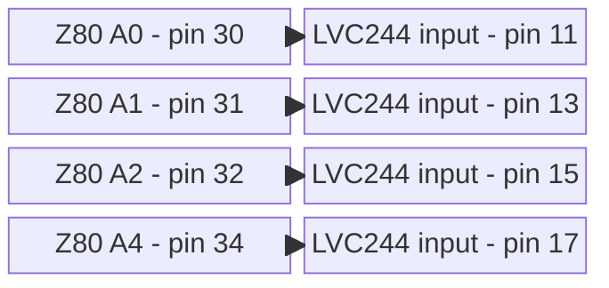

# 2. Z80-Assisted Loading and Address Monitoring

The Pico never drives A0-A15 and never asserts an SRAM write strobe. The
fully static CMOS Z80 executes injected instructions under a slow Pico clock.
This removes the address expander, programmable logic, and external programming
dependency from the circuit.

## Loader Sequence

1. Disable both data paths and PWM. Assert RESET# for at least six slow clock
   cycles, then release it and clock two reset-exit cycles.
2. Keep BOOT_READ_DISABLE HIGH. SRAM OE# stays HIGH while the Pico supplies
   opcode and immediate bytes during Z80 read cycles.
3. Inject `LD HL,nn` (`21 low high`), then `LD (HL),n` (`36 byte`). Disable the
   Pico output after the operand read; the Z80 drives the address, data, and
   write controls for the following three write T-states.
4. For verification, inject `LD A,(HL)` (`7E`), disable the upward path,
   enable the downward path, and lower BOOT_READ_DISABLE only for the three
   memory-read T-states. Sample the bus before the last clock; inhibit SRAM
   reads again afterward.
5. Compare every byte. On success, reset the Z80 again so PC is zero, isolate
   both paths, lower BOOT_READ_DISABLE, release RESET# while CLK is stopped
   LOW, wait at least 1 us, then start the normal clock. On failure, hold
   RESET# LOW and stop the clock.

Opcode fetches use four T-states; immediate reads use three. Every byte access
reloads HL, favoring a simple checked implementation over boot speed. These
operations require an initialized loader session and are not runtime DMA.
Each slow clock returns with CLK LOW only after a fixed 1 us settling interval.
This retains injected data through the Z80's
RD# release and lets the buffered controls settle before readback or isolation.
The pulse count, not a fixed slow-clock frequency, defines the instruction
sequence; software overhead and extra settling extend the low intervals.
PWM-to-SIO handover adds a one-time 1 us guard; already-SIO steps do not repeat
that guard. An injected step requests 1 us LOW, 1 us HIGH, and 1 us of trailing
settling, rather than a fixed 500 kHz clock. At 37 clocks per loaded-and-verified
byte, the 64 KiB image requires about 7.27 seconds of clock waits alone; data
turnaround waits, instructions, and other overhead increase the real boot time.
The host cycle model tests ordering, boundary addresses, patterns, March, and
readback errors; actual reset phase and bus timing still require bench captures.

**Maintained source:** [sram.c](https://github.com/gloveboxes/Z80ROMlessSBC/blob/main/src/common/sram.c)
and [cpu.c](https://github.com/gloveboxes/Z80ROMlessSBC/blob/main/src/common/cpu.c).

## Port Address Monitor

U7, a 3.3 V-powered SN74LVC244AN, monitors four address bits and four controls.
Tie enables pins 1/19 and GND pin 10 to GND; VCC pin 20 to Pico 3.3 V.

| Signal | Z80 pin | U7 input | U7 output | Pico GPIO / header |
| --- | ---: | ---: | ---: | --- |
| BUSACK# | 23 | 2 | 18 | GP0 / 1 |
| IORQ# | 20 | 4 | 16 | GP1 / 2 |
| RD# | 21 | 6 | 14 | GP27 / 32 |
| WR# | 22 | 8 | 12 | GP28 / 34 |
| A0 | 30 | 11 | 9 | GP18 / 24 |
| A1 | 31 | 13 | 7 | GP19 / 25 |
| A2 | 32 | 15 | 5 | GP20 / 26 |
| A4 | 34 | 17 | 3 | GP21 / 27 |

```mermaid
block-beta
  columns 2
  Z0["Z80 A0 - pin 30"] L0["LVC244 input - pin 11"]
  Z1["Z80 A1 - pin 31"] L1["LVC244 input - pin 13"]
  Z2["Z80 A2 - pin 32"] L2["LVC244 input - pin 15"]
  Z4["Z80 A4 - pin 34"] L4["LVC244 input - pin 17"]
  Z0 --> L0
  Z1 --> L1
  Z2 --> L2
  Z4 --> L4
```

The decoded port is `address & 0x17`. Terminal ports `00/01` and disk ports
`10-14` remain distinct. A3, A5-A7, and the high address byte are intentionally
ignored: for example `08` aliases `00`, and `18` aliases `10`. Unsupported
decoded ports retain the existing application behavior. There is no SPI
address sampling or address-driver direction to configure.

BUSREQ#/BUSACK# remains solely a CPU-quiescence handshake for runtime flash
writes. A granted bus never authorizes Pico memory address or write driving.