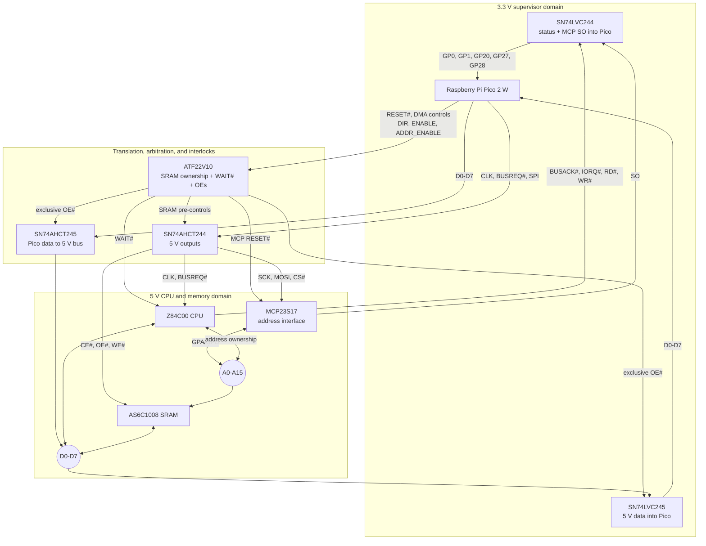

# 5. Transceiver Operating Modes & Isolation Tables

The transceivers isolate the supervisor elements (Pico 2 and MCP23S17)
from the main bus during standard execution, preventing bus contention.

## 5.1 All-PDIP Data-Bus Translation and Interlock

No single PDIP part provides an SN74LVC8T245-equivalent combination of
dual supplies, bidirectional translation, deterministic direction,
three-state isolation, and partial-power-down safety. The breadboard
design therefore uses two fixed-direction transceivers:

- **SN74AHCT245N (5 V):** A port is Pico D0-D7, B port is the 5 V bus,
  and DIR pin 1 is tied HIGH. Its TTL-compatible A inputs accept 3.3 V
  and its B outputs provide full 5 V CMOS levels.
- **SN74LVC245AN (3.3 V):** A port is Pico D0-D7, B port is the 5 V bus,
  and DIR pin 1 is tied LOW. Its B inputs tolerate 5.5 V, A outputs stay
  in the Pico domain, and `Ioff` prevents back-powering while 3.3 V is
  absent.

| Bus bit | Pico GPIO / both A ports | 5 V bus / both B ports |
|----|----|----|
| D0 | GP10 / A1 pin 2 | B1 pin 18 |
| D1 | GP11 / A2 pin 3 | B2 pin 17 |
| D2 | GP12 / A3 pin 4 | B3 pin 16 |
| D3 | GP13 / A4 pin 5 | B4 pin 15 |
| D4 | GP14 / A5 pin 6 | B5 pin 14 |
| D5 | GP15 / A6 pin 7 | B6 pin 13 |
| D6 | GP16 / A7 pin 8 | B7 pin 12 |
| D7 | GP17 / A8 pin 9 | B8 pin 11 |

Connect both pin 10s to GND. Connect AHCT pin 20 to 5 V and LVC pin
20 to 3.3 V. Each device needs its own local 100 nF capacitor.

The existing ATF22V10 provides the hardware interlock using spare pins
and product terms. Connect GP7 DATA_ENABLE to GAL pin 9 and GP6
DATA_DIR to pin 11. GAL pin 17 drives AHCT245 OE# pin 19; pin 18 drives
LVC245 OE# pin 19. The two equations are documented in
[SRAM control-source arbitration](pin-mapping.md#12-sram-control-source-arbitration-atf22v10bc).
No 5 V output drives GP6/GP7: they are GAL inputs with 10 kOhm
pull-downs. During Pico power-off both inputs read LOW, so both GAL OE#
outputs are HIGH. The LVC245's `Ioff` specification protects its
3.3 V-powered side while GAL pin 18 remains at a 5 V-domain HIGH.

| System state | DATA_ENABLE GP7 | DATA_DIR GP6 | AHCT OE# | LVC OE# | Result |
|----|----:|----:|----:|----:|----|
| Isolated / run | 0 | X | 1 | 1 | Both Pico data paths high-impedance |
| DMA write | 1 | 1 | 0 | 1 | Pico → AHCT245 → 5 V bus |
| Readback / OUT trap | 1 | 0 | 1 | 0 | 5 V bus → LVC245 → Pico |

Firmware always drives DATA_ENABLE LOW, waits, changes DATA_DIR, waits,
and only then drives DATA_ENABLE HIGH. The GAL truth table also
makes simultaneous enables impossible for every static GP6/GP7 state.
Do not substitute TXS0108E, TXB0108, BSS138, or resistor-divider
breakouts: their automatic/pass-device behavior and loading assumptions
are not equivalent to this controlled, multi-load push-pull bus.

## 5.2 Direct MCP23S17 Address-Bus Modes

| System state | ADDR_ENABLE GP9 | MCP RESET# | IODIRA/B | Functional role |
|----|----:|----:|----|----|
| **DMA injection** | 1 | 1 | `0x00/0x00` after OLAT preload | MCP drives A0-A15 |
| **Trap address read** | 1 | 1 | `0xFF/0xFF` | MCP samples the frozen Z80 address |
| **Active execution / isolated** | 0 | 0 | Reset default `0xFF/0xFF` | MCP pins are inputs; Z80 owns A0-A15 |

Always assert ADDR_ENABLE LOW before releasing the CPU. Releasing MCP
reset is not itself permission to drive: firmware must preload OLAT and
hold Z80 RESET# or BUSACK# before writing IODIR outputs.

## 5.3 SN74LVC244AN 5 V-to-3.3 V Input Buffer

The RP2350's GP0-GP25 are 5 V-tolerant FT pads, but the 5.5 V rating
applies only while IOVDD is powered at 3.3 V; with IOVDD at 0 V their
absolute maximum is 3.63 V. GP26-GP29 are the QFN-60 package's
ADC-capable pads and are not FT at all. Buffering all five incoming
5 V signals therefore avoids a power-sequencing constraint and keeps
every Pico GPIO within its normal 3.3 V domain. Power the SN74LVC244AN
from the Pico 3.3 V rail. Its inputs accept up to 5.5 V and its `Ioff`
specification protects both sides when VCC is 0 V. Tie both output
enables (pins 1 and 19) to GND: every buffered signal -- BUSACK#,
IORQ#, RD#, WR#, and MCP SO -- must always be readable, and none of
them share a Pico GPIO with any other driver, so neither output enable
needs gating. Wire the channels as follows; tie every unused input to
GND and leave unused outputs open.

| 5 V source | LVC244 input | 3.3 V output | Pico destination |
|----|----:|----:|----|
| Z80 BUSACK# pin 23 | 1A1 pin 2 | 1Y1 pin 18 | GP0 |
| Z80 IORQ# pin 20 | 1A2 pin 4 | 1Y2 pin 16 | GP1 |
| Z80 RD# pin 21 | 1A3 pin 6 | 1Y3 pin 14 | GP27 |
| Z80 WR# pin 22 | 1A4 pin 8 | 1Y4 pin 12 | GP28 |
| MCP23S17 SO pin 14 | 2A1 pin 11 | 2Y1 pin 9 | GP20 |
| GND | 2A2/2A3/2A4 pins 13/15/17 | 2Y2/2Y3/2Y4 pins 7/5/3 open | Unused |

VCC (pin 20) connects to 3.3 V and GND (pin 10) to common ground. The
The [5 V-side pull-ups](inventory.md#03-capacitors-and-resistors) keep every input defined when its
source is absent or high-impedance.

## 5.4 Bus and Supervisor Signal Interconnections

