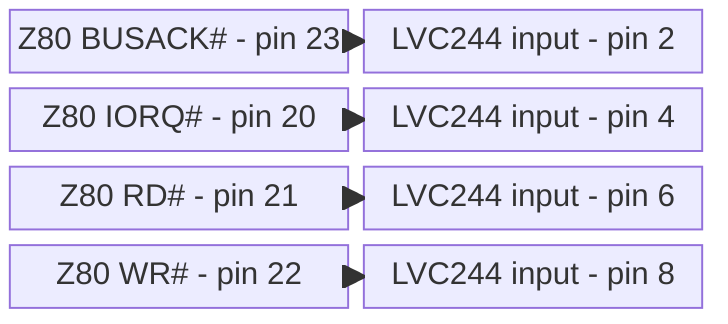

# 5. Bus Translation and Isolation

The Z80 is the sole address-bus driver. Two fixed-direction transceivers
separate its 5 V data bus from the Pico. Both must be disabled before changing
Pico data GPIO direction or value. Never enable both at once.

## 5.1 Data Paths

| Device | Supply | DIR pin 1 | A pins 2-9 | B pins 18-11 | OE# pin 19 |
| --- | --- | --- | --- | --- | --- |
| U9 SN74AHCT245N | +5 V at pin 20 | +5 V, A to B | GP10-GP17 | D0-D7 | HCT32 pin 8 |
| U10 SN74LVC245AN | +3.3 V at pin 20 | GND, B to A | GP10-GP17 | D0-D7 | GP7 |

Both GND pins 10 connect to common GND. Add local 100 nF capacitors.
The [complete bit table](pin-mapping.md#sram-address-and-data-trunks) specifies
every CPU, SRAM, translator, and Pico data pin.

| Mode | GP6 upward request | GP7 downward OE# | Upward path | Downward path |
| --- | ---: | ---: | --- | --- |
| Isolated / run | 1 | 1 | Off | Off |
| Injected read / IN reply | 0 | 1 | On only while RD# LOW | Off |
| SRAM verification / OUT | 1 | 0 | Off | On |

GP6 reaches HCT32 pin 10, raw RD# reaches pin 9, and output pin 8 reaches
U9 OE#. GP7 drives U10 OE# directly. Both GPIOs have 10 kOhm pulls to 3.3 V;
no 5 V output connects to either. Firmware raises both OEs, preloads data
before enabling outputs, or initializes all eight inputs before reception.
This is software-controlled exclusion, not an all-state hardware interlock:
forcing GP6 and GP7 LOW together is prohibited.

The RD# gate disables upward drive at read completion. Runtime firmware
finishes I/O with slow single clocks, observes IORQ#/RD#/WR# release, disables
both paths, rearms WAIT, and only then resumes PWM. RD# gating alone would
not protect a subsequent memory read if the upward request stayed asserted.

Do not substitute TXS/TXB auto-direction parts, BSS138, or resistor-divider
modules for this push-pull multi-load bus. The AHCT245 lacks data-port
power-off protection: apply external +5 V before USB and remove USB before
+5 V. Disabling its OE does not eliminate its input clamp paths.

## 5.2 CPU-Only Address Ownership

Only the Z80 drives A0-A15; SRAM, pulls, and four input-monitor taps share
the trunk. Loading requires the Z80 running under injected instructions,
not held in reset. BUSACK is retained for flash quiescence, never Pico DMA.

## 5.3 SN74LVC244AN 5 V-to-3.3 V Input Buffer

All eight monitor channels are used. Supply U7 pin 20 from Pico 3.3 V; pins
1,10,19 go to GND. Its inputs tolerate 5.5 V and `Ioff` protects power-off.
Never wire raw Z80 outputs directly to Pico GPIOs; GP27/GP28 are not FT pads,
and FT tolerance on other pads depends on IOVDD being present.

| Signal | CPU pin | U7 input | U7 output | Pico GP |
| --- | ---: | ---: | ---: | ---: |
| BUSACK# | 23 | 2 | 18 | 0 |
| IORQ# | 20 | 4 | 16 | 1 |
| RD# | 21 | 6 | 14 | 27 |
| WR# | 22 | 8 | 12 | 28 |
| A0 | 30 | 11 | 9 | 18 |
| A1 | 31 | 13 | 7 | 19 |
| A2 | 32 | 15 | 5 | 20 |
| A4 | 34 | 17 | 3 | 21 |

```mermaid
block-beta
  columns 2
  ZB["Z80 BUSACK# - pin 23"] LB["LVC244 input - pin 2"]
  ZI["Z80 IORQ# - pin 20"] LI["LVC244 input - pin 4"]
  ZR["Z80 RD# - pin 21"] LR["LVC244 input - pin 6"]
  ZW["Z80 WR# - pin 22"] LW["LVC244 input - pin 8"]
  ZB --> LB
  ZI --> LI
  ZR --> LR
  ZW --> LW
```

## 5.4 Implementation Wiring Index

- [Pico connections](../implementation/phase-1-supervisor.md#wiring-pico-2-w)
- [Fixed logic and output buffer](../implementation/phase-2-buffer-clock.md#wiring-output-buffer-and-fixed-logic)
- [Control and port monitor](../implementation/phase-3-address-generator.md#wiring-control-and-port-monitor)
- [Data paths](../implementation/phase-5-data-bus.md#wiring-bidirectional-data-path)
- [SRAM and CPU insertion](../implementation/phase-6-sram.md#wiring-sram-socket)