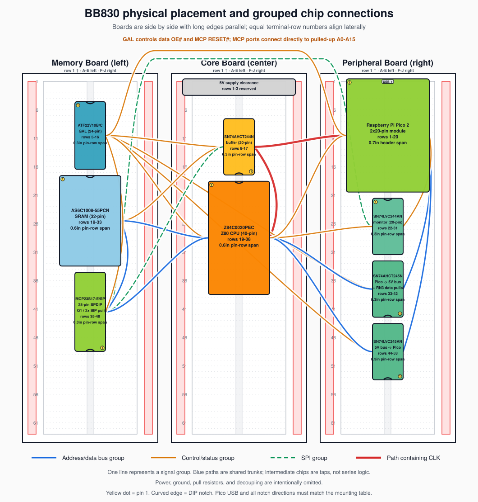
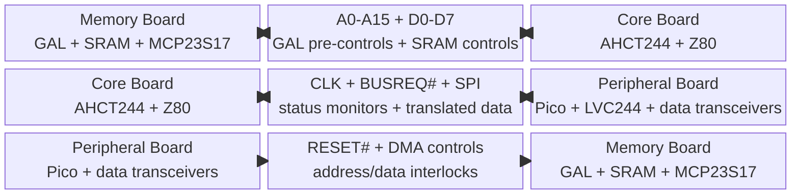

# 3. Physical Partitioning & Breadboard Topology

The layout enforces a strict three-zone model across three 830-point
breadboards to minimize cross-talk and propagation delay across the
distinct 3.3 V and 5 V power domains. Each zone below lists the specific
chips to place on that board and where to seat them.

Place the three BB830s side by side with their long edges parallel:
Memory on the left, Core in the center, and Peripheral on the right.
Rows 1-63 run in the same direction on all three boards, so equal row
numbers align across both board boundaries. The Core Board's central
position is deliberate: the dominant Memory/Core paths are the shared
16-bit address and 8-bit data buses plus the MCP23S17 address/SPI
interface, while the dominant Core/Peripheral paths are the Pico's
8-bit data interface and supervisor controls. Seven Pico-to-GAL signals span both board boundaries
without a buffer: PICO_CE#, PICO_OE#, PICO_WE#, RESET#, DATA_ENABLE,
DATA_DIR, and ADDR_ENABLE. RESET# is a
three-way node also tapped by the Z80 on the Core Board; the others
simply cross the Core Board without connecting to a Core component.
MCP SO also crosses both boundaries to the Peripheral Board's LVC244.
Keep these low-activity paths away from CLK. Putting either outer cluster
in the center would shorten these eight paths only by forcing one of the
much wider address/data interfaces to span two board widths.

- **Memory Board (Left Zone):** AS6C1008-55PCN SRAM, the programmed
  ATF22V10, and MCP23S17. The GAL's five CPU-side inputs (BUSACK#,
  MREQ#, IORQ#, RD#, WR#)
  cross from the Core Board, and its three pre-buffer outputs cross
  back to the Core Board's SN74AHCT244 before the buffered result
  returns here as SRAM CE#/OE#/WE#. This deliberate round trip keeps
  the AHCT244's clock channel local to the Z80 instead (see below), which
  matters far more than SRAM control length since SRAM CE#/OE#/WE# only
  toggle at the Z80 bus-cycle rate, the same class as MREQ#/RD#/WR#. The
  MCP23S17 now sits here so its 16 port lines join the pulled-up shared
  address bus at the Memory/Core boundary. Q1 beside it provides
  reset-based hardware isolation. AHCT244 SPI outputs also cross only
  the Memory/Core boundary. Its SO output is
  the one MCP signal that continues across Core to the LVC244. Row
  budget: 16 (SRAM) + 12 (ATF22V10) + 14 (MCP23S17) = 42 of 63 rows.

- **Core Board (Center Zone):** Z84C0020PEC CPU and the SN74AHCT244N
  output buffer. Keep the
  AHCT244 beside the Z80 so its
  Y1 clock output never crosses a board boundary, the same placement
  rule the discrete design used for its dedicated clock buffer. The
  Z80 address pins join the SRAM/MCP address trunk directly. The
  photographed plug-in supply reserves rows 1-3, leaving 60 usable
  terminal rows.
  The chip budget is 20 (Z80) + 10 (SN74AHCT244N) = 30 of those 60
  rows, leaving 30 rows for socket-body
  clearance, decoupling, and wiring. *No separate wait-state latch or
  flip-flop is used; the GAL drives WAIT# combinationally.*

- **Peripheral Board (Right Zone):** Raspberry Pi Pico 2 W,
  SN74LVC244AN monitor buffer, SN74AHCT245N upward data path,
  and SN74LVC245AN downward data path. The ATF22V10 on Memory provides
  the mutually exclusive enables. Rotate both data transceivers so
  their B-port pin rows face the Core Board and their A-port pin rows
  face the Pico; tie AHCT DIR HIGH and LVC DIR LOW. Orient the LVC244 so its 1A input pin
  row faces the Core Board and its 1Y output pin row faces inward toward
  the Pico; its fifth input, MCP SO, arrives from Memory across Core.
  Row budget: 20 (Pico) + 10 (LVC244) + 10 (AHCT245) + 10 (LVC245) =
  50 of 63 rows.

The following row-aligned schedule was selected by evaluating every
valid per-board package ordering and gap distribution against grouped
signal-count weights, iterating the comparison across all three boards.
This is a routing aid, not an instruction to equalize individual wire
lengths:

| Board | Terminal-row schedule | Unallocated rows |
|----|----|----:|
| Memory | Unallocated 1-4; GAL 5-16; gap 17; SRAM 18-33; gap 34; MCP23S17 35-48 | 1-4 and 49-63 (19) |
| Core / middle | Supply clearance 1-3; unallocated 4-7; AHCT244 8-17; gap 18; Z80 19-38 | 4-7 and 39-63 (29) |
| Peripheral | Pico 1-20; gap 21; LVC244 22-31; gap 32; AHCT245 33-42; gap 43; LVC245 44-53 | 54-63 (10) |

## 3.1 Package Orientation and Pin 1

Use this convention for both the table and the placement image: view
each BB830 from above and rotate it 90 degrees counter-clockwise from
the manufacturer's landscape drawing, so **row 1 is at the top, row 63
is at the bottom, A-E are on the left, and F-J are on the right**.
Memory, Core, and Peripheral then sit left-to-right. Do not mirror any
board.

Seat every DIP socket across the center ravine before wiring it. A
0.3-inch DIP uses the E/F holes immediately beside the ravine. The Z80
and SRAM are 0.6-inch-wide DIPs: dry-fit their specified 0.6-inch
sockets in two terminal columns matching the actual 15.24 mm lead-row
span; do not force or bend them into E/F. Both pin rows must remain on
opposite, electrically isolated sides of the ravine. Install the IC
only after marking the socket's pin-1 corner and matching the IC notch
or dot to the socket.

| Board / device | Occupied rows | Body orientation | Pin 1 location (top view) | Opposite corner check |
| --- | ---: | --- | --- | --- |
| Memory / ATF22V10 | 5-16 | Notch toward row 1 | E5 | Pin 24 at F5 |
| Memory / AS6C1008 SRAM | 18-33 | Notch toward row 1 | A-E pin-row side at row 18 | Pin 32 on F-J side at row 18 |
| Memory / MCP23S17 | 35-48 | Notch toward row 63 | F48 | Pin 28 at E48 |
| Core / SN74AHCT244 | 8-17 | Notch toward row 63 | F17 | Pin 20 at E17; 1Y1 pin 18 is then close to Z80 CLK |
| Core / Z84C0020 | 19-38 | Notch toward row 1 | A-E pin-row side at row 19 | Pin 40 on F-J side at row 19 |
| Peripheral / Pico 2 W | 1-20 | USB connector toward row 1 | Header pin 1 on A-E side at row 1 | Header pin 40 on F-J side at row 1 |
| Peripheral / SN74LVC244 | 22-31 | Notch toward row 1 | E22 | Pin 20 at F22; 1A inputs face Core |
| Peripheral / SN74AHCT245 | 33-42 | Notch toward row 63 | F42 | Pin 20 at E42; B1-B8 face Core |
| Peripheral / SN74LVC245 | 44-53 | Notch toward row 63 | F53 | Pin 20 at E53; B1-B8 face Core |

For the non-DIP keyed parts:

- **Q1 (2N3904):** place beside the MCP, not across the ravine. TO-92
  lead order can vary by manufacturer; use the purchased part's
  datasheet to identify emitter/base/collector and mark `E-B-C` beside
  its holes. Do not rely on flat-face orientation alone.
- **RN1/RN2:** place as single-row SIPs near SRAM/MCP, parallel to the
  ravine, with the dot/common pin toward row 1 and wired to +5 V.
- **RN3:** place beside the AHCT/LVC A-port node with its dot/common pin
  toward row 1 and wired to GND.
- **1N5819 and electrolytics:** the diode band faces Pico VSYS; every
  electrolytic `+` lead goes to its positive rail. Mark polarity on the
  breadboard before insertion.
- **Plug-in supply module:** orient it only from its printed `+`, `-`,
  input, and output labels, then confirm every rail with a meter while
  unloaded. There is no generic module orientation; never infer
  polarity from USB-jack position or board color.

Before applying power, inspect every socket from above and verify the
pin-1 location against this table. Then use continuity mode to prove
that opposite-side pins at the same row are not shorted through a
terminal strip.

This placement uses row alignment to reduce diagonal jumper length:

- **Memory/Core:** SRAM rows 18-33 overlap the Z80's rows 19-38 for the
  full A0-A15/D0-D7 trunk. GAL rows 5-16 overlap the AHCT244, while
  MCP23S17 rows 35-48 meet the lower end of the direct Z80 address trunk.
- **Core/Peripheral:** Pico rows 1-20 overlap AHCT244 and the top of the
  Z80. LVC244 rows 22-31 overlap the Z80 monitor sources. Both data
  transceivers overlap the lower Z80 region while remaining
  directly adjacent to the Pico on the same board.
- **Peripheral/Memory:** Pico rows 1-20 overlap GAL rows 5-16, reducing
  the vertical component of the seven Pico-to-GAL paths and two OE#
  returns. MCP SO
  remains one grouped low-activity crossing to the LVC244.

This schedule includes one empty row between every socket or module and
still fits all three boards. Mark the actual supply-module overhang and
socket outlines on the empty boards before wiring; the schedule is not
valid if the supply consumes more than the assumed three rows.



Use one supply-entry point and fan out +5 V and GND to each board; do
not daisy-chain the boards' power rails end-to-end. Run the Pico 3.3 V
rail separately to the two LVC devices. Bond adjacent boards with
multiple short ground jumpers, especially beside the address/data bus
crossings and CLK. Verify every BB830 distribution rail end-to-end with
a meter before fitting links; never assume visually aligned rail
segments are internally continuous.

## 3.2 KiCad Electrical Schematic

The native KiCad 10 schematic is the electrical source of truth for
pin numbers, named nets, explicit no-connect markers, and ERC. It uses
project-local symbols so the exact ATF22V10, Z80, SRAM, Pico, and
translator pin definitions travel with the repository. RESET# is drawn
as an explicit three-way Pico/Z80/GAL wire junction. Address, data,
SPI, monitor, and control paths are shown as unfolded KiCad vector or
group buses with every member named; matching labels on the chip-pin
stubs provide the exact electrical connections without implying that
signals pass through an intermediate chip as series logic.

| Artifact | Purpose |
| --- | --- |
| [KiCad project](https://github.com/gloveboxes/Z80ROMlessSBC/blob/main/hardware/kicad/z80_romless_sbc.kicad_pro) and [native schematic](https://github.com/gloveboxes/Z80ROMlessSBC/blob/main/hardware/kicad/z80_romless_sbc.kicad_sch) | Editable KiCad 10 source |
| [Project symbol library](https://github.com/gloveboxes/Z80ROMlessSBC/blob/main/hardware/kicad/z80sbc.kicad_sym) | Exact local pin names, numbers, and ERC electrical types |
| [SVG export](https://github.com/gloveboxes/Z80ROMlessSBC/blob/main/hardware/kicad/exports/z80_romless_sbc.svg) and [PDF export](https://github.com/gloveboxes/Z80ROMlessSBC/blob/main/hardware/kicad/exports/z80_romless_sbc.pdf) | Zoomable full schematic renderings |
| [KiCad netlist](https://github.com/gloveboxes/Z80ROMlessSBC/blob/main/hardware/kicad/reports/z80_romless_sbc.net) and [independent net manifest](https://github.com/gloveboxes/Z80ROMlessSBC/blob/main/hardware/kicad/reports/net_manifest.json) | Machine-readable connectivity |
| [ERC report](https://github.com/gloveboxes/Z80ROMlessSBC/blob/main/hardware/kicad/reports/z80_romless_sbc-erc.json) | KiCad 10.0.6 result: zero violations with errors, warnings, and exclusions included |

The schematic contains 59 physical components, including 31 discrete
resistors, three SIP networks, and 12 fitted capacitors, plus one nonphysical
`#FLG01` power marker used only by ERC. KiCad's exported netlist
matches the independently generated manifest exactly: 79 real nets
and 349 component pin endpoints. The ERC-only power marker and KiCad's
synthetic no-connect nets are excluded from that comparison.

To regenerate and validate the native source, exports, strict ERC
report, and independent netlist comparison:

```sh
python3 -m venv .venv-kicad
.venv-kicad/bin/pip install -r scripts/requirements-kicad.txt
PYTHON=.venv-kicad/bin/python npm run kicad
```

The command runs [build-kicad-schematic.py](https://github.com/gloveboxes/Z80ROMlessSBC/blob/main/scripts/build-kicad-schematic.py),
KiCad CLI upgrade/export/ERC, and
[check-kicad-netlist.py](https://github.com/gloveboxes/Z80ROMlessSBC/blob/main/scripts/check-kicad-netlist.py). Any ERC
violation or net/endpoint mismatch fails the build.

## 3.3 High-Speed Interconnect Routing

At the qualified 1-6 MHz clock rates, propagation skew from a few
millimetres of wire-length difference is negligible compared with the
Z80 timing budget. Solderless-breadboard reliability is instead
dominated by total wire length, stubs, loop area, contact resistance,
and fast-edge ringing. Route each bus as a short grouped trunk with
roughly similar paths, but do not add serpentine wire merely to make
lengths equal:

- **A0-A15 (hard construction rule):** keep the Z80, SRAM, MCP23S17,
  and both SIP pull-up networks on one short common trunk. Do not build
  this as a star and do not leave long branches to any device. A layout
  that cannot satisfy this rule fails the placement review and must be
  rearranged before wiring the remaining signals.
- **D0-D7:** join both Peripheral data-transceiver B ports to one short
  5 V trunk crossing to the Core Board, then continue that shared trunk
  through the Z80 to the adjacent SRAM. Keep the two A-port taps to the
  Pico short and parallel; never route one translator through the other.
- **SN74AHCT244 2Y2-2Y4 to SRAM WE#/OE#/CE#:** these cross from the Core
  Board's AHCT244 to the Memory Board's SRAM; route them as one grouped
  trunk at the board boundary. Exact length matching is unnecessary.
- **CLK (SN74AHCT244 1Y1 pin 18 to Z80 pin 6):** route this as the
  single shortest, most direct jumper, kept away from the address bus.
  Do not lengthen it to match other nets; clock is the most
  edge-rate-sensitive signal in the design. This is why the AHCT244 is
  seated on the Core Board rather than beside the GAL.

Route a ground jumper alongside every inter-board signal group and add
ground probe points near CLK, IORQ#, MREQ#, RD#, WR#, SRAM CE#/OE#/WE#,
and each bus transceiver. Keep all jumpers as short as the placement
allows.

## 3.4 Major Chip Interconnection Overview


