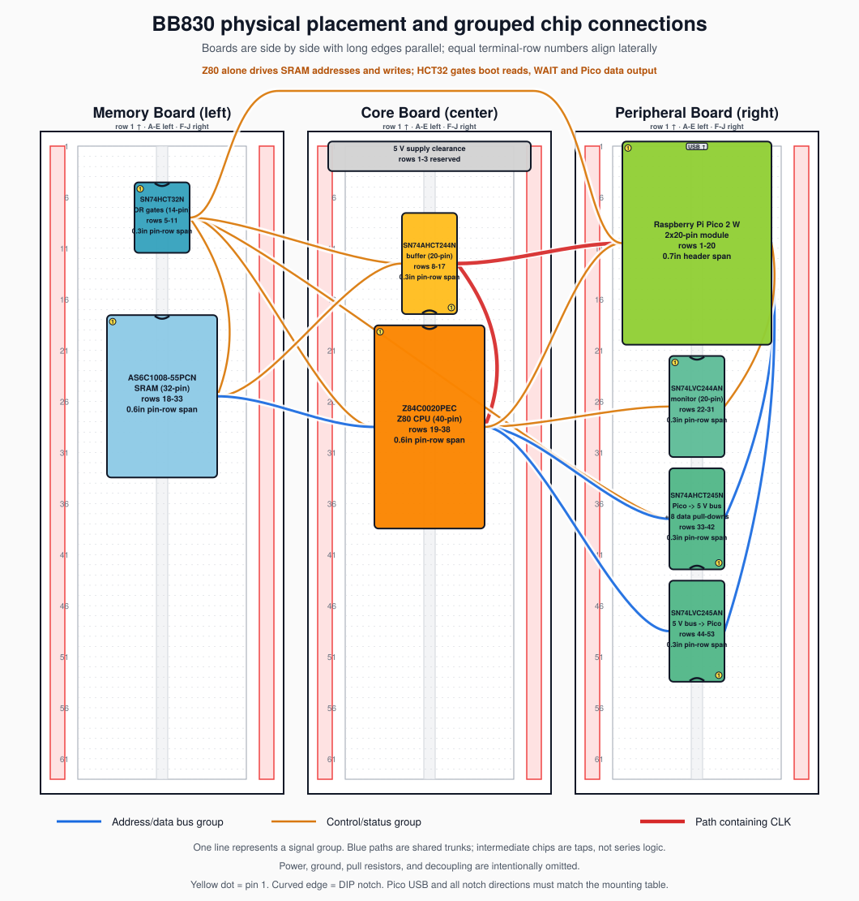

# 3. Construction and Breadboard Topology

Build the [phase sequence](../implementation/index.md); leave later devices
absent until instructed. Every pin map is a **top view**. Matching schematic
net labels mean an electrical connection even without a continuous drawn wire.

## Before You Wire

On each BB830, A-E at one numbered row are one connection; F-J at that row
are a separate connection. The center ravine isolates them. Adjacent numbered
rows are not connected. Check power-rail continuity with a meter: stripes
do not prove internal continuity or voltage.

Wire one named source pin to one named destination pin, then check continuity
at the actual socket contacts and shorts to adjacent contacts. GP2 is Pico
header pin 4, not header pin 2. A0-A15 means sixteen independent nets. Strip
only enough insulation to seat the jumper, with no exposed bridges.

### Use the Meter Safely

Use resistance/continuity only with external power and USB disconnected and
capacitors discharged. Do not discharge capacitors by shorting them. In voltage
mode, black COM goes to circuit GND and red goes to the named pin. Measure IC
supply contacts, not only the supply entry. Prefer the supply current readout;
an ammeter goes **in series**, never across +5 V and GND. Return its lead to
the voltage socket after any current measurement. Attach clips with power off.

## Board Roles and Placement

Place Memory, Core, and Peripheral boards left-to-right with long edges
parallel, row 1 at the top, A-E left and F-J right. Do not mirror a board.
Keep the AHCT244 next to the Z80 so CLK never crosses a board boundary.
Signal-group placement is a routing aid, not a wire-length-matching requirement.

## 3.1 Package Orientation and Pin 1

| Board / device | Rows | Orientation | Pin 1 | Opposite corner |
| --- | --- | --- | --- | --- |
| Memory / HCT32 | 5-11 | Notch up | E5 | Pin 14 at F5 |
| Memory / SRAM | 18-33 | Notch up | Left pin-row side, row 18 | Pin 32 right, row 18 |
| Core / AHCT244 | 8-17 | Notch down | F17 | Pin 20 E17 |
| Core / Z80 | 19-38 | Notch up | Left pin-row side, row 19 | Pin 40 right, row 19 |
| Peripheral / Pico | 1-20 | USB up | Header 1 left, row 1 | Header 40 right, row 1 |
| Peripheral / LVC244 | 22-31 | Notch up | E22 | Pin 20 F22 |
| Peripheral / AHCT245 | 33-42 | Notch down | F42 | Pin 20 E42 |
| Peripheral / LVC245 | 44-53 | Notch down | F53 | Pin 20 E53 |

Narrow 7.62 mm DIPs straddle the ravine in E/F. Dry-fit the Z80/SRAM wide
15.24 mm sockets in columns matching their actual pin-row spacing; do not bend
them into E/F. Both sides must remain electrically isolated. Reserve Core
rows 1-3 for supply-module clearance; if the module needs more, mount it
off-board rather than compressing the clock/CPU region.

Memory uses 23 terminal rows for ICs, Core 30, and Peripheral 50. Leave gaps,
keep bypass capacitors near supply pins, and place address pulls by the SRAM
trunk and Pico data pulls beside U9/U10 A pins. No reset transistor is fitted.

## Power Distribution

Feed the three +5 V rails from one supply-entry star, with multiple short
common-GND links near bus crossings. The Peripheral +3.3 V rail is supplied
only by Pico header 36 and powers U7/U10. Do not connect a plug-in module's
3.3 V output to it. Fit seven local 100 nF capacitors, three 22 uF board
capacitors, and one 100 uF entry capacitor. Observe electrolytic polarity;
the 1N5819 band faces VSYS.

All installed 5 V ICs must be powered whenever the 5 V rail is on. Pulls do
not isolate installed unpowered devices. Follow [Phase 0](../implementation/phase-0-power.md#power-distribution-and-isolation).

## 3.2 KiCad Electrical Schematic

The [native schematic](https://github.com/gloveboxes/Z80ROMlessSBC/blob/main/hardware/kicad/z80_romless_sbc.kicad_sch)
and [net manifest](https://github.com/gloveboxes/Z80ROMlessSBC/blob/main/hardware/kicad/reports/net_manifest.json)
are generated by
[build-kicad-schematic.py](https://github.com/gloveboxes/Z80ROMlessSBC/blob/main/scripts/build-kicad-schematic.py).
Current validation: **zero ERC violations, 68 real nets, 276 pin endpoints**.
This establishes connectivity, not bench timing or supply-transient safety.

The existing PCB, session, Gerbers, drills, and PCB assembly outputs are
unchanged and belong to the previous circuit. Do not manufacture them for the
assisted-loader revision. Do not run the full PCB regeneration pipeline until
a separate PCB migration is authorized.