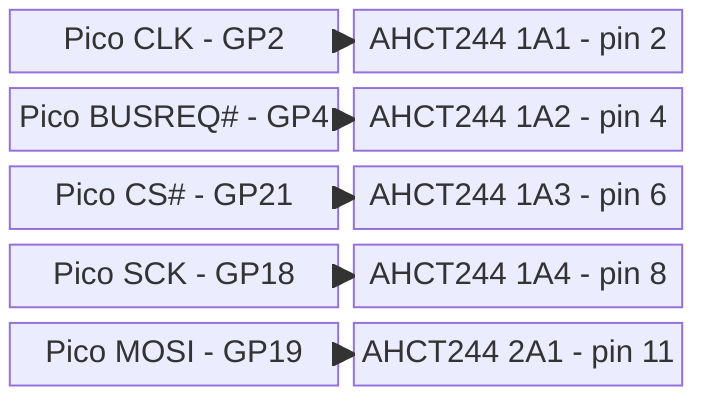
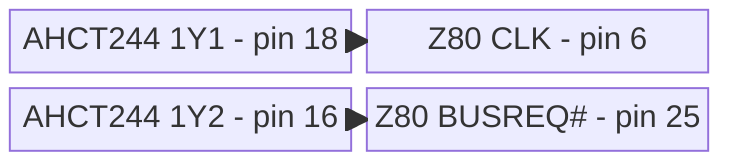
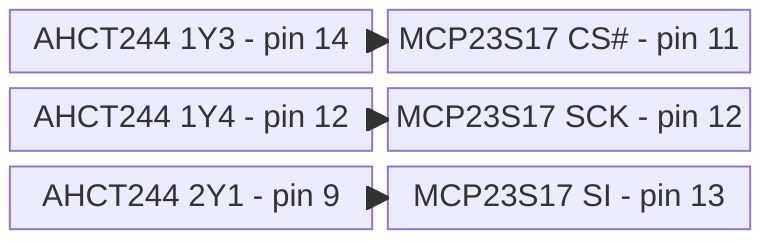
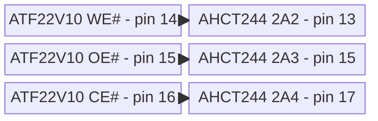
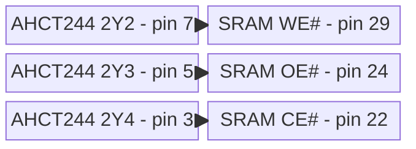

# 4. Output Buffer Mapping: SN74AHCT244N (DIP-20)

The 5 V-powered SN74AHCT244 provides all eight required high-level
outputs:

- **Input compatibility:** Its TTL-compatible inputs accept both Pico
  3.3 V signals and the ATF22V10's guaranteed 2.4 V HIGH.
- **Output threshold compliance:** At the light CMOS loads used here,
  its 5 V outputs satisfy the Z80 clock's strict $V_{IHC}$ threshold,
  the MCP23S17's $0.8V_{DD}$ SPI threshold, and the SRAM's CMOS
  control-input threshold.
- **Component-delay budget:** Its current TI datasheet specifies a
  worst-case 9.5 ns A-to-Y delay at 5 V with a 50 pF load over -40°C to
  85°C. Combined with the ATF22V10C-15's 15 ns combinational delay and
  the SRAM's 55 ns chip-enable access, these datasheet maxima give a
  conservative 79.5 ns component-delay sum for the control-to-data path.
  This is not complete timing closure: breadboard interconnect and Z80
  setup allowance are additional.

This is why 1-6 MHz is measured rather than assumed, and why this design
is not a 20 MHz system despite using a 20 MHz-rated CPU.

The complete pin-by-pin wiring is installed in
[Phase 2](../implementation/phase-2-buffer-clock.md#wiring-gal-and-output-buffer).

<template id="phase-2-output-buffer-wiring">

## Pico 2 W to SN74AHCT244

## SN74AHCT244 to Z84C00

## SN74AHCT244 to MCP23S17

## ATF22V10 to SN74AHCT244

## SN74AHCT244 to AS6C1008 SRAM

phase-2-output-buffer-wiring-end</template>

Tie both active-low output enables, OE1# pin 1 and OE2# pin 19, to GND.
Connect VCC pin 20 to regulated +5 V and GND pin 10 to common ground.
The buffer is permanently enabled; the Pico-side defaults and GAL
equations therefore establish safe inactive outputs before firmware
enables its GPIO drivers.

Pico GP3 RESET# bypasses the AHCT244 and connects directly to Z80 pin 26
and ATF22V10 pin 1. Its 3.3 V HIGH exceeds the Z84C00's 2.2 V and the
ATF22V10's 2.0 V input-HIGH minima. Keep its 10 kOhm pull-down to GND
and never fit a 5 V pull-up on this node.
