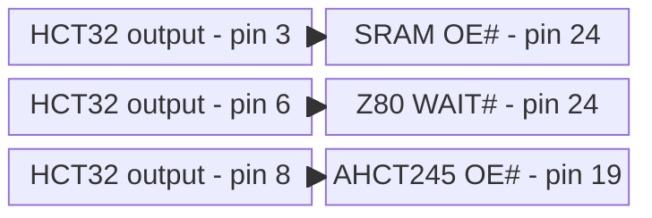

# 4. Output Buffer and Fixed Logic

## SN74AHCT244N

Power U4 from +5 V at pin 20, GND at pin 10, and tie enables pins 1/19 LOW.
Its TTL-compatible inputs accept Pico 3.3 V and Z80 TTL HIGH levels; its
outputs meet the SRAM CMOS-control and Z80 clock requirements. Use **AHCT**,
not AHC. Keep output pin 18 to Z80 CLK pin 6 short and local to the Core board.

| Source | U4 input | U4 output | Destination |
| --- | ---: | ---: | --- |
| Pico GP2, header 4 | 2 | 18 | Z80 CLK pin 6 |
| Pico GP4, header 6 | 4 | 16 | Z80 BUSREQ# pin 25 |
| Pico GP5, header 7 | 6 | 14 | HCT32 pin 2, BOOT_READ_DISABLE_5V |
| Z80 MREQ# pin 19 | 8 | 12 | SRAM CE# pin 22 |
| Z80 WR# pin 22 | 11 | 9 | SRAM WE# pin 29 |
| Z80 RD# pin 21 | 13 | 7 | HCT32 pin 1, RD_5V# |
| GND | 15 | 5 | Leave output open |
| GND | 17 | 3 | Leave output open |

<template id="phase-2-output-buffer-wiring">

### U4 AHCT244 input connections

| Done | Signal | Source socket/header contact | Destination socket contact |
| --- | --- | --- | --- |
| <input type="checkbox" data-checklist-id="wire-u4-input-2" aria-label="U4 clock input pin 2 continuity checked"> | CLK | Pico GP2 - header pin 4 | U4 AHCT244 input - pin 2 |
| <input type="checkbox" data-checklist-id="wire-u4-input-4" aria-label="U4 bus request input pin 4 continuity checked"> | BUSREQ# | Pico GP4 - header pin 6 | U4 AHCT244 input - pin 4 |
| <input type="checkbox" data-checklist-id="wire-u4-input-6" aria-label="U4 boot inhibit input pin 6 continuity checked"> | BOOT_READ_DISABLE | Pico GP5 - header pin 7 | U4 AHCT244 input - pin 6 |
| <input type="checkbox" data-checklist-id="wire-u4-input-8" aria-label="U4 memory request input pin 8 continuity checked"> | MREQ# | U1 Z80 MREQ# - pin 19 | U4 AHCT244 input - pin 8 |
| <input type="checkbox" data-checklist-id="wire-u4-input-11" aria-label="U4 write input pin 11 continuity checked"> | WR# | U1 Z80 WR# - pin 22 | U4 AHCT244 input - pin 11 |
| <input type="checkbox" data-checklist-id="wire-u4-input-13" aria-label="U4 read input pin 13 continuity checked"> | RD# | U1 Z80 RD# - pin 21 | U4 AHCT244 input - pin 13 |

### U4 AHCT244 outputs to CPU and SRAM

| Done | Signal | Source socket contact | Destination socket contact |
| --- | --- | --- | --- |
| <input type="checkbox" data-checklist-id="wire-u4-9" aria-label="AHCT244 pin 9 to SRAM write enable wire continuity checked"> | SRAM WE# | U4 AHCT244 output - pin 9 | U2 SRAM WE# - pin 29 |
| <input type="checkbox" data-checklist-id="wire-u4-12" aria-label="AHCT244 pin 12 to SRAM chip enable wire continuity checked"> | SRAM CE# | U4 AHCT244 output - pin 12 | U2 SRAM CE# - pin 22 |
| <input type="checkbox" data-checklist-id="wire-u4-16" aria-label="AHCT244 pin 16 to Z80 bus request wire continuity checked"> | BUSREQ# | U4 AHCT244 output - pin 16 | U1 Z80 BUSREQ# - pin 25 |
| <input type="checkbox" data-checklist-id="wire-u4-18" aria-label="AHCT244 pin 18 to Z80 clock wire continuity checked"> | CLK | U4 AHCT244 output - pin 18 | U1 Z80 CLK - pin 6 |

The remaining U4 outputs, pins 7 and 14, connect to U3 in the next table.

### U3 HCT32 gate connections

Rows are ordered by U3 pin number. Inputs and outputs are identified explicitly.

| Done | Signal | Source socket/header contact | Destination socket contact |
| --- | --- | --- | --- |
| <input type="checkbox" data-checklist-id="wire-u3-1" aria-label="U3 buffered read input pin 1 continuity checked"> | Buffered RD# | U4 AHCT244 output - pin 7 | U3 HCT32 input - pin 1 |
| <input type="checkbox" data-checklist-id="wire-u3-2" aria-label="U3 buffered boot inhibit input pin 2 continuity checked"> | Buffered BOOT_READ_DISABLE | U4 AHCT244 output - pin 14 | U3 HCT32 input - pin 2 |
| <input type="checkbox" data-checklist-id="wire-u3-3" aria-label="U3 SRAM output enable pin 3 continuity checked"> | SRAM OE# | U3 HCT32 output - pin 3 | U2 SRAM OE# - pin 24 |
| <input type="checkbox" data-checklist-id="wire-u3-4" aria-label="U3 IO request input pin 4 continuity checked"> | Raw IORQ# | U1 Z80 IORQ# - pin 20 | U3 HCT32 input - pin 4 |
| <input type="checkbox" data-checklist-id="wire-u3-5" aria-label="U3 IO release input pin 5 continuity checked"> | IO_RELEASE | Pico GP9 - header pin 12 | U3 HCT32 input - pin 5 |
| <input type="checkbox" data-checklist-id="wire-u3-6" aria-label="U3 WAIT output pin 6 continuity checked"> | WAIT# | U3 HCT32 output - pin 6 | U1 Z80 WAIT# - pin 24 |
| <input type="checkbox" data-checklist-id="wire-u3-8" aria-label="U3 upward data enable output pin 8 continuity checked"> | DATA_UP_OE# | U3 HCT32 output - pin 8 | U9 AHCT245 OE# - pin 19 |
| <input type="checkbox" data-checklist-id="wire-u3-9" aria-label="U3 raw read input pin 9 continuity checked"> | Raw RD# | U1 Z80 RD# - pin 21 | U3 HCT32 input - pin 9 |
| <input type="checkbox" data-checklist-id="wire-u3-10" aria-label="U3 upward enable request input pin 10 continuity checked"> | PICO_DATA_UP_OE# | Pico GP6 - header pin 9 | U3 HCT32 input - pin 10 |

### Supplies, grounded pins and unused outputs

These supply and ground connections are **direct links, not resistors**.
The local capacitors are additional to the direct supply/ground wires.

| Done | Device | Pin / component | Required connection |
| --- | --- | --- | --- |
| <input type="checkbox" data-checklist-id="fixed-u4-1" aria-label="U4 enable pin 1 grounded"> | U4 AHCT244 | Pin 1, OE# | Common GND |
| <input type="checkbox" data-checklist-id="open-u4-3" aria-label="U4 unused output pin 3 left open"> | U4 AHCT244 | Pin 3, unused output | Leave open |
| <input type="checkbox" data-checklist-id="open-u4-5" aria-label="U4 unused output pin 5 left open"> | U4 AHCT244 | Pin 5, unused output | Leave open |
| <input type="checkbox" data-checklist-id="fixed-u4-10" aria-label="U4 power ground pin 10 connected"> | U4 AHCT244 | Pin 10, power GND | Common GND |
| <input type="checkbox" data-checklist-id="fixed-u4-15" aria-label="U4 unused input pin 15 grounded"> | U4 AHCT244 | Pin 15, unused input | Common GND |
| <input type="checkbox" data-checklist-id="fixed-u4-17" aria-label="U4 unused input pin 17 grounded"> | U4 AHCT244 | Pin 17, unused input | Common GND |
| <input type="checkbox" data-checklist-id="fixed-u4-19" aria-label="U4 enable pin 19 grounded"> | U4 AHCT244 | Pin 19, OE# | Common GND |
| <input type="checkbox" data-checklist-id="fixed-u4-20" aria-label="U4 supply pin 20 connected to 5 V"> | U4 AHCT244 | Pin 20, VCC | Core +5 V rail |
| <input type="checkbox" data-checklist-id="bypass-u4" aria-label="U4 local 100 nF bypass checked"> | U4 AHCT244 | C4, 100 nF | Close to pin 20, between +5 V and nearby common GND |
| <input type="checkbox" data-checklist-id="fixed-u3-7" aria-label="U3 power ground pin 7 connected"> | U3 HCT32 | Pin 7, power GND | Common GND |
| <input type="checkbox" data-checklist-id="open-u3-11" aria-label="U3 unused output pin 11 left open"> | U3 HCT32 | Pin 11, unused output | Leave open |
| <input type="checkbox" data-checklist-id="fixed-u3-12" aria-label="U3 unused input pin 12 grounded"> | U3 HCT32 | Pin 12, unused input | Common GND |
| <input type="checkbox" data-checklist-id="fixed-u3-13" aria-label="U3 unused input pin 13 grounded"> | U3 HCT32 | Pin 13, unused input | Common GND |
| <input type="checkbox" data-checklist-id="fixed-u3-14" aria-label="U3 supply pin 14 connected to 5 V"> | U3 HCT32 | Pin 14, VCC | Memory +5 V rail |
| <input type="checkbox" data-checklist-id="bypass-u3" aria-label="U3 local 100 nF bypass checked"> | U3 HCT32 | C3, 100 nF | Close to pin 14, between +5 V and nearby common GND |

With power and USB disconnected, tick each row after checking continuity
at both actual socket contacts and isolation from adjacent pins. Progress
is saved in the Phase 2 checklist. Keep the CLK connection entirely on Core.

phase-2-output-buffer-wiring-end</template>

## HCT32 Quad OR Logic

Use **SN74HCT32N**, PDIP-14, powered from +5 V at pin 14 and GND at pin 7.
Do not substitute HC32: TTL and 3.3 V HIGH recognition is required.
The TI SCLS064G datasheet specifies 2.0 V minimum VIH over 4.5-5.5 V VCC.

| Gate | Input A | Input B | Output | Function |
| --- | --- | --- | --- | --- |
| 1 | Pin 1: U4 pin 7 | Pin 2: U4 pin 14 | Pin 3: SRAM OE# pin 24 | Inhibit SRAM reads during injection |
| 2 | Pin 4: Z80 IORQ# pin 20 | Pin 5: Pico GP9 | Pin 6: Z80 WAIT# pin 24 | Hold I/O until IO_RELEASE HIGH |
| 3 | Pin 9: Z80 RD# pin 21 | Pin 10: Pico GP6 | Pin 8: U9 OE# pin 19 | Drive only during Z80 read strobes |
| 4 | Pin 12: GND | Pin 13: GND | Pin 11: open | Unused, defined inputs |

```mermaid
block-beta
  columns 2
  H3["HCT32 output - pin 3"] R24["SRAM OE# - pin 24"]
  H6["HCT32 output - pin 6"] Z24["Z80 WAIT# - pin 24"]
  H8["HCT32 output - pin 8"] U19["AHCT245 OE# - pin 19"]
  H3 --> R24
  H6 --> Z24
  H8 --> U19
```

Pico GP3 RESET# connects directly to Z80 pin 26, with a 10 kOhm pull-down.
Never connect a +5 V pull-up to it. Add one local 100 nF capacitor per IC.
These fixed gates require no programming. Propagation delays, clock shape,
memory setup, and WAIT timing remain measured qualification requirements.