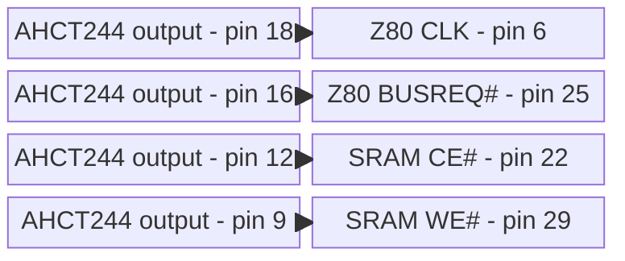
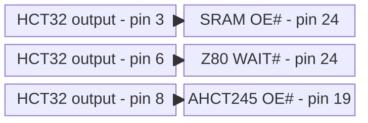

# 4. Output Buffer and Fixed Logic

## SN74AHCT244N

Power U4 from +5 V at pin 20, GND at pin 10, and tie enables pins 1/19 LOW.
Its TTL-compatible inputs accept Pico 3.3 V and Z80 TTL HIGH levels; its
outputs meet the SRAM CMOS-control and Z80 clock requirements. Use **AHCT**,
not AHC. Keep output pin 18 to Z80 CLK pin 6 short and local to the Core board.

| Source | U4 input | U4 output | Destination |
| --- | ---: | ---: | --- |
| Pico GP2, header 4 | 2 | 18 | Z80 CLK pin 6 |
| Pico GP4, header 6 | 4 | 16 | Z80 BUSREQ# pin 25 |
| Pico GP5, header 7 | 6 | 14 | HCT32 pin 2, BOOT_READ_DISABLE_5V |
| Z80 MREQ# pin 19 | 8 | 12 | SRAM CE# pin 22 |
| Z80 WR# pin 22 | 11 | 9 | SRAM WE# pin 29 |
| Z80 RD# pin 21 | 13 | 7 | HCT32 pin 1, RD_5V# |
| GND | 15 | 5 | Leave output open |
| GND | 17 | 3 | Leave output open |

<template id="phase-2-output-buffer-wiring">

```mermaid
block-beta
  columns 2
  BCLK["AHCT244 output - pin 18"] ZCLK["Z80 CLK - pin 6"]
  BREQ["AHCT244 output - pin 16"] ZREQ["Z80 BUSREQ# - pin 25"]
  BCE["AHCT244 output - pin 12"] RCE["SRAM CE# - pin 22"]
  BWE["AHCT244 output - pin 9"] RWE["SRAM WE# - pin 29"]
  BCLK --> ZCLK
  BREQ --> ZREQ
  BCE --> RCE
  BWE --> RWE
```

phase-2-output-buffer-wiring-end</template>

## HCT32 Quad OR Logic

Use **SN74HCT32N**, PDIP-14, powered from +5 V at pin 14 and GND at pin 7.
Do not substitute HC32: TTL and 3.3 V HIGH recognition is required.
The TI SCLS064G datasheet specifies 2.0 V minimum VIH over 4.5-5.5 V VCC.

| Gate | Input A | Input B | Output | Function |
| --- | --- | --- | --- | --- |
| 1 | Pin 1: U4 pin 7 | Pin 2: U4 pin 14 | Pin 3: SRAM OE# pin 24 | Inhibit SRAM reads during injection |
| 2 | Pin 4: Z80 IORQ# pin 20 | Pin 5: Pico GP9 | Pin 6: Z80 WAIT# pin 24 | Hold I/O until IO_RELEASE HIGH |
| 3 | Pin 9: Z80 RD# pin 21 | Pin 10: Pico GP6 | Pin 8: U9 OE# pin 19 | Drive only during Z80 read strobes |
| 4 | Pin 12: GND | Pin 13: GND | Pin 11: open | Unused, defined inputs |

```mermaid
block-beta
  columns 2
  H3["HCT32 output - pin 3"] R24["SRAM OE# - pin 24"]
  H6["HCT32 output - pin 6"] Z24["Z80 WAIT# - pin 24"]
  H8["HCT32 output - pin 8"] U19["AHCT245 OE# - pin 19"]
  H3 --> R24
  H6 --> Z24
  H8 --> U19
```

Pico GP3 RESET# connects directly to Z80 pin 26, with a 10 kOhm pull-down.
Never connect a +5 V pull-up to it. Add one local 100 nF capacitor per IC.
These fixed gates require no programming. Propagation delays, clock shape,
memory setup, and WAIT timing remain measured qualification requirements.