# 1. Reference Pin Mapping & Logic Domain Verification

This architecture leverages the fully static nature of the Z84C0020PEC
CMOS CPU. The Pico controls the clock and uses the Z80 BUSREQ#/
BUSACK# handshake for DMA ownership. During RESET, the address and data
buses float and control outputs are inactive. During BUSACK#, A0-A15,
D0-D7, MREQ#, IORQ#, RD#, and WR# float while BUSACK# remains actively
driven LOW; M1#, RFSH#, and HALT# are not part of the floated bus set.

## 1.0 Raspberry Pi Pico 2 Header Pin Map

GPIO numbers in the firmware are not physical header numbers. Use this
map for construction; the diagrams preserve ascending bit order.

The complete Pico wiring is installed in
[Phase 1](../implementation/phase-1-supervisor.md#wiring-pico-2-w).

<template id="phase-1-pico-wiring">

### Pico 2 W to SN74AHCT244

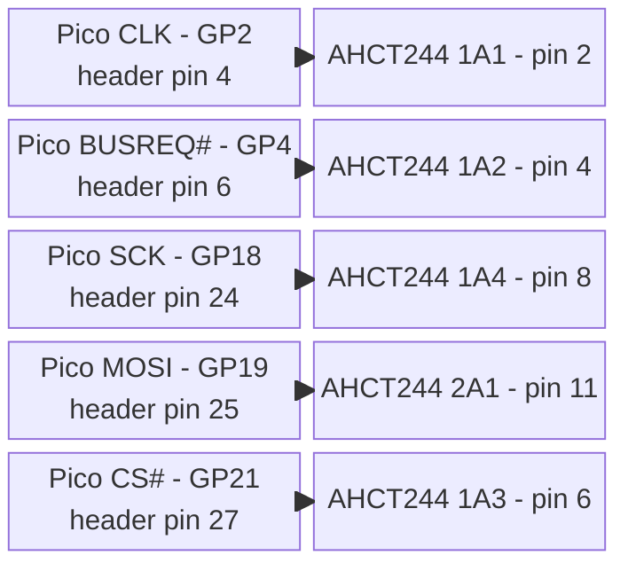

### Pico 2 W to ATF22V10

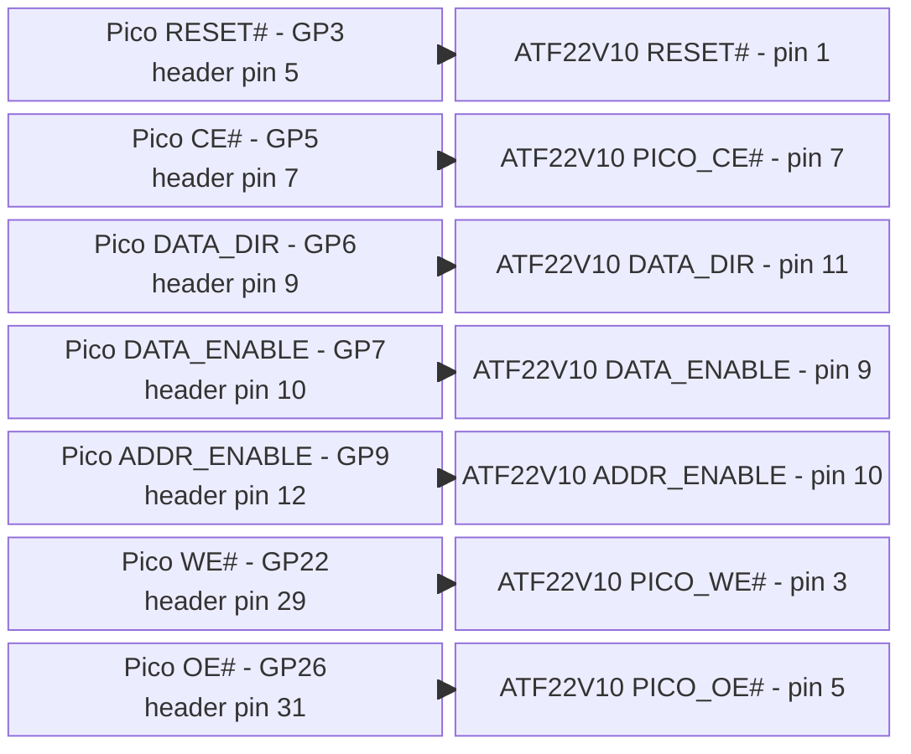

### Pico 2 W to Z84C00


RESET# is one shared node connecting Pico GP3, ATF22V10 pin 1, and Z80 pin 26;
it appears in both chip-pair views above.

### SN74LVC244 to Pico 2 W

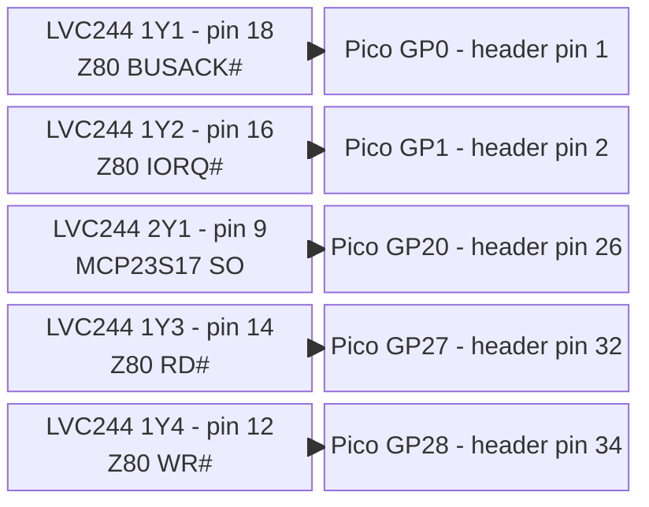

### Pico 2 W to SN74AHCT245

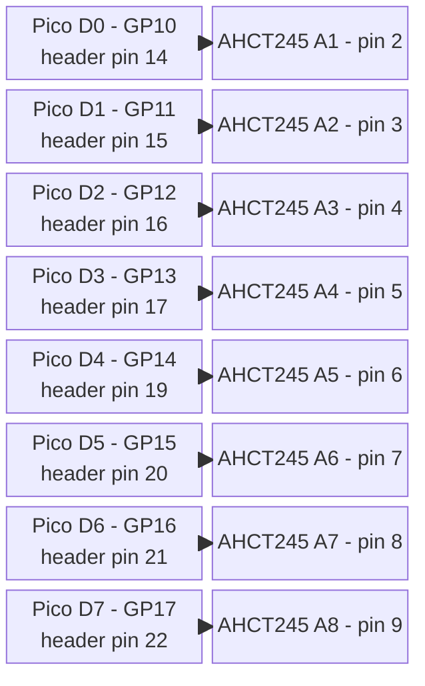

### SN74LVC245 to Pico 2 W

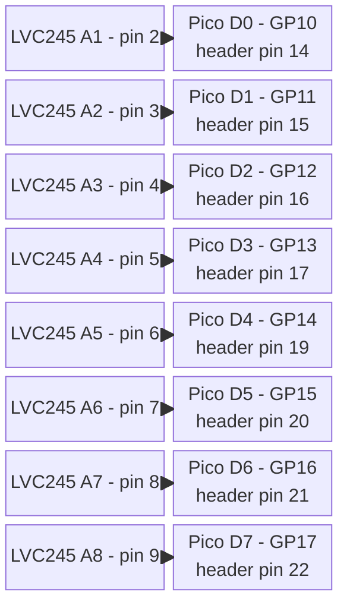

### Pico 2 W to SN74LVC244 power


### Pico 2 W to SN74LVC245 power


The same 3.3 V rail supplies the
[3.3 V pull-ups](inventory.md#03-capacitors-and-resistors); these are separate
resistor connections, not taps on either transceiver VCC pin.

### External supply to Pico 2 W


phase-1-pico-wiring-end</template>

Leave GP8/header pin 11 open; no address transceivers are fitted.

Connect Pico GND pins 3, 8, 13, 18, 23, 28, and 38, plus AGND pin
33, to common ground with multiple short links. Leave RUN pin 30,
ADC_VREF pin 35, and 3V3_EN pin 37 open. Do not connect the external
5 V rail to VBUS pin 40; USB supplies that node internally.

<table>
<colgroup>
<col style="width: 25%" />
<col style="width: 25%" />
<col style="width: 25%" />
<col style="width: 25%" />
</colgroup>
<thead>
<tr>
<th>Component</th>
<th>Signal Name / Group</th>
<th>Hardware Pin Numbers</th>
<th>Electrical Constraint / Logic Domain</th>
</tr>
</thead>
<tbody>
<tr>
<td rowspan="14"><strong>Z84C0020PEC (CPU)</strong></td>
<td>CLK</td>
<td>Pin 6</td>
<td>Input. Driven by level-shifted 5V CMOS square wave. Clock can be
safely frozen indefinitely in either a HIGH or LOW state.</td>
</tr>
<tr>
<td>IORQ#</td>
<td>Pin 20</td>
<td>Output. Active Low. Buffered to 3.3 V through SN74LVC244AN channel
1A2/1Y2 and monitored by Pico 2 GP1 to trigger clock-stop trapping. The
raw 5 V node also feeds ATF22V10 pin 13 for hardware WAIT generation.</td>
</tr>
<tr>
<td>MREQ#</td>
<td>Pin 19</td>
<td>Output. Active Low, three-state. Connects to ATF22V10 pin 8 for
CPU-owned SRAM cycles; pulled HIGH when the CPU is absent.</td>
</tr>
<tr>
<td>RD#</td>
<td>Pin 21</td>
<td>Output. Active Low. Buffered to 3.3 V through SN74LVC244AN channel
1A3/1Y3 and sampled by Pico 2 GP27 to resolve cycle intent.</td>
</tr>
<tr>
<td>WR#</td>
<td>Pin 22</td>
<td>Output. Active Low. Buffered to 3.3 V through SN74LVC244AN channel
1A4/1Y4 and sampled by Pico 2 GP28 to resolve cycle intent alongside
RD#.</td>
</tr>
<tr>
<td>BUSACK#</td>
<td>Pin 23</td>
<td>Output. Active Low. Feeds ATF22V10 pin 2 for SRAM-source arbitration
([Section 1.2](#12-sram-control-source-arbitration-atf22v10bc)) and is buffered to 3.3 V through SN74LVC244AN
channel 1A1/1Y1 for monitoring at Pico 2 GP0.</td>
</tr>
<tr>
<td>BUSREQ#</td>
<td>Pin 25</td>
<td>Input. Active Low. Level-shifted up to 5V to request DMA
ownership.</td>
</tr>
<tr>
<td>RESET#</td>
<td>Pin 26</td>
<td>Input. Active Low. Driven directly by Pico GP3 at TTL-compatible
3.3 V and also connected to ATF22V10 pin 1 for SRAM-source arbitration.
Hold LOW for at least three full clock cycles.</td>
</tr>
<tr>
<td>M1#</td>
<td>Pin 27</td>
<td>Output. Active Low. Probe point for the Phase 7 opcode-fetch test;
not connected to Pico logic.</td>
</tr>
<tr>
<td>A0 – A15 (Address Bus)</td>
<td>Pins 30 – 40, 1 – 5</td>
<td>5V Tri-state Bus. Driven by CPU during active run, floats during
DMA/RESET.</td>
</tr>
<tr>
<td>D0 – D7 (Data Bus)</td>
<td>Pins 7 – 10, 12 – 15</td>
<td>5V Bi-directional Tri-state Bus. Connected directly to SRAM data bus
pins.</td>
</tr>
<tr>
<td>WAIT#</td>
<td>Pin 24</td>
<td>Input. Active Low. Driven by ATF22V10 pin 20 during I/O trapping and
pulled to +5 V through 10 kOhm so it remains inactive if the GAL is
physically absent.</td>
</tr>
<tr>
<td>INT#</td>
<td>Pin 16</td>
<td>Input. Active Low. Unused; pull to +5V through 10 kOhm to prevent a
spurious interrupt from a floating input.</td>
</tr>
<tr>
<td>NMI#</td>
<td>Pin 17</td>
<td>Input. Active Low, edge-sensed. Unused; pull to +5V through 10 kOhm
to prevent a spurious non-maskable interrupt from a floating input.</td>
</tr>
<tr>
<td rowspan="7"><strong>AS6C1008-55PCN (SRAM)</strong></td>
<td>A0 – A15 (Address lines)</td>
<td>Pins 12-10, 9-7, 6-5, 27-26, 23, 25, 4, 28, 3, 31</td>
<td>5V Input. Connected directly to the 5V Z80 address bus. Driven by
MCP23S17 during DMA.</td>
</tr>
<tr>
<td>A16</td>
<td>Pin 2</td>
<td>5V Input. Tie to GND to select the lower 64KB bank; do not leave
floating.</td>
</tr>
<tr>
<td>D0 – D7 (Data lines)</td>
<td>Pins 13 – 15, 17 – 21</td>
<td>5V Bi-directional Bus. Connected directly to the Z80 data bus.</td>
</tr>
<tr>
<td>WE#</td>
<td>Pin 29</td>
<td>Input. Active Low. Driven by SN74AHCT244 2Y2 pin 7 from the ATF22V10
arbitration output ([Section 1.2](#12-sram-control-source-arbitration-atf22v10bc)): Z80 WR# during CPU ownership, Pico
DMA write signal during DMA ownership.</td>
</tr>
<tr>
<td>OE#</td>
<td>Pin 24</td>
<td>Input. Active Low. Driven by SN74AHCT244 2Y3 pin 5 from the ATF22V10
arbitration output ([Section 1.2](#12-sram-control-source-arbitration-atf22v10bc)): Z80 RD# during CPU ownership, Pico
DMA read signal during DMA ownership.</td>
</tr>
<tr>
<td>CE#</td>
<td>Pin 22</td>
<td>Input. Active Low. Driven by SN74AHCT244 2Y4 pin 3 from the ATF22V10
arbitration output ([Section 1.2](#12-sram-control-source-arbitration-atf22v10bc)): Z80 MREQ# during CPU ownership so
I/O cycles cannot access SRAM, Pico DMA chip-enable signal during DMA
ownership.</td>
</tr>
<tr>
<td>CE2</td>
<td>Pin 30</td>
<td>Input. Active High. Tie permanently to VCC (+5V) to enable the
device through the active-low CE# input.</td>
</tr>
</tbody>
</table>

## 1.1 Z84C0020PEC-to-AS6C1008-55PCN Wiring

The following is the direct run-mode connection verified against the
manufacturers' 40-pin PDIP and 32-pin PDIP pin assignments. The
AS6C1008 is a 128K x 8 device, so A16 must be tied LOW to expose its
lower 64KB as the Z80's address space. CE2 must be tied HIGH, and pin 1
is not connected.

Manufacturer datasheets:

- [Zilog Z84C00 CMOS Z80 CPU Product Specification](https://www.zilog.com/docs/z80/ps0178.pdf)
- [Alliance Memory AS6C1008 128K x 8 Low Power CMOS SRAM Datasheet](https://www.alliancememory.com/wp-content/uploads/AS6C1008_Mar_2023V1.2.pdf)

The complete SRAM socket wiring is installed in
[Phase 6](../implementation/phase-6-sram.md#wiring-sram-socket).

<template id="phase-6-sram-wiring">

### Package Pinouts

[](https://www.zilog.com/docs/z80/ps0178.pdf)

[](https://www.alliancememory.com/wp-content/uploads/AS6C1008_Mar_2023V1.2.pdf)

### Address Bus A0-A7

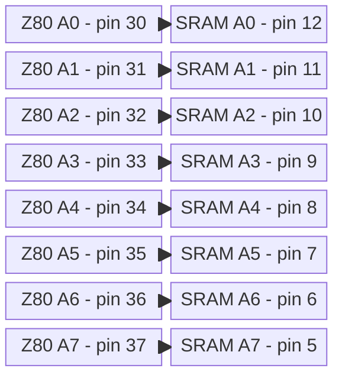

### Address Bus A8-A15

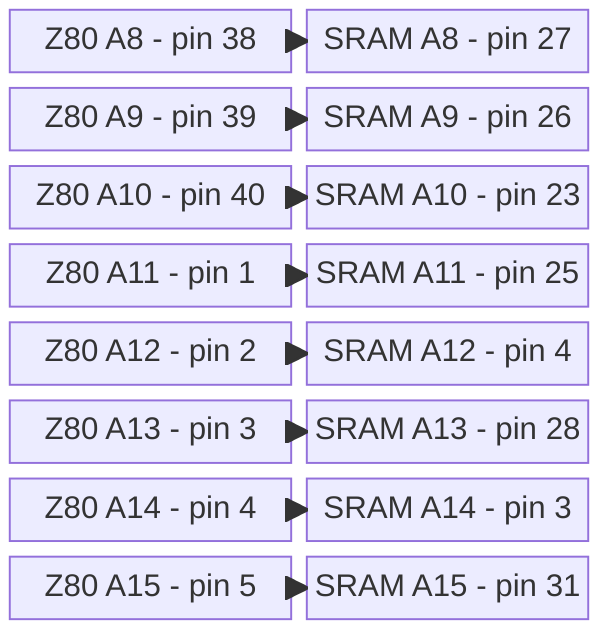

### Data Bus D0-D7

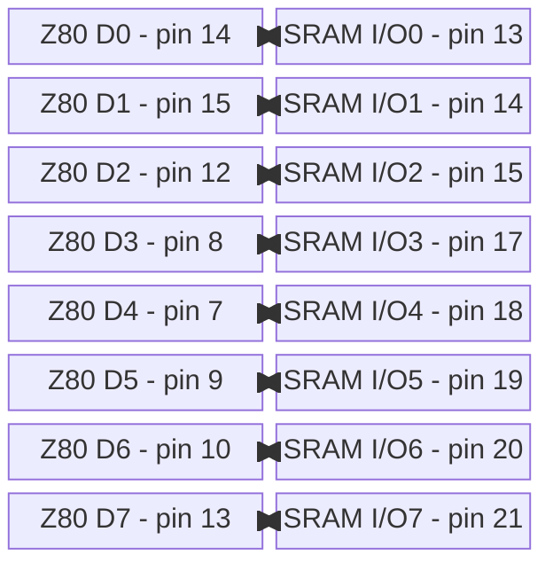

### Memory Control

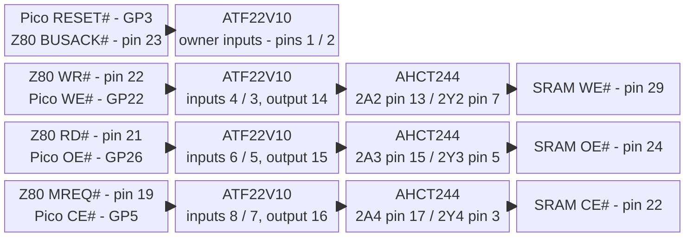

### Power and Fixed Pins

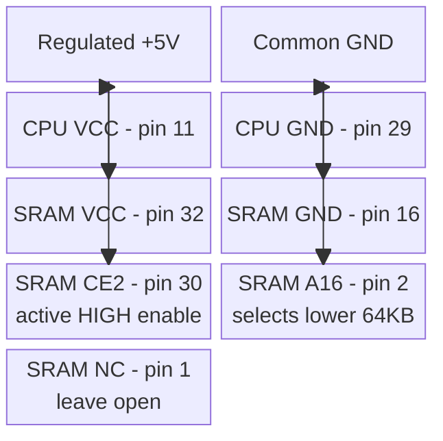

phase-6-sram-wiring-end</template>

> **SRAM control-source arbitration:** MREQ#/RD#/WR# above are the
> CPU-owned run-mode inputs of the ATF22V10 described in
> [Section 1.2](#12-sram-control-source-arbitration-atf22v10bc),
> never directly to the SRAM. The programmed equations select either
> these inputs or the Pico DMA controls; the three results then pass
> through dedicated SN74AHCT244 channels to the SRAM.

## 1.2 SRAM Control-Source Arbitration: ATF22V10B/C

The Z80 and Pico must never drive SRAM CE#, OE#, or WE# simultaneously.
The ATF22V10 implements three combinational 2:1 selectors with a shared
ownership condition:

```text
CPU_OWNS_SRAM = RESET# AND BUSACK#

SRAM_WE_PRE# = CPU_OWNS_SRAM ? Z80_WR#   : PICO_WE#
SRAM_OE_PRE# = CPU_OWNS_SRAM ? Z80_RD#   : PICO_OE#
SRAM_CE_PRE# = CPU_OWNS_SRAM ? Z80_MREQ# : PICO_CE#
```

| RESET# | BUSACK# | Selected source | Required state |
|----:|----:|----|----|
| 0 | X | Pico | Held-reset DMA or Z80 absent |
| 1 | 0 | Pico | BUSREQ#/BUSACK# DMA ownership |
| 1 | 1 | Z80 | Normal CPU execution |

This covers the two cases that BUSACK# alone cannot distinguish. During
RESET the Z80 drives BUSACK# inactive HIGH, and with the Z80 physically
absent its pull-up also reads HIGH. RESET# LOW therefore selects the Pico
in both cases. Only an out-of-reset CPU that has not granted the bus can
select MREQ#/RD#/WR#.

The PLD source adds the logically redundant consensus term
`Z80_CONTROL# & PICO_CONTROL#` to each output. It does not change this
truth table, but it holds an inactive HIGH continuously while RESET# or
BUSACK# transfers ownership with both candidate controls HIGH. Without
that term, unequal GAL product-term delays can create a static-1 hazard,
seen externally as a short active-low SRAM control pulse. Each hardened
equation uses four product terms, within every ATF22V10 macrocell's
capacity.

Program the selected ATF22V10B or ATF22V10C with
[src/pld/sram_control.pld](https://github.com/gloveboxes/Z80ROMlessSBC/blob/main/src/pld/sram_control.pld). Use the exact
device algorithm listed by the programmer, write the generated JEDEC
file, read it back, and require a verify pass before installation. Do
not enable the optional power-down mode or security fuse.

The complete GAL pin wiring is installed in
[Phase 2](../implementation/phase-2-buffer-clock.md#wiring-gal-and-output-buffer).

<template id="phase-2-gal-wiring">

### Pico 2 W to ATF22V10

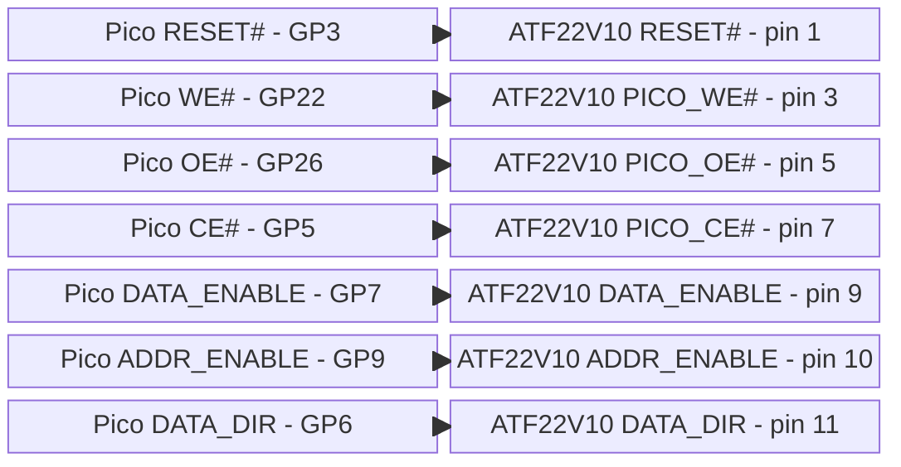

DATA_ENABLE, ADDR_ENABLE, and DATA_DIR each have a 10 kOhm pull-down to GND.

### Z84C00 to ATF22V10

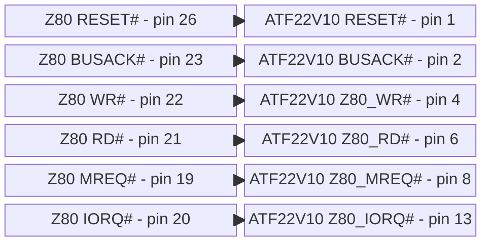

RESET# is one shared node connecting Pico GP3, Z80 pin 26, and ATF22V10 pin 1;
it appears in both chip-pair diagrams to make each pair complete. Z80 IORQ# has
the existing 10 kOhm pull-up to 5 V.

### ATF22V10 to SN74AHCT244

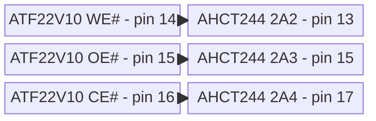

### SN74AHCT244 to AS6C1008 SRAM

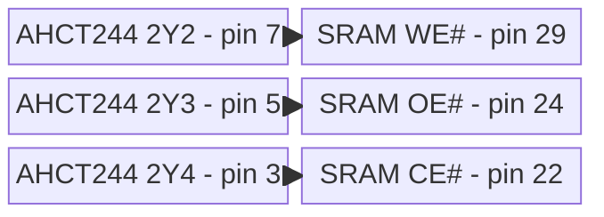

### ATF22V10 to data transceivers

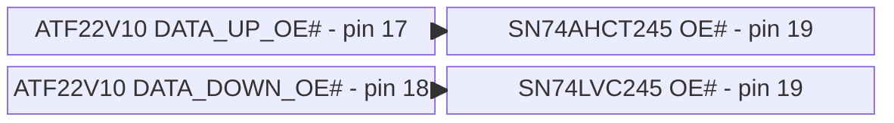

### ATF22V10 to Q1

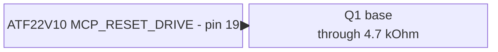

### Q1 to MCP23S17

```mermaid
block-beta
  columns 2
  Q1["Q1 collector<br/>reset pull-down"] MRST["MCP23S17 RESET# - pin 18"]
  Q1 --> MRST
```

### ATF22V10 to Z84C00

```mermaid
block-beta
  columns 2
  G20["ATF22V10 WAIT# - pin 20"] ZWAIT["Z80 WAIT# - pin 24"]
  G20 --> ZWAIT
```

phase-2-gal-wiring-end</template>

GAL pin 12 connects to common GND and pin 24 to regulated +5 V. Program
unused outputs 21-23 constant LOW and leave them open. WAIT# retains its
existing 10 kOhm pull-up to 5 V.

The ATF22V10's guaranteed HIGH output is 2.4 V, which satisfies the
AHCT244's 2.0 V input threshold but not the AS6C1008's 5 V CMOS input
threshold. Never bypass the AHCT244 on these three paths. Fit 10 kOhm
pull-ups at AHCT244 2A2-2A4 and at the final SRAM CE#/OE#/WE# nodes. The
input pull-ups keep the permanently enabled AHCT244 deterministic if the
GAL is missing; the output pull-ups keep the SRAM inactive if the
AHCT244 is physically missing. All installed source devices must be
powered as required by the
[construction and power rules](inventory.md#04-construction-and-power).

WAIT# may connect directly from GAL pin 20 to Z80 pin 24 because the
Z84C00 ordinary-input HIGH minimum is 2.2 V, below the GAL's guaranteed
2.4 V HIGH. The existing 10 kOhm pull-up defines WAIT# HIGH if the GAL
is physically absent; it is not a substitute for powering an installed
GAL.

The same 2.4 V guaranteed HIGH exceeds the 2.0 V input-HIGH minimum of
both data-transceiver OE# inputs. Two additional equations use two
product terms each:

```text
DATA_UP_OE#    = NOT DATA_ENABLE OR NOT DATA_DIR
DATA_DOWN_OE#  = NOT DATA_ENABLE OR DATA_DIR
MCP_RESET_DRIVE = NOT ADDR_ENABLE
WAIT_N          = Z80_IORQ_N OR DATA_ENABLE
```

Both paths are disabled whenever DATA_ENABLE is LOW. When it is HIGH,
exactly one path is enabled. Firmware changes DATA_DIR only while
DATA_ENABLE is LOW, so the shared `NOT DATA_ENABLE` product term holds
both OE# outputs inactive throughout the transition. SN74LVC245A `Ioff`
permits its OE# pin to remain driven from the 5 V GAL while the LVC
device's 3.3 V supply is absent.

While IORQ# is inactive HIGH, WAIT# is always HIGH. When IORQ# falls,
WAIT# goes LOW because DATA_ENABLE is still LOW. After the trap configures
the correct direction and stable read/write data, raising DATA_ENABLE both
enables exactly one data path and releases WAIT#. Firmware keeps
DATA_ENABLE HIGH until IORQ# and RD#/WR# are inactive; lowering it early
would reassert WAIT# in the same cycle.

For address isolation, connect GAL pin 19 through 4.7 kOhm to the base
of Q1 (2N3904), add 47 kOhm base-to-emitter, ground the emitter, pull
MCP RESET# up to 5 V through 10 kOhm, and connect the collector to
RESET#. ADDR_ENABLE LOW makes GAL pin 19 HIGH and Q1 asserts reset,
which forces all MCP GPIO registers back to input mode. ADDR_ENABLE
HIGH releases reset; firmware then configures IODIR before using the
address bus.

During [Phase 6](../implementation/phase-6-sram.md) with the Z80 absent, hold
GP3 RESET# LOW. The programmed
logic then selects the Pico controls regardless of the pulled-up,
undriven BUSACK# input.
