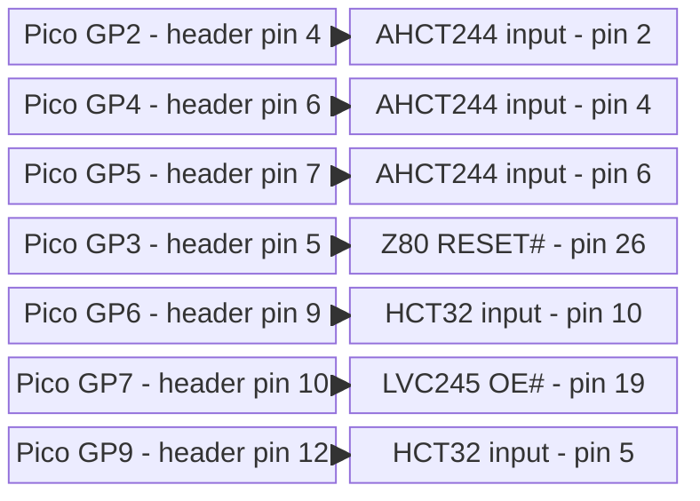

# 1. Pin Mapping and SRAM Wiring

The **Z80 is the only SRAM address and write master**. The Pico loads RAM by
feeding Z80 instructions while SRAM reads are inhibited. No programmable
logic, external programmer, or address expander is required.

## 1.0 Raspberry Pi Pico 2 W Header Pin Map

GPIO numbers are not physical header positions. All incoming 5 V signals
pass through the 3.3 V-powered LVC244 or LVC245, including GP27/GP28, which
are not 5 V-tolerant pads. Do not rely on GP0-GP25 FT tolerance during power-off.

| GPIO | Header pin | Signal | Connection | Startup |
| --- | ---: | --- | --- | --- |
| GP0 | 1 | BUSACK# input | U7 pin 18 | Input, no internal pull |
| GP1 | 2 | IORQ# input | U7 pin 16 | Input, no internal pull |
| GP2 | 4 | CLK output | U4 pin 2 | LOW |
| GP3 | 5 | RESET# output | Z80 pin 26 | LOW |
| GP4 | 6 | BUSREQ# output | U4 pin 4 | HIGH |
| GP5 | 7 | BOOT_READ_DISABLE | U4 pin 6 | HIGH |
| GP6 | 9 | PICO_DATA_UP_OE# | U3 pin 10 | HIGH |
| GP7 | 10 | DATA_DOWN_OE# | U10 pin 19 | HIGH |
| GP9 | 12 | IO_RELEASE | U3 pin 5 | LOW |
| GP10-GP17 | 14,15,16,17,19,20,21,22 | D0-D7 | U9 and U10 pins 2-9 | Inputs |
| GP18 | 24 | A0 input | U7 pin 9 | Input |
| GP19 | 25 | A1 input | U7 pin 7 | Input |
| GP20 | 26 | A2 input | U7 pin 5 | Input |
| GP21 | 27 | A4 input | U7 pin 3 | Input |
| GP27 | 32 | RD# input | U7 pin 14 | Input |
| GP28 | 34 | WR# input | U7 pin 12 | Input |

Connect GND header pins 3,8,13,18,23,28,38 and AGND pin 33 to common GND.
Header pin 36 supplies the two LVC devices and 3.3 V pull-ups. Connect external
+5 V through a 1N5819 to VSYS pin 39; the band faces VSYS. Leave VBUS pin 40,
RUN pin 30, 3V3_EN pin 37, ADC_VREF pin 35, and GP8/GP22/GP26 open.
GP23/24/25/29 are reserved by Pico 2 W wireless hardware.

<template id="phase-1-pico-wiring">

### Pico Control Outputs


```mermaid
block-beta
  columns 2
  P2["Pico GP2 - header pin 4"] B2["AHCT244 input - pin 2"]
  P4["Pico GP4 - header pin 6"] B4["AHCT244 input - pin 4"]
  P5["Pico GP5 - header pin 7"] B5["AHCT244 input - pin 6"]
  P3["Pico GP3 - header pin 5"] Z3["Z80 RESET# - pin 26"]
  P6["Pico GP6 - header pin 9"] H6["HCT32 input - pin 10"]
  P7["Pico GP7 - header pin 10"] L7["LVC245 OE# - pin 19"]
  P9["Pico GP9 - header pin 12"] H9["HCT32 input - pin 5"]
  P2 --> B2
  P4 --> B4
  P5 --> B5
  P3 --> Z3
  P6 --> H6
  P7 --> L7
  P9 --> H9
```

Wire all Pico connections from the table above with other active devices
absent. Continuity-check every destination socket contact and adjacent pins.

phase-1-pico-wiring-end</template>

## SRAM Address and Data Trunks

Each row represents one shared wire net, not a series path through a chip.
The address pulls are 10 kOhm to +5 V; they define the floated bus during
reset and BUSACK, not a substitute for active drive or timing qualification.

| Bit | Z80 pin | SRAM pin | LVC244 monitor input |
| ---: | ---: | ---: | ---: |
| A0 | 30 | 12 | 11 |
| A1 | 31 | 11 | 13 |
| A2 | 32 | 10 | 15 |
| A3 | 33 | 9 | None |
| A4 | 34 | 8 | 17 |
| A5 | 35 | 7 | None |
| A6 | 36 | 6 | None |
| A7 | 37 | 5 | None |
| A8 | 38 | 27 | None |
| A9 | 39 | 26 | None |
| A10 | 40 | 23 | None |
| A11 | 1 | 25 | None |
| A12 | 2 | 4 | None |
| A13 | 3 | 28 | None |
| A14 | 4 | 3 | None |
| A15 | 5 | 31 | None |

| Bit | Z80 pin | SRAM pin | U9/U10 B pin | U9/U10 A pin | Pico GPIO |
| ---: | ---: | ---: | ---: | ---: | ---: |
| D0 | 14 | 13 | 18 | 2 | 10 |
| D1 | 15 | 14 | 17 | 3 | 11 |
| D2 | 12 | 15 | 16 | 4 | 12 |
| D3 | 8 | 17 | 15 | 5 | 13 |
| D4 | 7 | 18 | 14 | 6 | 14 |
| D5 | 9 | 19 | 13 | 7 | 15 |
| D6 | 10 | 20 | 12 | 8 | 16 |
| D7 | 13 | 21 | 11 | 9 | 17 |

Tie SRAM A16 pin 2 and GND pin 16 to GND; CE2 pin 30 and VCC pin 32 to
+5 V. Leave SRAM pin 1 open. Only the lower 64 KiB is used.
SRAM CE# pin 22 connects to U4 pin 12; WE# pin 29 to U4 pin 9;
OE# pin 24 to U3 pin 3.

## Memory Control

The [AHCT244](output-buffer.md) translates Z80 MREQ#/WR#/RD# to valid CMOS
levels. Do not wire guaranteed 2.4 V TTL outputs directly to 5 V SRAM controls.
The [HCT32](output-buffer.md#hct32-quad-or-logic) implements:

```text
SRAM_CE# = buffered MREQ#
SRAM_WE# = buffered WR#
SRAM_OE# = buffered RD# OR buffered BOOT_READ_DISABLE
WAIT# = IORQ# OR IO_RELEASE
DATA_UP_OE# = RD# OR PICO_DATA_UP_OE#
DATA_DOWN_OE# = Pico GP7
```

Both data paths default off. Firmware disables both before changing GPIO
direction and completes trapped I/O with stepped clocks before PWM resumes.
RESET# has only a 10 kOhm pull-down to GND, never a 5 V pull-up.
The Z80's non-clock HIGH threshold accepts 3.3 V RESET#; CLK must use U4.

## Power and Fixed Pins

| Device | +5 V pins | +3.3 V pins | GND / fixed pins | Open pins |
| --- | --- | --- | --- | --- |
| Z80 U1 | 11 | None | 29; INT#16/NMI#17 via +5 V pulls | HALT#18, RFSH#28 |
| SRAM U2 | 30,32 | None | 2,16 | 1 |
| HCT32 U3 | 14 | None | 7,12,13 | 11 |
| AHCT244 U4 | 20 | None | 1,10,15,17,19 | 3,5 |
| LVC244 U7 | None | 20 | 1,10,19 | None |
| AHCT245 U9 | 1,20 | None | 10 | None |
| LVC245 U10 | None | 20 | 1,10 | None |

Z80 M1# pin 27 connects only to TP1. See the [power sequence](../implementation/phase-0-power.md#power-distribution-and-isolation)
and [native schematic](https://github.com/gloveboxes/Z80ROMlessSBC/blob/main/hardware/kicad/z80_romless_sbc.kicad_sch).