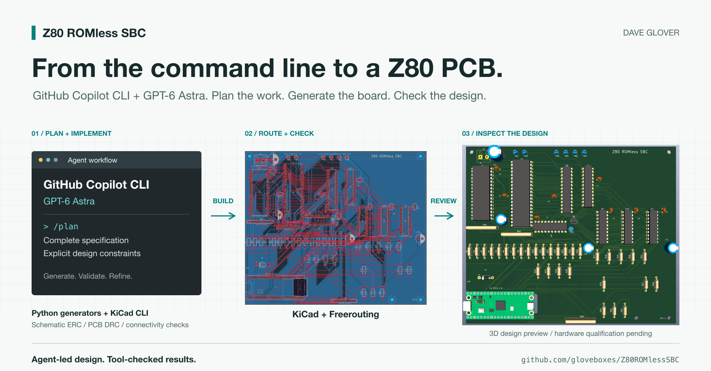
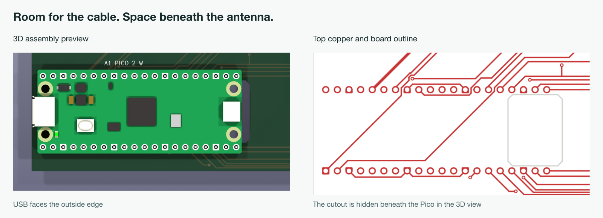
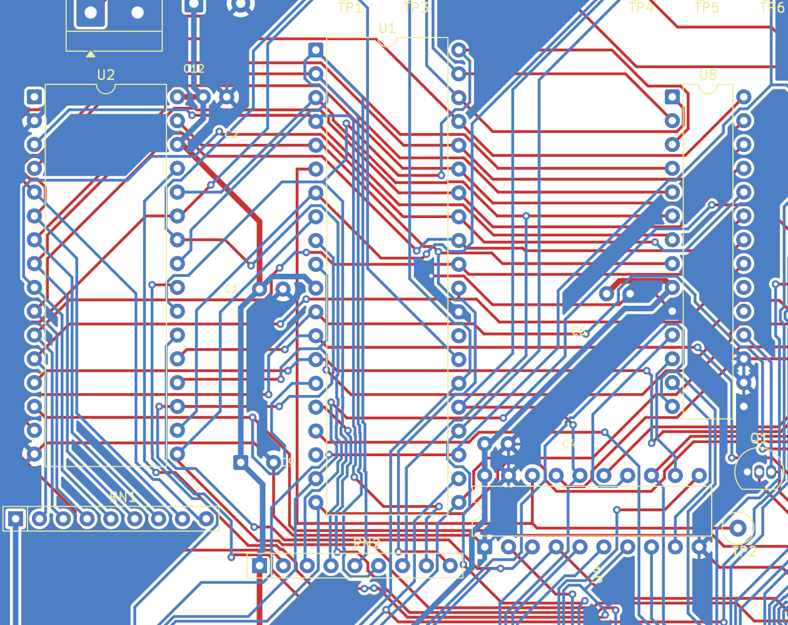
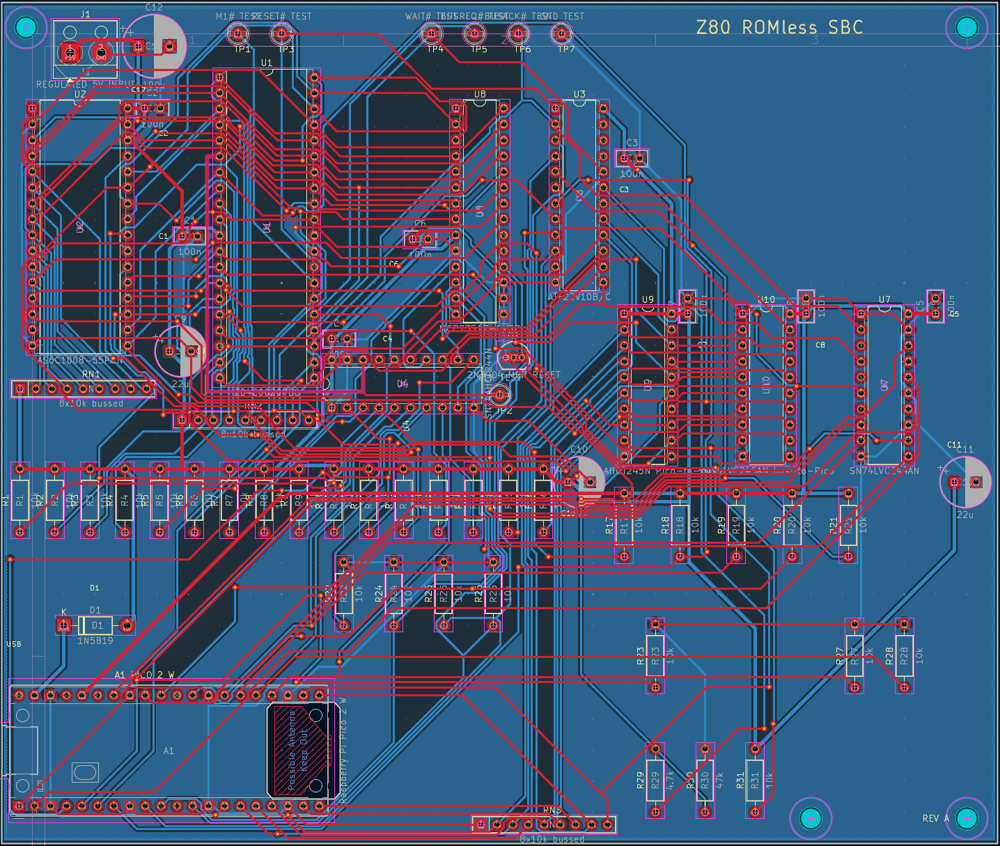
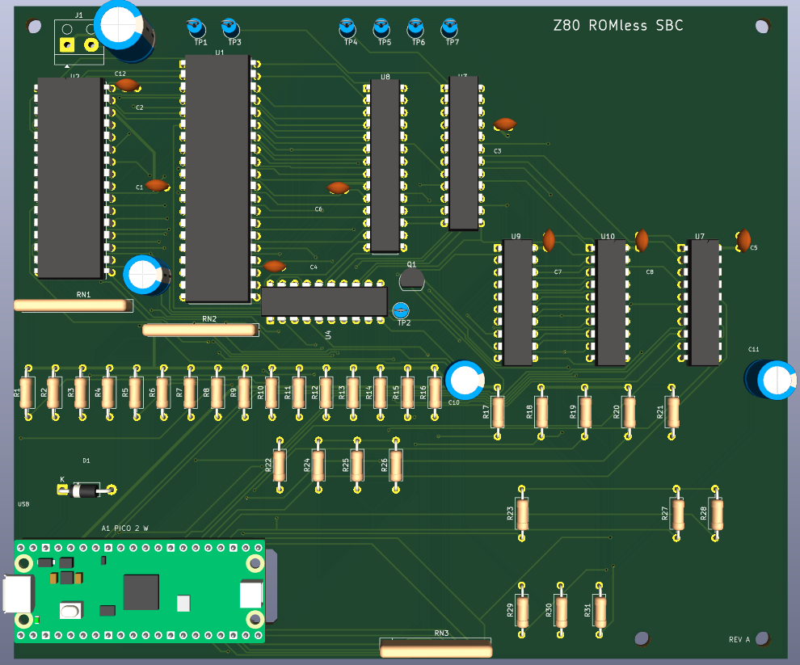
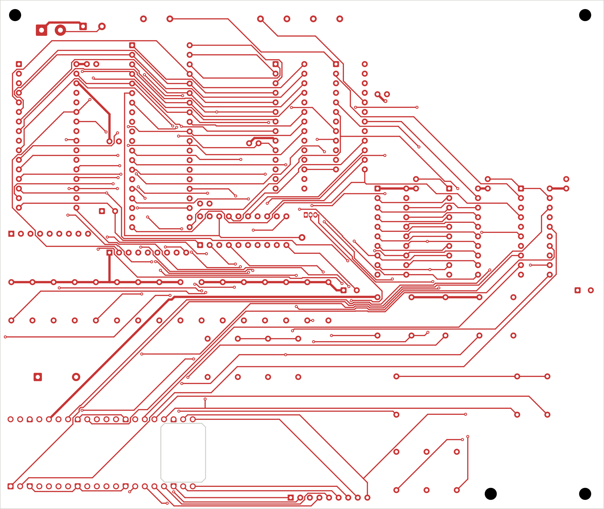

# Dream It, Build It: Designing a Z80 PCB with GitHub Copilot



*From a complete design specification to a routed PCB in a few hours with GitHub Copilot CLI and GPT-6 Astra.*

Designing this PCB myself would have taken days, probably weeks. With GitHub Copilot CLI and GPT-6 Astra doing the agent-led work, it came together in a few hours. That still amazes me. Projects that once felt out of reach now feel possible, and that's what really excites me.

The project is my **Z80 ROMless SBC**, a single-board computer pairing a Z80 processor with a Raspberry Pi Pico 2 W. The Pico loads software into SRAM and provides the clock, storage, and terminal services. A little old-school computing with a modern supervisor.

I used **GPT-5.6 Sol and GPT-6 Astra with GitHub Copilot for the engineering design**, then **GPT-6 Astra through Copilot CLI to plan and implement the PCB**.

To be clear, those few hours were the PCB design work, starting from a complete engineering specification. The physical board still needs to be built and tested. But getting from that specification to a routed KiCad design is a substantial piece of work, and that's the part I want to share.

## First, Give It Something to Work With

There are plenty of decisions hiding inside "design a Z80 computer." Which memory? Who owns the bus? How do you connect 5 V logic to a 3.3 V Pico without damaging anything?

I'd already worked through those questions in the project specification. It covered the components, pin assignments, voltage levels, bus ownership, firmware responsibilities, and bring-up sequence.

I gave Copilot that specification and used `/plan` with GPT-6 Astra to work out the implementation. The plan covered the schematic, component placement, routing, checks, and manufacturing files.

I also set constraints: two copper layers, the specified components, careful routing of the timing-sensitive address and data buses, accessible connectors, and room for the Pico's USB cable and antenna. These sound like small details until you have a nicely routed board with nowhere to plug in the cable!



*Two views of one constraint: USB access on the left, the cutout beneath the antenna on the right.*

The bus routing deserves a little explanation. Signals take time to travel along a PCB trace. A longer route generally adds more delay, so bits sent together can arrive at slightly different times. That difference is called *skew*. The address must settle early enough for memory to respond, and data must be stable before and briefly after the receiving chip samples it. Get those timings wrong and you can read the wrong byte or write to the wrong location.

Keeping related paths similar in length can reduce skew, but this Z80 board doesn't need every trace to be exactly the same length. The routing rules favour short, direct paths with short branches, and flag unusually long routes for review rather than adding meanders just to match lengths. Fast signal edges still matter, even at a modest clock speed. The final proof comes from measurements at the receiving pins.



*A closer look at the CPU and memory connections. The route between pins matters, not just whether they connect.*

## Then Let the Agent Get On With It

With the plan agreed, GPT-6 Astra carried out the work. Copilot wrote Python generators, ran the design tools, inspected reports, and revised the design.

I wasn't placing every component or drawing each trace. My role was to provide the requirements, resolve decisions, and review what came back. The agent was doing the implementation, including the repetitive checking that makes PCB work take time.

Here's what it had to work with:

| Tool | Role |
| --- | --- |
| GitHub Copilot CLI + GPT-6 Astra | Plan the work, write files, run tools, and iterate |
| Python and `kiutils` | Generate the schematic and pin-to-net manifest |
| KiCad's `pcbnew` Python API | Generate placement, board geometry, rules, and copper zones |
| Freerouting | Route the two-layer board |
| `kicad-cli` | Run checks and export manufacturing files |
| Bash and npm | Run the repeatable build and validation pipeline |

The whole build runs through one command:

```sh
npm run kicad
```

Underneath that command, Python generates the schematic and board, Freerouting connects the tracks, and KiCad checks and exports the result. npm is just the entry point.

## Give It Tools That Can Say "That's Wrong"

The useful thing about KiCad here is its command-line interface. Copilot could run Electrical Rules Check (ERC) on the schematic and Design Rules Check (DRC) on the PCB, then use the reports to guide the next change.

The project also checks the design against its expected **79 nets and 355 physical endpoints**. That catches a different problem: a board can satisfy KiCad's rules and still connect the wrong pins for *this* computer.

Placement, mounting holes, connector alignment, the antenna cutout, and ground zones all have checks too. The finish line was zero ERC violations, zero DRC violations, and no unconnected items. Hiding a warning with an exclusion wasn't an acceptable shortcut.

Routing was an iterative process: generate placement, route, refill the ground zones, check, and revise. Route-length reports helped flag long branches and unnecessary vias for inspection.

Here's where the specification starts to look like a computer. The KiCad layout below shows the copper routes joining the Z80, SRAM, bus interfaces, and Pico headers. Those red and blue lines are the connections the agent generated through the routing workflow, not traces I drew by hand.



*From pin assignments in a specification to connections on a two-layer board.*

One detail I liked: the accepted Freerouting session is saved, and the build checks that it reproduces the same tracks and vias. Running the autorouter again can produce a different result, so keeping the reviewed route matters.

## Now It Looks Like a Computer

The 3D view makes the result much easier to picture. You can see the large DIP chips, rows of resistors, test points, and the Pico tucked into the bottom-left corner with its USB connector facing outwards.



*A preview of the proposed assembly, not a photograph of a built board.*

This is a useful change of perspective: the routing view helps inspect connections, while the 3D view helps review placement, orientation, and access. Seeing the design as a board full of components brings that "dream it, build it" idea a little closer. Physical clearances still need checking against the actual parts.

## Keep What You Learn

The repository includes a `kicad-pcb` Copilot skill with the tools, commands, constraints, and validation steps for this project.

It records practical lessons such as using KiCad's bundled Python environment, keeping bypass capacitors close to their supply pins, and leaving the Pico antenna clear of copper and board material.

That saves explaining everything again in the next session. The agent can pick up the project with those decisions already available.

## From the Screen to the Fabricator

The agent also used KiCad to generate the manufacturing package, not just the images. The upload ZIP contains **Gerber files** for the copper layers, solder mask, silkscreen, and board outline, plus **Excellon drill files** for plated and non-plated holes. Together, these describe the patterns to manufacture, where to drill, and the outline and cutouts to machine.



*The front copper and board outline, exported directly from KiCad. This is a layer plot illustrating the manufacturing geometry, not a Gerber Viewer screenshot or the complete production package.*

Alongside that ZIP, it generated the bill of materials, component-placement CSV, electrical test netlist, and assembly drawings. The pipeline stages the outputs and only replaces the existing package after validation passes.

That's a substantial handoff to have ready in a few hours. Before uploading it to a PCB manufacturer, I still need to review the production files and confirm the board specifications and manufacturing options.

## Next Stop, the Workbench

There is still a real board to build. Clean KiCad reports don't prove that the power is stable, the signals are clean, or the computer will run reliably. Bring-up starts at 1 MHz, with an oscilloscope and logic analyzer to check what actually happens.

That's the next part of the project, not something I'm claiming the agent has already solved.

But a few hours to get this far? For me, that changes which projects feel practical to take on. Days or weeks of PCB design is a big commitment. A few hours of agent-led work, with a specification and tools to check it, makes exploring an idea much more approachable.

**Dream it, build it.** This project has made that feel a lot more achievable.

The [source, KiCad design, and documentation are on GitHub](https://github.com/gloveboxes/Z80ROMlessSBC). Have a look at the skill and build scripts as well as the board. They're the parts you can adapt to your own project.

What would you build if the first version took hours rather than weeks? Let me know in the comments.

Cheers, Dave
